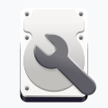
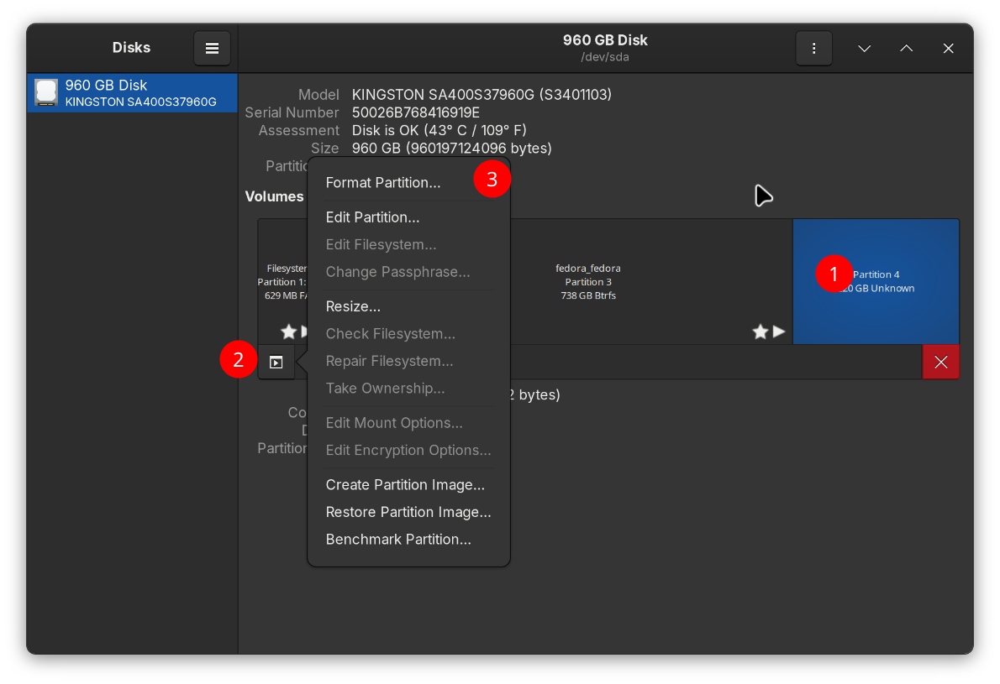
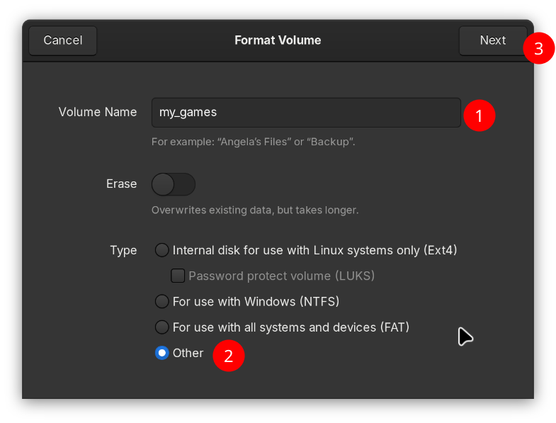
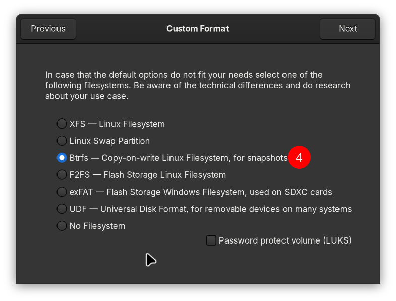
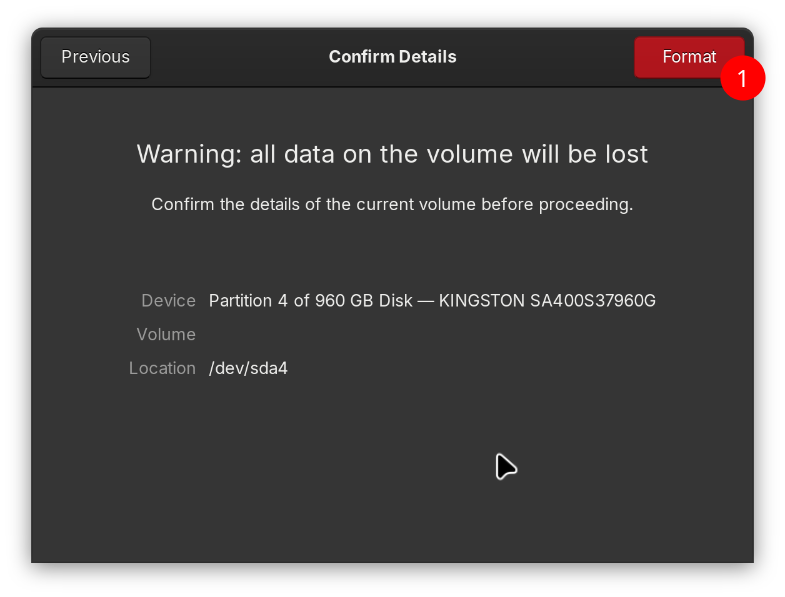
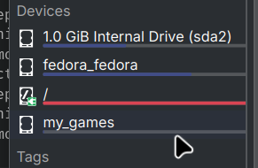
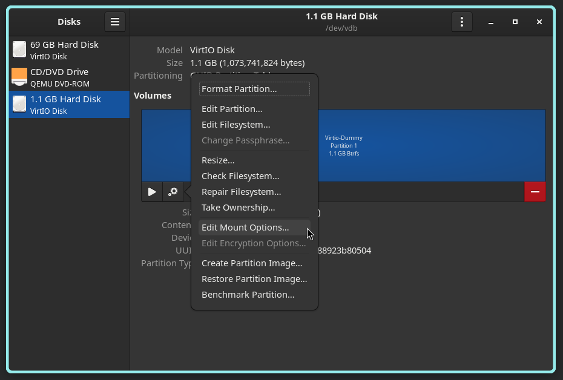
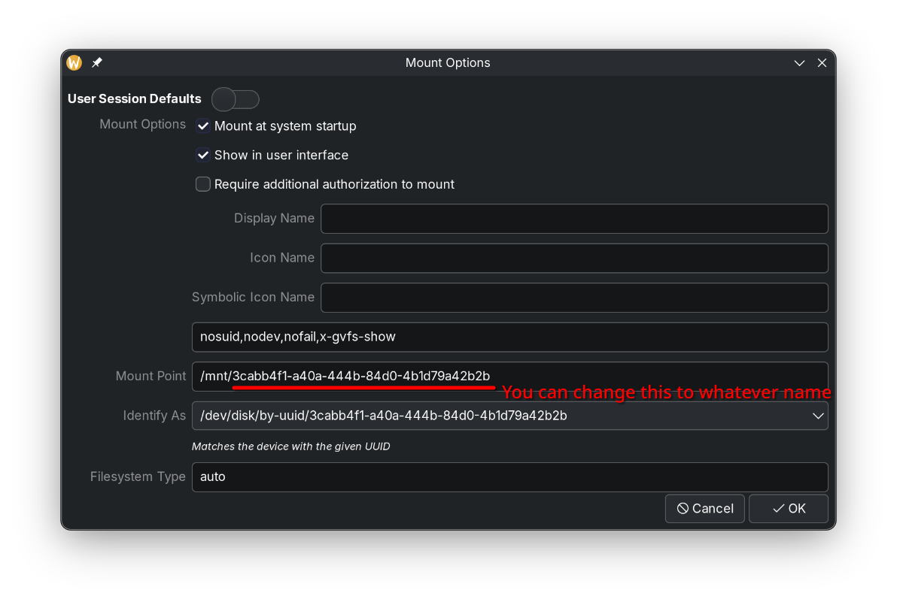
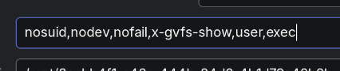

# Automatická montáž sekundárních disků

!!! info "MicroSD karty se automaticky připojí bez nutnosti jakéhokoli ručního zásahu."

## Video průvodce

https://youtu.be/fN9lvkkrExI

## Nastavte automaticky připojovaný oddíl

1. Otevřete Gnome Disks, měla by mít ikonu jako je tato. 

2. Smažte oddíl, který chcete použít, a poté použijte zbytek k vytvoření nového.

   

3. Zadejte název jednotky a souborový systém.

!!! warning "Bazzite podporuje pouze souborové systémy BTRFS/Ext4 pro hlášení problémů."

{data-gallery="step-2"}
{data-gallery="step-2"}
{data-gallery="step-2"}

Nyní restartujte, váš oddíl by měl být připojen automaticky. Mělo by se objevit pod `/run/media/system/PARTITION_NAME`.

{data-gallery="step-3"}

## Ruční montáž

Pokud nepracuje správně, připojte na konec `,user,exec`.

## Odstraňování problémů

### Nouzový režim po montáži?

Toto video tutoriál ukazuje, jak se zotavit z chyb při montáži.

https://www.youtube.com/watch?v=-2wca_0CpXY

### Disky se nebudou automaticky připojovat, přestože jsou BTRFS/ext4 (vyžaduje ověření při každém spuštění pro připojení)

1. Připojte cílové disky.

2. Otevřete Gnome Disks a přejděte na cílový disk.

3. Klepněte na Další možnosti oddílu > Upravit možnosti připojení.

4. Ujistěte se, že "Výchozí nastavení uživatelské relace" je NEPRAVDA a "Připojit při spuštění systému" je PRAVDA, poté klikněte na "OK".

5. Opakujte pro všechny další disky. Můžete potvrdit, že to fungovalo, když zkontrolujete svůj soubor Fstab a uvidíte, že byly přidány příslušné UUID. `sudo cat /etc/fstab`.