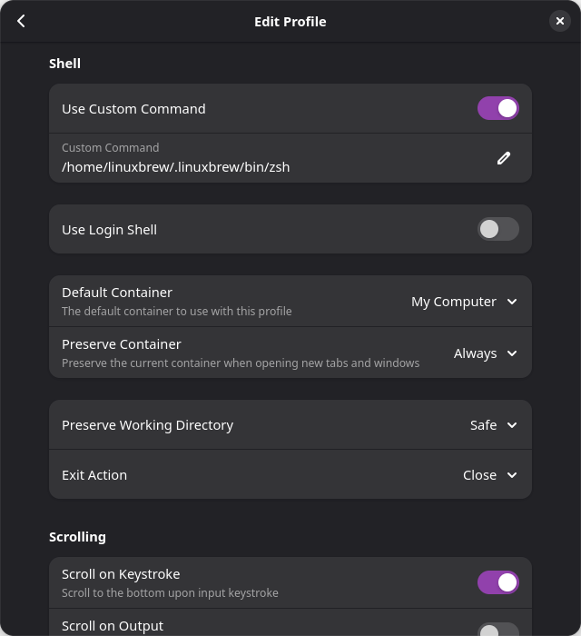

# Osvědčené postupy pro shell

## Změna výchozího shellu terminálu

!!! note

    *Postup pro změnu výchozího terminálu na Bazzite je stejný jako u [Project Bluefin](https://projectbluefin.io/), protože oba jsou založeny na [Universal Blue](https://universal-blue.org/). Tyto pokyny jsou převzaty z [dokumentů projektu Bluefin](https://docs.projectbluefin.io/).*

Bazzite dodává [Ptyxis](https://devsuite.app/ptyxis/) jako výchozí terminál. V nabídce se zobrazí jako `Terminal`. **důrazně doporučujeme**, abyste [změnili svůj shell prostřednictvím emulátoru terminálu místo celosystémového](https://tim.siosm.fr/blog/2023/12/22/dont-change-defaut-login-shell/). Klikněte na Nastavení terminálu a upravte svůj profil:

Poté vyberte "Použít vlastní příkaz" a přidejte shell, který chcete použít. `/usr/bin/fish` je součástí obrazu a další shelly jako ZSH lze nainstalovat s Homebrew:

