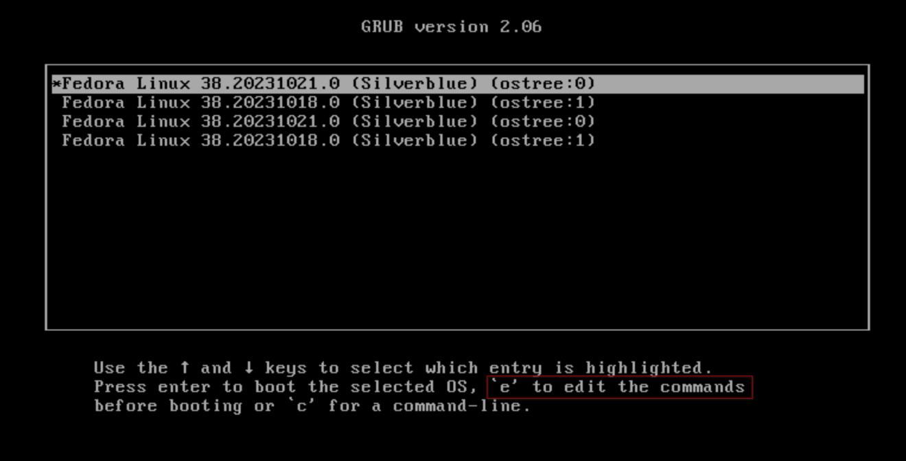
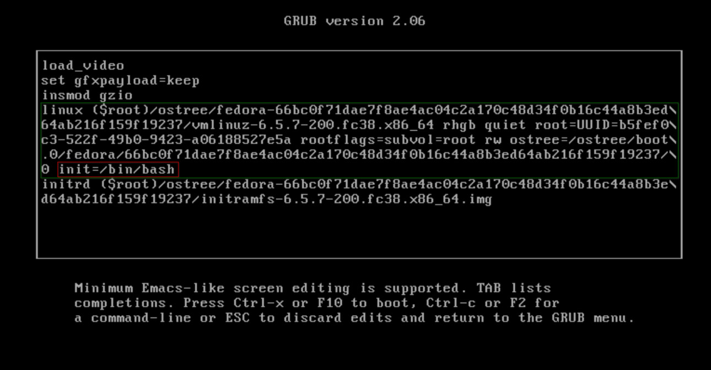
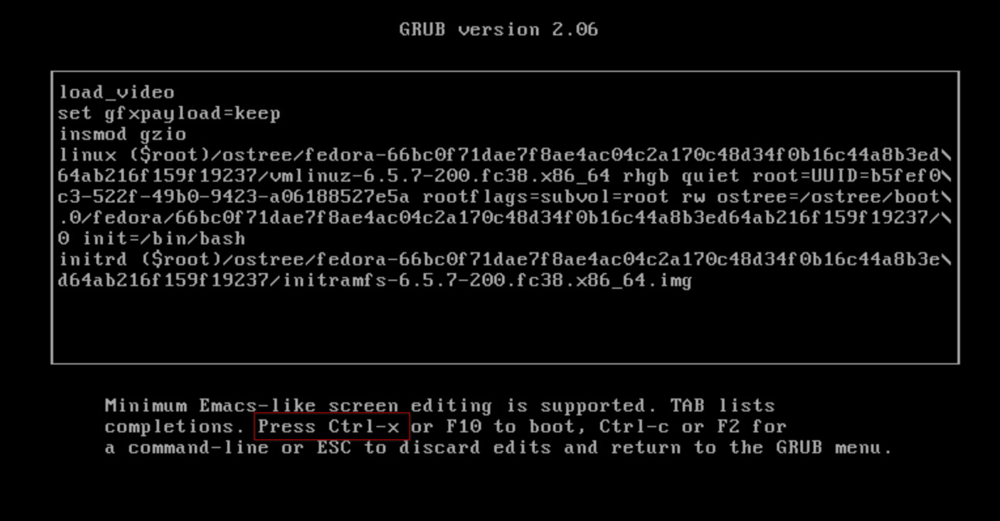
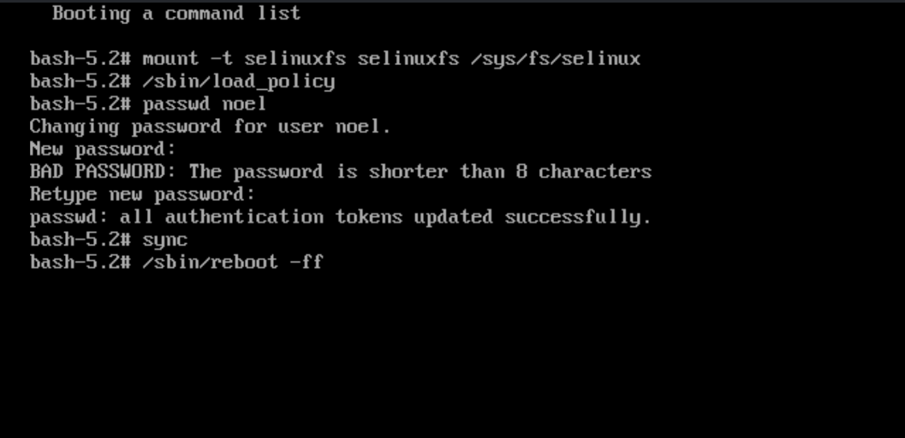
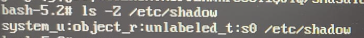

# Resetujte zapomenuté uživatelské heslo

!!! important

    Tato metoda je pouze v případě, že jste zapomněli své aktuální uživatelské heslo! Změna aktuálního hesla by měla být provedena prostřednictvím desktopového prostředí.

!!! warning

    Postupujte podle tohoto návodu **podle vlastního uvážení**, protože pokusem o cokoliv z toho můžete rozbít svůj systém.

1. Restartujte zařízení.
2. Stisknutím <kbd>Esc</kbd> na klávesnici přejděte do spouštěcí nabídky GRUB.
   A. Pokud stisknete <kbd>Esc</kbd> příliš mnohokrát, můžete skončit s výzvou `grub>`.
   b. Vraťte se do spouštěcí nabídky zadáním `exit` a stisknutím klávesy <kbd>Enter</kbd>
3. Upravte poslední nasazení stisknutím <kbd>E</kbd> na klávesnici.

Upravte výzvu GRUB a připojte `init=/bin/bash` na řádek začínající `linux`.

Pokračujte v zavádění pomocí <kbd>Ctrl</kbd>+<kbd>X</kbd>

Jakmile jste v příkazovém řádku GRUB:

1. Dočasně připojte SELinux

   `mount -t selinuxfs selinuxfs /sys/fs/selinux`

2. Načtěte zásady SELinux

   `/sbin/load_policy`

3. Zadejte své nové heslo (např. `passwd bazzite`)

   `passwd [INSERT USERNAME HERE]`

4. Synchronizace

   `sync`

5. Restartujte

   `/sbin/reboot -ff`

Vaše uživatelské heslo by nyní mělo být resetováno.

> Děkujeme [Colinu Waltersovi](https://github.com/cgwalters) za [řešení](https://github.com/ublue-os/main/issues/469#issuecomment-1885264886).

## Nefunguje?

Mnoho uživatelů zapomíná kroky týkající se SELinuxu kvůli starým zvykům. Pokud jste vytvořili vše kromě výše uvedených kroků SELinux, pak bude soubor `/etc/shadow` nečitelný nebo nedostupný jakýmkoli procesem.

Dobrým způsobem, jak zkontrolovat, zda je `/etc/shadow` ve špatné konfiguraci SELinux, je provést následující příkaz:

`ls -Z /etc/shadow`

Měli byste si také všimnout _unlabeled_t_ na vaší straně.
Nyní musíte opravit štítek na `/etc/shadow` příkazem níže:

`restorecon -v /etc/shadow`

A pak znovu zkontrolujte výsledek pomocí `ls -Z /etc/shadow`, což by mělo vést k:

`system_u:object_r:shadow_t:s0   /etc/shadow`

Nyní je systém připraven a můžete jej restartovat pomocí `/sbin/reboot -ff`.