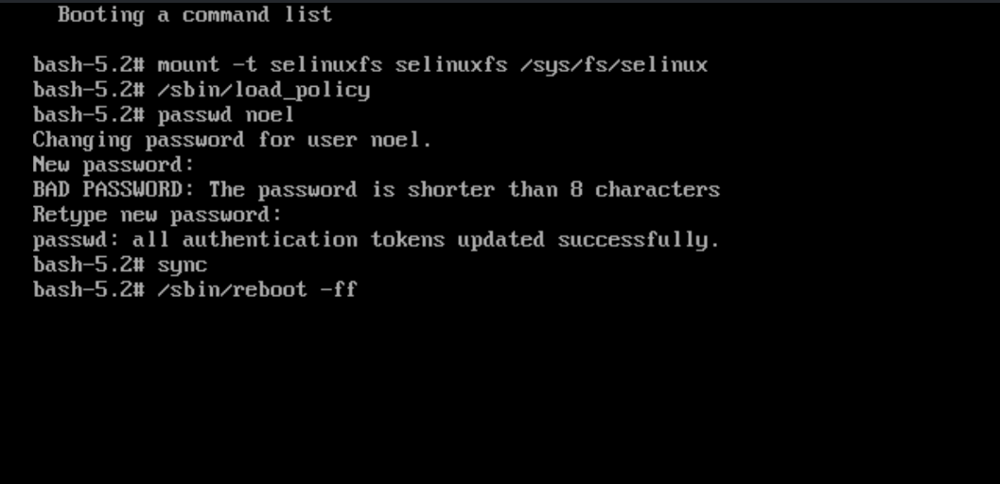
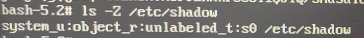

# 重置用户密码

!!! important

    本文的方法只适用于你忘记了当前密码的情况。如果你知道当前密码，应该通过桌面环境的正常方式修改。

!!! warning

    此处的步骤涉及非常底层的系统更改，请务必小心。

1. 重启设备。
2. 如果 GRUB 不默认显示，开机时按 <kbd>Esc</kbd> 键进入 GRUB 菜单。
   a. 如果按 <kbd>Esc</kbd> 的次数太多，可能会进入 GRUB shell （`grub>`）；
   b. 此时输入 `exit` 并按 <kbd>Enter</kbd> 以回到 GRUB 主菜单。
3. 通过上下键选择最新版本的部署（通常为`ostree:0`），按 <kbd>E</kbd>以进入编辑模式。

在自定义命令的界面中，找到 `linux` 开头的一行，在最后输入 `init=/bin/bash`。

按 <kbd>Ctrl</kbd>+<kbd>X</kbd> 以按当前命令启动。

进入命令行界面后：

1. 挂载 SELinux 系统

   `mount -t selinuxfs selinuxfs /sys/fs/selinux`

2. 加载 SELinux 策略

   `/sbin/load_policy`

3. 更改密码 (记得替换用户名，比如`passwd bazzite`)

   `passwd [INSERT USERNAME HERE]`

4. 强制存储读写同步

   `sync`

5. 重新启动

   `/sbin/reboot -ff`

之后即可使用新的密码登录。

> 感谢 [Colin Walters](https://github.com/cgwalters) 在[这个 Issue](https://github.com/ublue-os/main/issues/469#issuecomment-1885264886) 下提供的方案。

## 竟！然！不！许！

SELinux 似乎是经常被忘记的一步。由于 SELinux 事关安全配置，这会导致重启之后任何程序都无法访问或读写保存实际密码的`/etc/shadow`文件。

一种比较方便的检查方法是直接查询 `/etc/shadow` 的 SELinux 上下文。执行这条命令：

`ls -Z /etc/shadow`

_unlabeled_t_ 说明当前的 SELinux 配置出错。确定 SELinux 策略正确加载后，用以下命令进行修复：

`restorecon -v /etc/shadow`

修复完成后，`ls -Z /etc/shadow`应该报告：

`system_u:object_r:shadow_t:s0   /etc/shadow`

之后再次重启即可恢复正常。
