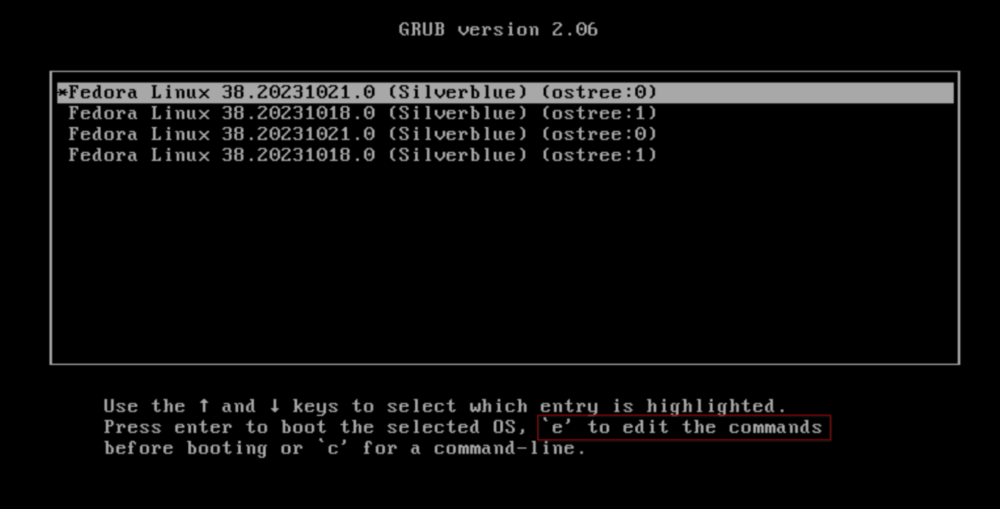
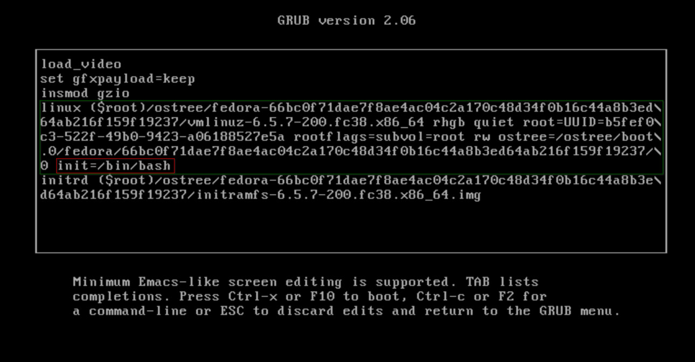
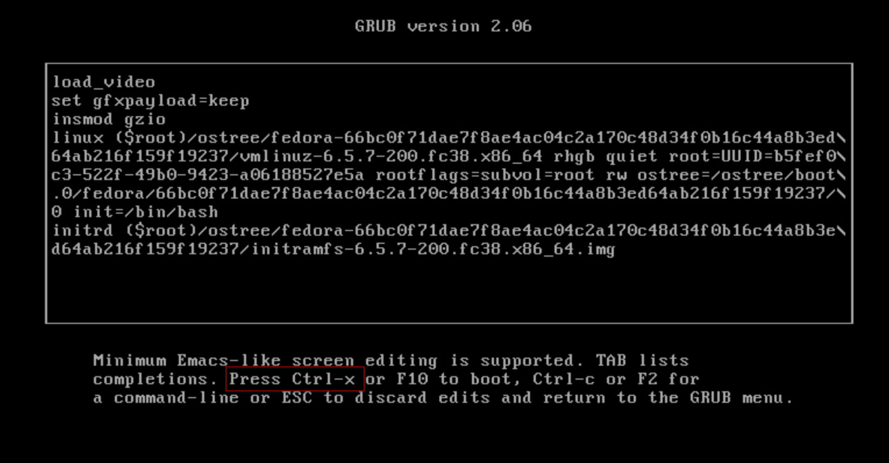

# 将用户添加到组

## 前言

[Users and Groups](https://wiki.archlinux.org/title/Users_and_groups) are used on Linux for access control, that is, to control access to the system's files, directories, and peripherals, and is cruicial to how Linux works.

!!! note "The following docs should also be applicable to other Fedora Atomic systems."

---

## Adding User to a Group on Atomic Systems

[Bazzite is based on Fedora Atomic](/General/Fedora_Atomic_Comparison/#comparison-of-bazzite-upstream-fedora-atomic-desktop), and Atomic systems use a slightly different way of managing Users & Groups. Therefore, `usermod` cannot be used directly. The following details steps to add your user to a particular group.

!!! warning "Follow this guide at your own discretion because you can **break** your system attempting any of this."

!!! info "If you only need to add your user to the input group for controller compatibility purposes, use the automated script at **Bazzite Portal → Tweak System → Add input to your user groups**."

---

#### 1. 备份当前用户组配置 

在继续之前，用以下命令创建你当前的用户组配置的备份：

```bash
sudo cp /etc/group /etc/group.bak
```

This copies your current group file to a file called `group.bak`. Additionally, it may prove to be helpful later on if you view and write down the current contents in `/etc/group`.

---

#### 2. Copy Group ID from `/usr/`

The Group ID then needs to be identified and copied. It can be found for any known group by running the following command:

!!! tip "Remember to replace `<your_group_name>` with the actual group name."

```bash
grep "<your_group_name>" /usr/lib/group
```

!!! example

    For example, the entry for the `dialout` group is `dialout:x:18`:

    ```bash
    grep "dialout" /usr/lib/group
    ```
    returns
    ```console
    dialout:x:18
    ```

!!! info "`/lib/` is a symlink to `/usr/lib/`."

---

#### 3. Write Group ID to Group File

This Group ID needs to be written into the working copy at `/etc/group`. This can be done by appending the entry manually to the `/etc/group` file, or via this one liner:

!!! tip "Remember to replace `<your_group_name>` with the actual group name."

```bash
grep "<your_group_name>" /usr/lib/group | sudo tee -a /etc/group
```

!!! example
    
    ```bash
    grep "dialout" /usr/lib/group | sudo tee -a /etc/group
    ```

!!! warning "Do **NOT** <small>_try to be smart and_</small> use bash's `>` or `>>` operator in this case. `>` overwrites the file, and both only work in a root shell. Follow the instructions."

---

#### 4. Use `usermod`

We can then add the user to group with the following command:

!!! tip "Remember to replace `<your_group_name>` with the actual group name, and `<username>` with your username."

```bash
sudo usermod -aG <your_group_name> <username>
```
!!! example
    
    ```bash
    sudo usermod -aG dialout bazzite
    ```

---

#### 5. 检查无误后重启

修改完成后，务必再次查看`/etc/group`文件，确定以下三条条目都在：

!!! tip "`<your_group_name>`应对应实际的组名，`<username>`对应你的用户名，`<group_ID>`对应组ID。"

*   `wheel:x:10:<username>`
*   `<username>:x:1000`
*   `<your_group_name>:x:<group_ID>:<username>`

如果你的`/etc/group`文件缺少任意一条，**不要重新启动或关机**，立刻前往 [Bazzite 的官方 Discord](/community/#discord-no-discord-account)上求助。

如果一切正常，重新启动后修改就能生效。

---

## 配置出错后的修复
<small>_diannaobaozhale_</small>

如果你意外删除了 `/etc/group` 或写入了错误的配置，可能会出现一种意外情况：你可以正常达到图形界面，但以下功能无法使用：

*   重启后的用户登录
*   Polkit 审核
*   `sudo`

此时你将无法直接修复 `/etc/group`，因为这需要 Polkit 或者 `sudo` 提供批准。

To fix this, the file needs to be edited in a root shell before the system arrives at a graphical session.

---

#### 1. Reboot into GRUB Command Editor

Reboot your device and tap <kbd>Esc</kbd> on the keyboard to reach the GRUB boot menu. If you have not hidden your GRUB menu, you may also tap <kbd>↓</kbd> continuously until the GRUB menu appears.

!!! tip

    *   If you press <kbd>Esc</kbd> too many times, you may end up at a `grub>` prompt.
    *   Return to the boot menu by typing `exit` and pressing <kbd>Enter</kbd>.



---

#### 2. Edit the Boot Command Temporarily

Edit the last deployment by pressing <kbd>E</kbd> on your keyboard.



Append `init=/bin/bash` to the line beginning with `linux`.



Continue the boot process with <kbd>Ctrl</kbd>+<kbd>X</kbd>.

---

#### 3. Fix `/etc/group`

Once the boot process completes, the system will drop you to a **root shell**.

View and edit your `/etc/group` with any CLI text editor, such as `vim` or `nano`. It should contain the following:

!!! tip "Replace `<username>` with your username. If you hadn't set it during installation, it would be set to a default of `bazzite`."

*   `wheel:x:10:<username>`
*   `<username>:x:1000`

!!! example 
    
    ```console
    bash-5.2# cat /etc/group
    wheel:x:10:bazzite
    bazzite:x:1000
    ```
!!! note "If you have previously backed up your `/etc/group` file, you can copy it back with `cp /etc/group.bak /etc/group`"

---

#### 4. Add User to `wheel` Group

After fixing `/etc/group`, SELinux needs to be temporarily loaded to add the user back to the group properly. Run the following commands:

Mount SELinux
```bash
mount -t selinuxfs selinuxfs /sys/fs/selinux
```
Load SELinux Policy
```bash
/sbin/load_policy
```
Add user to `wheel` Group
!!! tip "Replace `<username>` with your username. If you hadn't set it during installation, it would be set to a default of `bazzite`."
```bash
/sbin/usermod -aG wheel <username>
```
Sync configurations
```bash
sync
```
Reboot
```bash
/sbin/reboot -ff
```

---
