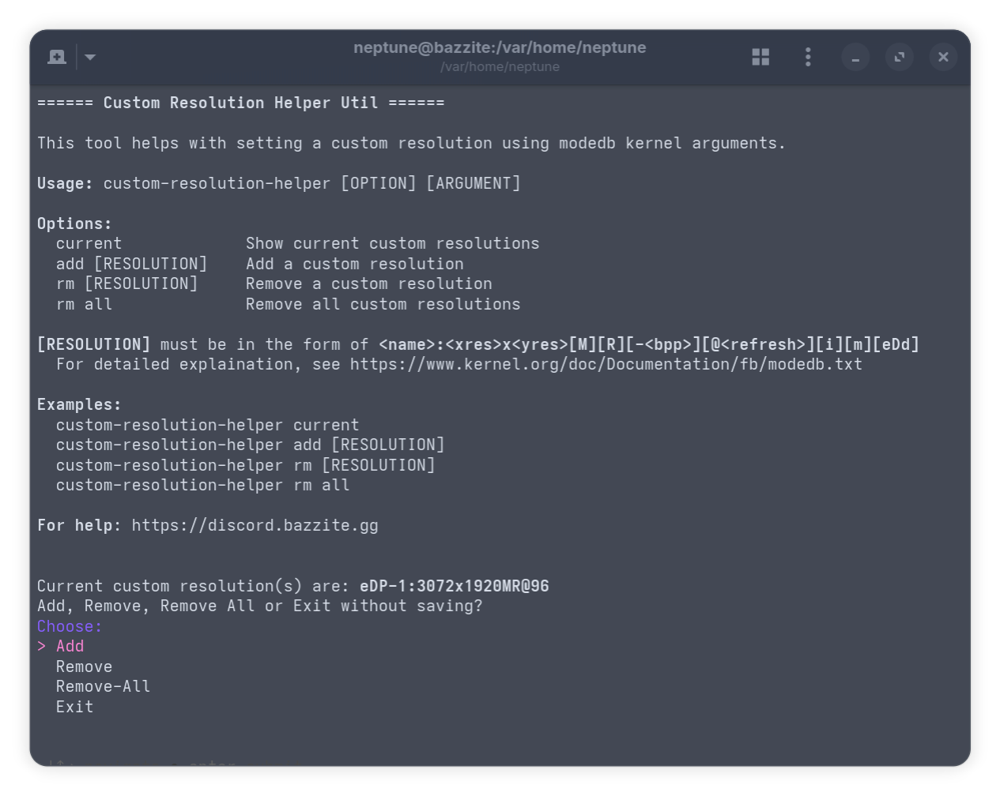
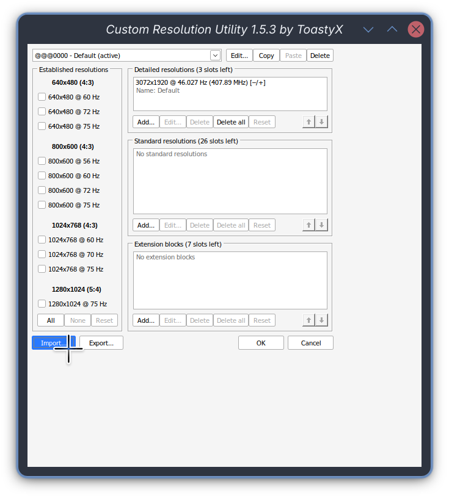

# Vlastní rozlišení

## Kscreen-Doctor (pouze Obrazy KDE / režim Desktop)

!!! info "Počínaje Plasmou 6.6 umožňuje `kscreen-doctor` přidání vlastní modeliny. Pokud jste v obrazu KDE, zkuste jej použít jako první!"

### Průvodce přidáním vlastního rozlišení pomocí `kscreen-doctor`

1. Spusťte `kscreen-doctor -o` v terminálu.
2. Najděte ID monitoru, pro který chcete přidat režim. Měli byste vidět něco podobného:
    ```bash
    Output: 1 eDP-1 a17bb763-cbd3-4b3d-b7d3-7344112e71b7
        enabled
        connected
        priority 1
        Panel
        replication source:0
        Modes:  1:2880x1800@60.00!  2:2880x1800@120.00*  3:1600x1200@59.87...... # output omitted for brevity
    ```
    Pokud například chcete do **eDP-1** přidat vlastní režim, vaše ID bude **1**. Poznamenejte si to.
3. Nyní můžete vytvořit příkaz pro přidání vlastního režimu v tomto formátu:
    ```bash
    kscreen-doctor output.<ID>.addCustomMode.<Width>.<Height>.<Refresh>.<Scaling>
    ```
    Nahraďte každou z možností tím, co chcete nastavit. Všimněte si, že obnovovací frekvence je v **mHz** (milihertz), takže obnovovací frekvence **75Hz** bude odpovídat `75000` v `<refresh>`.
    `<Scaling>` může být `full` nebo `reduced`. Použijte `full` k roztažení rozlišení tak, aby vyplnilo obrazovku, nebo `reduced` k přidání černých pruhů pro zachování poměru stran.
    
    Například příkaz pro přidání vlastního rozlišení 1920x1080@75Hz pro displej ID 1, který bude roztažen tak, aby vyplnil celou obrazovku, by byl:
    ```bash
    kscreen-doctor output.1.addCustomMode.1920.1080.75000.full
    ```
    
## Custom-Resolution-Helper



!!! warning "Pokud narazíte na neočekávaný problém se zobrazením u `crh rm all`, odeberte všechna vlastní rozlišení. Jakékoli úpravy na vašem zařízení by měly být prováděny odpovídajícím způsobem **na vlastní riziko**."

!!! info "Vlastní rozlišení vytvořená touto metodou vyžadují restart, aby se projevily."

Nástroj příkazového řádku, který pomáhá s **vytvářením** a **správou** vlastních rozlišení pro vaši instalaci Bazzite.

### Pomocí `custom-resolution-helper`

Otevřete hostitelský terminál a **zadejte**:

```command
custom-resolution-helper
```

K dispozici je také **alias**, který umožňuje méně psaní pro uživatele handheldů nebo HTPC nastavení bez klávesnice:

```command
crh
```

### Průvodce pro vytvoření vlastního rozlišení pomocí `custom-resolution-helper`

- Metoda ModeDB: snadnější nastavení, pravděpodobně nebude fungovat s HDMI.
- Metoda EDID: více potíží s nastavením, použijte ji pouze v případě, že ModeDB nefunguje.

!!! info "Počínaje Plasma 6.6 umožňuje `kscreen-doctor` přidání vlastní modeliny. Pokud jste v obrazu KDE a potřebujete vlastní rozlišení pouze v režimu plochy, zkuste nejprve použít [to](../custom_resolution/#guide-to-add-a-custom-resolution-using-kscreen-doctor)!"

=== "Metoda Modedb"

    1. Spusťte `custom-resolution-helper` v terminálu.
    2. Ověřte, že **nemáte** duplicitní rozlišení.
    3. Zvolte `Add`, pomocí šipek procházejte a enter pro odeslání.
    4. Vyberte displej, pro který chcete vytvořit vlastní rozlišení. Tento displej by měl být `connected`.
    5. Postupujte podle pokynů na obrazovce v **Interaktivní režim**.
    6. Jakmile dokončíte výběr možností, zobrazí se výzva ke změně konfigurace spouštění. Jednoduše jej autorizujte pomocí svého hesla.
    7. Po dokončení příkazu můžete restartovat počítač a vybrat nové rozlišení v **Nastavení systému**.

=== "Metoda EDID"

    1. Spusťte `custom-resolution-helper` v terminálu.
    2. Vyberte `Dump-EDID` a vyberte svůj displej.
    3. EDID bude umístěno do `/tmp/crh/edid.bin`.
    4. Toto můžete zkopírovat do složky Home, Downloads nebo Desktop.
    5. K úpravě můžeme použít známé CRU, ale to bude vyžadovat wine/proton launcher. K otevření můžete použít Lutris, Faugus launcher nebo dokonce Steam.
    6. Jakmile otevřete CRU, klepněte na možnost importu v levém dolním rohu. Ujistěte se, že typ souborů je nastaven na „vše“ a je vybrána možnost „Importovat kompletní EDID“.
    
    7. Úpravy edid můžete provádět stejným způsobem jako ve Windows.
    8. Jakmile skončíte, uložte jej jako soubor pomocí možnosti exportu.
    9. Přesuňte upravený soubor edid do `/tmp/crh/edited/` a vyberte jej v `crh add-edid`. Zobrazí se výzva ke změně konfigurace spouštění. Jednoduše jej autorizujte pomocí svého hesla.
    10. Po dokončení příkazu můžete restartovat počítač a vybrat nové rozlišení v **Nastavení systému**.
    

#### Vysvětlení možnosti interaktivního režimu:

- **VESA(TM) Coordinated Video Timings (CVT)**: Tuto možnost vyberte, pokud v **Nastavení systému** aktuálně nelze vybrat vaši obnovovací frekvenci (např. přetaktujete svůj displej z 60 Hz na 75 Hz, ale 75 Hz aktuálně není dostupná obnovovací frekvence).

- **Reduced Blanking**: Toto budete chtít, pokud má váš monitor vysoké rozlišení nebo obnovovací frekvenci. Další informace naleznete v [kalkulátoru časování zobrazení Toma Verbeura](https://tomverbeure.github.io/video_timings_calculator).

- **Interlaced**: Toto nastaví rozlišení jako prokládané, což je užitečné pro něco jako plazmový televizor nebo CRT displej.

- **Okraje**: To je užitečné, když jsou okraje obrazu skryty za hranicemi obrazovky, jako by byl obraz přiblížený. Většinou budete chtít, aby se to nastavilo na monitoru/TV.

### Průvodce pro vytvoření vlastního rozlišení pro streamování her Sunshine

Řekněme, že streamujete z hostitelského počítače (se systémem Bazzite) do notebooku:

- Váš hostitelský stolní počítač má rozlišení `1920x1080@144Hz`,
- ale váš notebook má rozlišení `2560x1600@120Hz`.

...a text ve streamu vypadá rozmazaně kvůli změně rozlišení.

`custom-resolution-helper` můžete použít k přidání virtuálního displeje do vašeho hostitelského PC (se systémem Bazzite) bez záslepky!

- Jednoduše postupujte podle kroků pro vytvoření vlastního rozlišení a vyberte možnost, aby byl displej **vždy zapnutý**. Po restartu můžete stisknout <kbd>Super</kbd> + <kbd>P</kbd> pro přepnutí režimů více monitorů v KDE. Poté se ujistěte, že je v Sunshine vybráno správné zobrazení.

- Alternativně můžete také přidat režim `2560x1600MR@120` na hlavní displej hostitelského počítače. To může způsobit zatemnění monitoru vašeho hostitelského počítače a zobrazení dialogu `unsupported mode` a během streamování hry budete muset změnit rozlišení. Tuto metodu můžete vyzkoušet, pokud nechcete řešit více monitorů.

!!! warning "**ne** deaktivujte hlavní displej, protože to může způsobit, že nebudete mít žádný dostupný displej (což může také přerušit streamování). <br>Pokud narazíte na černou obrazovku, která přetrvává i po restartu, můžete zkusit přejít do tty stisknutím <kbd>ctrl</kbd> + <kbd>alt</kbd> + <kbd>F4</kbd> a odstranit ~/.config/kwinoutputconfig.json z příkazového řádku. Všimněte si, že tím odstraníte konfigurace vašeho monitoru. <br>Příkladem bude příkaz mv ~/.config/kwinoutputconfig.json ~/.config/kwinoutputconfig.json.bak".

### Pokročilé použití

Tento nástroj přidává **argument jádra** s `video=[RESOLUTION]`. Řetězec `[RESOLUTION]` má formát `<name>:<xres>x<yres>[M][R][-<bpp>][@<refresh>][i][m][eDd]`, jak je uvedeno v [dokumentaci jádra pro modedb](https://www.kernel.org/doc/Documentation/fb/modedb.txt).

Pokud se cítíte dostatečně sebevědomě a víte, co děláte, můžete použít

```command
custom-resolution-helper add [RESOLUTION]
```

přidat rozlišení s funkcemi, které nejsou zahrnuty v tomto skriptu, jako je vynucení DVI-I portu k použití digitálního výstupu.

Můžete také manipulovat s argumenty jádra přímo přes

```command
rpm-ostree kargs --editor
```

Mějte však prosím na paměti, že jakékoli úpravy vašeho zařízení by měly být vždy prováděny vhodným způsobem **na vlastní riziko**.