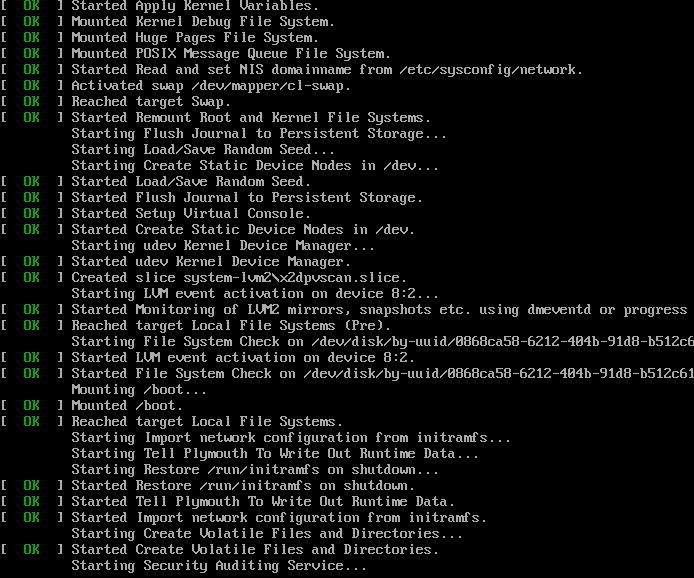

# Zobrazit podrobné inicializační protokoly během spouštění

## Účel

Podívejte se na inicializační protokol, který ukazuje, zda jsou služby funkční při spouštění vašeho zařízení.



## 1 – Změňte motiv Initramfs tak, aby povolil podrobné protokoly init:

```command
sudo plymouth-set-default-theme details
```

Případně vytvořte `/etc/plymouth/plymouthd.conf` ručně

## 2 - Regenerujte Initramfs a restartujte, abyste povolili změnu motivu

```command
sudo rpm-ostree initramfs --enable --reboot
```