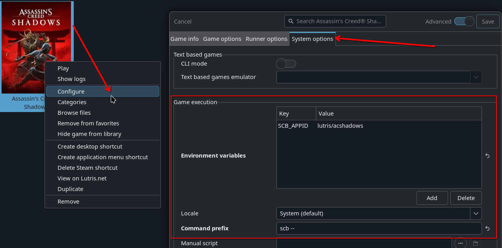

# ScopeBuddy

## Co to je?

- Malý skript, který funguje jako můstek gamescope, abyste nemuseli u mnoha her kopírovat a vkládat dlouhé možnosti spouštění.
- Umožňuje nastavit proměnné prostředí (env vars) a možnosti spuštění gamescope globálně, pro jednotlivé hry nebo v závislosti na tom, v jakém režimu ScopeBuddy nebo Steam běží.
- Dává vám možnost automatizovat spouštění bash skriptů před spuštěním hry (toto je vedlejší efekt toho, jak fungují konfigurační soubory)
- Své konfigurace si můžete přenést s sebou mezi počítače pouhým zkopírováním `~/.config/scopebuddy` do nového zařízení
- Používá se také jako řešení pro opravu překrytí Steam při použití vnořeného gamescope v režimu plochy.
- Opravuje SteamInput při použití ve vnořeném režimu na ploše.

## Jak to používat

**Jako náhrada `gamescope` pouze pro opravu překrytí Steam**:

Pokud chcete pouze opravit překrytí Steam (a vstup Steam v některých hrách), vše, co musíte udělat, je nahradit `gamescope` ve vašich možnostech spuštění hry za `scb` nebo `ScopeBuddy`.
V podstatě jde o záměnu

```bash
XDG_DEFAULT_LAYOUT=no gamescope -w 1920 -h 1080 -W 2560 -H 1440 -- %command% --launcher-skip
```

do

```bash
XDG_DEFAULT_LAYOUT=no scb -w 1920 -h 1080 -W 2560 -H 1440 -- %command% --launcher-skip
```

Nyní bude vaše překrytí Steam fungovat při použití gamescope pro hru v režimu plochy! 🎉

### Použití v Lutrisu

1. Otevřete Lutris a klikněte pravým tlačítkem na hru, se kterou chcete použít ScopeBuddy.
2. Klepněte na `Configure`
3. Přejděte na kartu `System Options` a přejděte dolů na `Game execution`
4. Klepněte na `Add` pod `Environment variables` a nastavte klíč na `SCB_APPID` a hodnotu na `lutris/nameofgame`.
5. Do `Command prefix` přidejte `scb --`
6. Klikněte na Uložit



!!! info "Proměnná prostředí `SCB_APPID` je volitelná, ale umožní vám využívat konfigurační soubory specifické pro hru"

## Konfigurační soubory

### Nastavení globálních výchozích hodnot

Pokud jste hru jednou spustili s výše uvedenými možnostmi spuštění, ScopeBuddy pro vás vytvoří výchozí ukázkovou konfiguraci `~/.config/scopebuddy/scb.conf`

!!! info "Je možné, že soubor neexistuje, v takovém případě vytvořte prázdný."

Uvnitř souboru můžete přidat env vars a nastavit výchozí sadu argumentů gamescope.

```bash
export XDG_DEFAULT_LAYOUT=no
SCB_GAMESCOPE_ARGS="-f -w 2560 -h 1440 -W 2560 -H 1440 -r 180"
```

Výše uvedený `scb.conf` způsobí, že ScopeBuddy vždy nastaví rozložení klávesnice v gamescope na norské a spustí gamescope s argumenty `-f -w 1920 -h 1080 -W 2560 -H 1440 -r 180`

To znamená, že nyní můžeme zkrátit naše možnosti spuštění pro hry, které chceme v gamescope spustit

```bash
scb -- %command% --launcher-skip
```

!!! note
    `--launcher-skip` je pouze příkladem možnosti spuštění

### Automatické rozlišení/HDR/VRR

Pro uživatele, kteří běžně mění rozlišení nebo používají streamování her přes Sunshine/Moonlight nebo Steam Remote Play, se mohou vlastnosti zobrazení často měnit.

Na desktopech KDE (první podpora Gnome [přidáno s upozorněními](https://github.com/HikariKnight/ScopeBuddy?tab=readme-ov-file#gnome-support)) přijímá ScopeBuddy konfiguraci pro automatické vkládání šířky a výšky, stavu HDR nebo stavu VRR na váš primární displej.

Přidejte následující proměnné k následujícímu do konfiguračního souboru na `~/config/scopebuddy/scb.conf`:

```bash
SCB_AUTO_RES=1 # Overrides output height and width with current display
SCB_AUTO_HDR=1 # Adds --enable-hdr if the current display has HDR enabled
SCB_AUTO_VRR=1 # Adds --adaptive-sync if the current display has VRR enabled
```
Pokud máte více displejů (nebo streamovací „fiktivní zástrčku“), budou tyto hodnoty detekovány z vašeho primárního displeje v KDE.

Pevné kódování konkrétního displeje ve vašem `SCB_GAMESCOPE_ARGS` pomocí `--prefer-output {your-device-here}` způsobí, že tyto automatické hodnoty budou detekovat z preferovaného displeje.

Úplný příklad konfigurace pomocí SCB_AUTO_* vars může vypadat takto:

```bash
SCB_GAMESCOPE_ARGS="-f --mangoapp" # passes args for fullscreen + mangohud to gamescope
SCB_AUTO_RES=1
SCB_AUTO_HDR=1
SCB_AUTO_VRR=1
```

To bude mít za následek následující výstup příkazu gamescope, když je váš displej KDE nastaven na 2560x1440 se zapnutým HDR a VRR: `gamescope -f --mangoapp -W 2560 -H 1440 --hdr-enabled --adaptive-sync`.

Pokud později přepnete displej KDE na 1920x1080 s vypnutým HDR a zapnutým VRR: `gamescope -f --mangoapp -W 1920 -H 1080 --adaptive-sync`.

To vše bez změny jediného řádku v možnostech spouštění služby Steam nebo konfiguraci ScopeBuddy!

### Další konfigurační soubory
Pokud pro hru používáte jinou sadu výchozích hodnot, například chcete tuto hru upscalovat z 1080p na 1440p, můžete mít samostatnou výchozí konfiguraci a říct ScopeBuddy, aby ji použil.
V tomto příkladu vytvořte soubor `1080p.conf` uvnitř `~/.config/scopebuddy/` a přidejte výchozí hodnoty specifické pro to, co chcete použít pro upscaling z 1080p.

```bash
export XDG_DEFAULT_LAYOUT=no
SCB_GAMESCOPE_ARGS="-f -w 1920 -h 1080 -W 2560 -H 1440 -r 180"
```

Chcete-li použít tuto novou konfiguraci, můžete ScopeBuddymu říct, aby ji používal, nastavením env var `SCB_CONF` v možnosti spuštění her ve službě steam

```bash
SCB_CONF=1080p.conf scb -- %command% --launcher-skip
```

ScopeBuddy nyní použije `1080p.conf` místo `scb.conf` k nastavení výchozích možností a proměnných prostředí.

!!! note

Pokud do ScopeBuddy zadáte jakýkoli argument, bude `SCB_GAMESCOPE_ARGS` zcela ignorován!
    To znamená, že použití volby spuštění `scb -f -- %command%` načte proměnnou env z `scb.conf`, ale nepoužije `SCB_GAMESCOPE_ARGS` z žádných konfiguračních souborů.

### Nastavení konkrétních možností pro jednu hru na Steamu

Pro tento příklad použijeme Path of Exile 2, tato hra podporuje HDR, takže chceme k gamescope připojit argument `--hdr-enabled`.

Nejprve budeme muset najít Steam AppID Path of Exile 2, můžete to najít tak, že přejdete do **Vlastnosti** her ve službě Steam a poté do sekce **Aktualizace**.
Ve spodní části uvidíte nějaké informace, chcete hodnotu **App ID**, v našem příkladu Path of Exile 2 je to `2694490`.

Nyní vytvořte `2694490.conf` uvnitř `~/.config/scopebuddy/AppID/` a přidejte své specifické možnosti Path of Exile 2.
A pro příklady nastavme `SteamDeck` na `0`, protože řekněme, že hra vynucuje nastavení, která jsou relevantní pouze na hardwaru Steam Deck, takže vypneme oznamování hře, že jsme na Steam Deck Client.

```bash
export SteamDeck=0
SCB_GAMESCOPE_ARGS+=" --hdr-enabled"
```

Nyní, když steam běží `scb -- %command%`, ScopeBuddy načte konfiguraci z `scb.conf` a poté načte `AppID/2694490.conf`, aby nad výchozí nastavení použil další možnosti (nebo nahradí předchozí možnosti z výchozí konfigurace, pokud se stejné proměnné exportují nebo znovu změní)

Všimněte si, jak `SCB_GAMESCOPE_ARGS` používá `+=` místo `=`.

- `+=` znamená přidat toto na konec aktuální proměnné.
- `=` znamená nahradit vše v proměnné.

To nám umožní znovu použít `SCB_GAMESCOPE_ARGS`, který jsme nastavili v našem `scb.conf`

!!! note

    AppID můžete také nastavit ručně pomocí `SCB_APPID="somecoolgame"` a přepsat tak automatickou detekci AppID, která aktuálně podporuje pouze Steam. To lze použít k ručnímu přidání základní podpory pro konfigurace podobné "AppID" pro hry v jiných launcherech, jako je Lutris nebo Heroic; například `SCB_APPID="heroic/somecoolgame"` by použil konfigurační soubor `AppID/heroic/somecoolgame.conf`.

## Často kladené otázky (FAQ)

### Existuje grafická aplikace pro vytváření konfigurací?

Ano! Na flathubu je jeden: [ScopeBuddy GUI](https://flathub.org/en/apps/io.github.rfrench3.ScopeBuddy-gui)

### Mohu používat funkce ScopeBuddys bez použití gamescope?

Ano, stačí použít env var `SCB_NOSCOPE=1` v možnostech spuštění, jako je tento

```bash
SCB_NOSCOPE=1 scb -- %command% --launcher-skip
```

Tím ScopeBuddy řekne, aby nespouštěl gamescope a ignoroval `SCB_GAMESCOPE_ARGS` ve všech konfiguracích.
Výchozí konfigurační soubor bude také nastaven na `noscope.conf` místo `scb.conf`, pokud jste do voleb spuštění nepřidali také env var `SCB_CONF`.

!!! note

    `SCB_NOSCOPE=1` můžete také exportovat do konfigurace aplikace, pokud nikdy nechcete používat gamescope pro hru, ale přesto pro ni používáte ScopeBuddy. Při tomto použití však bude `noscope.conf` ignorován, protože bude aplikován po načtení `scb.conf`.

### Funguje ScopeBuddy v herním režimu Steam?

Ano!
Když ScopeBuddy zjistí, že pára běží v režimu Steam Gaming Mode, vynutí to `SCB_NOSCOPE=1` a `SCB_CONF=gamemode.conf`, abyste mohli nastavit vlastní možnosti, které se použijí pouze v režimu Steam Gaming Mode, při zachování možností specifických pro hru!

To znamená, že můžete použít ScopeBuddy k automatickému ovládání použití vnořeného gamescope v režimu plochy a nevyužití gamescope v režimu Steam Gaming.
Už žádné ruční přidávání a odebírání gamescope z možností spouštění, když přepínáte mezi herním režimem Steam a režimem plochy! 🎉

### Mohu nechat ScopeBuddy ovládat možnosti spouštění mých her?

Samozřejmě! K tomu použijete pouze konfiguraci AppID a poté můžete přidat možnosti spuštění přidáním do konfigurace AppID pro hru.

```bash
command+=" --launcher-skip --some-other-parameter"
```

!!! note

    `+=` je velmi důležitý, protože POTŘEBUJETE připojit možnosti spuštění k %příkazu%, je také důležité, abyste začínali mezerou za prvním ", jinak se hra nespustí.

### Mohu nastavit, aby ScopeBuddy neaplikoval své opravy a používal jej pouze jako správce gamescope?

Použití následujících proměnných prostředí změní výchozí chování ScopeBuddy

- Nastavení `SCB_APPENDMODE=1` v `scb.conf` vám umožní dodat argumenty ScopeBuddy a ty budou připojeny **po** argumenty gamescope v jakýchkoli konfiguračních souborech.
- Nastavením `SCB_STEAMARGIGNORE=0` v `scb.conf` způsobí, že ScopeBuddy již nebude odstraňovat argumenty `-e` nebo `--steam`, pokud jsou dodány do gamescope, je to způsobeno tímto specifickým příznakem, který aktuálně havaruje gamescope.
- Nastavením `SCB_NESTEDFIX=0` v `scb.conf` zakážete opravu Steam Overlay a SteamInput, kterou ScopeBuddy aplikuje (než se zeptáte, jedná se o stejnou opravu)

!!! note

    Kontext, proč tyto proměnné prostředí existují, najdete v [XKCD 1172](https://xkcd.com/1172/)

### Kdy mám použít export pro proměnnou prostředí?

To závisí, zda se jedná o interní proměnnou pro ScopeBuddy nebo o globální proměnnou pro hry.
Pravidlem je, že exportujete každou proměnnou prostředí kromě situace

- Začíná to `SCB_`, protože to jsou všechny interní proměnné ScopeBuddy
- Proměnná se jmenuje `command`, protože se jedná o interní proměnnou ScopeBuddy obsahující vše uvnitř `%command%` ze služby steam (nebo vše po `--`)

### Počkat... Tohle všechno je jen Bash!?

Každý konfigurační soubor pro ScopeBuddy je úplný bash skript, který se získává před spuštěním gamescope a hry. To znamená, že pokud jste pokročilý uživatel, můžete dělat opravdu kreativní věci! Můžete také nastavit `SCB_DEBUG=1` tak, aby byl konečný příkaz zapsán do `~/.config/scopebuddy/scopebuddy.log`


!!! note

    Steam bude mít problémy se spouštěcím prostředím, některé nástroje jako `curl` budou mít v prostředí nekompatibilní knihovny, zatímco `wget` bude fungovat dobře. Otestujte správně své skripty a nechte je zapisovat do protokolu pro snadné ladění pomocí `2>&1 1>/tmp/myscript.log` na jeho konci v konfiguraci, abyste během testování zapsali výstup do souboru protokolu.

Některé užitečné proměnné máte k dispozici

- `$SCB_NOSCOPE` bude nastaven na 1, pokud byl ScopeBuddy spuštěn s `SCB_NOSCOPE=1`
- `$SCB_GAMEMODE` bude nastaven na 1, pokud je ScopeBuddy spuštěn z režimu Steam Gaming Mode (to také znamená `SCB_NOSCOPE=1`)
- `$SCB_CONFIGDIR` bude `$HOME/.config/scopebuddy`, to znamená, že můžete v rámci své konfigurace získávat další konfigurace (nedělejte prosím nekonečnou smyčku!)
- `$command` bude obsahovat rozšířenou proměnnou %command% ze Steamu a všechny možnosti spuštění, které jste přidali po ní.

Popusťte uzdu své kreativitě!
Ale buďte prosím zodpovědní!

### Příklad skriptu pro aktualizaci ArcDPS pro Guild Wars 2

To je myšleno jako inspirace pro vaše nápady?

Vytvořte konfigurační soubor pro Guild Wars 2
AppID/1284210.conf

```bash
# Guild Wars 2
# Do not use gamescope for this title
SCB_NOSCOPE=1
# Use ArenaNet login instead of Steam
command+=" -provider Portal"

# Get the game directory from the expanded %command% variable from steam
GAMEDIR=$(echo $command | awk -F '" "' '{ print $12 }' | sed 's/\/Gw2-64.exe//')
# Run the arcdps updater script before game starts
"$SCB_CONFIGDIR/scripts/dl-arcdps" "$GAMEDIR"
```

Poté vytvořte soubor skriptu (nezapomeňte, aby byl spustitelný)
scripts/dl-arcdps

```bash
#!/bin/bash
# Get the directory passed to the script
GW2_DIR=$1
# Get the latest md5sum for arcdps
NEWMD5SUM=$(wget -qO- https://www.deltaconnected.com/arcdps/x64/d3d11.dll.md5sum | awk '{print $1}')
# Get installed arcdps md5sum
MD5SUM=$(md5sum "$GW2_DIR/d3d11.dll" 2>/dev/null | awk '{print $1}')
# If they do not match, ask to update arcdps
if [ "$MD5SUM" != "$NEWMD5SUM" ]; then
    if zenity --question --text="Update ArcDPS?\nNew MD5: $NEWMD5SUM\nOld MD5: $MD5SUM"; then
        # Use wget to download arcdps as curl does not work in the steam environment
        wget -O "$GW2_DIR/d3d11.dll" https://www.deltaconnected.com/arcdps/x64/d3d11.dll
    fi
fi
```

## Přehled videa

https://www.youtube.com/watch?v=p-uggidEjIM