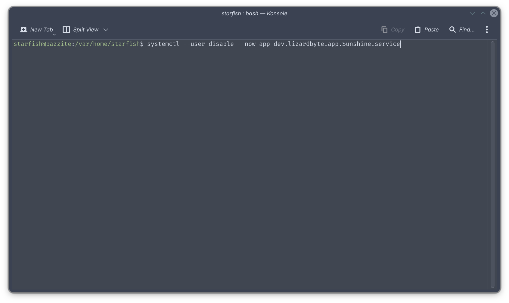

# Změny Sunshine on Bazzite

!!! info "Tato změna se projeví v aktualizaci v blízké budoucnosti spolu s přechodem na OGC jádro s inputplumberem. Podívejte se na oznámení!"

## Změna
Sunshine byl historicky dodáván se základním obrazem Bazzite, ale to se změní. 

## Proč se to děje?
Důvodem této změny je nedostatek stabilního balíčku Sunshine na Fedoře 43 a od dubna, šest měsíců životního cyklu Fedory 43 a blížící se vydání Fedory 44. 
To donutilo Bazzite místo toho použít balíček Sunshine-Beta, což způsobilo, že uživatelé měli po aktualizaci mnohokrát nefunkční streamování kvůli několika změnám v názvu jejich služby systemd.

## Co mám dělat, pokud momentálně používám Sunshine?
Níže uvedený průvodce vás provede přechodem na balíček Homebrew Sunshine, pokud již Sunshine aktivně používáte, takže budete mít i nadále funkční stream z vašeho hostitele Bazzite Sunshine, když dojde k aktualizaci.

1. Otevřete portál Bazzite a vyberte **Sunshine**

2. Vyberte **Povolit** nebo **Povolit (Beta)**, chcete-li beta verzi Sunshine

3. Zobrazí se okno terminálu. Počkejte na dokončení instalace a budete vyzváni k zadání hesla pro povolení snímání obrazovky prostřednictvím **Nastavení režimu jádra**.
4. Vypněte starou službu Sunshine otevřením nového okna terminálu a spusťte 
```bash
systemctl --user disable --now app-dev.lizardbyte.app.Sunshine.service
```

5. Nyní je vhodná doba na otestování, zda vaše nové nastavení funguje – vaše nastavení by měla přetrvat.

## Něco se pokazilo, co mám dělat?
### `The brew link step did not complete successfully`

Chcete-li to opravit, vytvořte adresář spuštěním 
```bash
mkdir -p /home/linuxbrew/.linuxbrew/Cellar/xkeyboard-config/2.47/share/xkeyboard-config-2
```

Pokud narazíte na nějaké další problémy, neváhejte se obrátit na [Bazzite Discord](/community/)!