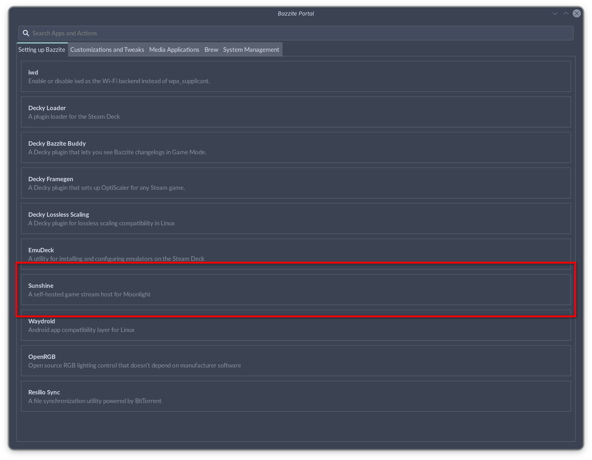
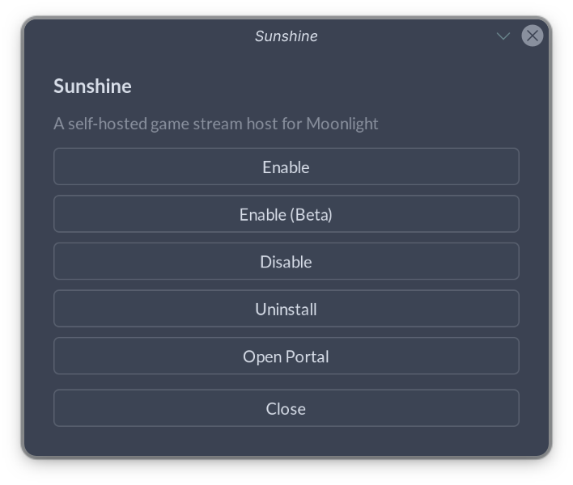
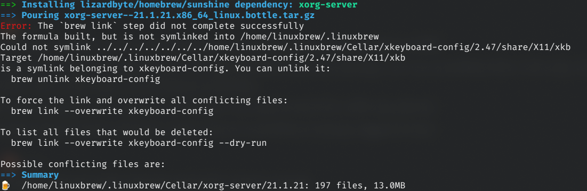

# Changes to Sunshine on Bazzite

## The Change

Sunshine had historically been shipped with the base Bazzite image - but that will no longer be the case. 
!!! info "This change will take effect in an update in the near future, along with the update to Fedora 44. Look out for announcements!"

## Why is This Happening?

The reasoning for this change is due to the lack of a stable package of Sunshine on Fedora 43, and as of April, six months into the Fedora 43 lifecycle, and nearing the release of Fedora 44. 
This forced Bazzite to use the Sunshine-Beta package instead, and had thus caused users to have non-functional streaming after an update numerous times, due to multiple changes to their systemd service name.
This change allows Sunshine's versions to stay independent of Bazzite updates, avoiding the situation mentioned above.

## What Should I Do If I am Currently Using Sunshine?

The guide below will walk you through switching to the Homebrew Sunshine package if you already actively use Sunshine, so that you will continue to have a working stream from your Bazzite Sunshine host when the update occurs.
!!! warning "It is highly recommended that you do this with physical access to your machine, or at least with an ssh connection set up."

1. Open the Bazzite Portal and select **Sunshine**

2. Select **Enable** or **Enable(Beta)** if you want the beta version of Sunshine

3. A Terminal Window will appear. Wait for the installation to complete and you will be prompted to input your password to enable screen capture through **Kernel Mode Setting**.
4. This is a good time to test if your new setup works - Your settings should persist.

## Something Went Wrong, What Should I do?

### The \`brew link\` step did not complete successfully


This is a known issue with homebrew on systems with a symlinked home directory.
To fix this, manually make the directory for the **Target** that brew is complaining about, or run the following command:
```bash
mkdir -p /home/linuxbrew/.linuxbrew/Cellar/xkeyboard-config/2.47/share/xkeyboard-config-2
```
Running the unlink and linking commands may also fix it:
```bash
brew unlink xkeyboard-config; brew link --overwrite xkeyboard-config
```

### Is a display connected and turned on? (error 503)

This usually means that the Sunshine executable hasn't been given the proper permissions (CAP_SYS_ADMIN). This can usually be fixed by updating Sunshine through the Bazzite Portal again.
!!! info "If you do not want Sunshine to be updated, you can run the postinstall script manually as ```sudo /usr/libexec/sunshine-postinst```"

### Error: Couldn't import RGB Image: 00003009 (error -1) 

When checking `systemctl --user status homebrew.sunshine*`, the error `Error: Couldn't import RGB Image: 00003009` is observed, and you are using an Nvidia system.
This is speculated to be some issues related to way Sunshine/CUDA is packaged on homebrew. Possible solutions include:

-    Installing the Beta version of Sunshine.
-    Using **XDG Portal Capture** and trying different encoders.
-    Manually specify the iGPU to use for capture if available.
-    Using alternative installation methods.

!!! info "Help us fix this if you do find a solution!"

## Alternative Ways to Install Sunshine

If the homebrew Sunshine package does not work well for you, or if you do not want homebrew packages on your system, you may try to install Sunshine with alternative ways as listed below, albeit with some limitations and downsides:
!!! warning "Installation of Sunshine via these methods is not officially supported."

=== "Layering from the COPR"
    
    This is similar to the situation when sunshine is/was included in the image.
    Layering the Sunshine Beta package from the [official Beta COPR](https://copr.fedorainfracloud.org/coprs/lizardbyte/beta/) by running
    ```bash
    sudo dnf5 copr enable lizardbyte/beta
    rpm-ostree install Sunshine
    ```
    This has the following downsides:
    
    -    May prevent system updates.
    -    Lack of a stable package.
    -    Potentially non-functional stream after an update due to changing service names.
    -    Lack of a way to prevent Sunshine from updating along with the system.

=== "Flatpak"
    
    Installing the Sunshine flatpak package from [flathub](https://flathub.org/en/apps/dev.lizardbyte.app.Sunshine).
    This has the following downsides:
    
    -    [Additional installation steps](https://docs.lizardbyte.dev/projects/sunshine/latest/md_docs_2getting__started.html#flatpak) are needed for KMS Capture and may not be maintained after a version upgrade.
    -    KMS Capture may still not work.
    -    Lack of a beta package with **XDG Portal** capture and Vulkan encoder, and thus no capture method can be used if KMS Capture does not work.
    -    The flatpak appears to still be in an experimental state, similar to the homebrew package.
    
If you encounter any other issues, feel free to reach out on the [Bazzite Discord](/community.md)!
