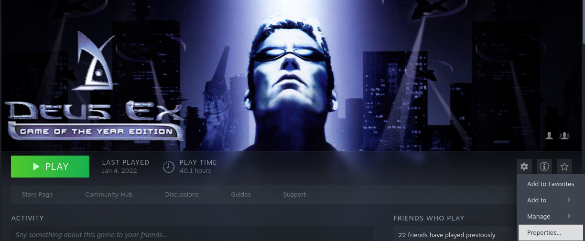
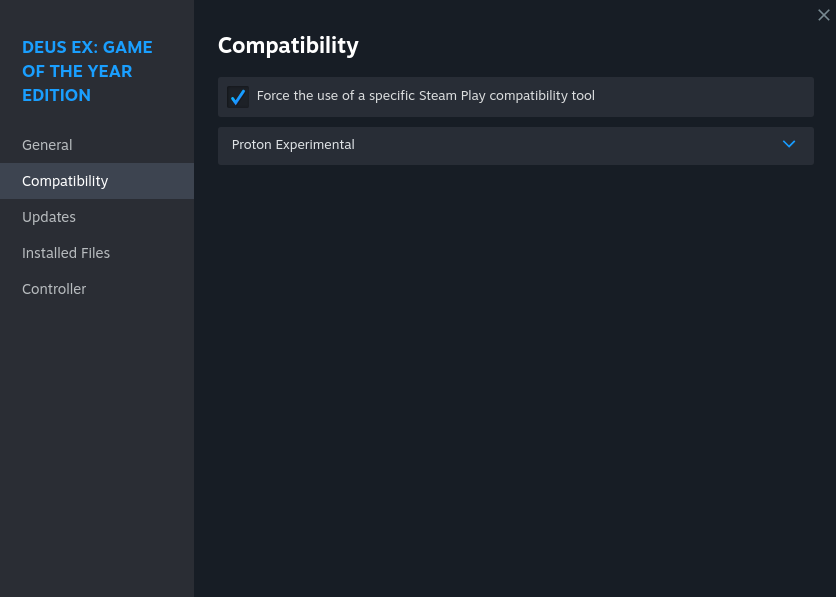
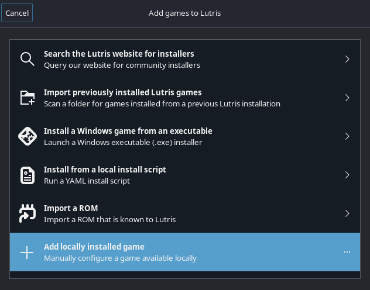
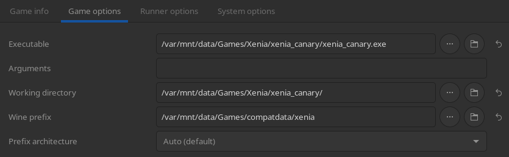
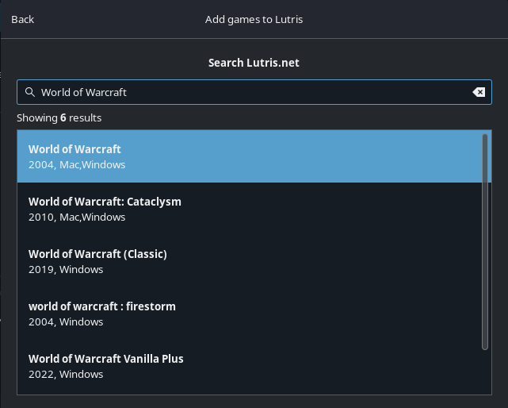
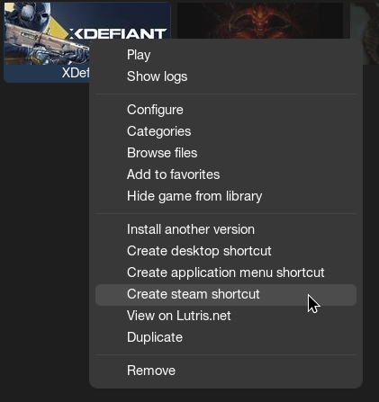

# Spouštěče her

## **Nastavení Steamu**

Steam může spouštět hry pro Windows na Linuxu. Využívá širokou škálu projektů a záplat, které jsou všechny zabaleny do části softwaru zabudovaného ve službě Steam s názvem [**Proton**](https://github.com/ValveSoftware/Proton) pro kompatibilitu s Windows.

### Vynucení konkrétní verze nástroje Proton / Steam Play

#### Důležité poznámky

- Hry s linuxovým portem budou ve výchozím nastavení používány na obrazech plochy.
- Valve vybere výchozí běžec na obrazech _Handheld/HTPC_. 
- Některé hry běží lépe se specifickou verzí Protonu nebo vynucením běhu Linuxu, aby spustil linuxový port.

Spusťte tuto konkrétní verzi tak, že přejdete do **Vlastnosti** > **Kompatibilita** > **Vynutíte použití konkrétního nástroje pro kompatibilitu se Steam Play**

#### Příklad obrázku

## **Hry mimo službu Steam**

**Doporučujeme používat [Lutris](https://lutris.net/games?q=&ordering=-popularity&paginate_by=100) pro _většinu_ her mimo Steam**.  Existují okrajové případy se specifickými spouštěči a hrami, které mají lepší funkční alternativu než Lutris, ale Lutris je nejvíce podporovanou možností pro PC hry mimo Steam na Bazzite mimo speciální scénáře.

### Nastavení Lutris

Lutris nabízí dva způsoby hraní her pro Windows na Bazzite.  Skripty řízené komunitou nebo ruční přidání spustitelného souboru.  Je **důrazně doporučeno používat ruční metodu**, protože některé skripty se špatně udržují.

### Ruční přidání hry pro Windows do Lutris

Pokud však vaše hra není uvedena nebo nefunguje s poskytnutým skriptem, přidejte spustitelný soubor ručně. Bude potřebovat vytvořený [**adresář předpon**](./Managing_and_modding_games.md), ale ve výchozím nastavení bude pro každou hru používat adresář `~/Games`.

### Instalační skripty Lutris

Lutris je software pro správu her, který funguje jako rozhraní WINE pro hry Windows. Několik her a spouštěčů lze nainstalovat vyhledáním titulu a použitím některého z instalačních skriptů. 

#### Zkratky Lutris

Kliknutím pravým tlačítkem na hru na Lutris získáte možnost přidat ji jako hru mimo Steam (užitečné pro herní režim Steam), vytvořit zástupce na ploše nebo zástupce nabídky aplikace.

## Další spouštěče her

Bazaar může nainstalovat další spouštěče her, jako je [**Heroic Games Launcher**](https://flathub.org/en/apps/com.heroicgameslauncher.hgl) (pro hry GOG/Epic/Amazon) nebo alternativní rozhraní jako [**Faugus**](https://flathub.org/en/apps/io.git.fau.Fa).