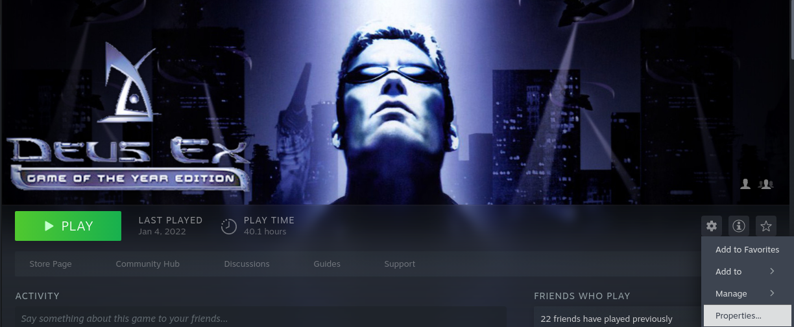
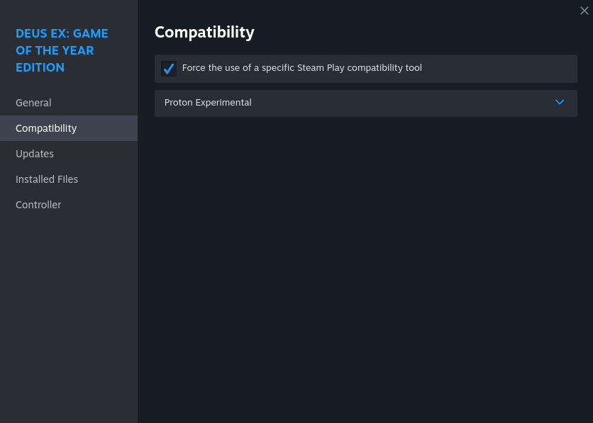
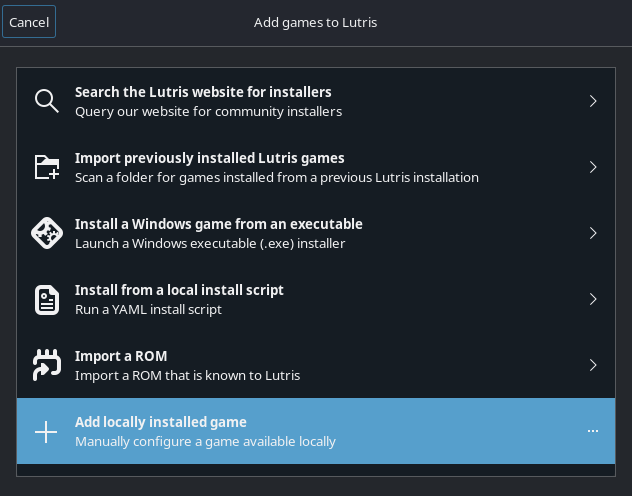
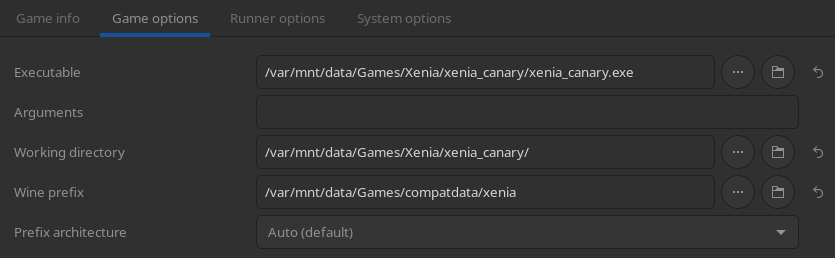
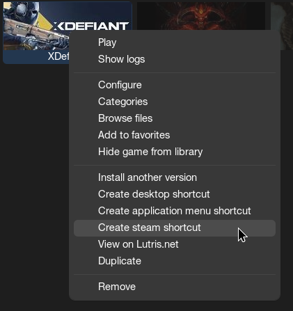

# 游戏启动器

## 配置 Steam

Steam 允许你在 Linux 上运行 Windows 游戏。这一过程使用 [**Proton**](https://github.com/ValveSoftware/Proton) 这一工具来实现 Windows 的兼容性。Proton 的本质是许多相关项目（比如 Wine）和特化补丁的集合，关于它的更多信息可以参考[这里](/Gaming/gaming-intro/#steam-games)。

### Forcing A Specific Proton / Steam Play Tool Version

#### 重要注意事项

- 在 Bazzite 桌面版上，Steam 会优先使用 Linux 原生版（如果游戏提供的话）.
- 在 Bazzite 掌机版上，Steam 会默认自动配置 Valve 官方推荐的 Steam Play 工具。
- 有些游戏使用特定的 Proton 版本运行可能会比 Linux 原生版性能明显更好或更差，但必须具体游戏具体分析。

如果需要特定的 Proton 版本，可以在游戏的 **Properties** → **Compatibility** 下选中 **Force the use of a specific Steam Play compatibility tool**，并在下拉框中选择你需要的版本。

!!! warning "Counter Strike 2 **必须**使用 Linux 原生版运行（在 Steam 的游戏配置中禁用**Force the use of a specific Steam Play compatibility tool**）。运行 Proton 版的 CS2 可能会导致账户被 VAC 封禁。"

#### 图例

## 非 Steam 游戏

可以使用 Lutris （已预安装）或其他启动器，比如 [**Heroic Games Launcher**](https://flathub.org/en/apps/com.heroicgameslauncher.hgl) （适用于 GOG、Epic 或 Amazon 游戏）或者 [**Faugus**](https://flathub.org/en/apps/io.github.Faugus.faugus-launcher) ，它们都可以用于管理你的非 Steam 游戏的 Proton Prefix、Proton 版本和[启动选项](/Gaming/launch-options-env-variables/)。

!!! note "通过 **Bazaar** 可以查找并安装不同的启动器。"

!!! info "也可以直接把非 Steam 游戏添加到 Steam，此时 Prefix 由 Steam 直接管理。这在 Steam 游戏模式/大屏幕模式下会很有用。"

### 设置

通常来讲你只需要在 **Add locally installed game** 选项中选择游戏的 .exe 文件，启动器会自动创建 Proton Prefix 并进行管理。各个启动器一般也提供手动指定 Prefix 路径的选项，可以按需操作。

!!! note "Lutris 通常提供两种在 Bazzite 上运行 Windows 游戏的选项：社区脚本或手动配置。由于有些社区脚本可能已过时或疏于维护，**一般建议手动配置**。"

### 在 Lutris 里手动添加 Windows 游戏

!!! 备注

    其他启动器对应的操作和以下列出的步骤一般差别不会太大。

By default, Lutris will use the `~/Games` directory for each game's [**prefix directory**](/Gaming/Managing_and_modding_games/#what-is-a-proton-or-wine-prefix).

### Adding Shortcuts and Desktop Entries

You may add a shortcut for the game into the App Menu or your Desktop by going into the Edit Tab or the Right Click Context Menu of the launcher of your choice and selecting the respective entries.
