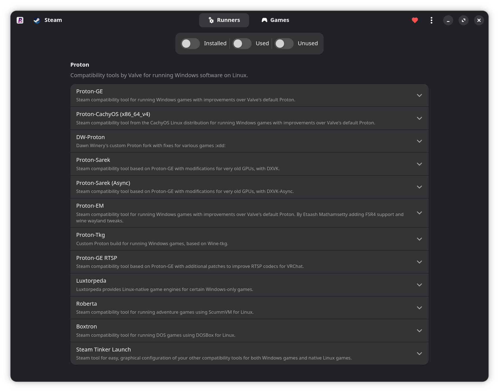
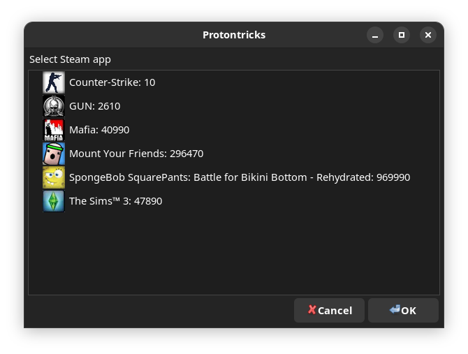
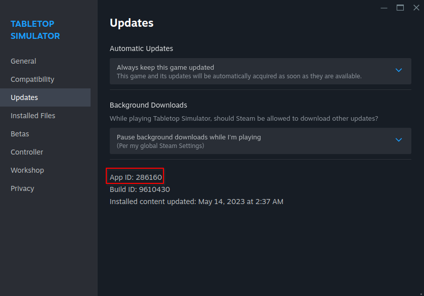

# Správa a úprava her

## Vrstvy kompatibility a správa her pro Windows

Hry pro Windows musí na Bazzite běžet přes **vrstvu kompatibility** (jako Proton). Nainstalujte a aktualizujte na nejnovější [GE-Proton](https://github.com/GloriousEggroll/proton-ge-custom), [Luxtorpeda](https://github.com/luxtorpeda-dev/luxtorpeda) a další nástroje pomocí ProtonPlus.

## Protontricks

Některé hry vyžadují, aby správně fungovaly [Protontricks](https://github.com/Matoking/protontricks) (předinstalované) nebo [Winetricks](https://github.com/Winetricks/winetricks) (pro hry jiné než Steam, které jsou součástí Lutris), a to instalací Windows DLL do předpony.

## Skryté soubory ve Správci souborů

!!! note

    Winecfg obsahuje možnost zobrazit skryté soubory pro programy Windows, které vyžadují soubor pro výběr souborů.

Desktop Linux obsahuje skryté soubory a adresáře, které mohou obsahovat důležité soubory související s hraním her.

**Zobrazit skryté soubory** kliknutím na nabídku **hamburger** (_3 vodorovné čáry ve správci souborů_) a výběrem možnosti „Zobrazit skryté soubory“ zobrazíte všechny adresáře a soubory, které jsou ve výchozím nastavení skryté.

Všechny tyto adresáře a soubory začínají `.` před nimi

### Co je předpona protonu (nebo vína)?

Je to lepidlo, které drží vše pohromadě, když spustíte hru přes Proton, a také je zodpovědné za to, že obsahuje všechny soubory, které hra uloží mimo instalační složku.

!!! important

    Tato instalační složka pro **Steam hry** je obvykle v: `.../steamapps/common/<game>`

Mnoho počítačových her ukládá soubory do složek Windows, jako jsou „Dokumenty“ nebo „AppData“, a oba lze nalézt v adresáři s předponami. Tento adresář s předponami může být užitečný pro úpravy vašich her, zálohování uložených souborů nebo konfiguračních souborů.

U her na Steamu jsou umístěny ve vaší složce `~/.steam/root/steamapps/compatdata/` a poté **číslo AppID hry**:

- Toto ID tak, že přejdete do vlastností hry na Steamu ve hrách **Vlastnosti** >> **Aktualizace** >> **ID aplikace**
- Pokračujte na `.../pfx/drive_c/` a všude tam, kde hra upustí soubor ve Windows.

Hry mimo Steam mohou mít složku s předponou kdekoli, kterou určíte.  Ve výchozím nastavení používá Lutris jako hlavní složku `~/Games`.

#### Zlomená předpona protonu?

!!! warning

    Odstranění předpony Protonu **_může_** odstranit uložení a konfigurační soubory!

Otevřete adresář s předponami hry a odstraňte data v něm. Dávejte pozor, abyste nesmazali kořenový adresář `.../compatdata` (nebo `~/Games` nebo vlastní adresář, který jste nastavili pro hry mimo Steam), čímž by se odstranila data prefixu pro všechny hry!

## Modifikace

**Steam Workshop je nejpřímější způsob, jak získat mody**, ale není podporován pro každý titul a vyžaduje, abyste hru vlastnili ve službě Steam. Někteří správci modů mají linuxové porty jako [r2modman](https://github.com/ebkr/r2modmanPlus).

Přidávání a nahrazování herních souborů je stále možné jak v adresáři hry, tak v prefixu, ale mohou být spojeny některé další kroky.  Některé mody vyžadují proměnnou prostředí „WINE DLL OVERRIDE“ v možnostech spouštění služby Steam.  U her mimo Steam použijte Lutris k otevření „Konfigurace vína“ a vyberte kartu „Knihovny“ pro přidání nových přepsání.

### Příklad možnosti spuštění přepsání DLL:

    **DirectInput8 DLL Override**: 
    `WINEDLLOVERRIDES="dinput8=n,b" %command%`