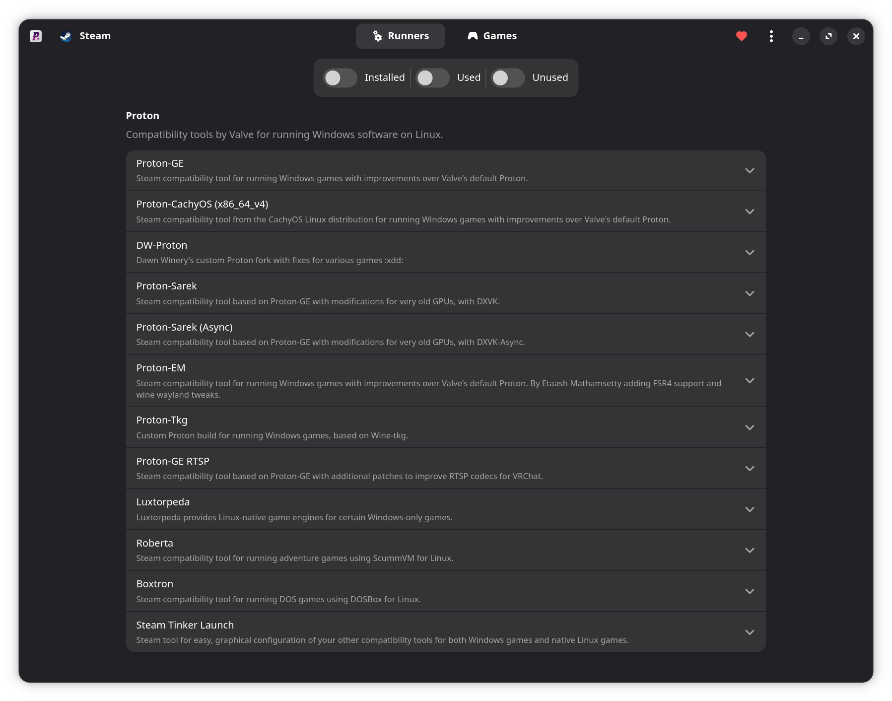
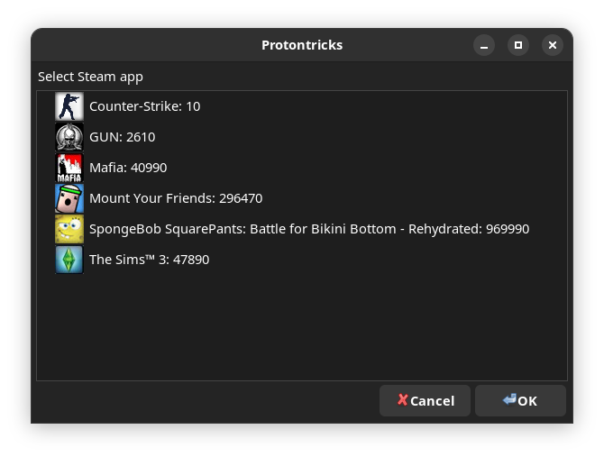
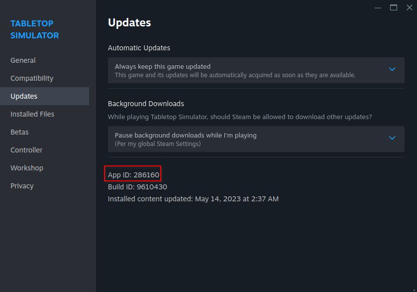

# Управление играми и моддинг

## Слои совместимости и управление играми для Windows



Игры для Windows в Bazzite нужно запускать через **слой совместимости**, например Proton. Устанавливайте и обновляйте до последних версий [GE-Proton](https://github.com/GloriousEggroll/proton-ge-custom), [Luxtorpeda](https://codeberg.org/luxtorpeda/luxtorpeda) и другие инструменты с помощью ProtonPlus.

## Protontricks



Некоторым играм для правильной работы нужен [Protontricks](https://github.com/Matoking/protontricks) (предустановлен) или [Winetricks](https://github.com/Winetricks/winetricks) (для игр вне Steam, входит в Lutris). Эти инструменты устанавливают Windows DLL в префикс.

## Скрытые файлы в файловом менеджере

!!! note

    В Winecfg есть параметр, который показывает скрытые файлы для Windows-программ, которым нужен выбор файлов.

В Desktop Linux есть скрытые файлы и каталоги, среди которых могут быть важные файлы, связанные с играми.

**Покажите скрытые файлы**: нажмите **hamburger menu** (_3 горизонтальные линии в файловом менеджере_) и выберите "Show Hidden Files", чтобы увидеть все каталоги и файлы, скрытые по умолчанию.

Все эти каталоги и файлы начинаются с `.` перед именем.


### Что такое префикс Proton (или Wine)? { #what-is-a-proton-or-wine-prefix }

Это связующий слой, который удерживает все вместе при запуске игры через Proton, а также хранит файлы, которые игра записывает вне папки установки.

!!! important

    Папка установки **игр Steam** обычно находится здесь: `~/.steam/root/steamapps/common/<game>`

Многие игры для ПК записывают файлы в папки Windows вроде "My Documents" или "AppData". Обе можно найти в каталоге префикса. Этот каталог может пригодиться для моддинга игр, резервного копирования сохранений или файлов конфигурации.



Для игр в Steam префиксы находятся в папке `~/.steam/root/steamapps/compatdata/`, затем в папке с **номером AppID игры**:

!!! tip

    Эту папку можно открыть через ProtonPlus: перейдите на вкладку **Games** и выберите **Open prefix directory** для нужной игры.
    

- Этот ID можно посмотреть в свойствах игры в Steam: **Properties** → **Updates** → **App ID**
- Затем перейдите в `.../pfx/drive_c/` и дальше туда, куда игра записывает файл в Windows.

У игр вне Steam папка префикса может находиться в любом указанном вами месте. По умолчанию Lutris использует `~/Games` как основную папку.

#### Поврежденный префикс Proton?

!!! warning

    Удаление префикса Proton **_может_** удалить сохранения и файлы конфигурации!

=== "Using Protontricks"

    1. Выберите игру в Protontricks
    2. Нажмите **Select the default wineprefix**
    3. Нажмите **Delete ALL DATA AND APPLICATIONS INSIDE THIS PROTON PREFIX**

=== "Manual Removal"

    Откройте каталог префикса с именем, соответствующим App ID игры, и удалите данные внутри него.

    Будьте осторожны: не удалите корневой каталог `.../compatdata` (или `~/Games`, или пользовательский каталог, который вы задали для игр вне Steam), иначе будут удалены данные префиксов для всех игр!

## Моддинг

-   **Steam Workshop** - самый простой способ получить моды, хотя он может поддерживаться не для каждой игры или мода и требует, чтобы игра была куплена в Steam.
-   У некоторых менеджеров модов есть порты для Linux, например [r2modman](https://github.com/ebkr/r2modmanPlus).
-   Добавлять и заменять игровые файлы по-прежнему можно как в каталоге игры, так и в префиксе, но иногда нужны дополнительные действия.
    -   Для некоторых модов нужна [дополнительная настройка переопределения WINE DLL](#wine-dll-override)
-   Также можно добавить некоторые менеджеры модов и лаунчеры только для Windows в Steam как стороннюю игру, а затем с помощью symlink связать их префикс с настоящим префиксом игры.


### Переопределение WINE DLL { #wine-dll-override }

Переопределения WINE DLL можно настроить любым из следующих способов:

=== "Protontricks (Steam games)"

    1. Выберите игру в Protontricks
    2. Нажмите **Select the default wineprefix**
    3. Нажмите **Run wincfg**
    4. На вкладке Libraries добавьте переопределение DLL

=== "Wine Configuration (Non-Steam games)"

    1. В Lutris, Faugus Launcher или любом другом лаунчере выберите игру и откройте **Wine Configuration**
    2. На вкладке Libraries добавьте переопределение DLL

=== "Environment Variable"

    Добавьте переменную окружения в параметры запуска Steam, например:
    **DirectInput8 DLL Override**:
    ```bash
    WINEDLLOVERRIDES="dinput8=n,b" %command%
    ```
