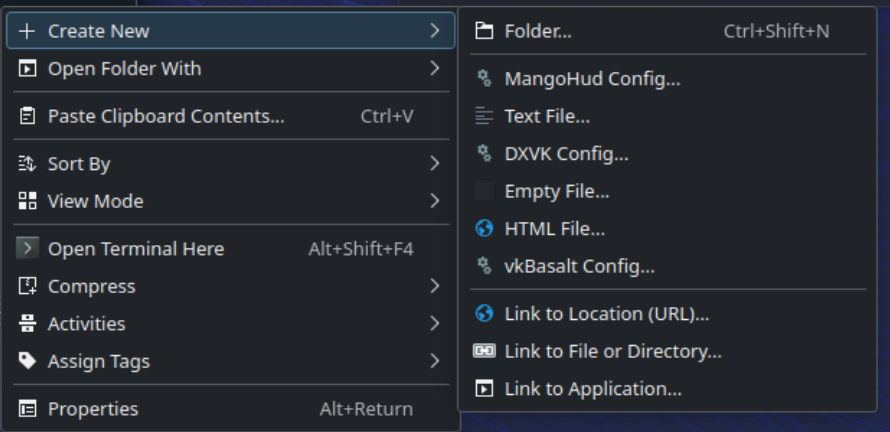
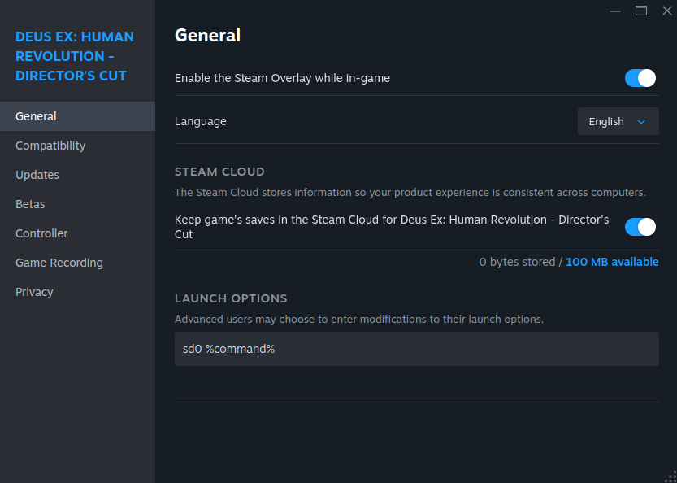

# Možnosti spuštění a proměnné prostředí

## Předmluva

Linuxové hraní je dnes mnohem intuitivnější než před lety.  Stále však existují pokročilé možnosti spouštění a konfigurace, které lze spustit z Bazzite.  Tato příručka předvede příklady pokročilých herních vylepšení, která lze provést v instalaci Bazzite.

## Šablony konfigurace pro DXVK, MangoHud a vkBasalt



Uživatelé Bazzite mohou používat šablony pro některé z předinstalovaných nástrojů, ke kterým lze přistupovat kliknutím pravým tlačítkem kdekoli ve správci souborů.  Existují také aplikace jako [**Mango Juice**](https://flathub.org/en/apps/io.github.radiolamp.mangojuice), které fungují jako grafická metoda konfigurace Mangohud.

## Možnosti a zkratky spuštění služby Steam

Možnosti spouštění na Steamu vám umožňují předávat hrám při spuštění proměnné prostředí, argumenty a příkazy. Bazzite obsahuje několik zkratek a vylepšení uživatelského rozhraní, které usnadňují používání běžných možností spouštění, zejména na kapesních zařízeních.

### Společné vzory možností spuštění

Většina možností spouštění Steamu se řídí tímto vzorem: `ENVIRONMENT_VARIABLES command_or_script %command%`

- `%command%` představuje spustitelný soubor hry a musí být zahrnut
- Proměnné prostředí jsou před `%command%`
- Další argumenty mohou následovat za `%command%`

**Příklady:**
```
PROTON_LOG=1 %command%                    # Enable Proton logging
SteamDeck=0 %command%                     # Disable Steam Deck mode
PROTON_ENABLE_NGX_UPDATER=1 %command%     # Enable DLSS updates
```

### Zkratky možnosti spuštění Bazzite

Bazzite obsahuje několik zkratek pro zjednodušení běžných možností spouštění:

#### Pro ovládání režimu Steam Deck
- **`sd0 %command%`** - Zkratka pro `SteamDeck=0 %command%`
  - Deaktivuje specifické funkce Steam Deck, které mohou být v konfliktu s vaším nastavením
  - Příklad: Expedice 33 skryje většinu nastavení grafiky, pokud nenastavíte `SteamDeck=0`, a vynutí nižší než nejnižší nastavení.

#### Pro uživatele NVIDIA (dlss-swapper)
- **`dlss-swapper %command%`** - Umožňuje nejnovější předvolby DLSS s aktualizátorem NGX
  - Nahrazuje: `PROTON_ENABLE_NGX_UPDATER=1 DXVK_NVAPI_DRS_SETTINGS=NGX_DLSS_SR_OVERRIDE=on,NGX_DLSS_RR_OVERRIDE=on,NGX_DLSS_FG_OVERRIDE=on,NGX_DLSS_SR_OVERRIDE_RENDER_PRESET_SELECTION=render_preset_latest,NGX_DLSS_RR_OVERRIDE_RENDER_PRESET_SELECTION=render_preset_latest %command%`
- **`dlss-swapper-dll %command%`** - Stejné jako výše, ale vynechá aktualizaci NGX

#### Kde nastavit možnosti spuštění

1. Klikněte pravým tlačítkem na hru v knihovně Steam
2. Vyberte **Vlastnosti**
3. Na kartě Obecné najděte pole **Možnosti spuštění**
4. Zadejte možnosti spuštění



## Problémy a nekonzistence omezující snímkovou frekvenci

Při použití Gamescope lze limity snímkové frekvence použít několika způsoby. Bohužel ne všechny metody fungují pro každé prostředí, hru nebo konfiguraci hardwaru.

Zejména při aplikaci limitů snímkové frekvence v režimu plochy lze pozorovat mnoho nesrovnalostí.

Níže uvedené tabulky ukazují chování různých metod omezení snímkové frekvence.

### Herní režim Steam (relace herního režimu Steam)

| Metoda | Kroky nastavení | Vyžaduje V-Sync ve hře? | Změnit limit bez restartování hry? | Latence | Preferováno | Poznámky |
|---|---|---|---|---|---|---|
| **Omezovač FPS gamescope** | Použijte **Nabídka rychlého přístupu > Výkon > Limit snímkové frekvence** | Ne | Ano | Meh | **Preferováno** | Automaticky zapne v-sync na úrovni ovladače, kdykoli je povoleno omezení snímkové frekvence. Bude zavedena další latence. |
| **MangoAPP (vložený)** | N/A – vůbec nefunguje. | - | - | - | – | Nastavení omezovače snímků z mangoapp jsou v herním režimu/režimu decku ignorována. Místo toho použijte posuvník nebo externí mangohud. |
| **MangoHUD (externí)** | **Možnosti spuštění:** `MANGOHUD=1 %command%` | Ne | Ano | Meh | – | Sada `fps_limit=0,30,60,120...` (0=bez víčka) v MangoHud.conf. Může se střetnout s MangoAPP. |
| **Omezovač snímků za běhu DXVK/VKD3D** | **DXVK (D3D8/9/10/11):** `DXVK_FRAME_RATE={fps} %command%`<br>**VKD3D-Proton (D3D12):** `VKD3D_FRAME_RATE={fps} %command%` | Ne | Ne | Nejlepší | – | Platí pouze pro tituly DXVK/VKD3D (žádný vliv na nativní OpenGL nebo nativní Vulkan). |


### Režim plochy (GNOME / KDE Plasma Desktop Session)

| Metoda | Kroky nastavení | Vyžaduje V-Sync ve hře? | Změnit limit bez restartování hry? | Latence | Preferováno | Poznámky |
|---|---|---|---|---|---|---|
| **Omezovač FPS gamescope** | **Možnosti spuštění**: `gamescope -r {fps} -- %command%` / `--framerate-limit {fps}` | Ano | Ano | Meh | – | Pomocí `gamescopectl debug_set_fps_limit {fps}` změňte hodnotu omezovače naživo bez restartování. |
| **MangoAPP (vložený)** | **Možnosti spuštění:** `gamescope --mangoapp -- %command%` | Ano | Ano | Meh | – | Čepice někdy nejsou účinné. Nastavte `fps_limit=0,30,60,120...` (0=bez víčka) v MangoHud.conf (nebo přes `MANGOHUD_CONFIG=...`). Přidejte `show_fps_limit` do předvolby, abyste ji viděli ve hře. Změňte pomocí `ShiftL+F1`. |
| **MangoHUD (externí)** | **Možnosti spuštění:** `MANGOHUD=1 gamescope -- %command%` | Ne | Ano | Meh | **Preferováno** | Čepice jsou téměř vždy účinné. Nastavte `fps_limit=0,30,60,120...` (0=bez uzávěru) v MangoHud.conf (nebo přes `MANGOHUD_CONFIG=...`). Přidejte `show_fps_limit` do předvolby, abyste ji viděli ve hře. Změňte pomocí `ShiftL+F1`. |
| **Omezovač snímků za běhu DXVK/VKD3D** | **DXVK (D3D8/9/10/11):** `DXVK_FRAME_RATE={fps} %command%`<br>**VKD3D-Proton (D3D12):** `VKD3D_FRAME_RATE={fps} %command%` | Ne | Ne | Nejlepší | – | Omezení na úrovni procesu/API; skvělé načasování, ale pro změnu musíte restartovat. |


Pokud váš omezovač snímkové frekvence nefunguje, často vám pomohou následující kroky:

1. Vypněte adaptivní synchronizaci/VRR nebo odstraňte příznak `--adaptive-sync` z vašich argumentů gamescope.
2. Nastavte vsync ve hře na "on".

## Pokročilá správa možností spuštění pro ScopeBuddy

Pro uživatele, kteří potřebují složitější správu možností spuštění, zvažte **[dokumentaci ScopeBuddy](../Advanced/scopebuddy.md)** pro ještě pokročilejší správu možností spuštění Gamescope.