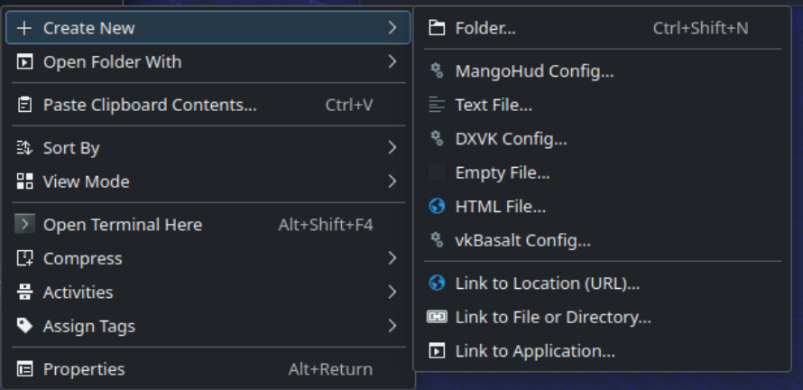
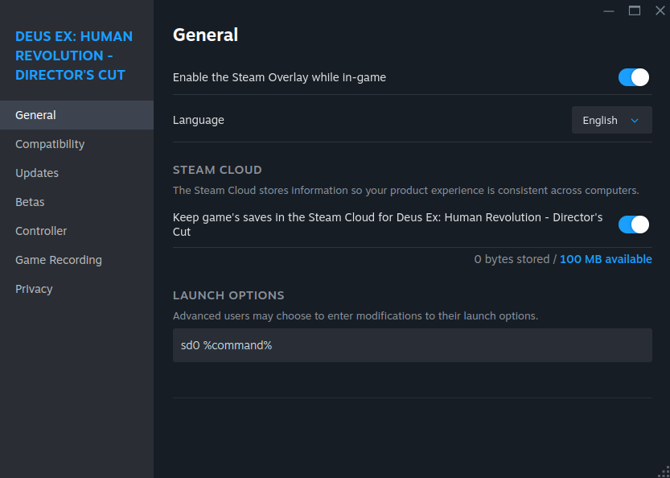

# Параметры запуска и переменные окружения

## Введение

Игры на Linux сегодня гораздо понятнее, чем несколько лет назад. Но в Bazzite все еще доступны продвинутые параметры запуска и настройки. В этом руководстве приведены примеры расширенной настройки игр в установленной системе Bazzite.

## Шаблоны конфигурации для DXVK, MangoHud и vkBasalt



Пользователи Bazzite могут использовать шаблоны для некоторых предустановленных инструментов. Они доступны через контекстное меню файлового менеджера. Также есть приложения вроде [**Mango Juice**](https://flathub.org/en/apps/io.github.radiolamp.mangojuice), которые позволяют настраивать MangoHud через графический интерфейс.

## Параметры запуска Steam и ярлыки

Параметры запуска Steam позволяют передавать играм переменные окружения, аргументы и команды при старте. В Bazzite есть несколько сокращений и улучшений интерфейса, которые упрощают работу с частыми параметрами запуска, особенно на портативных устройствах.

### Типовые схемы параметров запуска

Большинство параметров запуска Steam используют такую схему: `ENVIRONMENT_VARIABLES command_or_script %command% --arguments`

- `%command%` обозначает исполняемый файл игры. Его нужно указывать всегда, кроме следующих случаев:
  - параметр запуска пустой или содержит только аргументы;
  - команда или скрипт запускает игру самостоятельно, без Steam.
- Переменные окружения нужно указывать перед `%command%`, кроме следующих случаев, когда их можно не задавать:
  - вы уже задали глобальную переменную окружения в `~/.config/environment.d` или другом месте;
  - вы задали глобальную переменную окружения в Bazzite Portal, что делает то же изменение;
  - команда или скрипт перед `%command%` уже задали ее за вас.
- Дополнительные аргументы для самого исполняемого файла игры можно указывать после `%command%`.

**Примеры:**
```bash
PROTON_LOG=1 %command%                    # Enable Proton logging
STEAMDECK=0 %command%                     # Disable Steam Deck mode
PROTON_ENABLE_NGX_UPDATER=1 %command%     # Enable DLSS updates
%command% --in-process-gpu                # Fixes a blank screen in some Unity games
scb %command%                             # Use ScopeBuddy (a Gamescope helper) to launch the game
```

### Параметры запуска Proton { #proton-launch-options }
<small>_Выглядит знакомо? Этот раздел скопирован из [Proton-CachyOS Wiki](https://wiki.cachyos.org/configuration/gaming/#environment-variables)_</small>

В пользовательских версиях Proton параметры конфигурации по умолчанию нестабильны. Актуальную информацию о параметрах каждой версии смотрите в их документации.

- Proton-CachyOS
  - [Readme](https://github.com/CachyOS/proton-cachyos/blob/cachyos_main/README.md#proton-cachyos-config-options)
  - [Changelogs](https://github.com/CachyOS/proton-cachyos/blob/cachyos_main/CHANGELOG.md)
- Proton-EM
  - [Readme](https://github.com/Etaash-mathamsetty/Proton/blob/em-11-hdr/README.md)
  - [EM-ADDITIONS](https://github.com/Etaash-mathamsetty/Proton/blob/em-10-hdrtest/docs/EM-ADDITIONS.md)
  - [FSR4](https://github.com/Etaash-mathamsetty/Proton/blob/em-10-hdrtest/docs/FSR4.md)
  - [Wine-Wayland](https://github.com/Etaash-mathamsetty/Proton/blob/em-10-hdrtest/docs/CHANGES.md)

### Сокращения параметров запуска Bazzite

Bazzite включает несколько сокращений для упрощения частых параметров запуска:

#### Для управления режимом Steam Deck

- **`sd0 %command%`** - сокращение для `SteamDeck=0 %command%`
  - отключает функции Steam Deck, которые могут конфликтовать с вашей конфигурацией;
  - пример: Expedition 33 скрывает большую часть настроек графики, если не задать `SteamDeck=0`, и принудительно использует настройки ниже минимальных.

#### Для пользователей NVIDIA (dlss-swapper)

- **`dlss-swapper %command%`** - включает последние пресеты DLSS через NGX updater
  - заменяет: `PROTON_ENABLE_NGX_UPDATER=1 DXVK_NVAPI_DRS_SETTINGS=NGX_DLSS_SR_OVERRIDE=on,NGX_DLSS_RR_OVERRIDE=on,NGX_DLSS_FG_OVERRIDE=on,NGX_DLSS_SR_OVERRIDE_RENDER_PRESET_SELECTION=render_preset_latest,NGX_DLSS_RR_OVERRIDE_RENDER_PRESET_SELECTION=render_preset_latest %command%`
- **`dlss-swapper-dll %command%`** - то же самое, но без NGX updater

!!! info

    Для DLSS все еще может быть смысл оставаться на старой модели, например из-за производительности или качества. Возможность вручную указать версию модели остается полезной, поэтому она по-прежнему будет доступна вместе с более новым `PROTON_DLSS_UPGRADE=1`, который можно включить через Bazzite Portal.

#### Где задавать параметры запуска

1. Нажмите правой кнопкой мыши на игру в библиотеке Steam
2. Выберите **Properties**
3. На вкладке General найдите поле **Launch Options**
4. Введите параметры запуска



## Проблемы и непредсказуемость ограничения частоты кадров

При использовании Gamescope ограничение частоты кадров можно применять несколькими способами. К сожалению, не все методы работают в каждом окружении, игре или аппаратной конфигурации.

Можно наблюдать много различий в поведении, особенно при ограничении частоты кадров в Desktop Mode.

В таблицах ниже показано поведение разных методов ограничения частоты кадров.

=== "Steam Game Mode (Steam Gaming Mode Session)"

    | Метод | Настройка | Требуется включить V-Sync в игре? | Можно изменить лимит без перезапуска игры? | Задержка | Предпочтительно | Примечания |
    |---|---|---|---|---|---|---|
    | **Gamescope FPS limiter** | Используйте **Quick Access Menu → Performance → Framerate Limit** | Нет | Да | Обычно хуже | **Предпочтительно** | Автоматически включает v-sync на уровне драйвера, когда включено ограничение частоты кадров. Это добавит задержку. |
    | **MangoAPP (embedded)** | - | - | - | - | – | N/A - совсем не работает. |
    | **MangoHUD (external)** | **Launch Options:** `MANGOHUD=1 %command%` | Нет | Да | Обычно хуже | – | Задайте `fps_limit=0,{fps}...` (`0`=без ограничения) в `MangoHud.conf` или используйте [MangoJuice](https://flathub.org/en/apps/io.github.radiolamp.mangojuice). |
    | **DXVK/VKD3D runtime frame limiter** | **DXVK(D3D8/9/10/11):** `DXVK_FRAME_RATE={fps} %command%`<br>**VKD3D(D3D12):** `VKD3D_FRAME_RATE={fps} %command%` | Нет | Нет | Обычно лучше | – | Применяется только к играм через DXVK/VKD3D, без эффекта для нативных игр OpenGL или Vulkan. |

=== "Desktop Mode (GNOME / KDE Plasma Desktop Session)"

    | Метод | Настройка | Требуется включить V-Sync в игре? | Можно изменить лимит без перезапуска игры? | Задержка | Предпочтительно | Примечания |
    |---|---|---|---|---|---|---|
    | **Gamescope FPS limiter** | **Launch Options**: `gamescope -r {fps} -- %command%` / `--framerate-limit {fps}` | Да | Да* | Обычно хуже | – | *Используйте `gamescopectl debug_set_fps_limit {fps}` для изменения значения ограничителя на лету, без перезапуска. |
    | **MangoAPP (embedded)** | **Launch Options:** `gamescope --mangoapp -- %command%` | Да | Да | Обычно хуже | – | Ограничения иногда не работают. Способ настройки такой же, как у MangoHUD. |
    | **MangoHUD (external)** | **Launch Options:** `MANGOHUD=1 %command%` | Нет | Да | Обычно лучше | **Предпочтительно** | Ограничения почти всегда работают. Задайте `fps_limit=0,{fps}...` (`0`=без ограничения) в `MangoHud.conf` или используйте [MangoJuice](https://flathub.org/en/apps/io.github.radiolamp.mangojuice). |
    | **DXVK/VKD3D runtime frame limiter** | **DXVK(D3D8/9/10/11):** `DXVK_FRAME_RATE={fps} %command%`<br>**VKD3D(D3D12):** `VKD3D_FRAME_RATE={fps} %command%` | Нет | Нет | Обычно лучше | – |  Применяется только к играм через DXVK/VKD3D, без эффекта для нативных игр OpenGL или Vulkan. |

Если ограничитель частоты кадров не работает, часто помогают следующие действия:

- Отключите adaptive sync/VRR или уберите флаг `--adaptive-sync` из аргументов gamescope.
- Включите Vsync в игре.

!!! Note

    Задержка - сложная тема, и она зависит от конкретной конфигурации. Единого лучшего ограничителя кадров для всех ситуаций нет. Если вам нужна минимальная задержка в вашей конфигурации, без подробного тестирования не обойтись.

    Кроме того, базовые DXVK и VKD3D убрали настройку ограничения кадров через переменную окружения `DXVK_FRAME_RATE`, начиная с версии 3.0. Поддержка этих переменных окружения теперь есть в производных сборках, например Proton-CachyOS и других вариантах Proton. Официальный Proton от Valve использует базовые DXVK/VKD3D. Если вам нужен ограничитель кадров DXVK/VKD3D во время выполнения, используйте [пользовательские версии Proton](#proton-launch-options) или [DXVK Low-Latency](https://github.com/netborg-afps/dxvk-low-latency) вместе с WINE.

    Хорошая отправная точка - Proton-CachyOS. Он включает DXVK-LL, который можно активировать через `PROTON_DXVK_LOWLATENCY=1`.

## Управление расширенными параметрами запуска через ScopeBuddy

Если вам нужно более сложное управление параметрами запуска, посмотрите **[документацию ScopeBuddy](../Advanced/scopebuddy.md)** для еще более продвинутого управления параметрами запуска Gamescope.
