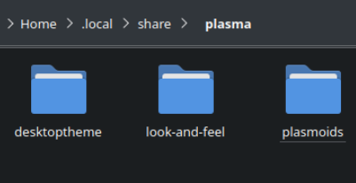

# Přizpůsobení desktopového prostředí, motivy a vylepšení

!!! warning
    
    Nainstalujte software pro přizpůsobení plochy **na vlastní nebezpečí**!

## Přizpůsobení KDE Plasma pomocí motivů

KDE Plasma je výchozím desktopovým prostředím Bazzite a je vysoce přizpůsobitelné. Jedním z různých přizpůsobení, které lze provést, je instalace vlastních stylů, kurzorů a ikon do vašeho systému s vlastními motivy vytvořenými komunitou.  Motivy nainstalované prostřednictvím **Nastavení systému** se instalují do `~/.local/share/plasma`; Chcete-li je odinstalovat, možná budete muset ručně odstranit složky spojené s nainstalovanými motivy.

## Ruční instalace motivů

Podrobné pokyny k instalaci vlastních motivů na KDE Plasma.

1. Stáhněte si motiv ručně z [**KDE Store**](https://store.kde.org/browse/).
2. Extrahování obsahu do `~/.local/share/plasma/` <small>(_Možná budete muset vytvořit tento adresář_.)</small>
3. Otevřete nastavení systému a vyberte svůj motiv, styl, kurzor atd., jak by se nyní mělo zobrazit.

## Místa extrakce motivů

Umístění, kde budou na ploše extrahovány konkrétní komponenty KDE Plasma.

### Globální témata

Globální témata jsou umístěna v `~/.local/share/plasma/look-and-feel/`. <small>(_Možná budete muset vytvořit tento adresář_.)</small>

### Plasma motivy

"Plasma motivy" jsou umístěny v `~/.local/share/plasma/desktoptheme/`. <small>(_Možná budete muset vytvořit tento adresář_.)</small>

### Plasma okenní dekorace

"Motivy výzdoby oken" jsou umístěny v `~/.local/share/aurorae/themes/`. <small>(_Možná budete muset vytvořit tento adresář_.)</small>

### Motivy ikon / kurzorů

"Motivy ikon/kurzorů" jsou umístěny v `~/.local/share/icons`. <small>(_Možná budete muset vytvořit tento adresář_.)</small>

### Zvuky

Systémové zvuky lze nahradit v `~/.local/share/sounds`. <small>(_Možná budete muset vytvořit tento adresář_.)</small>

### Motivy SDDM (Správce přihlášení).

Motivy SDDM lze vrstvit **na vlastní nebezpečí**, pokud jsou k dispozici jako balíčky RPM pomocí [`rpm-ostree`](/Installing_and_Managing_Software/rpm-ostree.md).

## Oprávnění aplikace používat motivy

Některé Flatpaks potřebují oprávnění k souborovému systému pro aplikace, které mají problémy s motivy kurzoru.

**Příklad**: (`~/.local/share/icons/:ro` v "Filesystem" v každé problematické aplikaci nebo globálně v Flatseal).

## Přizpůsobení dalších ploch a relací

Výchozím desktopovým prostředím pro Bazzite je KDE Plasma, které také shodou okolností nabízí dosud nejpodrobnější přizpůsobení pro moderní desktopové prostředí Linuxu, a proto se tato příručka silně zaměřuje na obrazy Bazzite, které používají KDE Plasma.

### Správa rozšíření GNOME (obrazy `-gnome`)

Aplikace "Extension Manager" umožňuje instalaci nových rozšíření do GNOME a správu aktuálně předinstalovaných rozšíření.  Pokračujte opatrně, protože rozšíření mohou způsobit nestabilitu systému a pokud dojde k selhání plochy, GNOME při příštím spuštění všechna rozšíření zakáže.

### Přizpůsobení herního režimu Steam (obrazy `-deck`)
!!! warning
    Decky Loader bude mít někdy problémy s novými aktualizacemi Steam a Gamescope a může být nutné jej dočasně odinstalovat.

Nainstalujte [Decky Loader](https://decky.xyz/), poté nainstalujte [CSS Loader](https://docs.deckthemes.com/), abyste si přizpůsobili vzhled herního režimu Steam. Uvědomte si, že pluginy třetích stran mohou způsobovat problémy. Přečtěte si [dokumentaci herního režimu Steam](../Handheld_and_HTPC_edition/quirks.md), abyste vyřešili běžné problémy, pokud na ně narazíte po použití Decky Loader.

## Dokumentace desktopového prostředí
- [**Dokumentace KDE Plasma**](https://docs.kde.org/stable5/en/plasma-desktop/plasma-desktop/index.html)
- [**Dokumentace GNOME**](https://help.gnome.org/users/gnome-help/stable/)
- [**Dokumentace herního režimu Steam**](../Handheld_and_HTPC_edition/Steam_Gaming_Mode.md)