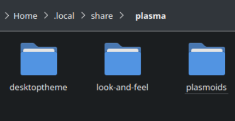

# Настройка, темы и доработка окружения рабочего стола

!!! warning
    
    Устанавливайте программы для настройки рабочего стола **на свой страх и риск**!

## Настройка KDE Plasma с помощью тем

KDE Plasma - стандартное окружение рабочего стола Bazzite, и его можно очень гибко настраивать. Например, можно устанавливать в систему пользовательские стили, курсоры и значки через темы, созданные сообществом. Темы, установленные через **System Settings**, попадают в `~/.local/share/plasma`; чтобы удалить их, может понадобиться вручную удалить папки, связанные с установленными темами.

## Ручная установка тем

Пошаговая инструкция по установке пользовательских тем в KDE Plasma.

1. Скачайте тему вручную из [**KDE Store**](https://store.kde.org/browse/).
2. Распакуйте содержимое в `~/.local/share/plasma/` <small>(_Возможно, этот каталог придется создать._)</small>
3. Откройте параметры системы и выберите тему, стиль, курсор и т. д. Теперь они должны появиться в списке.

## Куда распаковывать темы

Ниже приведен список мест для распаковки тем: <small>(_Возможно, эти папки придется создать вручную._)</small>

-   Global Themes: `~/.local/share/plasma/look-and-feel/`
-   Plasma Themes: `~/.local/share/plasma/desktoptheme/`
-   Plasma Window Decorations: `~/.local/share/aurorae/themes/`
-   Icon / Cursor Themes: `~/.local/share/icons`
-   Sounds: `~/.local/share/sounds`
-   Login Screen: Security & Privacy → Login Screen

!!! notice
    
    После обновления до Fedora 44 Bazzite перешел на KDE Display Manager для управления входом в систему.

## Разрешения приложений для использования тем

Некоторым Flatpak-приложениям нужны разрешения на доступ к файловой системе, если у них возникают проблемы с темами курсора.

**Пример**: (`~/.local/share/icons/:ro` в "Filesystem" для каждого проблемного приложения или глобально в Flatseal).

## Настройка других рабочих столов и сеансов

Стандартное окружение рабочего стола Bazzite - KDE Plasma. Оно также предлагает одну из самых глубоких возможностей настройки среди современных окружений рабочего стола Linux, поэтому это руководство в основном сосредоточено на образах Bazzite с KDE Plasma.

### Управление расширениями GNOME (образы `-gnome`)

!!! warning

    Действуйте осторожно: расширения могут сделать систему нестабильной. Если рабочий стол аварийно завершит работу, GNOME отключит все расширения при следующей загрузке.

Приложение "Extension Manager" позволяет устанавливать новые расширения GNOME и управлять уже предустановленными расширениями.

### Настройка Steam Gaming Mode (образы `-deck`)

!!! warning

    У Decky Loader иногда бывают проблемы с новыми обновлениями Steam и Gamescope, поэтому его может понадобиться временно удалить.

Установите [Decky Loader](https://decky.xyz/), затем установите [CSS Loader](https://docs.deckthemes.com/), чтобы настроить внешний вид Steam Gaming Mode. Учтите, что сторонние плагины могут вызывать проблемы. Если после использования Decky Loader вы столкнетесь с типичными проблемами, прочитайте [документацию Bazzite об особенностях Steam Gaming Mode](../Handheld_and_HTPC_edition/quirks.md), чтобы их решить.

## Документация по окружениям рабочего стола
- [**KDE Plasma Documentation**](https://docs.kde.org/stable5/en/plasma-desktop/plasma-desktop/index.html)
- [**GNOME Documentation**](https://help.gnome.org/users/gnome-help/stable/)
- [**Документация Bazzite по Steam Gaming Mode**](../Handheld_and_HTPC_edition/Steam_Gaming_Mode.md)
