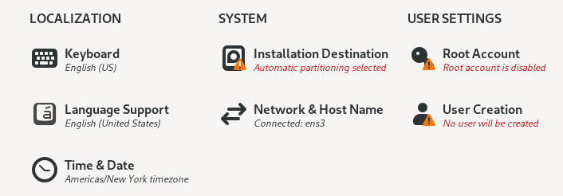
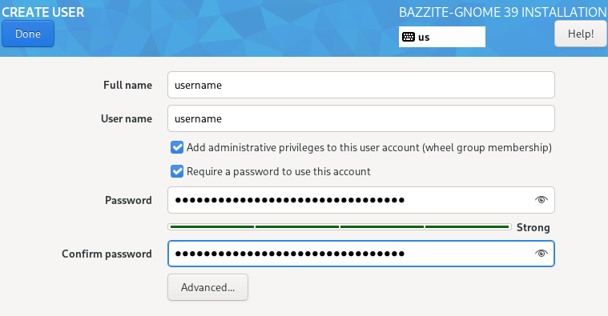
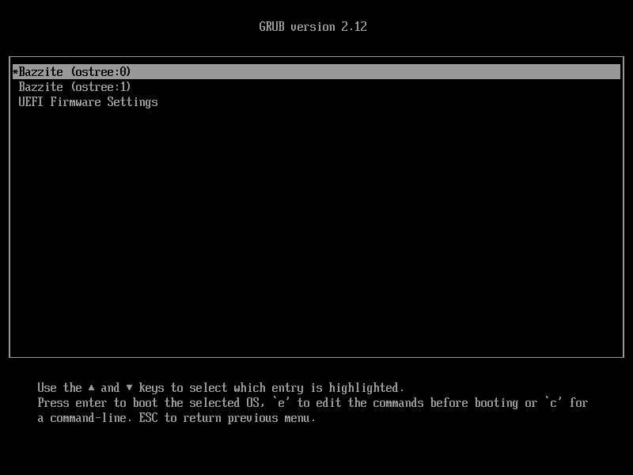
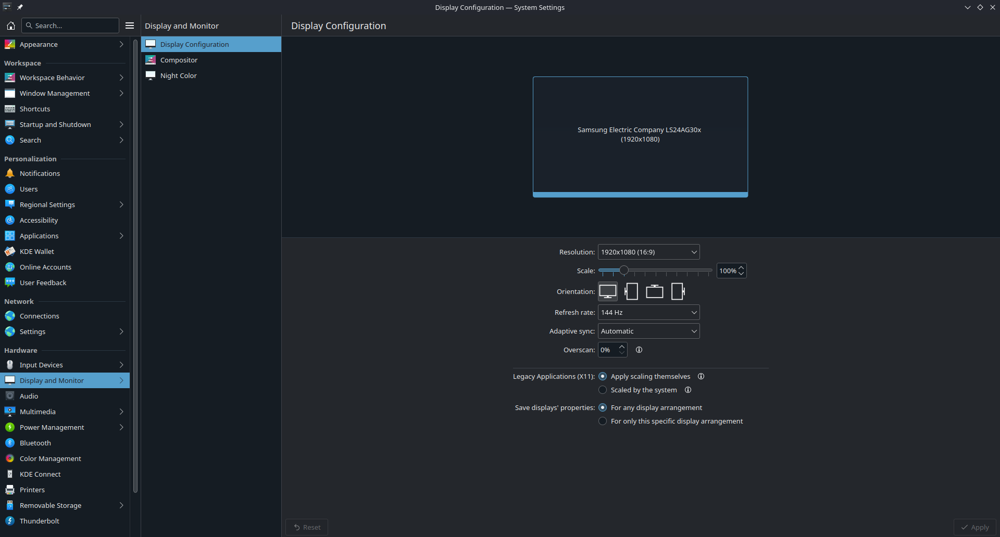
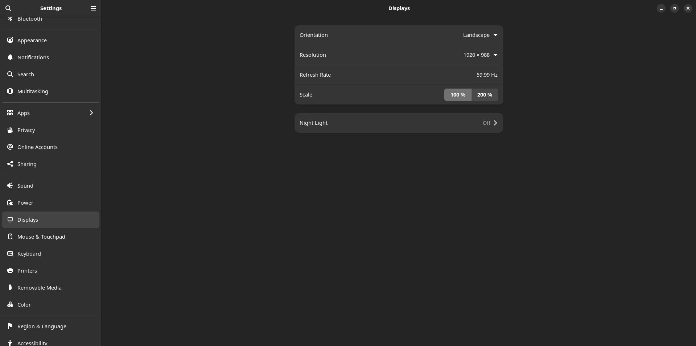

# Instalace Bazzite pro stolní hardware

!!! note
      
      Tato instalační příručka je pro **starší ISO** a aktualizovaná příručka pro nové ISO bude brzy k dispozici.

## Předinstalace

> Předpoklady a kroky před instalací Bazzite.

### Minimální systémové požadavky

- **Architektura**: x86_64
- **Firmware**: UEFI (CSM/Legacy boot [**UNSUPPORTED**](../FAQ.md#does-bazzite-support-csmlegacy-boot))
- **Procesor (CPU)**: 2GHz čtyřjádrový procesor nebo lepší
- **Systémová paměť (RAM)**: 8 GB
- **Grafika**: Grafická karta, která může využívat Vulkan 1.3+
- **Úložiště**: 64 GB volného místa na interním disku SSD
- **Síť**: Stabilní připojení k internetu bez omezení šířky pásma
- **Další poznámky**: Některé ovladače **nejsou** kompatibilní s Bazzite
  – Například: [seznam kompatibilních adaptérů USB Wi-Fi](https://github.com/morrownr/USB-WiFi/blob/main/home/USB_WiFi_Adapters_that_are_supported_with_Linux_in-kernel_drivers.md)

#### Požadavky na instalaci


- Fyzická klávesnice



### Dual Boot Předběžná instalace + Průvodce po instalaci

Než budete pokračovat, přečtěte si [Dual Boot Guide](./dual_boot_setup_guide.md) **po** přečtení tohoto průvodce.

!!! warning
    **Upozornění pro uživatele s duálním spouštěním**: Během instalačního procesu Bazzite **důrazně doporučujeme** fyzicky odpojit úložnou jednotku, na které je nainstalován systém Windows. Předejdete tak náhodné ztrátě dat nebo úpravám vaší instalace Windows.
    Po úspěšné instalaci Bazzite můžete znovu připojit jednotku Windows.

## Průvodce instalací

> Část průvodce, která vyžaduje největší úsilí.

### 1. Stáhněte si a flashujte Bazzite

- Stáhněte si [Bazzite](https://download.bazzite.gg) po výběru správného ISO pro váš hardware pomocí našeho nástroje Image Picker.
- Flash Bazzite na zaváděcí médium.
- Vysunout pohon.

#### Aktuální uživatelé Fedora Atomic Desktop

Současní uživatelé [Fedora Atomic Desktop](https://fedoraproject.org/atomic-desktops/) mohou znovu vytvořit základ pomocí příkazu terminálu uvedeného na webu v části „**Existující uživatelé Fedora Atomic Desktop**“ a mohou přeskočit další krok.

### 2. Boot Bazzite

- Připojte zaváděcí médium k zařízení a spusťte jej.
- Po připojení zařízení spusťte instalační program Bazzite.
- To závisí na hardwaru vaší základní desky, ale většinou to mohou být funkční klávesy jako <kbd>F9</kbd> nebo podobné.
  - Někdy potřebujete nahlédnout do manuálu, vyhledat své zařízení online nebo si přečíst klávesové zkratky, které se objeví při spouštění počítače.
    - Případně změňte nastavení systému BIOS tak, aby se spouštělo ze zaváděcího zařízení nejdříve před aktuálním úložištěm, ale toto se **nedoporučuje** ponechat zapnuté i po instalaci Bazzite.
- Ověřte správně médium a přejděte k instalačnímu programu.

### 3. Instalační program

- Vyberte jazyk, region, rozložení klávesnice a časové pásmo.
- Vyberte jednotku, na kterou bude Bazzite nainstalován.
  - Odstraňte všechny diskové oddíly, které vám zbyly na disku **pokud není duální bootování na stejném disku**.
  - Doporučuje se použít konfiguraci automatického úložiště **pokud není duální bootování na stejném disku**.
- V případě potřeby můžete disk zašifrovat heslem.
  - **Pokud toto heslo ztratíte, nelze ho dešifrovat**.
- Nastavení uživatelského účtu.
  - Poskytněte administrátorská oprávnění a **nastavte uživatelské heslo**.
- Zahajte instalaci.
- Po dokončení instalace restartujte zařízení.

#### Důležité informace pro uživatele se Secure Boot **povoleným**:

Další informace naleznete v [Příručce bezpečného spouštění](https://universal-blue.discourse.group/docs?topic=2742).

## Po instalaci

> Jemné doladění před hraním.

### Nabídka GRUB

Při prvním spuštění se zobrazí obrazovka s aktuálním a posledním nasazením. Je důležité poznamenat, že nabídku GRUB lze použít k vrácení zpět nasazení Bazzite, pokud narazíte na problémy.

Přečtěte si o tom více v [dokumentaci k aktualizacím, vrácení změn a rebasingu](../../Installing_and_Managing_Software/Updates_Rollbacks_and_Rebasing/index.md).

### Konfigurace nastavení systému pro KDE Plasma a GNOME

**_Aplikace Nastavení systému KDE Plasma_**

**_aplikace Nastavení GNOME_**

Je důležité nakonfigurovat nastavení systému při prvním spuštění, abyste si přizpůsobili plochu, zejména pokud si všimnete, že při prvním spuštění je škálování nesprávné.

## Začínáme s hraním na Bazzite

**Nyní jste nainstalovali Bazzite!**

Chcete-li začít s hraním her, podívejte se do našeho [Gaming Guide](../../Gaming/index.md), který zahrnuje:

- Instalace a konfigurace **Steam** a **Proton** pro kompatibilitu her se systémem Windows
- Nastavení **Lutris** a dalších spouštěčů her (Epic Games, GOG, Amazon Games)
- Správa a úprava her
- Odstraňování běžných herních problémů

Tyto příručky vám pomohou připravit se na hraní na Bazzite.

### Instalace dalšího softwaru

[Dokumentace k instalaci a správě aplikací](../../Installing_and_Managing_Software/index.md) je užitečná, abyste se naučili, jak nainstalovat další software na Bazzite.

**Nenechte se chytit do pasti *apt* a zjistěte, jak správně instalovat a spravovat aplikace v Bazzite.**

## Video tutoriály

### Jak vypočítat kontrolní součet ISO SHA256

https://www.youtube.com/watch?v=wUDbMJtR1sM

### Nastavení duálního spouštění s povoleným bezpečným spouštěním

https://www.youtube.com/watch?v=JxPsKhJGTrs

## Problémy s instalací Bazzite?

Prohlédněte si [Průvodce odstraňováním problémů s instalací](./troubleshoot_guide.md).

**Viz také:**
[Upstream Manual Partitioning Guide](https://docs.fedoraproject.org/en-US/fedora-silverblue/installation/#manual-partition) & [Auto-Mounting Secondary Drives](../../Advanced/Auto-Mounting_Secondary_Drives.md)

<-- [**Zobrazit veškerou dokumentaci Bazzite**](../../index.md)