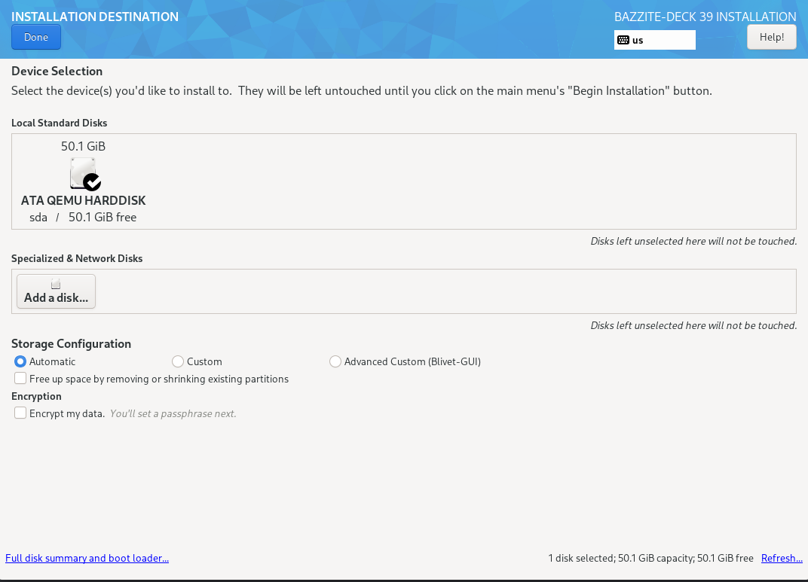

# Instalace Bazzite pro ruční hardware

!!! note
      
      Tato instalační příručka je pro **starší ISO** a aktualizovaná příručka pro nové ISO bude brzy k dispozici.

## Důležité poznámky k hardwaru handheldu

!!! attention

    Několik kapesních počítačů vyžaduje odemknutí nástroje BitLocker (zapište si také obnovovací klíč), deaktivaci „Fast Startup“ systému Windows a **ne** uvedení systému Windows do režimu hibernace před instalací Bazzite.

> [Handheld Wiki Bazzite](/Handheld_and_HTPC_edition/Handheld_Wiki/) obsahuje informace o nastavení vašeho kapesního počítače po instalaci Bazzite a o řešeních známých problémů.

## Předinstalace

> Předpoklady a kroky před instalací Bazzite.

#### Požadavky na instalaci

!!! note

    Bazzite vyžaduje stabilní připojení k internetu bez omezení šířky pásma.


- Volitelné: Fyzická klávesnice (bez jedné bude vaše uživatelské jméno `bazzite` a heslo `bazzite`)

#### Požadavky na herní režim Steam

- Kompatibilní grafická karta
  - **moderní AMD GPU**
  - **Intel Arc GPU** (jiná řada Intel GPU nespustí herní režim Steam)
    - Kapesní počítače Intel Arc budou mít v současné době chybějící funkce (limit TDP, ovládací prvky atd.)

Uživatelé kapesních počítačů budou také těžit z toho, že si přečtou [dokumentaci režimu hry Steam][Steam_Gaming_Mode].



### Dual Boot Předběžná instalace + Průvodce po instalaci

Než budete pokračovat, přečtěte si [Dual Boot Guide](https://universal-blue.discourse.group/docs?topic=2743) **po** přečtení tohoto průvodce.

## Průvodce instalací

> Část průvodce, která vyžaduje největší úsilí.

### 1. Stáhněte si a flashujte Bazzite

- Stáhněte si [Bazzite](https://download.bazzite.gg) po výběru správného kapesního hardwaru pomocí našeho nástroje Image Picker.
- Flash Bazzite na zaváděcí médium.
- Vysunout pohon.

### 2. Zavedení instalačního média

Možná budete muset prozkoumat svůj kapesní počítač, jak zavést systém z vyměnitelného úložiště. Může to být podobné jako u Steam Deck s podržením jednoho z „tlačítek hlasitosti“ a stisknutím dalšího tlačítka, ale stejně jako u jiného obecného hardwaru to velmi závisí na vašem hardwaru.

### 3. Nastavení instalačního programu

> **POZNÁMKA**: Pokud nemáte připojenou fyzickou drátovou klávesnici, **NE** nemačkejte** „_User Creation_“, protože tím odstraníte výchozí uživatelské jméno a heslo a nebudete moci zadat uživatelské jméno nebo heslo bez fyzické klávesnice.

> **výchozí uživatel**: `bazzite` > **výchozí heslo**: `bazzite`

<!----!

<!--
-->

- Vyberte jazyk, region, rozložení klávesnice a časové pásmo.
- Vyberte jednotku, na kterou bude Bazzite nainstalován.
  - Odstraňte všechny oddíly, které vám zbyly na disku **pokud [duální spouštění na stejném disku](/General/Installation_Guide/dual_boot_setup_guide/#b-same-drive-method)**.
  - Pokud **[duální spouštění na stejném disku](/General/Installation_Guide/dual_boot_setup_guide/#manual-partitioning-to-the-same-drive-for-dual-boot-setups)**, **důrazně doporučujeme** provést ruční rozdělení a vytvořit samostatný oddíl EFI.
    - Samostatný oddíl EFI pomůže zabránit tomu, aby aktualizace systému Windows ovlivnily vaši instalaci Bazzite později.
  - Automatickou konfiguraci úložiště používejte pouze při instalaci na samostatné jednotky
- V případě potřeby můžete disk zašifrovat heslem.
  - **Pokud toto heslo ztratíte, nelze ho dešifrovat**.
  - **K ODEMKNUTÍ ZAŘÍZENÍ JE VYŽADOVÁNA FYZICKÁ KABELOVÁ KLÁVESNICE!**
- Nastavte uživatelský účet a spusťte instalaci. (Pokud nemáte fyzickou klávesnici, přeskočte tento krok a zahajte instalaci)
  - Poskytněte administrátorská práva a nastavte uživatelské heslo. (**povinné**)
- Zahajte instalaci.
- Po dokončení instalace restartujte zařízení.

#### Důležité informace pro uživatele se Secure Boot **povoleným**:

Přečtěte si [Příručku bezpečného spouštění](https://universal-blue.discourse.group/docs?topic=2742).

## Po instalaci

> Jemné doladění před hraním.

### Nabídka GRUB

Při prvním spuštění se zobrazí obrazovka s aktuálním a posledním nasazením. Je důležité poznamenat, že nabídku GRUB lze použít k vrácení zpět nasazení Bazzite, pokud narazíte na problémy.

Přečtěte si o tom více v [dokumentaci k aktualizacím, vrácení změn a rebasingu](../../Installing_and_Managing_Software/Updates_Rollbacks_and_Rebasing/index.md).

### Přihlaste se do služby Steam a restartujte zařízení

Přihlaste se do služby Steam a poté **restartujte** zařízení, až dokončíte nastavení zařízení během procesu prvního spouštění.

Po dokončení všech výše uvedených kroků bude vaše další spuštění v herním režimu Steam, který vyžaduje další nastavení pro Steam.

### Konfigurace nastavení systému pro KDE Plasma a GNOME

**_Aplikace Nastavení systému KDE Plasma_**

**_aplikace Nastavení GNOME_**

Po prvním spuštění na ploše můžete upravit nastavení podle svých představ. Nejdůležitějším nastavením, které může být nutné změnit, je nastavení měřítka v "Display(s) [and Monitor]", protože může být nesprávné pro obrazovku vašeho hardwaru při nové instalaci. Orientace monitoru by měla být také opravena, pokud je nesprávně natočen.

### Instalace dalšího softwaru

[Dokumentace k instalaci a správě aplikací](../../Installing_and_Managing_Software/index.md) je užitečná, abyste se naučili, jak nainstalovat další software na Bazzite.

### Změna výchozího hesla
 (Pokud to nebylo změněno v instalačním programu) 

Změňte jej v nastavení režimu plochy v kategorii „Uživatel“.

### Po nastavení a známé problémy pro kapesní počítače a herní režim Steam

Přečtěte si [Handheld Wiki](https://universal-blue.discourse.group/docs?topic=1038) a [dokumentaci Přehled herního režimu Steam][Steam_Gaming_Mode], kde najdete informace o Bazzite na kapesních počítačích.

### Výpočet hash kontrolního součtu ISO SHA256

https://www.youtube.com/watch?v=wUDbMJtR1sM

## **Video tutoriál**

!!! attention

    Důrazně doporučujeme **ruční dělení + vytvoření samostatného EFI oddílu** pro duální zavádění, **ne** automatické dělení.  Viz pokyny pro ruční rozdělení [zde](/General/Installation_Guide/dual_boot_setup_guide/#manual-partitioning-to-the-same-drive-for-dual-boot-setups). Samostatný oddíl EFI pomůže zabránit tomu, aby aktualizace systému Windows ovlivnily vaši instalaci Bazzite později.

https://www.youtube.com/watch?v=JxPsKhJGTrs

## Problémy s instalací Bazzite?

Prohlédněte si [Průvodce odstraňováním problémů s instalací](./troubleshoot_guide.md).

**Viz také:** [Upstream Manual Partitioning Guide](https://docs.fedoraproject.org/en-US/fedora-silverblue/installation/#manual-partition) & [Režim hry Steam][Steam_Gaming_Mode]

<-- [**Zobrazit veškerou dokumentaci Bazzite**](../../index.md)

[Steam_Gaming_Mode]: ../../Handheld_and_HTPC_edition/Steam_Gaming_Mode.md