# Průvodce instalací Bazzite

## Video návod

https://www.youtube.com/watch?v=lBqbk6Z8HrQ

## Systémové požadavky

- Přečtěte si [**Průvodce kompatibilitou hardwaru**](/Gaming/Hardware_compatibility_for_gaming.md) pro systémové požadavky Bazzite.
- Secure Boot a Trusted Platform Module (TPM) jsou podporovány na většině hardwaru, ale musíte [**zaregistrovat náš klíč během instalace nebo po instalaci**](#secure-boot).
- [**Dual-booting-windows je také podporováno**](#dual-booting-windows).

### Požadavky na instalaci

- Způsob, jak stáhnout Bazzite ISO
  - Správce stahování (jako [**Motrix**](https://motrix.app/)), pokud přímé stahování pro Bazzite ISO selže nebo se stahuje příliš pomalu.
- 16GB+ spouštěcí médium, jako je flash disk
  - Bootování z SD nebo microSD karty může fungovat, ale ne všechny firmware to podporují.
- Jeden z následujících programů pro flash/boot ISO:
  - **Fedora Media Writer (doporučeno)** ([Windows/macOS](https://github.com/FedoraQt/MediaWriter/releases), [Linux](https://flathub.org/en/apps/org.fedoraproject.MediaWriter))
  - **Rufus** ([Windows](https://rufus.ie/)) (režim DD Image **povinný**)
  - **Ventoy** ([Windows, Linux](https://www.ventoy.net/)) (poznámka: Ventoy potřebuje [**další kroky, aby podpora zabezpečeného spouštění fungovala**](https://www.ventoy.net/en/doc_secure.html))
- Fyzická kabelová klávesnice je **doporučena** a **vyžadována pro zařízení bez dotykové obrazovky**.
  - Pro scénáře, kdy nemáte fyzickou klávesnici USB, existuje klávesnice na obrazovce.
    - Pro správnou navigaci v instalačním programu je vyžadován dotykový displej nebo myš.

### Desktopová prostředí

Všechny obrazy přicházejí s výběrem [**KDE Plasma**](https://kde.org/plasma-desktop/) nebo [**GNOME**](https://www.gnome.org/) pro jejich desktopové prostředí.

[**Steam Gaming Mode**](../../Handheld_and_HTPC_edition/Steam_Gaming_Mode.md) je možnost jako další relace, kterou lze spustit vedle KDE Plasma nebo GNOME.

Více informací o rozdílech mezi variantami obrazů naleznete na [**Časté dotazy Bazzite**](../../General/FAQ.md).

=== "KDE Plasma"

    #### KDE Plasma (výchozí)

    

    - Výchozí rozhraní KDE Plasma má tradiční a známé rozložení
    - Vysoce přizpůsobitelné se spoustou nastavení
    - Qt framework
    - Populární linuxové distribuce jako SteamOS používají KDE Plasma

=== "GNOME"

    #### GNOME (obrazy `-gnome`)

    

    - Výchozí rozhraní GNOME má elegantní a dotykové rozložení
    - Jednoduché a stručné
    - GTK framework
    - Populární linuxové distribuce jako Ubuntu používají GNOME

=== "Steam Gaming Mode"

    #### Herní režim Steam (obrazy `-deck`)

    

    !!! note

        Vaše zařízení se při spuštění automaticky spustí do relace herního režimu Steam a do režimu Desktop lze přistupovat z „**nabídky napájení**“ v režimu hry Steam.

    

    - **Vyžaduje účet [Steam](https://store.steampowered.com/)**
    - Zahrnuto v [obrazech Bazzite-Deck](/Handheld_and_HTPC_edition/Steam_Gaming_Mode.md)
    - Rozhraní je navrženo pro ruční a gaučové hraní
    - Přátelský k ovladači
    - Volba KDE Plasma nebo GNOME jako relace režimu plochy
    - Další funkce s [Decky pluginy](https://github.com/SteamDeckHomebrew/decky-loader) [(Zobrazit všechny pluginy)](https://plugins.deckbrew.xyz/)

    

## Záložní zařízení

Než budete pokračovat v instalaci, nezapomeňte si zálohovat svá osobní data z disku, na který chcete Bazzite nainstalovat.

## Stáhnout Bazzite

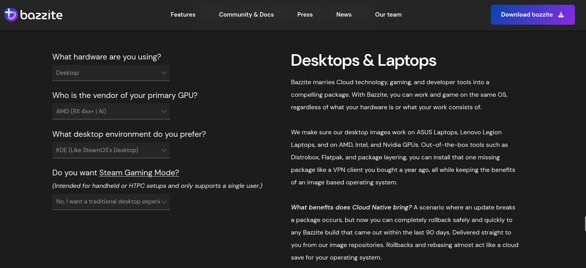

Stáhněte si Bazzite ISO dle vašeho výběru. Vyberte si hardware, na který plánujete Bazzite nainstalovat, dodavatele vašeho primárního GPU, desktopové prostředí dle vašeho výběru, a pokud chcete Steam Gaming Mode, což je varianta Bazzite-Deck určená pro nastavení HTPC a handheld hardware.

### Výpočet hash kontrolního součtu ISO SHA256

**Video tutoriál**:

https://www.youtube.com/watch?v=wUDbMJtR1sM

## Naflashování ISO

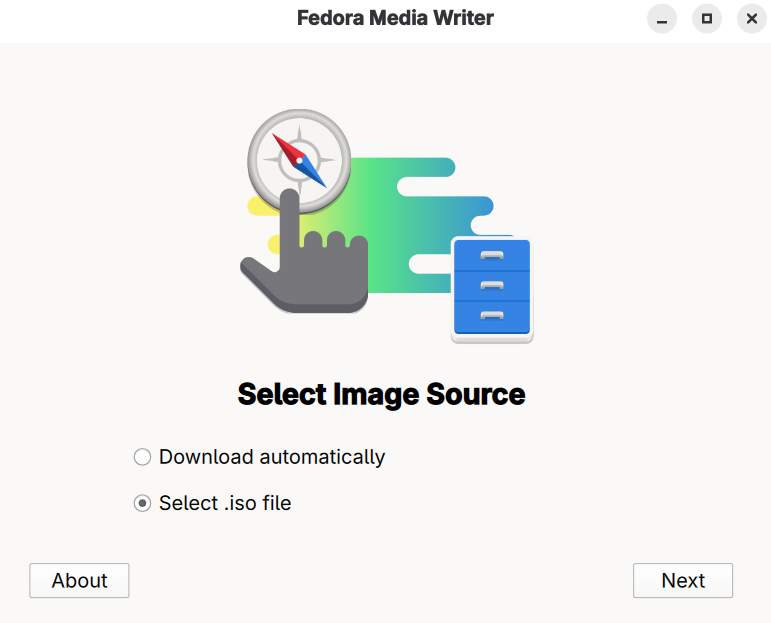
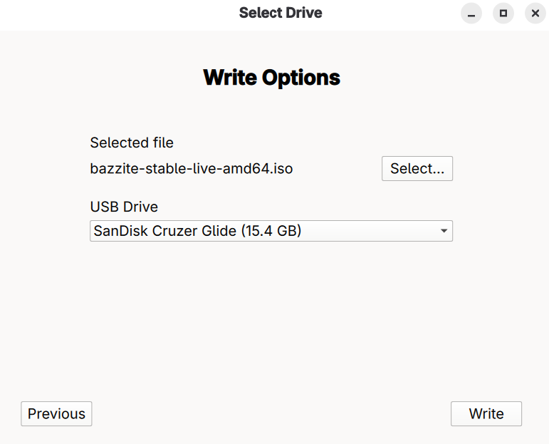

Flash Bazzite do zaváděcího zařízení pomocí Fedora Media Writer a **potom vysuňte ISO**.

## Zavedení instalačního programu

- Připojte zaváděcí médium k zařízení a spusťte jej.
- Po připojení zařízení spusťte instalační program Bazzite.
- To závisí na hardwaru vaší základní desky, ale většinou to může být funkční klávesa jako <kbd>F9</kbd> nebo podobná.
  - Někdy potřebujete nahlédnout do manuálu, vyhledat své zařízení online nebo si přečíst klávesové zkratky, které se objeví při spouštění počítače.
    - Případně změňte nastavení systému BIOS tak, aby se spouštělo ze zaváděcího zařízení nejdříve před aktuálním úložištěm, ale toto se **nedoporučuje** ponechat zapnuté i po instalaci Bazzite.

### Ruční zařízení

Podržte tlačítko 'Snížit hlasitost' (<kbd>-</kbd>) a klikněte na tlačítko napájení, a když uslyšíte zvonění, uvolněte obě tlačítka a spustí se Boot Manager. Když se dostanete do spouštěcí nabídky, vyberte spouštěcí zařízení pro zavedení instalačního programu Bazzite.

## Živé prostředí

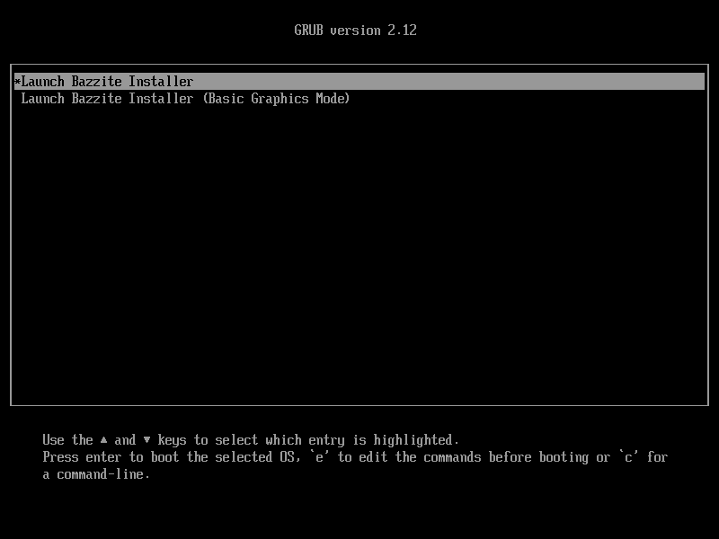

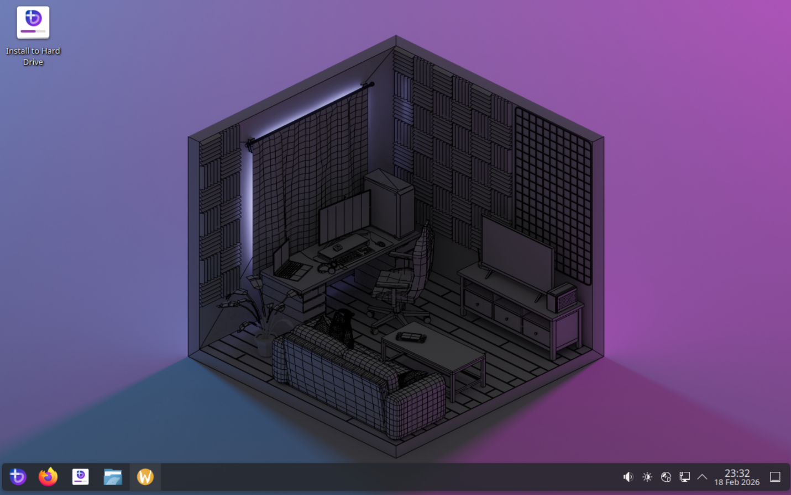

Živá instalační relace Bazzite vám umožní zobrazit předinstalované desktopové aplikace a seznámit se s jejich UI/UX.  

Prosím, nepokoušejte se hrát v živé relaci, protože výkon nebude přesný, když je správně nainstalován na váš disk.
Kromě toho stojí za zmínku, že instalační prostředí nezahrnuje veškerou hardwarovou podporu Bazzite (například pro Steam Deck Audio), protože používá jiné jádro než běžný Bazzite.

### Nastavení sítě v živém prostředí

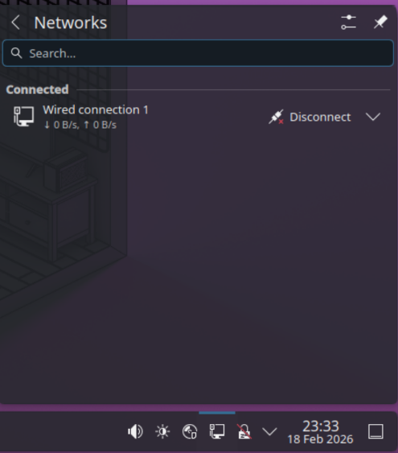

Vezměte prosím na vědomí, že k instalaci Bazzite není vyžadováno připojení k internetu, ale je užitečné, pokud Bazzite testujete před testováním v živém prostředí.  **Až budete připraveni pokračovat v instalaci, otevřete instalační program Bazzite.**

## Vyberte svůj jazyk, oblast a rozložení klávesnice

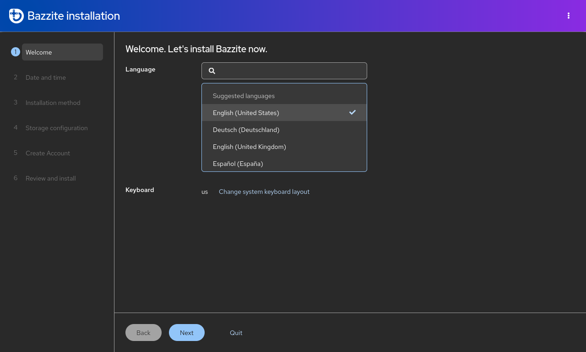

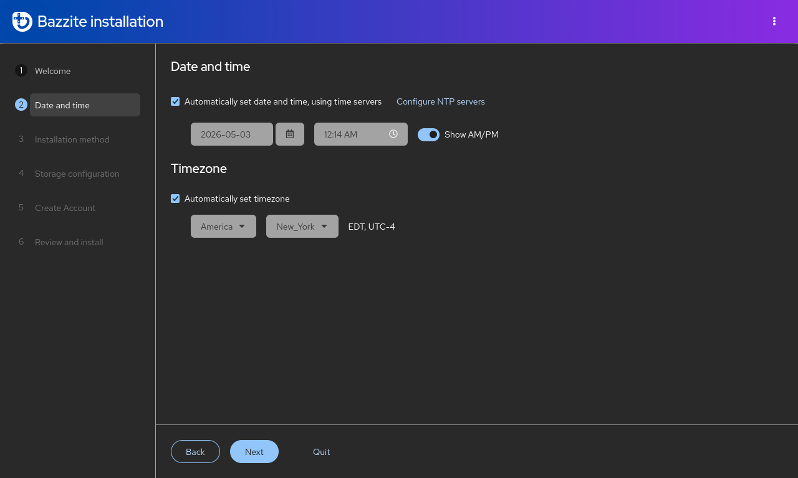

První kroky k instalaci Bazzite zahrnují výběr jazyka systému, regionu pro vaše časové pásmo a rozložení klávesnice pro správné mapování vstupu.

## Nastavení rozdělení disku

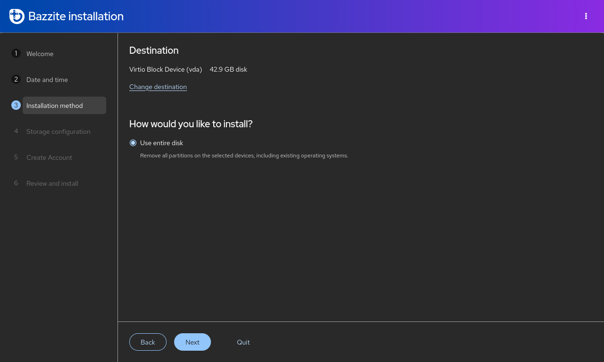

!!! warning

    Ujistěte se, že jste vybrali pouze vhodné jednotky, abyste předešli ztrátě dat na ostatních, a je nejlepší praxí bezpečně odebrat všechny externí jednotky, než budete pokračovat.

Vyberte jednotku, na kterou plánujete nainstalovat Bazzite. Upozorňujeme, že tím vymažete všechna data na vybraném disku.

## Duální spouštění systému Windows

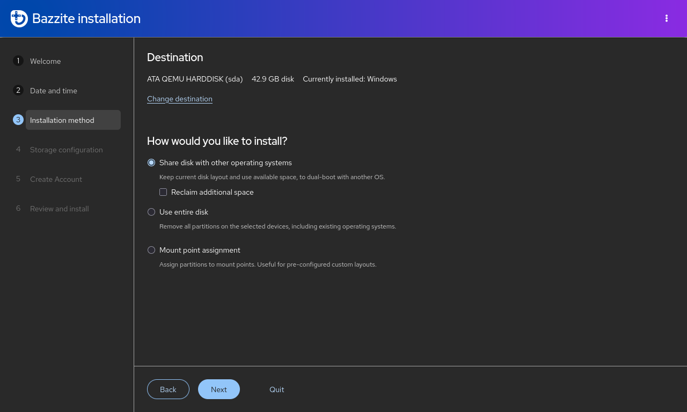

!!! note

    Tuto část přeskočte, pokud plánujete nainstalovat Bazzite bez duálního spouštění Windows.

!!! warning

     Tlačítko „formátovat jako efi“ při duálním spouštění říká, že zformátuje Windows EFI, ale ve skutečnosti se přidá k EFI. Toto je upstream chyba instalačního programu.

Pokud s Windows spouštíte duální zavádění, použijte automatické rozdělování, protože je to jediná možnost dostupná v živém ISO, ale mělo by to fungovat pro většinu případů použití duálního spouštění.  Pokud požadujete ruční rozdělení, stáhněte si starší ISO a postupujte podle [**staršího instalačního průvodce ISO**](./legacy-install.md). Pro duální spouštění Windows na **samostatných** discích použijte spouštěcí nabídku UEFI vaší základní desky, protože zavaděč GRUB nemusí správně rozpoznat každou spouštěcí položku.

### Videonávod

https://www.youtube.com/watch?v=KAt49B6rSFI

### Písemný návod

1. Instalace Bazzite se sdíleným diskem.
2. Instalace Bazzite na samostatný disk.

=== "Sdílený disk (automatické rozdělování)"

    1. (Ve Windows) Vypněte **Bitlocker šifrování** a **fastboot** a restartujte počítač.
    2. (Ve Windows) Změňte velikost oddílu Windows pomocí aplikace Správa disků, abyste měli dostatek místa pro Bazzite.
    Obvykle by to mělo vypadat nějak takto:
    
    <i><small>Zdroj: [diskpart.com](https://www.diskpart.com/windows-10/windows-10-disk-management-0528.html)</small></i>
    3. Spusťte instalační program Bazzite s možností automatického rozdělení.
    4. Restartujte do Bazzite a spusťte `ujust regenerate-grub` v terminálu pro přidání Windows do GRUB.

=== "Samostatný disk"

    **Pokud je možné použít vyhrazený disk, doporučujeme tento způsob.**

    Nainstalujte Bazzite na samostatný interní nebo externí disk.

1. Nainstalujte druhý operační systém na jednotku (například Windows).
    2. Nainstalujte Bazzite na **druhý** disk.
    3. Nastavte Bazzite jako **výchozí** v pořadí spouštění (volitelné).

    Pokud instalujete Windows jako druhý, měli byste odpojit jednotku Bazzite, abyste zabránili použití instalátoru Windows v používání jeho oddílu EFI.

    Pokud nemáte k dispozici interní disk, můžete také nainstalovat systém Windows na externí disk pomocí systému Windows-to-Go pomocí [Rufus](https://rufus.ie/en/) pro duální spouštění.

### Duální spouštění jiných operačních systémů Linux

!!! note 

    Duální bootování s **jinými distribucemi Linuxu**, zejména s **neatomovou Fedorou**, není oficiálně podporováno. Doporučuje se použít spouštěcí nabídku UEFI vaší základní desky nebo se zcela vzdát duálního spouštění, abyste předešli neočekávaným problémům. Pokud se něco pokazí, obnovte zavaděč Bazzite pomocí nástroje **Bootloader Restoring Tool** v Live ISO.

Pro obrazy Fedora Atomic Desktop na **stejném** disku: pro duální spouštění jiného **obrazu Fedora Atomic Desktop** (jako [Bluefin](https://projectbluefin.io/)) nainstalovaného spolu s Bazzite, musíte vytvořit další oddíl EFI a přepínat mezi nimi prostřednictvím spouštěcí nabídky UEFI vaší základní desky.

## Šifrování disku

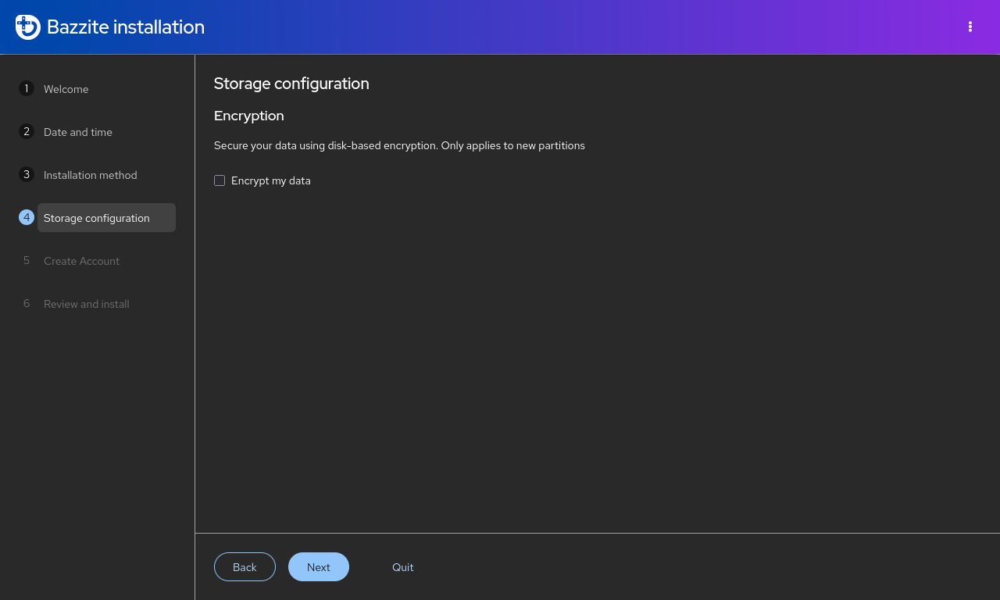

!!! warning

    Nebude možné dešifrovat váš disk a data budou ztracena, pokud zapomenete své šifrovací heslo!

Šifrování disku je **volitelné**, ale je dostupné prostřednictvím [LUKS](https://docs.fedoraproject.org/en-US/quick-docs/encrypting-drives-using-LUKS/). **K dešifrování disku budete potřebovat fyzickou klávesnici USB!** Tento krok přeskočte, pokud na tomto zařízení nevyžaduje šifrování disku. Toto není nutný krok pro nejběžnější scénáře, pokud se neobáváte, že k vašemu fyzickému disku, na kterém je Bazzite nainstalován, bude mít přístup špatný herec.

## Nastavení uživatelského účtu

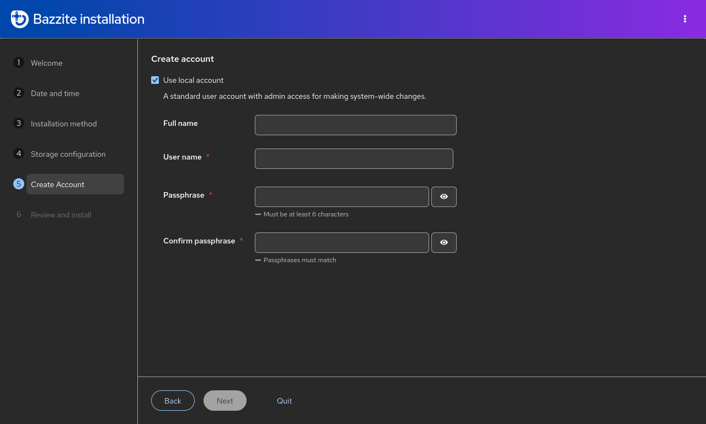

!!! warning

    Nedoporučuje se povolit účet root.

Vytvořte si uživatelské jméno a heslo pro přihlášení ke svému účtu Bazzite.  Toto heslo bude také použito pro všechna administrátorská oprávnění.  **Ujistěte se, že se jedná o heslo, které si pamatujete**.

## Instalace Bazzite

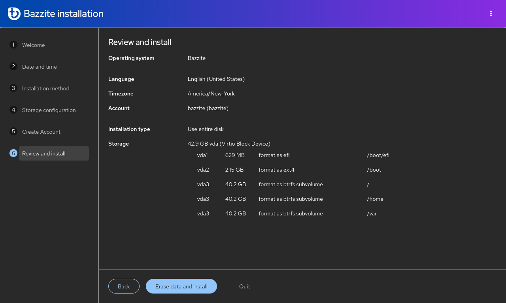

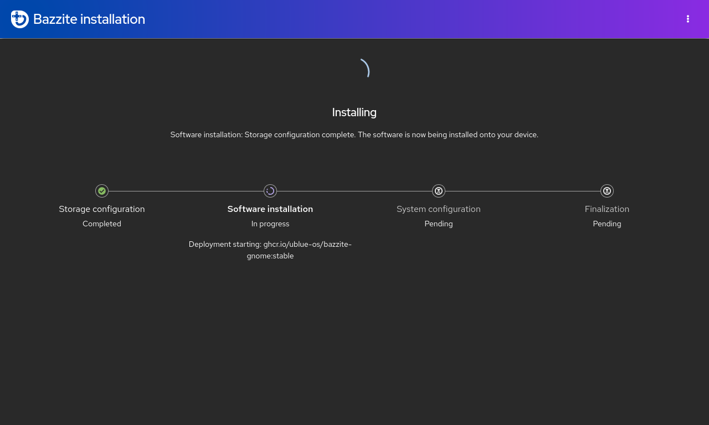

Zkontrolujte změny, které se chystáte provést v instalačním programu.  **Před pokračováním v instalaci si pozorně přečtěte**. Počkejte prosím, než se Bazzite nainstaluje.  To může chvíli trvat.

## Restartujte

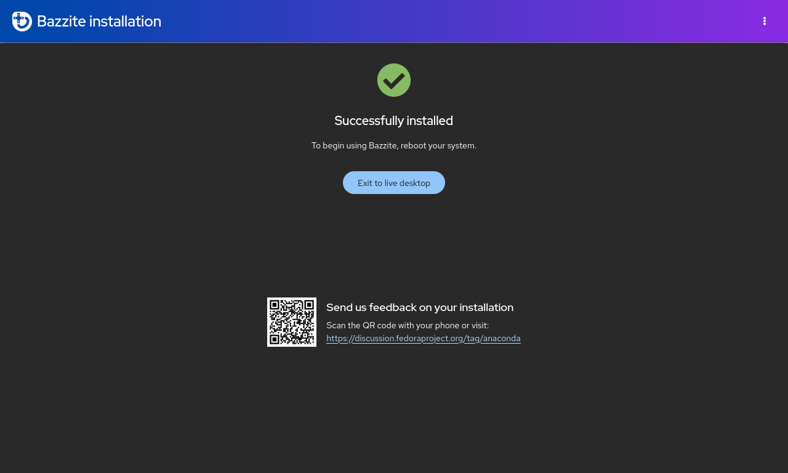

Restartujte zařízení. Nyní můžete ze zařízení vysunout flashovatelné médium, které jste použili k instalaci Bazzite, jakmile se zařízení začne znovu spouštět.

## Zabezpečené spouštění

!!! note

    Tuto část přeskočte, pokud není zabezpečené spouštění povoleno nebo jej váš hardware nepodporuje.

!!! important

    Výzva k registraci používá anglické rozložení klávesnice QWERTY bez rozdílu od vaší skutečné hardwarové klávesnice. Jiná rozložení proto mohou kolidovat se znaky hesla (tj. `A` a `Q` jsou na rozloženích AZERTY zaměněny).

Bazzite podporuje Secure Boot, ale pro jeho použití je nutné zaregistrovat klíč Universal Blue, jinak ponecháte Secure Boot zapnutou v BIOSu, Bazzite se nespustí.

### Důležité poznámky k bezpečnému spouštění:

- Zadáním hesla se z bezpečnostních důvodů zaregistrují neviditelné znaky, takže neuvidíte, co píšete!
- Aktualizace BIOSu může znovu povolit Secure Boot a možná budete muset po aktualizaci postupovat podle **"Metody B"**, abyste vyřešili černou obrazovku při zavádění, která si stěžovala na načtení jádra jako prvního.
- Steam Deck **není** dodáván s povoleným bezpečným spouštěním a nedodává se s žádnými klíči zaregistrovanými ve výchozím nastavení, nepovolujte Secure Boot na vašem Steam Deck, pokud absolutně nevíte, co děláte.

### Chybová zpráva (pokud klíč **není** správně zaregistrován):

```
error: ../../grub-core/kern/efi/sb.c:182:bad shim signature.
error: ../../grub-core/loader/1389/efi/linux.c:256:you need to load the kernel first.

Press any key to continue...
```

Chcete-li to vyřešit, postupujte podle **metody B** níže, a pokud na ni narazíte, přejděte přes chybovou zprávu.

### **Metoda A** - Během způsobu instalace


!!! note

    Tato obrazovka se objeví také při příštím spouštění, pokud povolíte zabezpečené spouštění, pokud bylo během instalace zakázáno.

Po opuštění instalačního programu Bazzite se objeví modrá obrazovka s možností zaregistrovat podepsané klíče.

`Enroll MOK`, pokud máte povoleno bezpečné spouštění. Pokud budete vyzváni k zadání hesla, **zadejte**:

```command
universalblue
```

V opačném případě `Continue boot`, pokud máte zakázáno Secure Boot nebo pokud není podporováno vaším hardwarem.

### **Metoda B** – Metoda po instalaci

**Před pokračováním v BIOSu zakažte Secure Boot** a poté jej znovu povolte **po registraci klíče**.

Pokud jste již Bazzite nainstalovali, pak **zadejte tento příkaz do hostitelského terminálu**:

```
ujust enroll-secure-boot-key
```

Pokud budete vyzváni k registraci požadovaného klíče, **zadejte heslo do hostitelského terminálu**:

```command
universalblue
```

**Zabezpečené spouštění můžete nyní znovu zapnout v systému BIOS.**
Pomocí následujícího příkazu nabootujete přímo do systému BIOS (pokud je podporován):

```command
ujust bios
```
### Dokončete registraci MOK při spuštění

Při příštím spuštění uvidíte modrou obrazovku MokManager:

1. Zvolte **Zapsat MOK**.
2. Až budete vyzváni k zadání hesla, zadejte:
    ```command
    universalblue
    ```

Po restartu je klíč zaregistrován a Secure Boot může zůstat povolený. Váš systém by se nyní měl normálně spustit pod Secure Boot.

## **Odstraňování problémů s instalací**:

Přečtěte si [**Troubleshooting Guide**](./troubleshoot_guide.md) nebo [**Alternative Installation Guide**](./alternate-install-guide.md), kde najdete zástupná řešení instalace.

## Po instalaci

Bazzite je nyní nainstalován. Přečtěte si [**Průvodce po instalaci**](./post-installation.md), kde najdete doporučené další kroky!