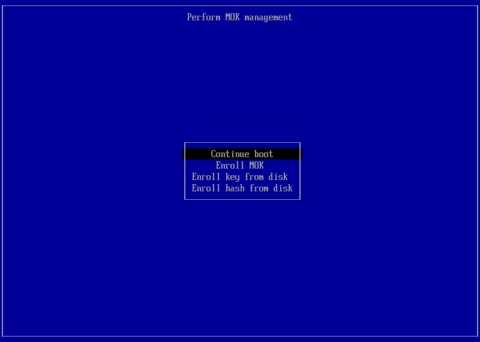

# Guide d'installation de Bazzite

## Tutoriel vidéo

https://www.youtube.com/watch?v=lBqbk6Z8HrQ

## Configuration requise

- Consultez le [**Guide de compatibilité matérielle**](/Gaming/Hardware_compatibility_for_gaming.md) pour connaître la configuration requise pour Bazzite.
- Le Secure Boot et module TPM (Trusted Platform Module) sont pris en charge sur la plupart des configurations, mais vous devez [**enregistrer notre clé pendant ou après l'installation**](#secure-boot).
- [**Le "dual boot" avec Windows est également pris en charge**](#dual-booting-windows).

### Configuration requise pour l'installation

- Un moyen de télécharger l'ISO de Bazzite
  - Un gestionnaire de téléchargement (comme [**Motrix**](https://motrix.app/)) si le téléchargement direct de l'ISO de Bazzite échoue ou est trop lent.
- Un support de démarrage d'au moins 16 Go, comme un clef USB
  - Le démarrage à partir d'une carte SD ou microSD peut fonctionner, mais tous les firmwares ne le prennent pas en charge.
- L'un des programmes suivants pour flasher/démarrer l'ISO :
  - **Fedora Media Writer (recommandé)** ([Windows/macOS](https://github.com/FedoraQt/MediaWriter/releases), [Linux](https://flathub.org/en/apps/org.fedoraproject.MediaWriter))
  - **Rufus** ([Windows](https://rufus.ie/)) (mode Image DD **requis**)
  - **Ventoy** ([Windows, Linux](https://www.ventoy.net/)) (remarque : Ventoy nécessite [**des étapes supplémentaires pour que le Secure Boot fonctionne**](https://www.ventoy.net/en/doc_secure.html))
- Un clavier physique filaire est **recommandé** et **obligatoire pour les appareils sans écran tactile**.
  - Un clavier virtuel est disponible si vous ne disposez pas de clavier USB physique.
    - Un écran tactile ou une souris est nécessaire pour naviguer correctement dans le programme d'installation.

### Environnements de bureau

Toutes les versions proposent le choix entre [**KDE Plasma**](https://kde.org/plasma-desktop/) et [**GNOME**](https://www.gnome.org/) comme environnement de bureau.

[**Le mode jeu Steam**](../../Handheld_and_HTPC_edition/Steam_Gaming_Mode.md) est une option permettant de lancer une session en plus de KDE Plasma ou GNOME.

Vous trouverez plus d'informations sur la [**FAQ de Bazzite**](../../General/FAQ.md) concernant les différences entre les variantes d'images.

=== "KDE Plasma"

    #### KDE Plasma (par défaut)

    

    - L'interface par défaut de KDE Plasma présente une disposition classique et familière
    - Hautement personnalisable grâce à de nombreux paramètres
    - Framework Qt
    - Des distributions Linux populaires telles que SteamOS utilisent KDE Plasma

=== "GNOME"

    #### GNOME (images "-gnome")

    

    - L'interface par défaut de GNOME a une mise en page élégante et adaptée au tactile
    - Simple et concise
    - Framework GTK
    - Les distributions Linux populaires telles qu'Ubuntu utilisent GNOME

=== "Mode Jeu Steam"

    #### Mode Jeu Steam (images "-deck")

    

    !!! note

        Votre appareil démarrera automatiquement en mode Jeu Steam au lancement, et vous pourrez accéder au mode Bureau depuis le "**menu d'alimentation**" en mode Jeu Steam.

    

    - **Nécessite un compte [Steam](https://store.steampowered.com/)**
    - Inclus dans les [images Bazzite-Deck](/Handheld_and_HTPC_edition/Steam_Gaming_Mode.md)
    - L'interface est conçue pour le jeu sur console portable et salon
    - Compatible avec les manettes
    - Choix entre KDE Plasma ou GNOME pour le mode bureau
    - Fonctionnalités supplémentaires avec les [plugins Decky](https://github.com/SteamDeckHomebrew/decky-loader) [(Voir tous les plugins)](https://plugins.deckbrew.xyz/)

    

## Sauvegarde

Assurez-vous de sauvegarder vos données personnelles stockées sur le disque sur lequel vous prévoyez d'installer Bazzite avant de procéder à l'installation.

## Télécharger Bazzite


Téléchargez l'ISO Bazzite de votre choix. Choisissez la configuration sur laquelle vous prévoyez d'installer Bazzite, le fabricant de votre carte graphique principale, l'environnement de bureau de votre choix, et indiquez si vous souhaitez le mode de jeu Steam, correspondant à la variante Bazzite-Deck destinée aux configurations HTPC et aux appareils portables.

### Calcul de la signature SHA256 de l'ISO

**Tutoriel vidéo** :

https://www.youtube.com/watch?v=wUDbMJtR1sM

## Flash de l'ISO


Copiez l'image ISO sur votre support de démarrage à l'aide de Fedora Media Writer, puis **éjectez le support**.

## Démarrage du programme d'installation

- Connectez votre support de démarrage à votre appareil et démarrez à partir de celui-ci.
- Une fois l'appareil connecté, démarrez le programme d'installation Bazzite.
- Cela dépend de la configuration de votre carte mère, mais il s'agit généralement d'une touche comme <kbd>F9</kbd> ou similaire.
  - Vous devrez peut-être consulter le manuel, rechercher votre appareil en ligne ou lire les raccourcis clavier qui s'affichent au démarrage de votre PC.
    - Vous pouvez également modifier les paramètres du BIOS pour démarrer d'abord avec votre périphérique de démarrage avant votre stockage actuel, mais il n'est **pas recommandé** de laisser cette option activée après l'installation de Bazzite.

### Appareils portables

Maintenez enfoncé le bouton « Volume bas » (<kbd>-</kbd>) et cliquez sur le bouton d'alimentation. Lorsque vous entendez un signal sonore, relâchez les deux boutons et vous accéderez au "Boot Manager". Une fois dans le "Boot Menu", sélectionnez votre périphérique de démarrage pour lancer le programme d'installation de Bazzite.

## Environnement Live


La session Live de Bazzite vous permet de découvrir les applications de bureau préinstallées et de vous familiariser avec son interface et l'expérience Bazzite.  

Veuillez ne pas essayer de jouer à des jeux pendant la session Live, car les performances ne seront pas identiques à celles obtenues une fois le système correctement installé sur votre disque.
De plus, notez que l'environnement d'installation n'inclut pas toute la prise en charge matérielle de Bazzite (par exemple pour l'audio du Steam Deck), car il utilise un noyau différent de celui de Bazzite standard.

### Configuration réseau en session Live


Notez qu'une connexion Internet n'est pas nécessaire pour installer Bazzite, mais qu'elle est utile si vous testez Bazzite avant de le déployer en environnement de production.  **Lancez le programme d'installation de Bazzite lorsque vous êtes prêt à procéder à l'installation.**

## Sélectionnez votre langue, votre région et la disposition de votre clavier


Les premières étapes de l'installation de Bazzite consistent à sélectionner la langue du système, la région correspondant à votre fuseau horaire et la disposition de votre clavier afin d'assurer un mappage correct des touches.

## Configuration de partition


!!! warning

    Veillez à ne sélectionner que les disques concernés afin d'éviter toute perte de données sur les autres. Il est recommandé de retirer tout disque externe avant de continuer.

Sélectionnez le disque sur lequel vous souhaitez installer Bazzite. Veuillez noter que cela effacera toutes les données présentes sur le disque sélectionné.

## Dual Boot Windows


!!! note

    Ignorez cette section si vous prévoyez d'installer Bazzite sans Dual Boot Windows.

!!! warning

     Le bouton « Formater en EFI » lors du Dual Boot indique qu'il va formater l'EFI de Windows, mais en réalité, il s'ajoute simplement à l'EFI. Il s'agit d'un bug de l'installateur.

Si vous effectuez un Dual Boot Windows, utilisez le partitionnement automatique, la seule option disponible dans l'ISO live, mais cela devrait fonctionner pour la plupart des cas d'utilisation de Dual Boot.  Si vous avez besoin d'un partitionnement manuel, téléchargez l'ISO legacy et suivez le [**guide d'installation de l'ISO legacy**](./legacy-install.md). Pour un Dual Boot Windows sur des disques **distincts**, utilisez le menu de démarrage UEFI de votre carte mère, car le BootLoader GRUB pourrait ne pas reconnaître correctement chaque entrée de démarrage.

### Guide vidéo

https://www.youtube.com/watch?v=KAt49B6rSFI

### Guide étape par étape

1. Installation de Bazzite sur un disque partagé.
2. Installation de Bazzite sur un disque séparé.

=== "Disque partagé (partition automatique)"

    1. (Sur Windows) Désactivez le **chiffrement BitLocker** et **fastboot**, puis redémarrez.
    2. (Sur Windows) Redimensionnez la partition Windows à l'aide de l'application Gestion des disques afin de disposer de suffisamment d'espace pour Bazzite.
    En général, cela devrait ressembler à ceci :
    
    <i><small>Source : [diskpart.com](https://www.diskpart.com/windows-10/windows-10-disk-management-0528.html)</small></i>
    3. Lancez le programme d'installation de Bazzite avec l'option de partition automatique.
    4. Redémarrez sous Bazzite et exécutez `ujust regenerate-grub` dans le terminal pour ajouter Windows au menu GRUB.

=== "Disque dédié"

    **Lorsque l'utilisation d'un disque dédié est possible, cette méthode est recommandée.**

    Installez Bazzite sur un disque interne ou externe dédié.

    1. Installez l'autre système d'exploitation sur un disque (comme Windows).
    2. Installez Bazzite sur un **second** disque.
    3. Définissez Bazzite comme **par défaut** dans les priorités de démarrage (facultatif).

    Si vous installez Windows ensuite, vous devez déconnecter le disque Bazzite pour empêcher le programme d'installation de Windows d'utiliser sa partition EFI.

    Vous pouvez également installer Windows sur un disque externe avec Windows-to-Go à l'aide de [Rufus](https://rufus.ie/en/) pour le Dual Boot si vous ne disposez pas d'un disque interne.

### Dual-boot avec d'autres systèmes d'exploitation Linux

!!! note

    Le dual boot avec d'**autres distributions Linux**, en particulier **Fedora non-atomic**, n'est pas officiellement pris en charge. Il est recommandé d'utiliser le menu de démarrage UEFI de votre carte mère ou de renoncer complètement au dual boot afin d'éviter tout problème inattendu. Si un problème survient, restaurez le BootLoader de Bazzite à l'aide de l'**outil de restauration du BootLoader** disponible dans l'ISO Live.

Pour les images Fedora Atomic Desktop sur le **même** disque : pour effectuer un dual boot avec une autre **image Fedora Atomic Desktop** (comme [Bluefin](https://projectbluefin.io/)) installée parallèlement à Bazzite, vous devez créer une partition EFI supplémentaire et basculer entre les deux via le menu de démarrage UEFI de votre carte mère.

## Chiffrement du disque


!!! warning

    Si vous oubliez votre mot de passe de chiffrement, il ne sera plus possible de déchiffrer votre disque et les données seront perdues !

Le chiffrement du disque est **facultatif**, mais il est disponible via [LUKS](https://docs.fedoraproject.org/en-US/quick-docs/encrypting-drives-using-LUKS/). **Vous aurez besoin d'un clavier USB pour déchiffrer le disque !** Ignorez cette étape si vous n'avez pas besoin du chiffrement du disque sur cet appareil. Cette étape n'est pas nécessaire dans la plupart des cas, sauf si vous craignez qu'un individu malveillant ait accès au disque physique sur lequel Bazzite est installé.

## Configuration du compte utilisateur


!!! warning

    Il n'est pas recommandé d'activer un compte root.

Créez un nom d'utilisateur et un mot de passe pour vous connecter à votre compte Bazzite.  Ce mot de passe sera également utilisé pour tous les privilèges administratifs.  **Assurez-vous de choisir un mot de passe dont vous pourrez vous souvenir**.

## Installation de Bazzite


Passez en revue les modifications que le programme d'installation est sur le point d'effectuer.  **Veuillez lire attentivement avant de poursuivre l'installation**. Veuillez patienter pendant l'installation de Bazzite.  Cela peut prendre un certain temps.

## Redémarrage


Redémarrez votre appareil. Vous pouvez désormais retirer le support de démarrage que vous avez utilisé pour installer Bazzite dès que votre appareil recommence à démarrer.

## Secure Boot

!!! note

    Ignorez cette section si le Secure Boot n'est pas activé ou n'est pas pris en charge par votre matériel.

!!! important

    L'invite d'enregistrement utilise une disposition de clavier QWERTY anglais, quelle que soit la disposition réelle de votre clavier. D'autres dispositions peuvent donc interférer avec les caractères du mot de passe (par exemple, les touches `A` et `Q` sont inversées sur les dispositions AZERTY).

Bazzite prend en charge le Secure Boot, mais la clef Universal Blue doit être enregistrée pour pouvoir l'utiliser ; sinon, le maintien du Secure Boot activé dans votre BIOS empêchera Bazzite de démarrer.

### Remarques importantes concernant le Secure Boot

- Pour des raisons de sécurité, la saisie du mot de passe s'effectue à l'aide de caractères invisibles ; vous ne pourrez donc pas voir ce que vous tapez !
- La mise à jour de votre BIOS peut réactiver le Secure Boot et vous devrez peut-être suivre la **« Méthode B »** après la mise à jour pour résoudre le problème d'écran noir au démarrage signalant que le noyau doit être chargé en premier.
- Le Steam Deck n'est **pas** livré avec le Secure Boot activé et ne contient aucune clé enregistrée par défaut. N'activez pas le Secure Boot sur votre Steam Deck à moins d'être absolument certain de ce que vous faites.

### Message d'erreur (si la clé n'est **pas** correctement enregistrée)

```
error: ../../grub-core/kern/efi/sb.c:182:bad shim signature.
error: ../../grub-core/loader/1389/efi/linux.c:256:you need to load the kernel first.

Press any key to continue...
```

Suivez la **méthode B** ci-dessous pour résoudre ce problème et ignorer le message d'erreur si celui-ci s'affiche.

### **Méthode A** - Procédure pendant l'installation



!!! note

    Cet écran s'affichera également au prochain démarrage si vous activez le Secure Boot alors qu'il était désactivé pendant l'installation.

Un écran bleu s'affichera, vous proposant d'enregistrer les clés signées après avoir quitté le programme d'installation de Bazzite.

`Register MOK` si le Secure Boot est activé. Si vous êtes invité à saisir un mot de passe, **saisissez** :

```command
universalblue
```

Sinon, `Continue boot` si le Secure Boot est désactivé ou s'il n'est pas pris en charge par votre matériel.

### **Méthode B** - Méthode après installation

**Désactivez le Secure Boot dans le BIOS avant de continuer**, puis réactivez-le **après avoir enregistré la clé**.

Si vous avez déjà installé Bazzite, **saisissez cette commande dans un terminal hôte**

```
ujust enroll-secure-boot-key
```

Si vous êtes invité à enregistrer la clé requise, **saisissez le mot de passe dans le terminal hôte** :

```command
universalblue
```

**Vous pouvez désormais réactiver le Secure Boot dans le BIOS.**
Utilisez la commande suivante pour démarrer directement dans le BIOS de votre système (si cette fonctionnalité est prise en charge) :

```command
ujust bios
```
### Effectuer l'enregistrement du MOK au démarrage

Au prochain démarrage, l'écran bleu de MokManager s'affichera :

1.  Sélectionnez **Enroll MOK**.
2.  Lorsque le mot de passe vous est demandé, saisissez :
    ```command
    universalblue
    ```

Après le redémarrage, la clé est enregistrée et le Secure Boot peut rester activé. Votre système devrait désormais démarrer normalement sous Secure Boot.

## **Dépannage de l'installation**

Consultez le [**Guide de dépannage**](./troubleshoot_guide.md) ou le [**Guide d'installation alternative**](./alternate-install-guide.md) pour connaître les solutions de dépannage de l'installation.

## Après l'installation

Bazzite est désormais installé. Consultez le [**Guide post-installation**](./post-installation.md) pour connaître les étapes suivantes recommandées !
