# Руководство по установке Bazzite

## Видеоинструкция

https://www.youtube.com/watch?v=lBqbk6Z8HrQ

## Системные требования

- Системные требования Bazzite приведены в [**руководстве по совместимости оборудования**](/Gaming/Hardware_compatibility_for_gaming.md).
- Secure Boot и доверенный платформенный модуль (TPM) поддерживаются на большинстве устройств, но вам потребуется [**зарегистрировать наш ключ во время или после установки**](#secure-boot).
- [**Также поддерживается двойная загрузка с Windows**](#dual-booting-windows).

### Требования установщика

- Возможность скачать ISO-образ Bazzite
  - Менеджер загрузок, например [**Motrix**](https://motrix.app/), если ISO-образ Bazzite не скачивается напрямую или загрузка идет слишком медленно.
- Загрузочный носитель объемом от 16 ГБ, например USB-накопитель
  - Загрузка с карты SD или microSD может работать, но поддерживается не всеми прошивками.
- Одна из следующих программ для записи или загрузки ISO-образа:
  - **Fedora Media Writer (рекомендуется)** ([Windows/macOS](https://github.com/FedoraQt/MediaWriter/releases), [Linux](https://flathub.org/en/apps/org.fedoraproject.MediaWriter))
  - **Rufus** ([Windows](https://rufus.ie/))
  - **Ventoy** ([Windows, Linux](https://www.ventoy.net/)) (примечание: для работы Secure Boot в Ventoy [**нужны дополнительные действия**](https://www.ventoy.net/en/doc_secure.html))
- Физическая проводная клавиатура **рекомендуется**, а для устройств без сенсорного экрана она **обязательна**.
  - Если физической USB-клавиатуры нет, можно воспользоваться экранной.
    - Для полноценной работы с установщиком потребуется сенсорный экран или мышь.

### Окружения рабочего стола

Для всех образов можно выбрать окружение рабочего стола: [**KDE Plasma**](https://kde.org/plasma-desktop/) или [**GNOME**](https://www.gnome.org/).

[**Игровой режим Steam**](../../Handheld_and_HTPC_edition/Steam_Gaming_Mode.md) доступен как дополнительный сеанс наряду с KDE Plasma или GNOME.

Подробнее о различиях между вариантами образов рассказано в [**часто задаваемых вопросах о Bazzite**](../../General/FAQ.md).

=== "KDE Plasma"

    #### KDE Plasma (по умолчанию)

    

    - Привычная классическая компоновка интерфейса по умолчанию
    - Гибкая настройка с множеством параметров
    - Фреймворк Qt
    - KDE Plasma используется в популярных дистрибутивах Linux, например SteamOS

=== "GNOME"

    #### GNOME (образы `-gnome`)

    

    - Изящный интерфейс по умолчанию, удобный для сенсорных экранов
    - Простота и лаконичность
    - Фреймворк GTK
    - GNOME используется в популярных дистрибутивах Linux, например Ubuntu

=== "Игровой режим Steam"

    #### Игровой режим Steam (образы `-deck`)

    

    !!! note

        При включении устройство автоматически запустит сеанс игрового режима Steam. Перейти в режим рабочего стола можно через **меню питания** в игровом режиме Steam.

    

    - **Требуется учетная запись [Steam](https://store.steampowered.com/)**
    - Входит в состав [образов Bazzite-Deck](/Handheld_and_HTPC_edition/Steam_Gaming_Mode.md)
    - Интерфейс рассчитан на портативные устройства и игру с дивана
    - Удобное управление с помощью контроллера
    - В режиме рабочего стола можно выбрать KDE Plasma или GNOME
    - Дополнительные возможности с [плагинами Decky](https://github.com/SteamDeckHomebrew/decky-loader) [(Все плагины)](https://plugins.deckbrew.xyz/)

    

## Резервное копирование

Перед установкой сохраните в надежном месте резервную копию личных файлов с диска, на который планируете установить Bazzite.

## Скачивание Bazzite

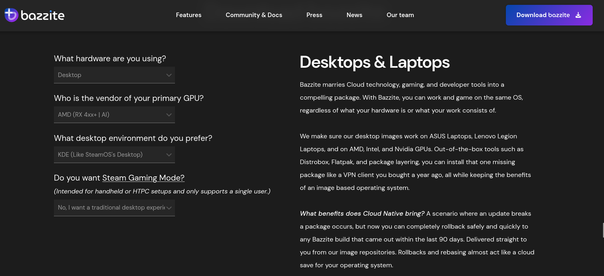

Скачайте подходящий ISO-образ Bazzite. Выберите устройство, на которое собираетесь установить Bazzite, производителя основной видеокарты, желаемое окружение рабочего стола и игровой режим Steam, если он нужен. Игровой режим входит в вариант Bazzite-Deck для домашних мультимедийных компьютеров (HTPC) и портативных устройств.

### Вычисление контрольной суммы SHA256 ISO-образа

**Видеоинструкция**:

https://www.youtube.com/watch?v=wUDbMJtR1sM

## Запись ISO-образа

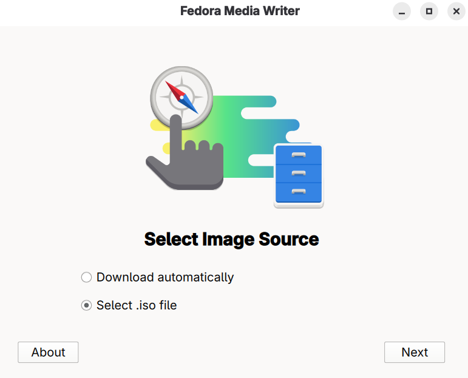
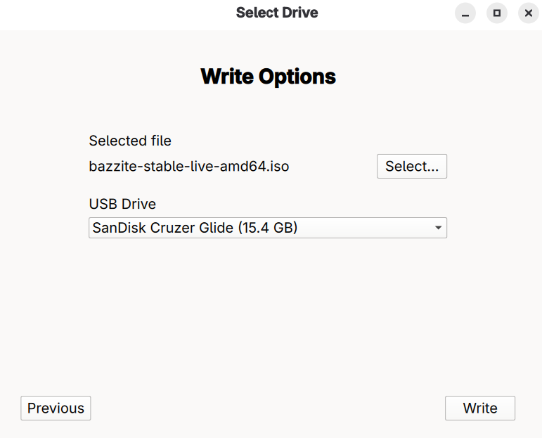

Запишите Bazzite на загрузочный носитель с помощью Fedora Media Writer, а затем **извлеките носитель с ISO-образом**.

## Загрузка установщика

- Подключите загрузочный носитель к устройству и загрузитесь с него.
- После подключения носителя запустите установщик Bazzite.
- Способ зависит от материнской платы, но чаще всего меню загрузки открывается функциональной клавишей, например <kbd>F9</kbd>.
  - Иногда нужно свериться с руководством, найти сведения об устройстве в интернете или посмотреть подсказки с горячими клавишами при включении компьютера.
    - Еще один вариант: изменить настройки BIOS, чтобы загрузочный носитель стоял в очереди раньше основного накопителя. После установки Bazzite оставлять такой порядок загрузки **не рекомендуется**.

### Портативные устройства

Зажмите кнопку уменьшения громкости (<kbd>-</kbd>) и нажмите кнопку питания. Услышав сигнал, отпустите обе кнопки: откроется диспетчер загрузки. В меню загрузки выберите загрузочный носитель, чтобы запустить установщик Bazzite.

## Live-среда

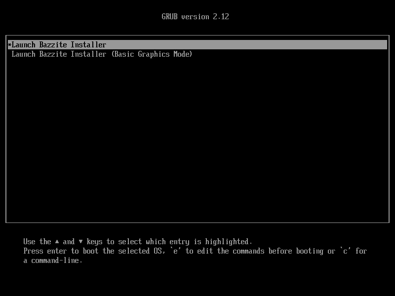

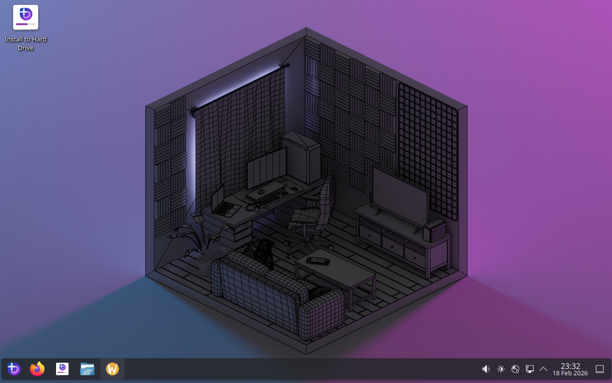

В установочной Live-среде Bazzite можно посмотреть предустановленные приложения и познакомиться с интерфейсом.  

Не запускайте игры в Live-среде: ее производительность не соответствует производительности Bazzite после полноценной установки на диск.
Кроме того, установочная среда поддерживает не все оборудование, с которым работает Bazzite, например звук Steam Deck, поскольку использует другое ядро.

### Настройка сети в Live-среде

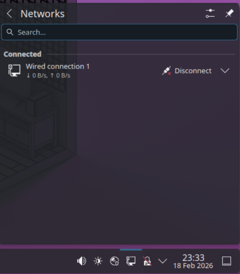

Для установки Bazzite подключение к интернету не требуется, но пригодится при проверке Bazzite в Live-среде. **Когда будете готовы начать установку, откройте установщик Bazzite.**

## Выбор языка, региона и раскладки клавиатуры

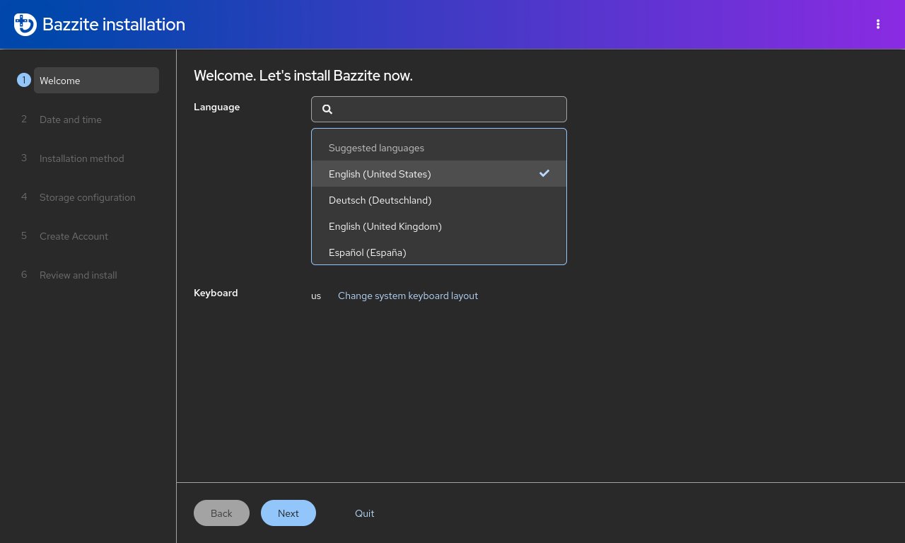

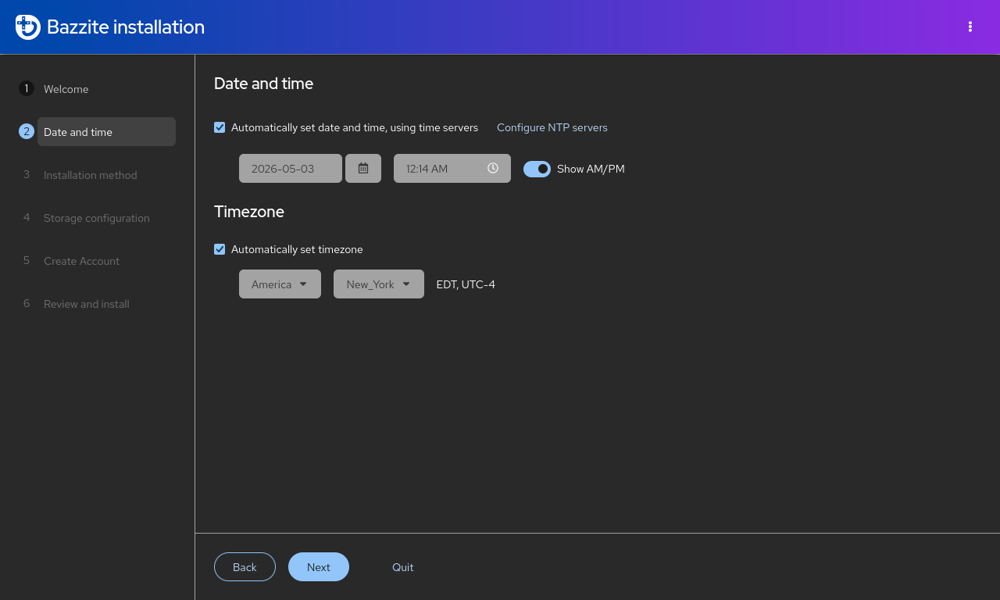

В начале установки Bazzite выберите язык системы, регион с нужным часовым поясом и раскладку клавиатуры, чтобы клавиши распознавались правильно.

## Настройка разделов диска

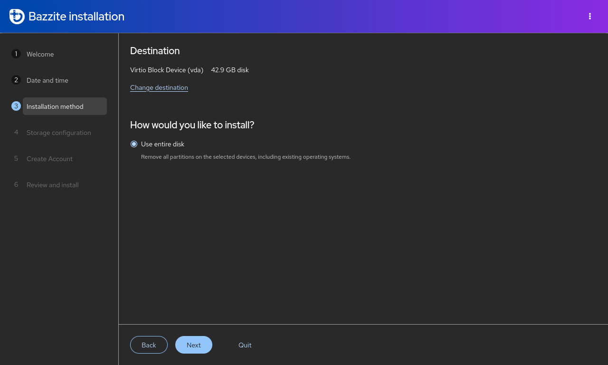

!!! warning

    Выбирайте только нужные диски, чтобы не потерять данные на остальных. Перед продолжением лучше безопасно отключить все внешние накопители.

Выберите диск, на который планируете установить Bazzite. Все данные на выбранном диске будут удалены.

## Двойная загрузка с Windows { #dual-booting-windows }

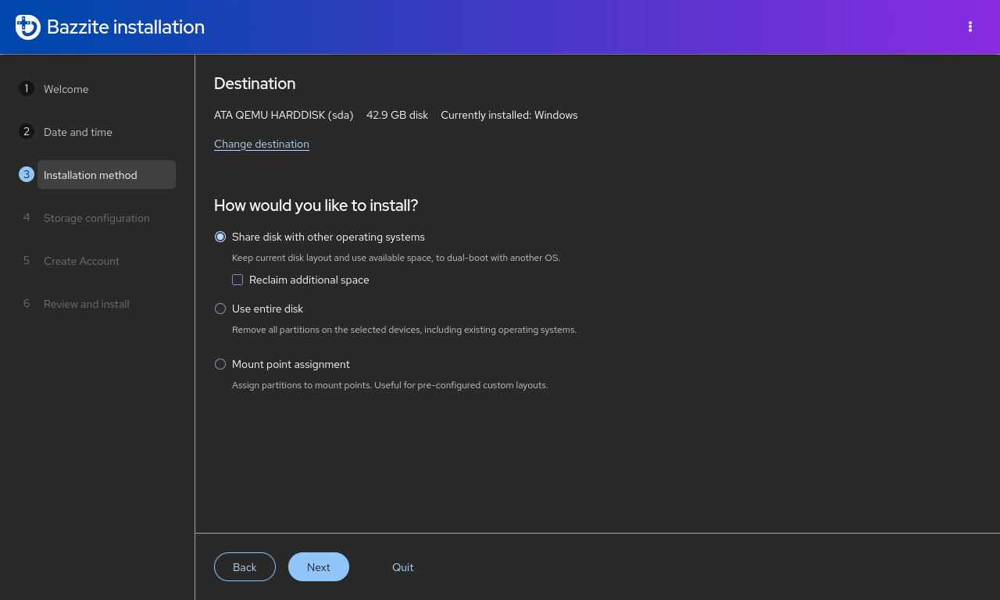

!!! note

    Пропустите этот раздел, если собираетесь установить Bazzite без двойной загрузки с Windows.

!!! warning

     При двойной загрузке кнопка `format as efi` сообщает, что раздел EFI Windows будет отформатирован, но на самом деле установщик лишь добавляет в него свою запись. Это ошибка основного установщика.

Для двойной загрузки с Windows используйте автоматическую разметку: в Live ISO доступен только этот вариант, и он подходит для большинства таких случаев. Если нужна ручная разметка, скачайте устаревший ISO-образ и следуйте [**руководству по установке с устаревшего ISO-образа**](./legacy-install.md). При двойной загрузке Windows с **отдельных** дисков пользуйтесь меню загрузки UEFI материнской платы, поскольку загрузчик GRUB может неправильно распознать отдельные загрузочные записи.

### Видеоинструкция

https://www.youtube.com/watch?v=KAt49B6rSFI

### Пошаговая инструкция

1. Установка Bazzite на один диск с Windows.
2. Установка Bazzite на отдельный диск.

=== "Общий диск (автоматическая разметка)"

    1. В Windows отключите **шифрование BitLocker** и **быструю загрузку**, затем перезагрузите компьютер.
    2. В Windows уменьшите раздел Windows с помощью приложения «Управление дисками», освободив достаточно места для Bazzite.
    Обычно результат выглядит примерно так:
    
    <i><small>Источник: [diskpart.com](https://www.diskpart.com/windows-10/windows-10-disk-management-0528.html)</small></i>
    3. Запустите установщик Bazzite и выберите автоматическую разметку.
    4. Перезагрузитесь в Bazzite и выполните в терминале `ujust regenerate-grub`, чтобы добавить Windows в GRUB.

=== "Отдельный диск"

    **Если есть возможность выделить отдельный диск, рекомендуется этот способ.**

    Установите Bazzite на отдельный внутренний или внешний диск.

    1. Установите другую операционную систему, например Windows, на один диск.
    2. Установите Bazzite на **второй** диск.
    3. При желании назначьте Bazzite системой **по умолчанию** в порядке загрузки.

    Если устанавливаете Windows после Bazzite, отключите диск с Bazzite, чтобы установщик Windows не воспользовался его разделом EFI.

    Если свободного внутреннего диска нет, для двойной загрузки можно установить Windows-to-Go на внешний диск с помощью [Rufus](https://rufus.ie/en/).

### Двойная загрузка с другими операционными системами Linux

!!! note 

    Двойная загрузка с **другими дистрибутивами Linux**, особенно с **неатомарной Fedora**, официально не поддерживается. Чтобы избежать неожиданных проблем, рекомендуется пользоваться меню загрузки UEFI материнской платы или полностью отказаться от двойной загрузки. Если возникнет ошибка, восстановите загрузчик Bazzite с помощью **Bootloader Restoring Tool** из Live ISO.

Для образов Fedora Atomic Desktop на **одном** диске: чтобы настроить двойную загрузку еще одного **образа Fedora Atomic Desktop**, например [Bluefin](https://projectbluefin.io/), установленного рядом с Bazzite, создайте дополнительный раздел EFI и переключайтесь между системами через меню загрузки UEFI материнской платы.

## Шифрование диска

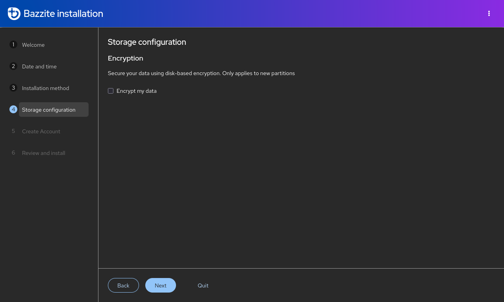

!!! warning

    Если вы забудете пароль шифрования, расшифровать диск уже не получится и данные будут потеряны!

Шифрование диска с помощью [LUKS](https://docs.fedoraproject.org/en-US/quick-docs/encrypting-drives-using-LUKS/) **необязательно**. **Для расшифровки диска потребуется физическая USB-клавиатура!** Пропустите этот шаг, если шифрование на устройстве не требуется. В большинстве случаев оно не нужно, если вы не опасаетесь, что посторонний получит физический доступ к диску с Bazzite.

## Настройка учетной записи

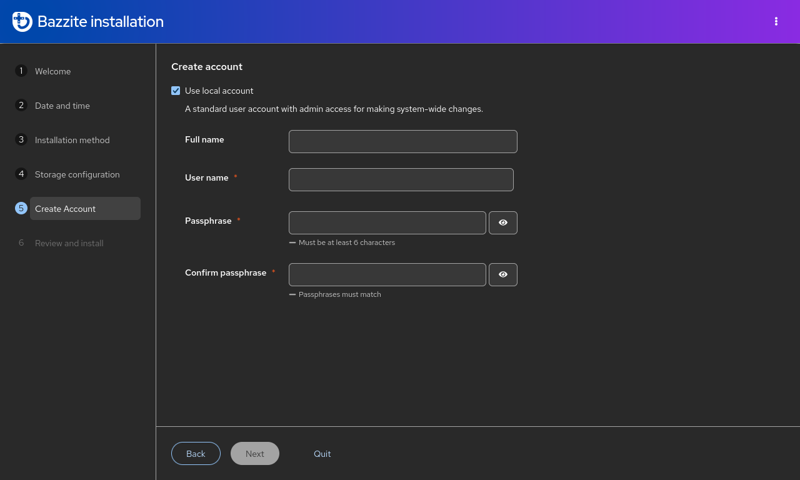

!!! warning

    Включать учетную запись root не рекомендуется.

Создайте имя пользователя и пароль для входа в Bazzite. Этот же пароль потребуется для административных действий. **Выберите пароль, который сможете запомнить**.

## Установка Bazzite

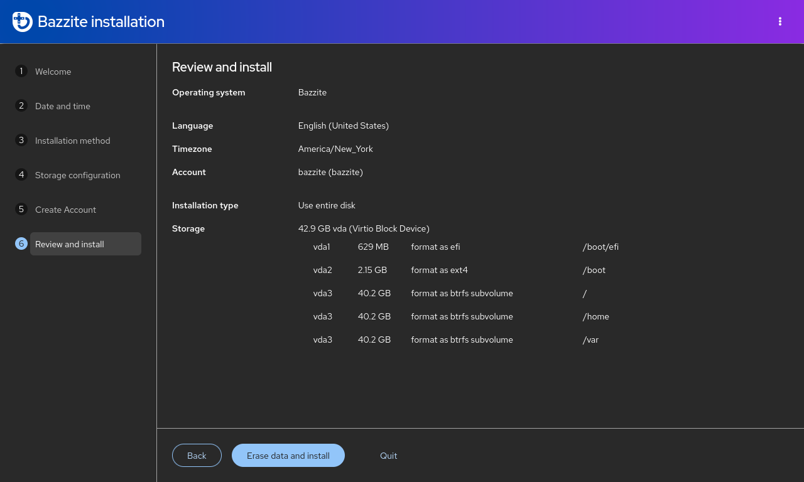

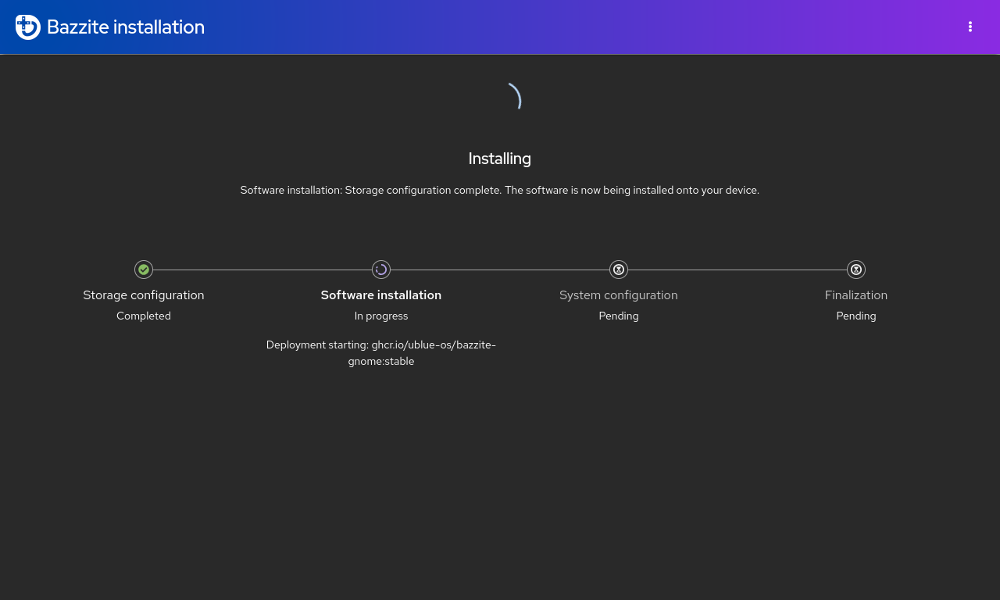

Проверьте изменения, которые собирается внести установщик. **Внимательно прочитайте все сведения, прежде чем продолжить установку**. Дождитесь завершения установки Bazzite. Это может занять некоторое время.

## Перезагрузка

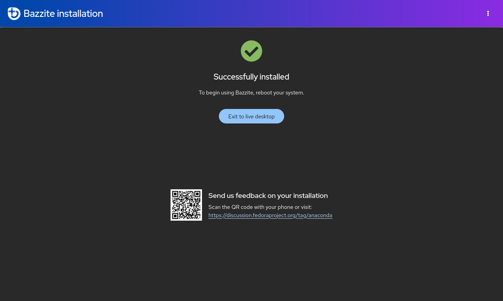

Перезагрузите устройство. Когда оно снова начнет загружаться, извлеките загрузочный носитель, с которого устанавливали Bazzite.

## Secure Boot

!!! note

    Пропустите этот раздел, если Secure Boot отключен или не поддерживается вашим оборудованием.

!!! important

    При регистрации ключа используется английская раскладка QWERTY независимо от физической клавиатуры. Поэтому на других раскладках символы пароля могут располагаться на других клавишах. Например, в AZERTY клавиши `A` и `Q` поменяны местами.

Bazzite поддерживает Secure Boot, но для его работы нужно зарегистрировать ключ Universal Blue. Если оставить Secure Boot включенным в BIOS без регистрации ключа, Bazzite не загрузится.

### Важные сведения о Secure Boot:

- При вводе пароля символы не отображаются из соображений безопасности, поэтому вы не увидите набираемый текст!
- После обновления BIOS Secure Boot может снова включиться. Если при загрузке появится черный экран с требованием сначала загрузить ядро, выполните действия из **способа Б**.
- На Steam Deck Secure Boot **отключен**, а ключи по умолчанию не зарегистрированы. Не включайте Secure Boot на Steam Deck, если не уверены, что понимаете последствия.

### Сообщение об ошибке (если ключ зарегистрирован **неправильно**):

```
error: ../../grub-core/kern/efi/sb.c:182:bad shim signature.
error: ../../grub-core/loader/1389/efi/linux.c:256:you need to load the kernel first.

Press any key to continue...
```

Если увидите эту ошибку, устраните ее с помощью описанного ниже **способа Б**.

### **Способ А** - во время установки


!!! note

    Этот экран также появится при следующей загрузке, если Secure Boot был отключен во время установки, а затем вы его включили.

После выхода из установщика Bazzite появится синий экран, на котором можно зарегистрировать подписанные ключи.

Если Secure Boot включен, выберите `Enroll MOK`. При запросе пароля **введите**:

```command
universalblue
```

Если Secure Boot отключен или не поддерживается вашим оборудованием, выберите `Continue boot`.

### **Способ Б** - после установки

**Перед продолжением отключите Secure Boot в BIOS**, а **после регистрации ключа** включите снова.

Если Bazzite уже установлена, **введите в терминале основной системы следующую команду**:

```
ujust enroll-secure-boot-key
```

Если появится запрос на регистрацию нужного ключа, **введите пароль в терминале основной системы**:

```command
universalblue
```

**Теперь можно снова включить Secure Boot в BIOS.**
Чтобы сразу загрузиться в BIOS системы, выполните следующую команду, если она поддерживается:

```command
ujust bios
```
### Завершение регистрации MOK при загрузке

При следующей загрузке появится синий экран MokManager:

1.  Выберите **Enroll MOK**.
2.  Когда появится запрос пароля, введите:
    ```command
    universalblue
    ```

После перезагрузки ключ будет зарегистрирован, и Secure Boot можно оставить включенным. Теперь система должна нормально загружаться с Secure Boot.

## **Устранение проблем с установкой**:

Способы обойти проблемы при установке описаны в [**руководстве по устранению неполадок**](./troubleshoot_guide.md) и [**руководстве по альтернативной установке**](./alternate-install-guide.md).

## После установки

Bazzite установлена. Рекомендуемые дальнейшие действия приведены в [**руководстве по настройке после установки**](./post-installation.md)!
