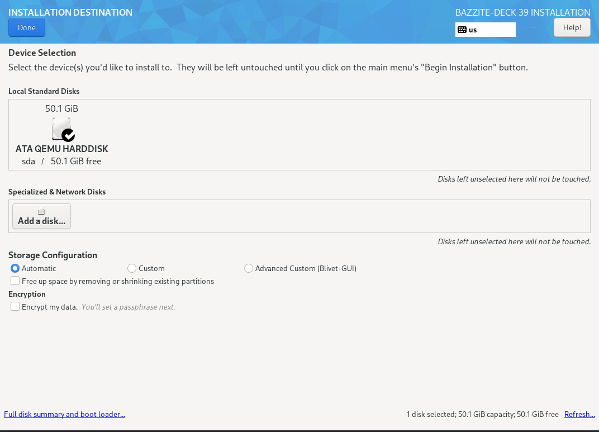
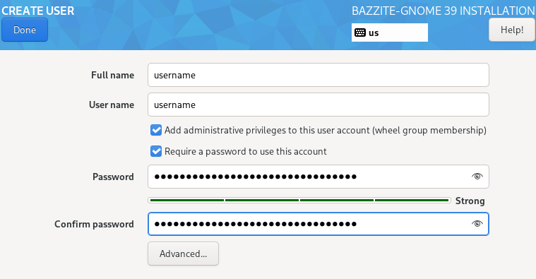
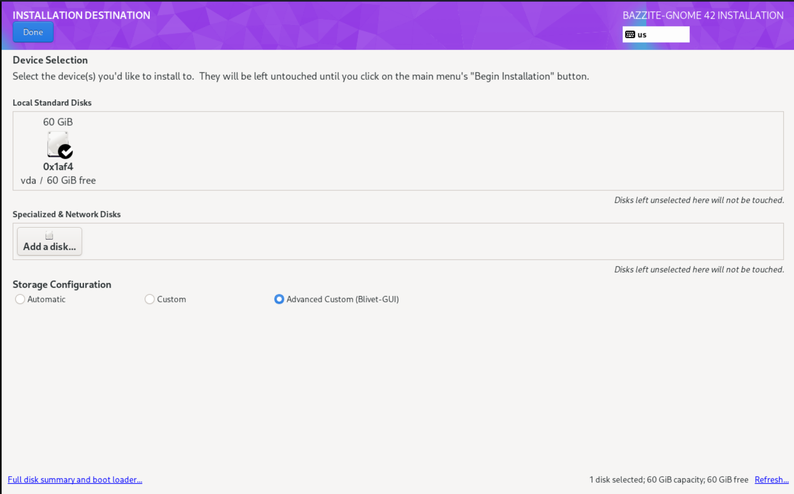
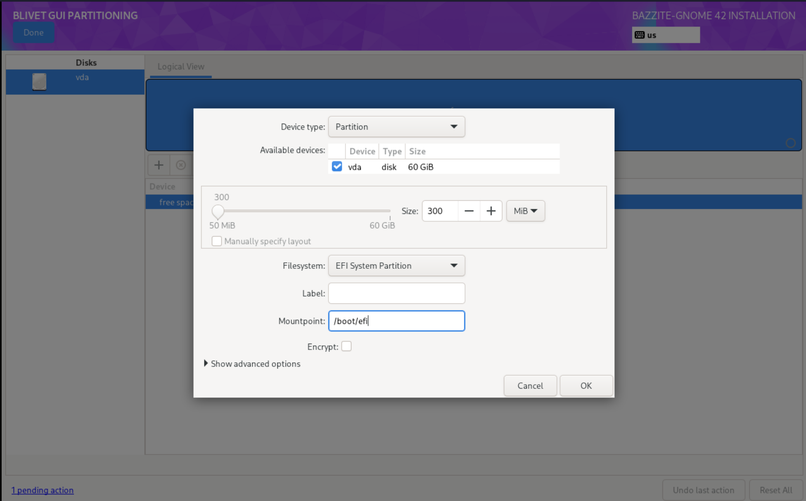
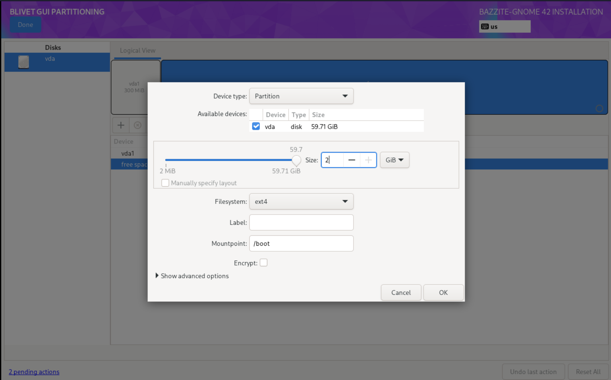
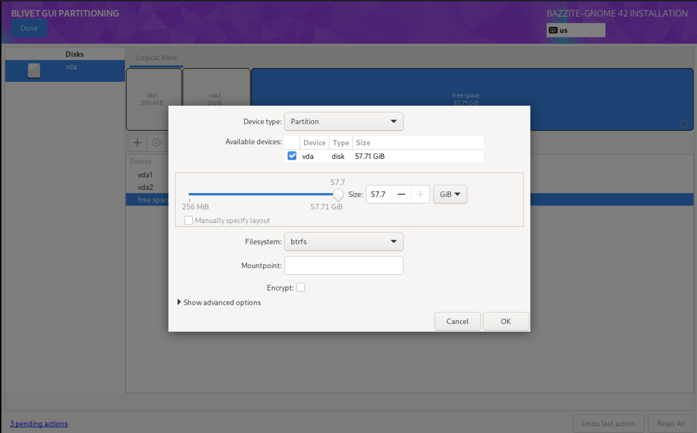
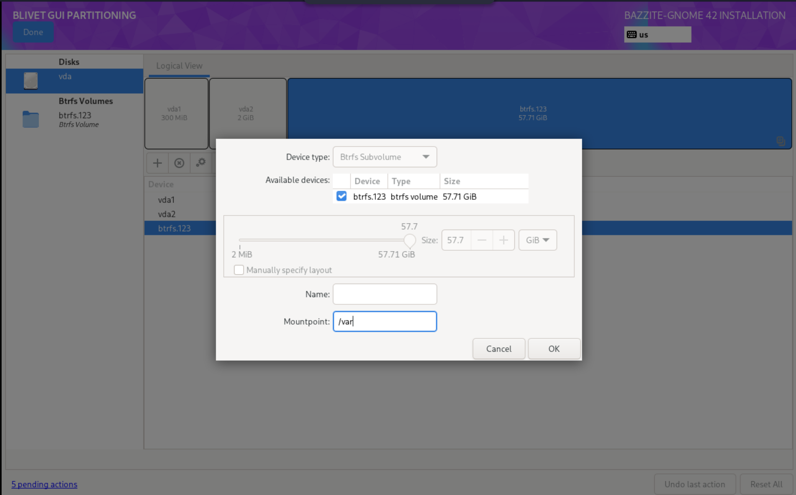
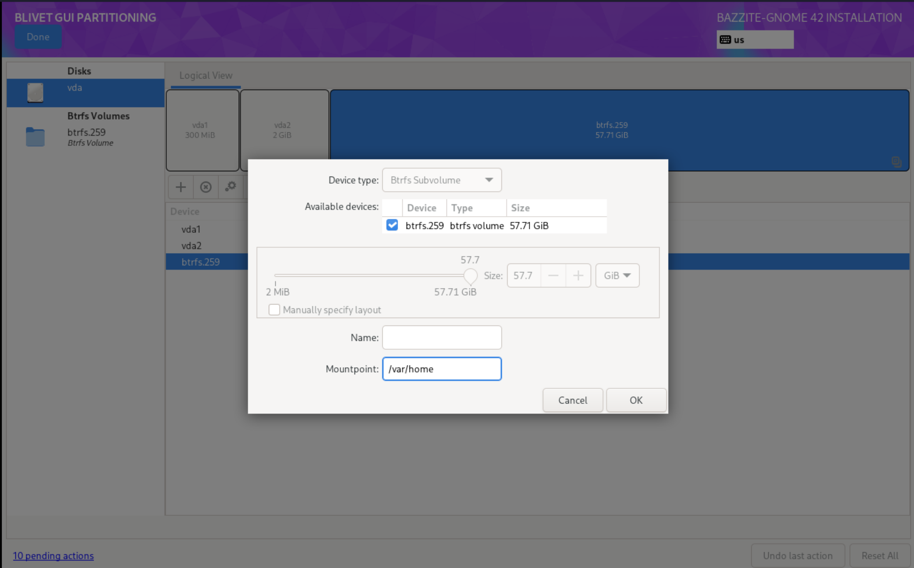

# Руководство по установке со старого ISO

## Только старые ISO

Это руководство предназначено только для старых ISO-образов, которые пока поддерживаются, потому что новый установщик еще не поддерживает ручную разметку диска и в нем остаются небольшие ошибки.

## Системные требования

- Системные требования Bazzite приведены в [**руководстве по совместимости оборудования**](/Gaming/Hardware_compatibility_for_gaming.md).
- Secure Boot и доверенный платформенный модуль (TPM) поддерживаются на большинстве устройств, но вам потребуется [**зарегистрировать наш ключ во время или после установки**](#secure-boot).
- [**Также поддерживается двойная загрузка с Windows**](#dual-booting-windows).

### Требования установщика

- Возможность скачать ISO-образ Bazzite
  - Менеджер загрузок, например [**Motrix**](https://motrix.app/), если ISO-образ Bazzite не скачивается напрямую или загрузка идет слишком медленно.
- Загрузочный носитель объемом от 16 ГБ, например USB-накопитель
  - Загрузка с карты SD или microSD может работать, но поддерживается не всеми прошивками.
- Одна из следующих программ для записи или загрузки ISO-образа:
  - **Fedora Media Writer (рекомендуется)** ([Windows/macOS](https://github.com/FedoraQt/MediaWriter/releases), [Linux](https://flathub.org/en/apps/org.fedoraproject.MediaWriter))
  - **Rufus** ([Windows](https://rufus.ie/))
  - **Ventoy** ([Windows, Linux](https://www.ventoy.net/)) (примечание: для работы Secure Boot в Ventoy [**нужны дополнительные действия**](https://www.ventoy.net/en/doc_secure.html))
- Физическая проводная клавиатура **рекомендуется**, а для устройств без сенсорного экрана она **обязательна**.
  - В остальных случаях создайте учетную запись с **именем пользователя** и **паролем пользователя**, если у вас есть клавиатура.

### Окружения рабочего стола

Для всех образов можно выбрать окружение рабочего стола: [**KDE Plasma**](https://kde.org/plasma-desktop/) или [**GNOME**](https://www.gnome.org/).

[**Игровой режим Steam**](/Handheld_and_HTPC_edition/Steam_Gaming_Mode.md) доступен как дополнительный сеанс наряду с KDE Plasma или GNOME. Он рекомендуется для домашних мультимедийных компьютеров (HTPC) и портативных устройств.

Подробнее о различиях между вариантами образов рассказано в [**часто задаваемых вопросах о Bazzite**](../../General/FAQ.md).

=== "KDE Plasma"

    #### KDE Plasma (по умолчанию)

    

    - Привычная классическая компоновка интерфейса по умолчанию
    - Гибкая настройка с множеством параметров
    - Фреймворк Qt
    - KDE Plasma используется в популярных дистрибутивах Linux, например SteamOS

=== "GNOME"

    #### GNOME (образы `-gnome`)

    

    - Изящный интерфейс по умолчанию, удобный для сенсорных экранов
    - Простота и лаконичность
    - Фреймворк GTK
    - GNOME используется в популярных дистрибутивах Linux, например Ubuntu

=== "Игровой режим Steam"

    #### Игровой режим Steam (образы `-deck`)

    

    !!! note

        При включении устройство автоматически запустит сеанс игрового режима Steam. Перейти в режим рабочего стола можно через **меню питания** в игровом режиме Steam.

    

    - **Требуется учетная запись [Steam](https://store.steampowered.com/)**
    - Входит в состав [образов Bazzite-Deck](/Handheld_and_HTPC_edition/Steam_Gaming_Mode.md)
    - Интерфейс рассчитан на портативные устройства и игру с дивана
    - Удобное управление с помощью контроллера
    - В режиме рабочего стола можно выбрать KDE Plasma или GNOME
    - Дополнительные возможности с [плагинами Decky](https://github.com/SteamDeckHomebrew/decky-loader) [(Все плагины)](https://plugins.deckbrew.xyz/)

    

## 0. Резервное копирование данных

Перед установкой сохраните в надежном месте резервную копию личных файлов с диска, на который планируете установить Bazzite.

## 1. Скачивание и запись старого ISO

- Скачайте [Bazzite](https://download.bazzite.gg), выбрав подходящий ISO для своего оборудования с помощью нашего инструмента выбора образа.
- Запишите Bazzite на загрузочный носитель.
- После записи ISO извлеките накопитель.

### Вычисление контрольной суммы SHA256 ISO-образа

**Видеоинструкция**:

https://www.youtube.com/watch?v=wUDbMJtR1sM

## 2. Загрузка Bazzite

- Подключите загрузочный носитель к устройству и загрузитесь с него.
- После подключения носителя запустите установщик Bazzite.
- Способ зависит от материнской платы, но чаще всего меню загрузки открывается функциональной клавишей, например <kbd>F9</kbd>.
  - Иногда нужно свериться с руководством, найти сведения об устройстве в интернете или посмотреть подсказки с горячими клавишами при включении компьютера.
    - Еще один вариант: изменить настройки BIOS, чтобы загрузочный носитель стоял в очереди раньше основного накопителя. После установки Bazzite оставлять такой порядок загрузки **не рекомендуется**.
- Проверьте носитель и перейдите к установщику.

### Портативные устройства

Зажмите кнопку уменьшения громкости (<kbd>-</kbd>) и нажмите кнопку питания. Услышав сигнал, отпустите обе кнопки: откроется диспетчер загрузки. В меню загрузки выберите загрузочный носитель, чтобы запустить установщик Bazzite.

## 3. Внутри установочного носителя

!!! note "Установка Bazzite без физической клавиатуры, подключенной к устройству:"

    Если физическая USB-клавиатура не подключена, **НЕ** нажимайте "_User Creation_": это удалит стандартные имя пользователя и пароль, а без физической клавиатуры вы не сможете ввести новые.

     **Имя пользователя по умолчанию**: `bazzite`
     **Пароль по умолчанию**: `bazzite`





- Выберите язык, регион, раскладку клавиатуры и часовой пояс.
- Выберите диск, на который будет установлена Bazzite.
  - Удалите все оставшиеся разделы на диске, **если только вы не настраиваете двойную загрузку на том же диске**.
  - Рекомендуется использовать автоматическую настройку хранилища, **если только вы не настраиваете двойную загрузку на том же диске**.
- При желании зашифруйте диск паролем.
  - **Если вы потеряете этот пароль, диск нельзя будет расшифровать**.
  - ДЛЯ РАЗБЛОКИРОВКИ УСТРОЙСТВА НУЖНА ФИЗИЧЕСКАЯ ПРОВОДНАЯ КЛАВИАТУРА!
- Настройте учетную запись пользователя.
  - Выдайте права администратора и **задайте пароль пользователя**.
- Начните установку.
- Перезагрузите устройство после завершения установки.

## Двойная загрузка

!!! note

    Пропустите этот раздел, если собираетесь установить Bazzite без двойной загрузки Windows.

### Двойная загрузка с Windows { #dual-booting-windows }

Для двойной загрузки Windows на **отдельных** дисках используйте UEFI-меню загрузки материнской платы, так как загрузчик GRUB может распознать не все загрузочные записи правильно.

### Видеоинструкция

https://www.youtube.com/watch?v=KAt49B6rSFI

### Письменная инструкция

1. Установка Bazzite на общий диск.
2. Установка Bazzite на отдельный диск.

=== "Общий диск (автоматическая разметка)"

    1. (В Windows) Отключите **шифрование BitLocker** и **быстрый запуск (Fast Startup)**, затем перезагрузитесь.
    2. (В Windows) Уменьшите раздел Windows через приложение «Управление дисками», чтобы освободить достаточно места для Bazzite.
    Обычно это должно выглядеть примерно так:
    
    <i><small>Источник: [diskpart.com](https://www.diskpart.com/windows-10/windows-10-disk-management-0528.html)</small></i>
    3. Запустите установщик Bazzite с автоматической разметкой.
    4. Перезагрузитесь в Bazzite и выполните `ujust regenerate-grub` в терминале, чтобы добавить Windows в GRUB.

=== "Общий диск (ручная разметка) [доступно только на старом ISO]"

    1. (В Windows) Уменьшите раздел Windows через приложение «Управление дисками», чтобы освободить достаточно места для Bazzite.
    Обычно это должно выглядеть примерно так:
    
    <i><small>Источник: [diskpart.com](https://www.diskpart.com/windows-10/windows-10-disk-management-0528.html)</small></i>
    2. Запустите установщик Bazzite с [ручной разметкой](#manual-partitioning-instructions)
    3. Перезагрузитесь в Bazzite и выполните `ujust regenerate-grub` в терминале, чтобы добавить Windows в GRUB.

=== "Отдельный диск"

    **Если можно выделить отдельный диск, рекомендуется использовать этот способ.**

    Установите Bazzite на отдельный внутренний или внешний диск.

    1. Установите другую операционную систему на диск, например Windows.
    2. Установите Bazzite на **второй** диск.
    3. Сделайте Bazzite системой загрузки **по умолчанию** в порядке загрузки (необязательно).

    Если вы устанавливаете Windows второй системой, отключите диск Bazzite, чтобы установщик Windows не использовал его EFI-раздел.

    Если внутреннего диска нет, Windows также можно установить на внешний диск в режиме Windows-to-Go с помощью [Rufus](https://rufus.ie/en/) и использовать двойную загрузку.

Если вы установите Windows после Bazzite, загрузчик Bazzite можно восстановить с помощью **Bootloader Restoring Tool** в Live ISO.

### Инструкции по ручной разметке { #manual-partitioning-instructions }

!!! warning "Эти инструкции предназначены только для пользователей, которые настраивают двойную загрузку на одном диске. В остальных случаях предпочтительна автоматическая разметка."

!!! attention "Bazzite поддерживает для `/` только файловую систему BTRFS."

Если вам нужна видеоинструкция по ручной разметке, посмотрите этот [урок с отметки 9:10](https://www.youtube.com/watch?v=JxPsKhJGTrs&t=550s).

1.  Выберите Installation Destination
2.  В разделе Storage Configuration выберите `Advanced Custom(Blivet-GUI)`.

3.  Создайте следующие разделы и устройства:
  - **/boot/efi**
    
    ```
    mount point: /boot/efi
    format:      EFI system partition
    size:        300MB
    ```
  - **/boot**
    
    ```
    mount point: /boot
    format:      ext4
    size:        2GB
    ```
  - **раздел btrfs**
    
    ```
    mount point:
    format: btrfs
    size: [max]
    ```
  - **/**
    
    ```
    mount point: /
    format:      btrfs (subvolume)
    ```
  - **/var**
    
    ```
    mount point: /var
    format:      btrfs (subvolume)
    ```
  - **/var/home**
    
    ```
    mount point: /var/home
    format:      btrfs (subvolume)
    ```
4.  Выберите Done
5.  Выберите Accept Changes
6.  Продолжите установку.

### Двойная загрузка с другими операционными системами Linux

!!! note 

    Двойная загрузка с **другими дистрибутивами Linux**, особенно с **неатомарной Fedora**, официально не поддерживается. Рекомендуется использовать UEFI-меню загрузки материнской платы или полностью отказаться от двойной загрузки, чтобы избежать неожиданных проблем. Если что-то пойдет не так, восстановите загрузчик Bazzite с помощью **Bootloader Restoring Tool** в Live ISO.

Для образов Fedora Atomic Desktop на **том же** диске: чтобы настроить двойную загрузку с другим **образом Fedora Atomic Desktop**, например [Bluefin](https://projectbluefin.io/), установленным рядом с Bazzite, нужно создать дополнительный EFI-раздел и переключаться между системами через UEFI-меню загрузки материнской платы.

Для двойной загрузки на **отдельных** дисках:

Используйте UEFI-меню загрузки материнской платы, так как загрузчик GRUB может распознать не все загрузочные записи правильно.

## Secure Boot

!!! note

    Пропустите этот раздел, если Secure Boot выключен или не поддерживается вашим оборудованием.

!!! important

    Запрос регистрации использует английскую раскладку QWERTY независимо от фактической раскладки физической клавиатуры. Поэтому другие раскладки могут мешать вводу символов пароля, например `A` и `Q` меняются местами в раскладках AZERTY.

Bazzite поддерживает Secure Boot, однако для его использования нужно зарегистрировать ключ Universal Blue. Иначе при включенном Secure Boot в BIOS Bazzite не загрузится.

### Важные примечания о Secure Boot:

- При вводе пароля из соображений безопасности будут регистрироваться невидимые символы, поэтому вы не увидите, что печатаете!
- Обновление BIOS может снова включить Secure Boot. После обновления может потребоваться выполнить **«Способ B»**, чтобы исправить черный экран при загрузке с сообщением о необходимости сначала загрузить ядро.
- На Steam Deck Secure Boot **не** включен и по умолчанию не поставляется с зарегистрированными ключами. Не включайте Secure Boot на Steam Deck, если точно не понимаете, что делаете.

### Сообщение об ошибке (если ключ зарегистрирован **неправильно**):

```
error: ../../grub-core/kern/efi/sb.c:182:bad shim signature.
error: ../../grub-core/loader/1389/efi/linux.c:256:you need to load the kernel first.

Press any key to continue...
```

Если вы столкнетесь с этой ошибкой, выполните **способ B** ниже, чтобы устранить ее и продолжить загрузку.

### **Способ A** - во время установки


!!! note

    Этот экран также появится при следующей загрузке, если вы включите Secure Boot после того, как он был выключен во время установки.

После выхода из установщика Bazzite появится синий экран с возможностью зарегистрировать подписанные ключи.

Выберите `Enroll MOK`, если Secure Boot включен. Если появится запрос пароля, **введите**:

```command
universalblue
```

В остальных случаях выберите `Continue boot`, если Secure Boot выключен или не поддерживается вашим оборудованием.

### **Способ B** - после установки

**Перед продолжением отключите Secure Boot в BIOS**, а затем включите его снова **после регистрации ключа**.

Если вы уже установили Bazzite, **введите эту команду в терминале хоста**:

```
ujust enroll-secure-boot-key
```

Если появится запрос на регистрацию нужного ключа, **введите пароль в терминале хоста**:

```command
universalblue
```

**Теперь Secure Boot можно снова включить в BIOS.**
Чтобы загрузиться прямо в BIOS системы, используйте следующую команду (если поддерживается):

```command
ujust bios
```

### Завершение регистрации MOK при загрузке

При следующей загрузке вы увидите синий экран MokManager:

1.  Выберите **Enroll MOK**.
2.  При запросе пароля введите:
    ```command
    universalblue
    ```

После перезагрузки ключ будет зарегистрирован, и Secure Boot можно оставить включенным. Теперь система должна загружаться через Secure Boot как обычно.

## **Устранение проблем с установкой**:

Читайте [**руководство по устранению проблем**](./troubleshoot_guide.md) или [**альтернативное руководство по установке**](./alternate-install-guide.md), где описаны обходные пути для установки.

## После установки

Bazzite установлена. Прочитайте [**руководство по настройке после установки**](./post-installation.md), чтобы узнать о рекомендуемых следующих шагах, или начинайте играть!
