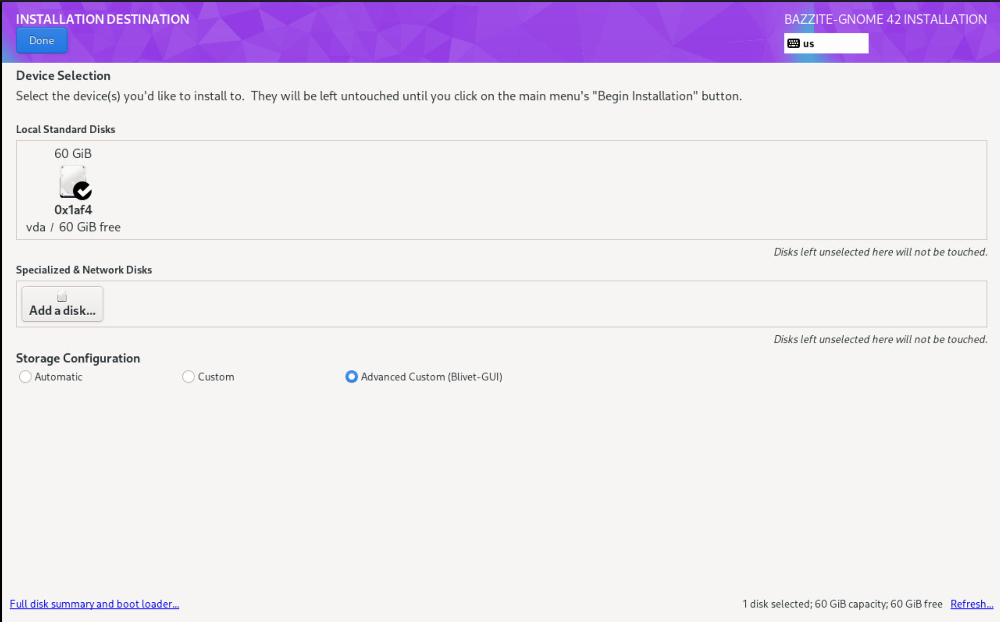
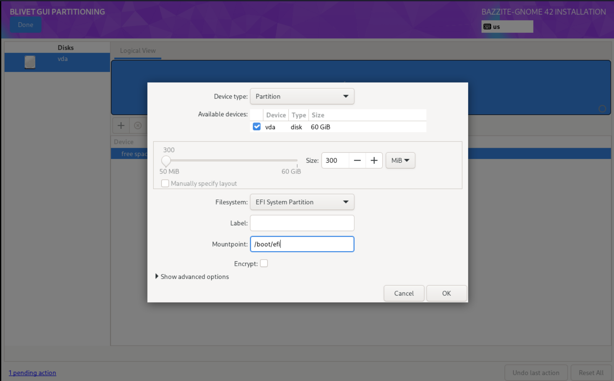
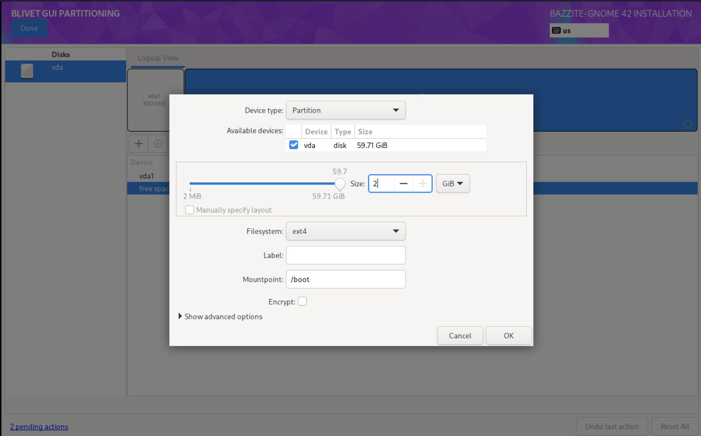
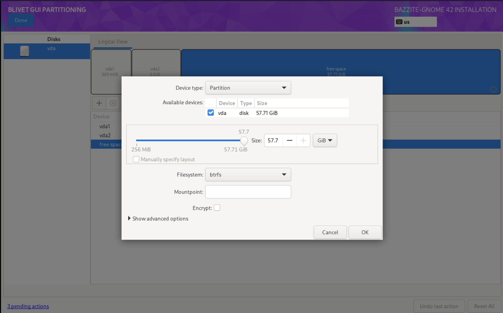
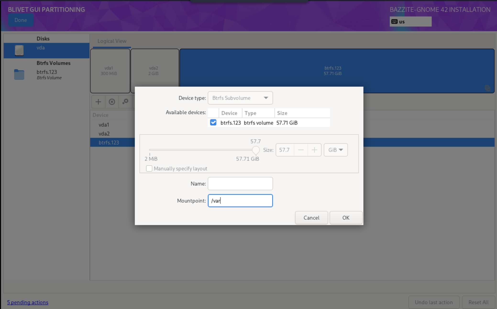
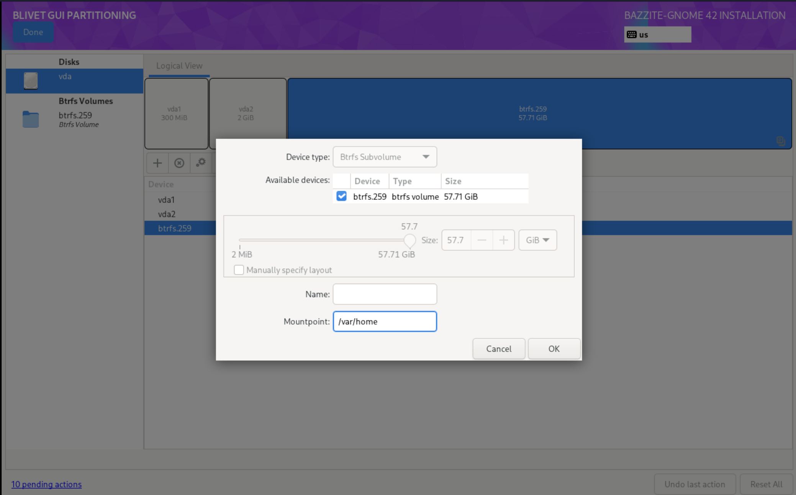

# Ruční dělení

!!! note
      
      Tato instalační příručka je pro **starší ISO** a aktualizovaná příručka pro nové ISO bude brzy k dispozici.

!!! warning "Tyto pokyny by měli používat pouze uživatelé, kteří spouštějí duální systém na stejném disku. V ostatních případech je preferováno automatické rozdělování."

!!! warning "Bazzite podporuje pouze souborový systém BTRFS pro `/`"

## Pokyny k ručnímu rozdělení

Pokud potřebujete výukové video pro ruční dělení, podívejte se na tento [návod v časovém razítku 9:10](https://www.youtube.com/watch?v=JxPsKhJGTrs&t=550s).

1. Vyberte možnost Instalace
2. Vyberte `Advanced Custom(Blivet-GUI)` v části Konfigurace úložiště.

3. Vytvořte následující oddíly a zařízení:
  - **/boot/efi**
    
    ```
    mount point: /boot/efi
    format:      EFI system partition
    size:        300MB
    ```
  - **/bota**
    
    ```
    mount point: /boot
    format:      ext4
    size:        2GB
    ```
  - **oddíl btrfs**
    
    ```
    mount point:
    format: btrfs
    size: [max]
    ```
  -**/**
    
    ```
    mount point: /
    format:      btrfs (subvolume)
    ```
  - **/var**
    
    ```
    mount point: /var
    format:      btrfs (subvolume)
    ```
  - **/var/home**
    
    ```
    mount point: /var/home
    format:      btrfs (subvolume)
    ```
4. Vyberte Hotovo
5. Vyberte Přijmout změny
6. Pokračujte v instalaci.