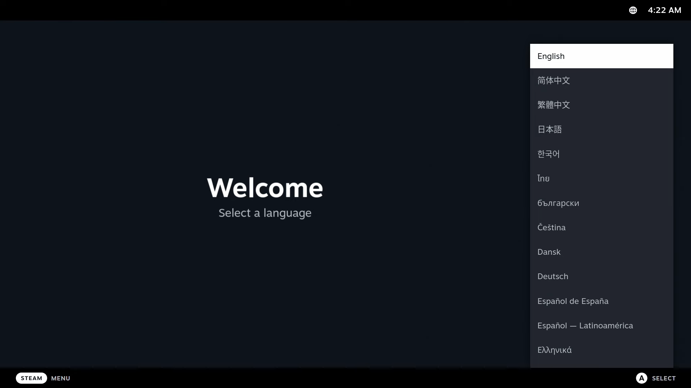
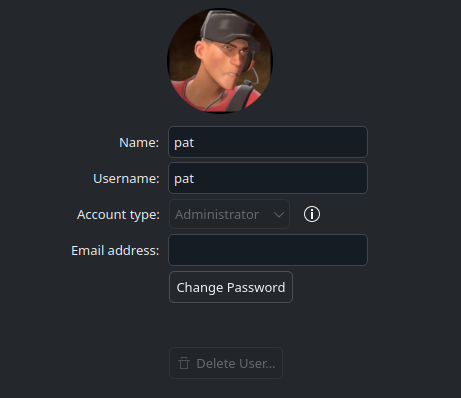
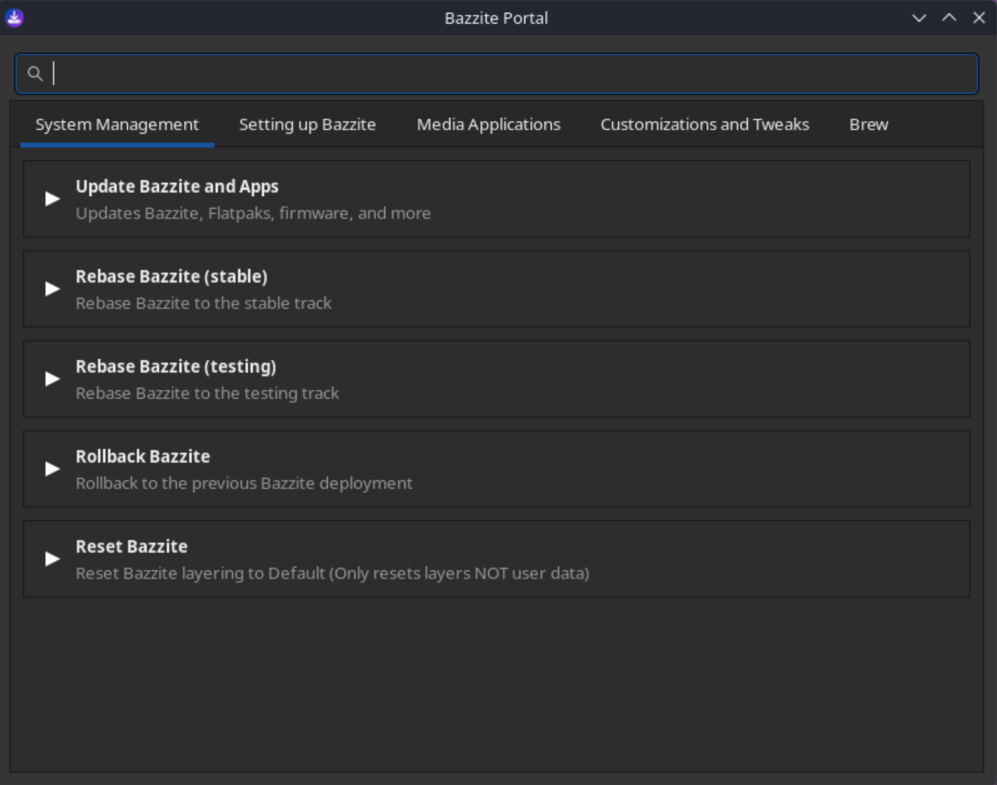

# Nastavení po instalaci

## Nastavení prvního spouštění


Při prvním spuštění se zobrazí obrazovka s aktuálním a posledním nasazením. Je důležité poznamenat, že nabídku GRUB lze použít k vrácení zpět nasazení Bazzite, pokud narazíte na problémy.

Přečtěte si o tom více v [**dokumentaci k aktualizacím, vrácení zpět a rebasingu**](../../Installing_and_Managing_Software/Updates_Rollbacks_and_Rebasing/index.md).

## Nastavení herního režimu Steam (pouze obrazy Bazzite-Deck)



Pokud jste před stažením ISO zvolili použití herního režimu Steam, budete na verzi Bazzite-Deck.  Po dokončení všech výše uvedených kroků bude vaše další spuštění v herním režimu Steam, který vyžaduje další nastavení pro Steam.

Přečtěte si [**dokumentaci Bazzite-Deck**](../../Handheld_and_HTPC_edition/index.md), kde najdete další informace o obrazech HTPC/Handheld.

## Konfigurace nastavení systému

Je důležité nakonfigurovat nastavení systému při prvním spuštění, abyste si přizpůsobili plochu, zejména pokud si všimnete, že při prvním spuštění je škálování nesprávné.  Otevřete aplikaci nastavení systému v relaci plochy a začněte konfigurovat nastavení.

### Nastavení měřítka


**_Aplikace Nastavení systému KDE Plasma_**


**_aplikace Nastavení GNOME_**

Upravte nastavení systému podle svých preferencí.

### Změna výchozího hesla
<sub> (Pokud to nebylo změněno ve starším instalačním programu ISO) </sub>



Změňte jej v nastavení režimu plochy v kategorii „Uživatel“.

## Nastavení duálního spouštění po instalaci

!!! note

    To platí pouze pro uživatele Bazzite, kteří používají duální spouštění systému Windows.

Zobrazte své instalace Windows i Bazzite v nabídce GRUB, ze které si můžete vybrat při spouštění, zadáním tohoto **příkazu do terminálu**:

```
ujust regenerate-grub
```

### Bazzite jako primární spouštěcí systém

Pokud `OS Boot Manager` nastavil `Windows Boot Manager` jako první prioritu spouštění, může to mít za následek zavádění systému přímo do Windows po instalaci namísto Bazzite. Možná to budete muset opravit v nastavení systému BIOS.

Pamatujte, že nabídka GRUB se nemusí zobrazit. V takovém případě spamujte při spouštění klávesu <kbd>↓</kbd>.

### Spusťte systém Windows ze služby Steam

Přidá skript ve službě Steam pro spuštění systému Windows.

```
ujust setup-boot-windows-steam
```

### Rozšíření velikosti úložiště ve scénáři s duálním spouštěním systému Windows

!!! note

    Toto je pro budoucí použití po chvíli duálního spouštění.

**Podívejte se na tento videonávod o tom, jak rozšířit úložiště**:

https://www.youtube.com/watch?v=uy8mi1pAj8E

<hr>

## Další kroky

### Nakonfigurujte svůj systém pomocí aplikace Bazzite Portal



Seznamte se s portálem Bazzite, který provádí údržbu systému, instaluje malou podmnožinu dalších aplikací a konfiguruje pokročilá nastavení systému.

### Nainstalujte si další software pomocí obchodu s aplikacemi Bazaar


Nainstalujte si další software pro Bazzite v obchodě s aplikacemi Bazaar.  Toto je místo, kde získáte většinu svých aplikací, ale pokud potřebujete něco, co zde nenajdete, podívejte se do [**Instalace a správa aplikací**](../../Installing_and_Managing_Software/index.md).

<hr>

## Připraveno ke hře

**Nyní jste nainstalovali Bazzite!**

Začněte hrát hraním tím, že si přečtete našeho [**Gaming Guide**](../../Gaming/index.md), který zahrnuje:

- Instalace a konfigurace **Steam** a **Proton** pro kompatibilitu her se systémem Windows
- Nastavení **Lutris** a dalších spouštěčů her (Epic Games, GOG, Amazon Games atd.)
- Správa a úprava her
- Odstraňování běžných herních problémů

Užijte si Bazzite a nezapomeňte [**nahlásit všechny chyby**](../../General/reporting_bugs.md), na které narazíte, aby mohly být pokud možno co nejdříve opraveny.