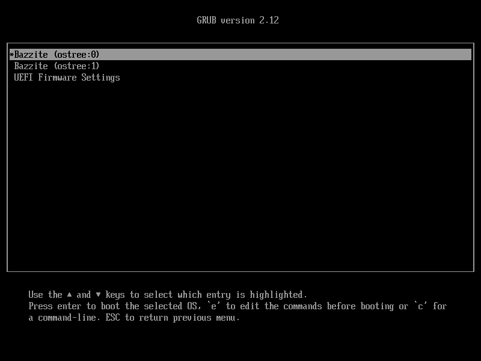
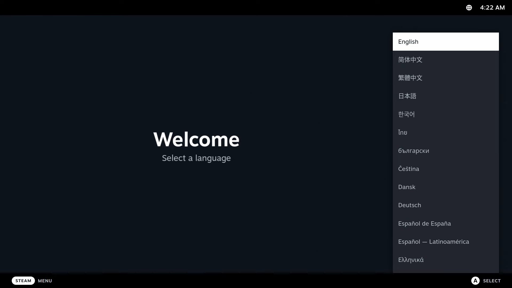
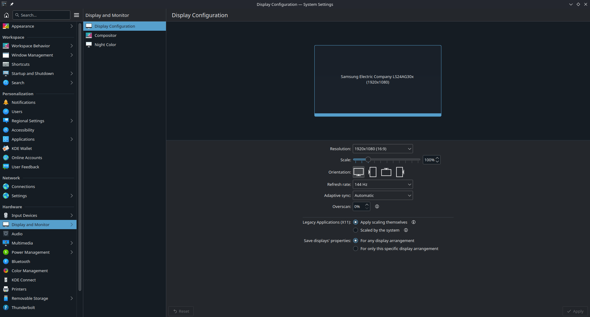
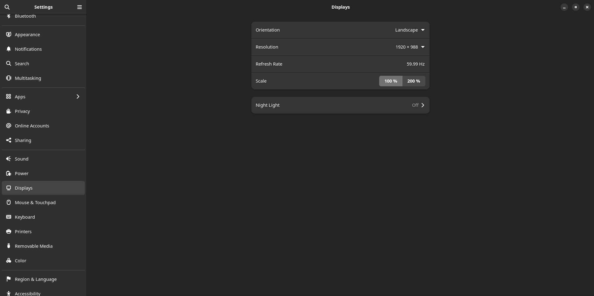
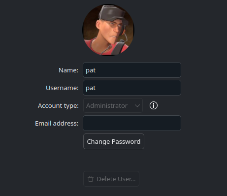
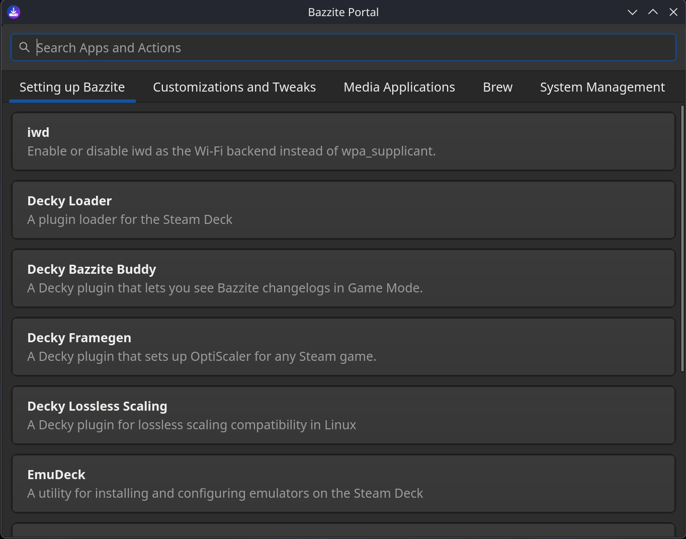

# Настройка после установки

## Настройка при первом запуске



При первом запуске появится экран с текущим и предыдущим развертываниями системы. Если возникнут проблемы, через меню GRUB можно откатить Bazzite к предыдущему развертыванию.

Подробнее об этом рассказано в разделе [**«Обновление, откат и переход на другой образ»**](../../Installing_and_Managing_Software/Updates_Rollbacks_and_Rebasing/index.md).

## Настройка игрового режима Steam (только для образов Bazzite-Deck)



Если перед скачиванием ISO вы выбрали игровой режим Steam, у вас будет установлена версия Bazzite-Deck. После выполнения всех описанных выше действий система при следующем запуске перейдет в игровой режим Steam, где потребуется дополнительно настроить Steam.

Подробнее об образах для домашних кинотеатров и портативных устройств читайте в [**документации Bazzite-Deck**](../../Handheld_and_HTPC_edition/index.md).

## Настройка параметров системы

При первом запуске настройте систему под себя. Это особенно важно, если масштаб интерфейса выбран неправильно. Откройте приложение с параметрами системы в сеансе рабочего стола и задайте нужные настройки.

### Настройка масштаба


**_Приложение «Параметры системы» в KDE Plasma_**


**_Приложение «Параметры» в GNOME_**

Настройте параметры системы по своему усмотрению.

### Изменение стандартного пароля
<sub> (Если вы не изменили его в старом установщике ISO) </sub>



Измените пароль в параметрах режима рабочего стола, в разделе «User».

## Настройка после установки при двойной загрузке

!!! note

    Этот раздел предназначен для пользователей Bazzite с двойной загрузкой Windows.

Чтобы при запуске можно было выбрать Windows или Bazzite в меню GRUB, **введите в терминале следующую команду**:

```
ujust regenerate-grub
```

### Bazzite как основная система загрузки

Если в `OS Boot Manager` для `Windows Boot Manager` установлен наивысший приоритет, после установки компьютер может загрузиться сразу в Windows, а не в Bazzite. В таком случае измените порядок загрузки в настройках BIOS.

Меню GRUB может не появиться. В этом случае во время запуска многократно нажимайте клавишу <kbd>↓</kbd>.

### Запуск Windows из Steam

Добавляет в Steam скрипт для загрузки Windows.

```
ujust setup-boot-windows-steam
```

### Увеличение размера хранилища при двойной загрузке с Windows

!!! note

    Этот раздел пригодится в будущем, когда вы некоторое время попользуетесь двойной загрузкой.

**Посмотрите видеоинструкцию по увеличению размера хранилища**:

https://www.youtube.com/watch?v=uy8mi1pAj8E

<hr>

## Что дальше

### Настройте систему с помощью приложения Bazzite Portal



Познакомьтесь с Bazzite Portal. В нем можно обслуживать систему, устанавливать некоторые дополнительные приложения и менять расширенные настройки.

### Установите дополнительные программы из магазина приложений Bazaar


Устанавливайте дополнительные программы для Bazzite из магазина приложений Bazaar. Большинство приложений можно найти здесь. Если нужного приложения нет, обратитесь к разделу [**«Установка приложений и управление ими»**](../../Installing_and_Managing_Software/index.md).

<hr>

## Все готово к играм

**Bazzite установлена!**

Начните с нашего [**руководства по играм**](../../Gaming/index.md). В нем описаны:

- установка и настройка **Steam** и **Proton** для совместимости с играми для Windows;
- настройка **Lutris** и других программ запуска игр (Epic Games, GOG, Amazon Games и прочих);
- управление играми и установка модификаций;
- устранение распространенных проблем с играми.

Пользуйтесь Bazzite и обязательно [**сообщайте обо всех обнаруженных ошибках**](../../General/reporting_bugs.md), чтобы их по возможности исправили как можно скорее.
