# Odstraňování problémů s instalací

## Stažení ISO

Pokud se přímé stahování nezdaří nebo je stahování příliš pomalé, použijte správce stahování (jako [**Motrix**](https://motrix.app/)).

## Pohony

Ujistěte se, že jste vybrali pouze vhodné jednotky, abyste předešli ztrátě dat na ostatních, a je nejlepší praxí bezpečně odebrat všechny externí jednotky, než budete pokračovat.

## Chyba „Nepodařilo se otevřít \EFI\BOOT\mmx64.efi – nenalezeno“

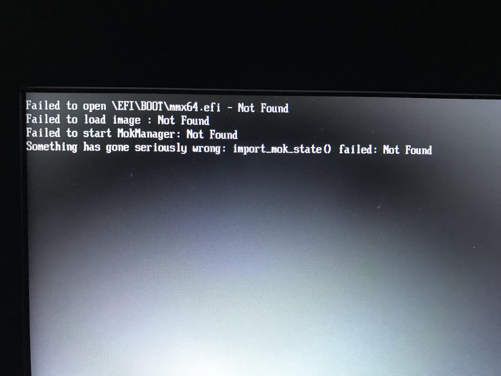

Chcete-li tento problém vyřešit, spusťte systém ze souboru. Přejděte do svého UEFI (BIOS), vyberte svůj oddíl EFI s nainstalovaným Bazzite a poté vyberte /EFI/fedora/grubx64.efi, ze kterého chcete bootovat.
Poté by se měl váš boot manager spustit normálně a zobrazit jako možnost „FEDORA“.

## Instalační program se nespustí

!!! note

Nový instalační program se nemusí spustit, pokud je váš BIOS v režimu CSM Legacy na rozdíl od UEFI. Další informace naleznete v [**systémové požadavky Bazzite**](../../Gaming/Hardware_compatibility_for_gaming.md#minimum-system-requirements).

Použijte [starší ISO](./legacy-install.md) nebo vyzkoušejte [alternativní metodu](./alternate-install-guide.md) instalace Bazzite.

## Kód chyby 1

Chyba „kód 1“ je obecný kód chyby, který se objeví během instalace, když není k dispozici konkrétnější chybová zpráva. Tato chyba se může objevit v několika scénářích, které jsme dosud identifikovali, ale může existovat více scénářů:

- **Stávající instalace Linuxu:** Pokud jste již dříve na stejný disk nainstalovali jiný Linux, může se stát, že instalační program selže při instalaci zavaděče s chybou „konfigurace zápisu zavaděče“.
  - To se může stát, i když předchozí instalace Linuxu již není funkční. Je známo, že se vyskytuje jak u **založených na Fedoře** (Fedora, Fedora Atomic, Bazzite, Nobara atd.), tak na **založených na Ubuntu** (Ubuntu, Mint, PopOS atd.).
  - **Oprava 1:** Samostatný disk: Pokud váš hardware podporuje více než 1 SSD, nainstalujte Bazzite na jiný disk, který dosud Linux neviděl.
  - **Oprava 2:** Ručně odstraňte existující Linux z EFI: [Pokyny naleznete níže.](#how-to-remove-an-orphaned-copy-of-grub)
  - **Oprava 3:** Odstraňte stávající oddíl EFI na disku: Pokud NEPlánujete duální spouštění, použijte GParted nebo Disky k odstranění stávajícího EFI.
    - **Upozornění:** Toto je **nevratné** a odstraní všechny ostatní operační systémy na disku, **včetně Windows**
  - **Oprava 4:** Vytvořte nový oddíl EFI: Chcete-li toho dosáhnout, můžete použít ruční rozdělení podle popisu v [Manual Partitioning Guide](./manual_partitioning.md) k vytvoření nového oddílu EFI vedle stávajícího.
    - Varování: některé BIOSy nedokážou zpracovat druhý oddíl EFI na disku.
- **Nesprávný systém souborů:** Použití EXT4 nebo jiného typu souborového systému pro kořenový oddíl způsobí tuto chybu. Pro kořenový oddíl musíte použít BTRFS.
- **Poškozený obraz ISO:** Výpočtem kontrolních součtů se ujistěte, že obraz ISO není poškozen.
- **Přehřívání USB Flash Drive:** Použijte USB 3.0 nebo lepší flash disk a zapojte jej do USB 3.0 nebo lepšího portu, aby nedošlo k přehřátí.

## Chyba „Na zařízení nezbývá místo“.
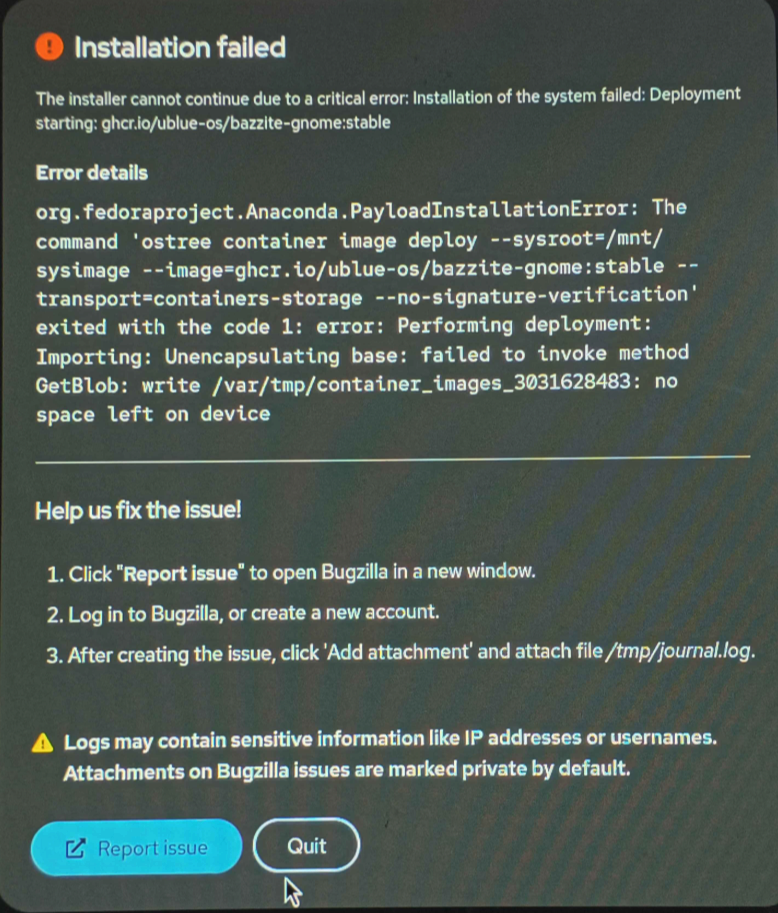

Tato chyba se může zavádějící objevit, když systém nemá dostatek paměti RAM pro fungování instalačního programu. [**K instalaci Bazzite potřebujete alespoň 8 GB systémové paměti.**](/General/Installation_Guide/Installing_Bazzite_for_Desktop_or_Laptop_Hardware.md/#minimum-system-requirements)

## Chyba "Špatný podpis shim, musíte nejprve načíst jádro".

Chcete-li se dostat přes tuto obrazovku, vypněte Secure Boot v BIOSu. Pokud chcete použít zabezpečené spouštění, postupujte podle [**Příručky bezpečného spouštění** pomocí metody B](/General/Installation_Guide/secure_boot.md).

**Video průvodce**:

https://www.youtube.com/watch?v=Z_DsWqTuipU

## Chyba „Zařízení je aktivní“.

K této chybě dochází, když instalační program narazí na šifrovaný oddíl BitLocker. Máte dvě možné možnosti:

A. **Pokud duální bootování:** Před instalací zmenšete oddíl ve Windows, dost na to, abyste měli dostatek místa pro instalaci Bazzite.
B. **Pouze Bazzite:** Před instalací odstraňte oddíl BitLocker pomocí nástroje, jako je GParted.

**Podívejte se na toto video pro ukázku**:

https://www.youtube.com/watch?v=FBGLLkIKp-w

### "Chyba při kontrole konfigurace úložiště"

**Podívejte se na toto video, kde najdete řešení**:

https://www.youtube.com/watch?v=VTnm9EiBdPA

## Chyba požadovaného schématu oddílů nelze alokovat

K této chybě dochází při instalaci na disky větší než 2 TB, kde jsou první 2 TB nebo více již obsazeny jedním nebo více oddíly. Níže uvedený obrázek znázorňuje chybovou zprávu.

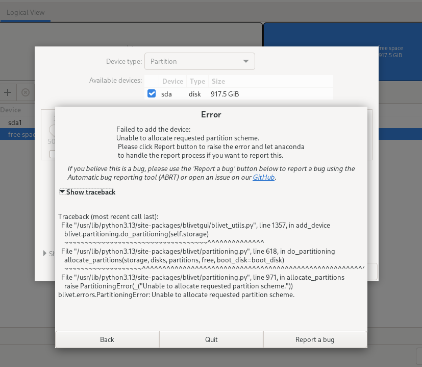

Zdá se, že instalační program Anaconda nemůže vytvořit žádné oddíly po značce 2 TB.

Zde je několik možných řešení, jak to vyřešit:

- Nainstalujte Bazzite na jiné úložné zařízení, kde Bazzite může mít celý disk.
- Pokud se systémem Windows spouštíte duální systém, zmenšete velikost oddílu Windows pod 2 TB. Pokud to Správa disků systému Windows nedokáže, zvažte použití nástroje třetí strany, jako je [EaseUS Partition Master](https://www.easeus.com/partition-master/), ke změně velikosti oddílů, když Windows neběží.
- Pokud disk neobsahuje žádná důležitá data, můžete odstranit všechny existující oddíly a restartovat instalační proces.

## Alternativní způsob instalace

!!! note

    **Alternativní způsob instalace je užitečný pro stažení menšího ISO a může vyřešit další problémy, ale také obsahuje problémy se zobrazením v instalačním programu na většině kapesních displejů**.

Pokud žádná z výše uvedených chyb není relevantní pro váš problém nebo máte stále problémy s instalací Bazzite, zkuste použít naši alternativní metodu instalace:

[**Zkuste nainstalovat Bazzite rebasingem z Fedora Kinoite (KDE Plasma) nebo Fedora Silverblue (GNOME)**](/General/Installation_Guide/alternate-install-guide.md).

## Jak odstranit osiřelou kopii GRUB
1. Spusťte instalační program Bazzite (starší instalační program nebude fungovat) a otevřete nabídku aplikací
   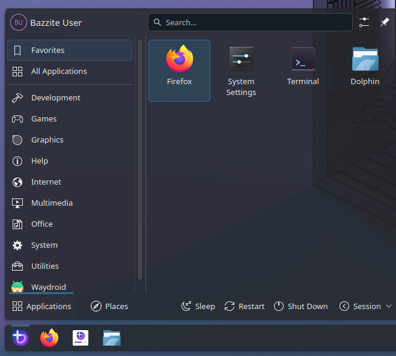
2. Napište „disk“ a otevřete aplikaci Disky
   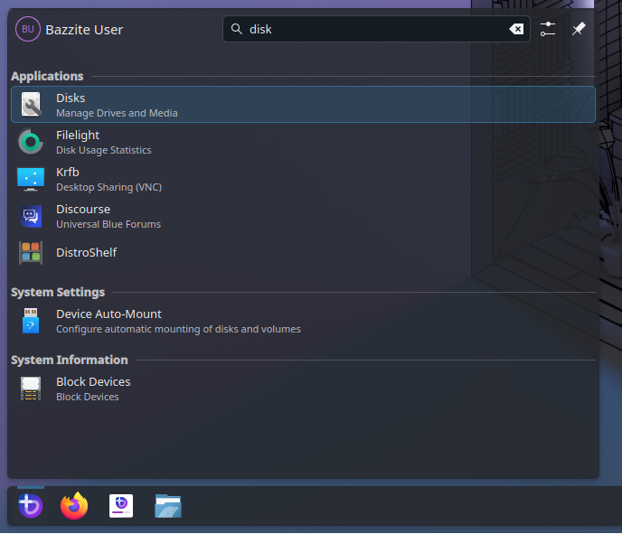
3. Vyberte jednotku, na kterou chcete Bazzite nainstalovat
   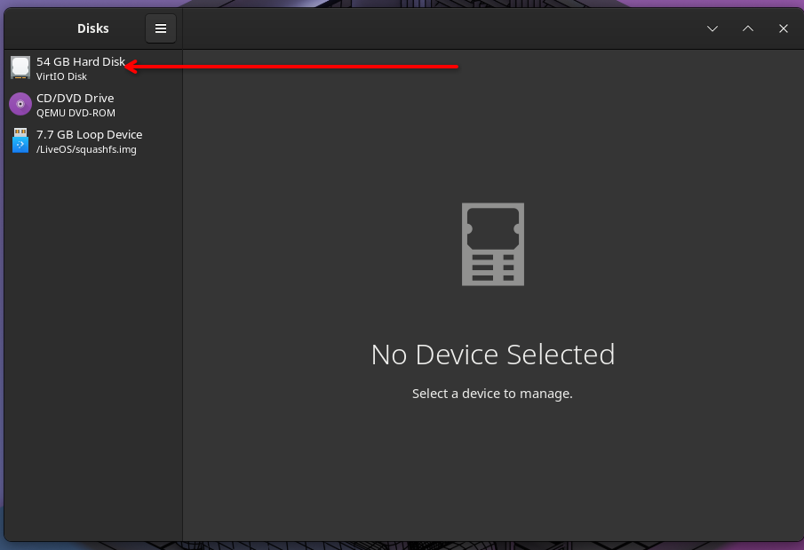
4. Identifikujte svůj oddíl EFI, bude to souborový systém typu FAT a obvykle velmi malý
   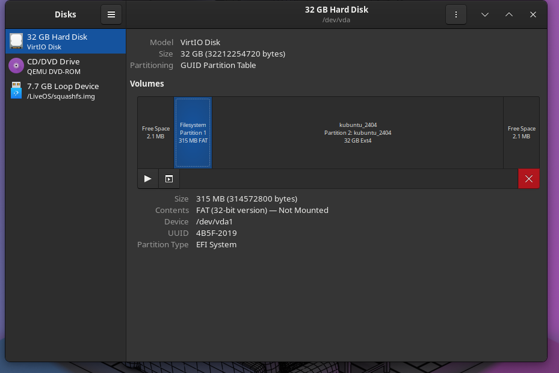
5. Připojte oddíl EFI (pokud již není připojen) kliknutím na tlačítko Přehrát
   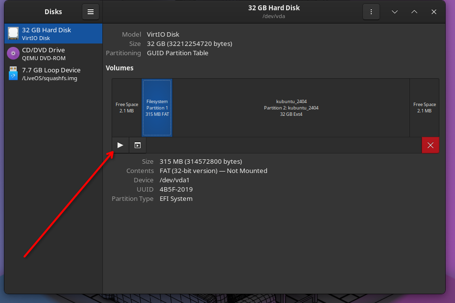
6. Klikněte na modrý nápis vedle „připevněno na“
   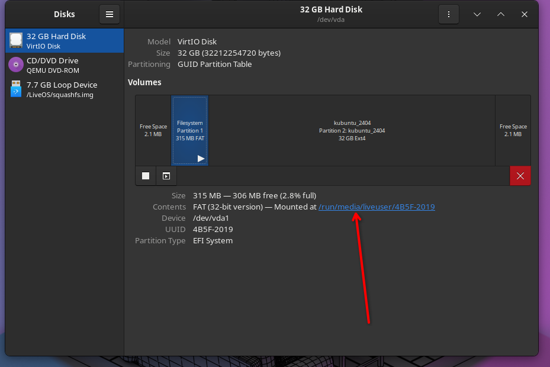
7. Poklepejte na složku EFI
   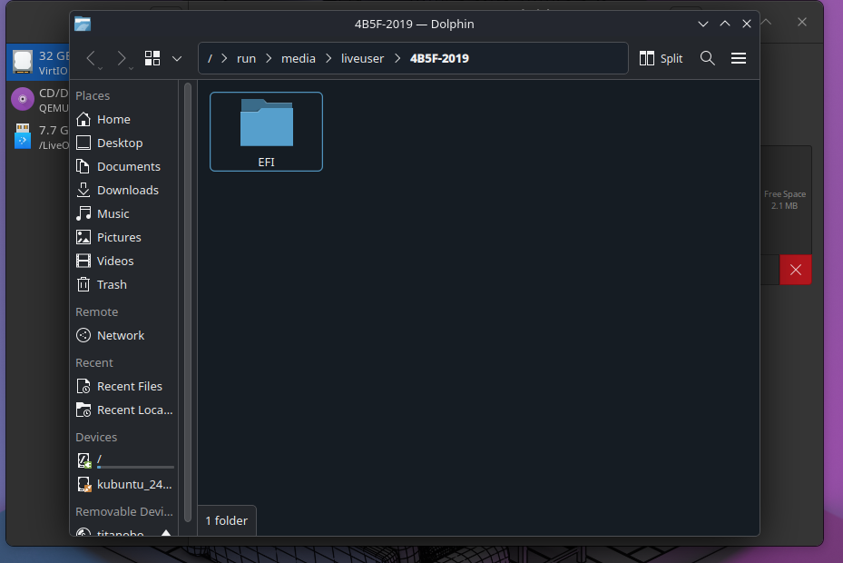
8. Identifikujte složku 'Ubuntu' nebo 'Fedora' a přesuňte ji do koše
   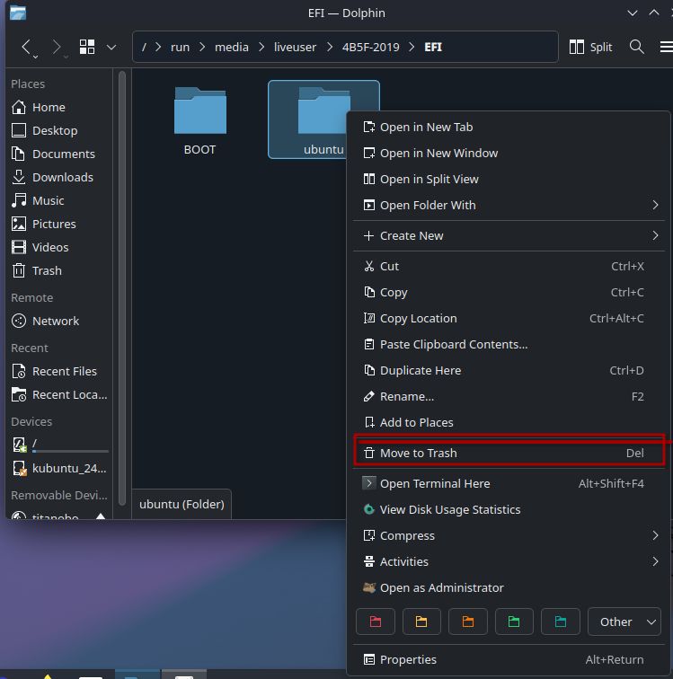
!!! warning 
    Neodstraňujte žádné další složky, jako je Boot, Dell, HP nebo Microsoft, protože systém Windows nemusí správně zavést!
9. Restartujte a znovu spusťte instalační program. Možná budete chtít odstranit oddíly, které byly vytvořeny během prvního pokusu o instalaci.
   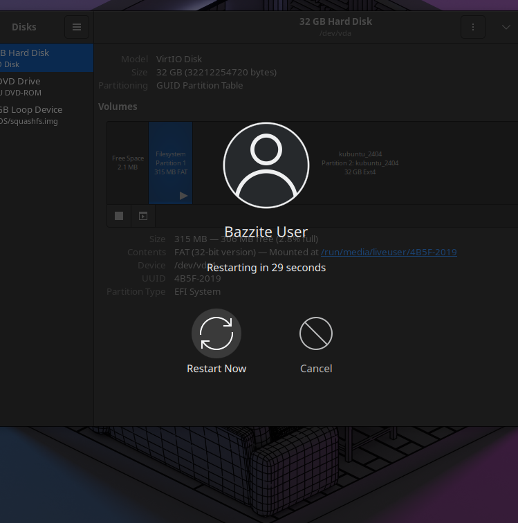