# Устранение неполадок при установке

## Загрузка ISO

Если прямая загрузка не работает или идет слишком медленно, используйте менеджер загрузок, например [**Motrix**](https://motrix.app/).

## Диски

Убедитесь, что выбраны только нужные диски, чтобы не потерять данные на остальных, и перед продолжением лучше безопасно отключить все внешние накопители.

## Ошибка "Failed to open \EFI\BOOT\mmx64.efi - Not Found"

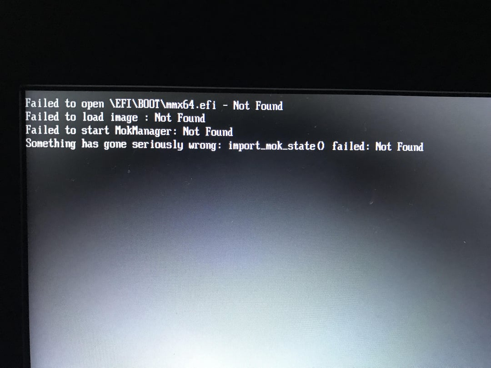

Чтобы обойти эту проблему, загружайтесь из файла. Зайдите в UEFI (BIOS), выберите раздел EFI, где установлен Bazzite, затем укажите `/EFI/fedora/grubx64.efi` для загрузки.
После этого менеджер загрузки должен стартовать как обычно, показывая в качестве варианта "FEDORA".

## Установщик не загружается

!!! note

    Новый установщик может не загрузиться, если в BIOS выбран режим CSM Legacy вместо UEFI. Подробнее см. в [**системных требованиях Bazzite**](../../Gaming/Hardware_compatibility_for_gaming.md#minimum-system-requirements).

Используйте [legacy ISO](./legacy-install.md) или попробуйте [альтернативный способ](./alternate-install-guide.md) установки Bazzite.

## Код ошибки 1

Ошибка "code 1" - это общий код ошибки, который возникает во время установки, когда нет более конкретного сообщения. Мы уже выявили несколько сценариев, в которых она может возникать, но их может быть больше:

- **Существующая установка Linux:** если вы раньше ставили на тот же диск другой Linux, установщик может упасть при установке загрузчика с ошибкой `bootloader write config`.
  - Это может случиться даже если прежняя установка Linux больше не работает. Известно, что это происходит как с дистрибутивами на базе **Fedora** (Fedora, Fedora Atomic, Bazzite, Nobara и т. д.), так и на базе **Ubuntu** (Ubuntu, Mint, PopOS и т. д.).
  - **Исправление 1:** отдельный диск. Если ваше железо поддерживает больше одного SSD, установите Bazzite на другой диск, на котором Linux раньше не было.
  - **Исправление 2:** вручную удалите существующий Linux из EFI: [инструкция ниже.](#how-to-remove-an-orphaned-copy-of-grub)
  - **Исправление 3:** удалите существующий EFI-раздел на диске. Если вы **НЕ** планируете двойную загрузку, используйте GParted или Disks, чтобы удалить существующий EFI.
    - **Предупреждение:** это **необратимо** и удалит все остальные операционные системы на диске, **включая Windows**.
  - **Исправление 4:** создайте новый EFI-раздел. Можно воспользоваться ручной разметкой, как описано в [руководстве по ручной разметке](./manual_partitioning.md), и создать новый EFI-раздел рядом с существующим.
    - Предупреждение: некоторые BIOS не умеют работать со вторым EFI-разделом на диске.
- **Неверная файловая система:** если для корневого раздела выбрать EXT4 или любую другую файловую систему, появится эта ошибка. Для корневого раздела нужно использовать BTRFS.
- **Поврежденный ISO-образ:** проверьте контрольные суммы и убедитесь, что образ не поврежден.
- **Перегрев USB-накопителя:** используйте USB-накопитель USB 3.0 или лучше и подключайте его к порту USB 3.0 или лучше, чтобы избежать перегрева.

## Ошибка "No Space left on Device"
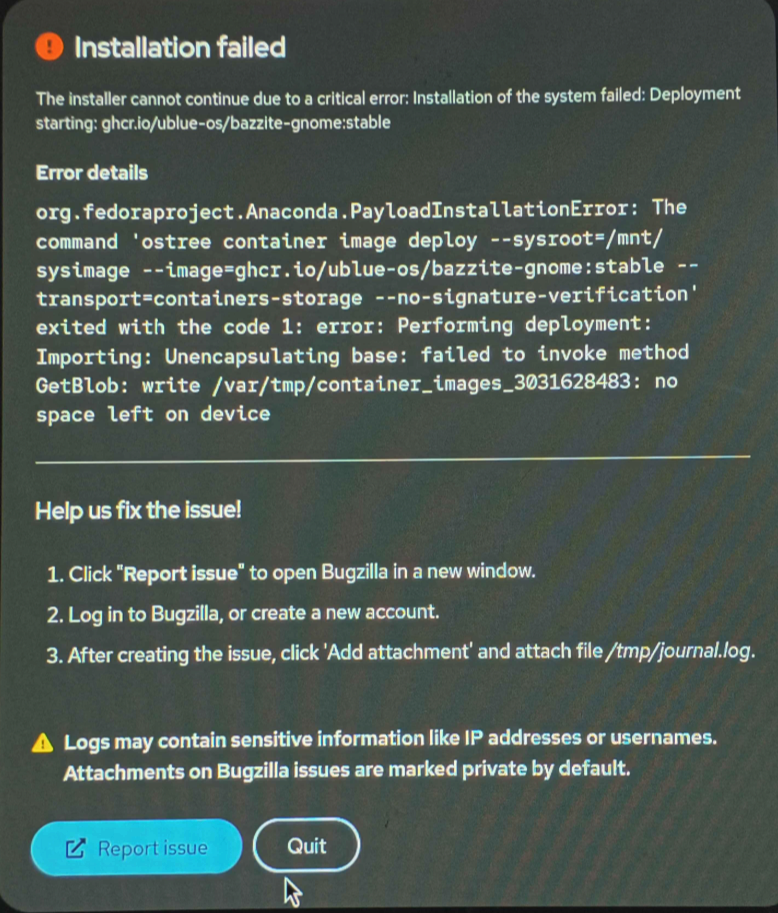

Эта ошибка может вводить в заблуждение: она возникает, когда системе не хватает оперативной памяти для работы установщика. [**Для установки Bazzite нужно как минимум 8 ГБ системной памяти.**](/General/Installation_Guide/Installing_Bazzite_for_Desktop_or_Laptop_Hardware.md#minimum-system-requirements)

## Ошибка "Bad shim signature, you need to load the kernel first"

Отключите Secure Boot в BIOS, чтобы пройти дальше. Если хотите использовать Secure Boot, следуйте [**руководству по Secure Boot, используя способ B**](/General/Installation_Guide/secure_boot.md).

**Видеоинструкция**:

https://www.youtube.com/watch?v=Z_DsWqTuipU

## Ошибка "Device is Active"

Эта ошибка возникает, когда установщик сталкивается с разделом, зашифрованным BitLocker. У вас есть два варианта:

A. **При двойной загрузке:** уменьшите раздел в Windows перед установкой так, чтобы осталось достаточно места для Bazzite.
B. **Только Bazzite:** удалите раздел BitLocker с помощью инструмента вроде GParted перед установкой.

**Посмотрите это видео с примером**:

https://www.youtube.com/watch?v=FBGLLkIKp-w

### "Error checking storage configuration"

**Посмотрите это видео с обходным решением**:

https://www.youtube.com/watch?v=VTnm9EiBdPA

## Ошибка Unable to allocate requested partition scheme

Эта ошибка возникает при установке на диски больше 2 ТБ, если первые 2 ТБ или больше уже заняты одним или несколькими разделами. На изображении ниже показано сообщение об ошибке.

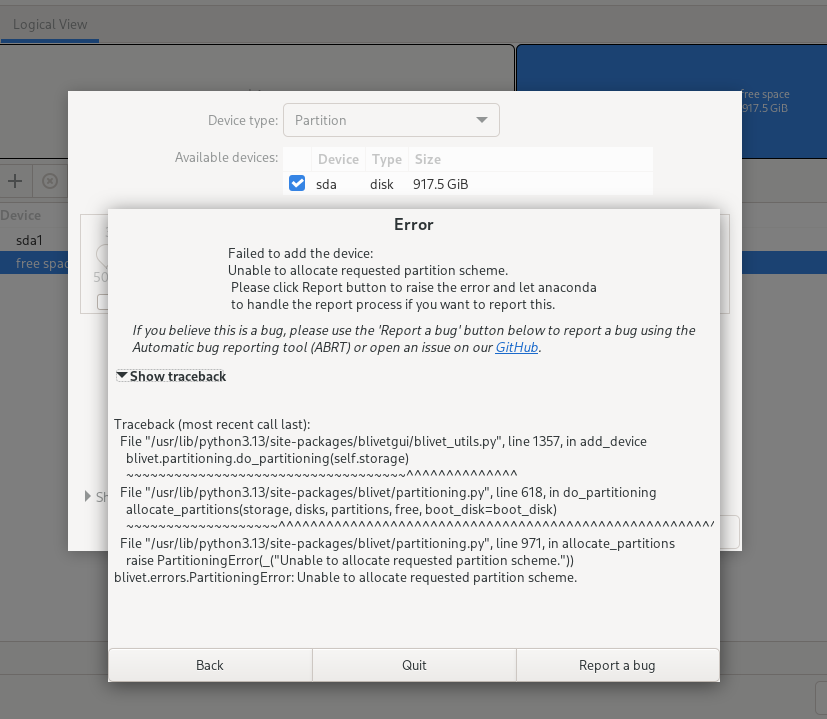

Похоже, установщик Anaconda не может создавать разделы после отметки 2 ТБ.

Вот несколько возможных способов решить проблему:

- Установите Bazzite на другой накопитель, где ему будет доступен весь диск.
- Если у вас двойная загрузка с Windows, уменьшите размер раздела Windows до менее чем 2 ТБ. Если стандартное управление дисками Windows не позволяет это сделать, попробуйте сторонний инструмент, например [EaseUS Partition Master](https://www.easeus.com/partition-master/), чтобы изменить размер разделов, пока Windows не запущена.
- Если на диске нет важных данных, можно удалить все существующие разделы и начать установку заново.

## Альтернативный способ установки

!!! note

    **Альтернативный способ установки полезен, если нужен ISO меньшего размера, и он может решить другие проблемы, но на большинстве портативных экранов в установщике есть проблемы с отображением**.

Если ни одна из ошибок выше не подходит к вашей ситуации или проблемы с установкой Bazzite все еще остаются, попробуйте наш альтернативный способ установки:

[**Попробуйте установить Bazzite, перейдя на другой образ с Fedora Kinoite (KDE Plasma) или Fedora Silverblue (GNOME)**](/General/Installation_Guide/alternate-install-guide.md).

## Как удалить осиротевшую копию GRUB
1. Загрузитесь в установщик Bazzite (Legacy Installer для этого не подойдет) и откройте меню приложений
   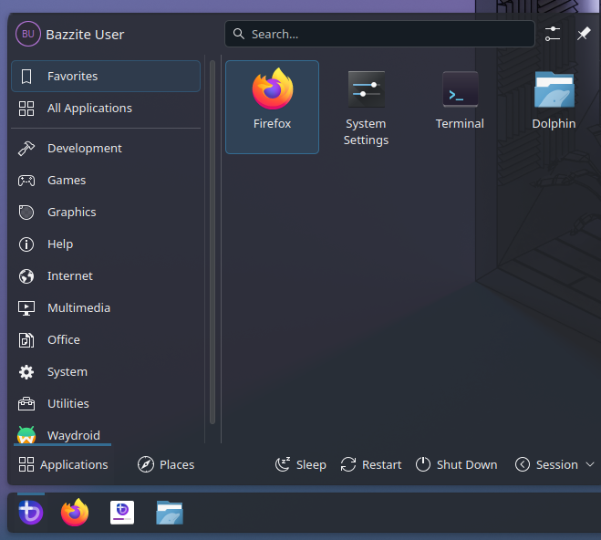
2. Введите `disk` и откройте приложение Disks
   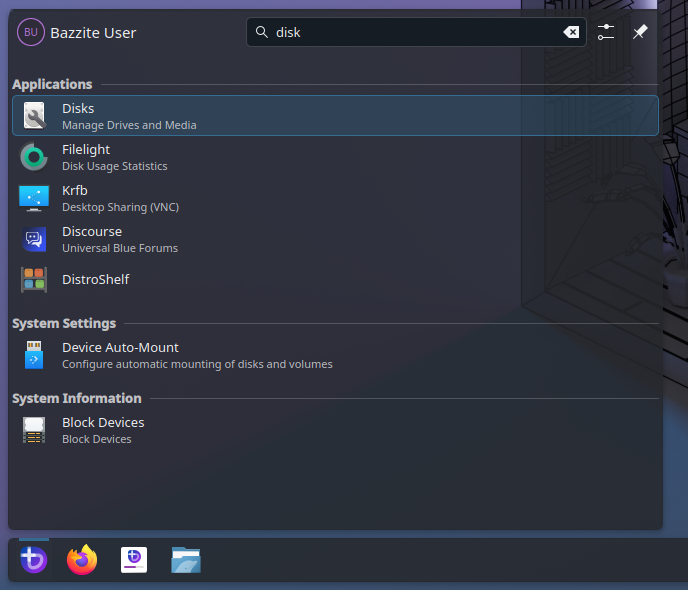
3. Выберите диск, на который хотите установить Bazzite
   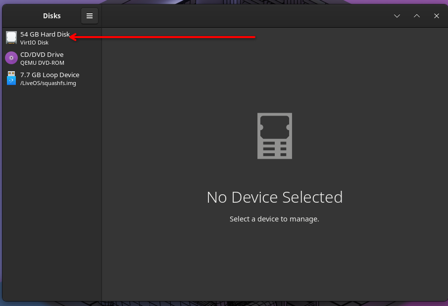
4. Найдите раздел EFI. Обычно у него файловая система FAT и он очень маленький
   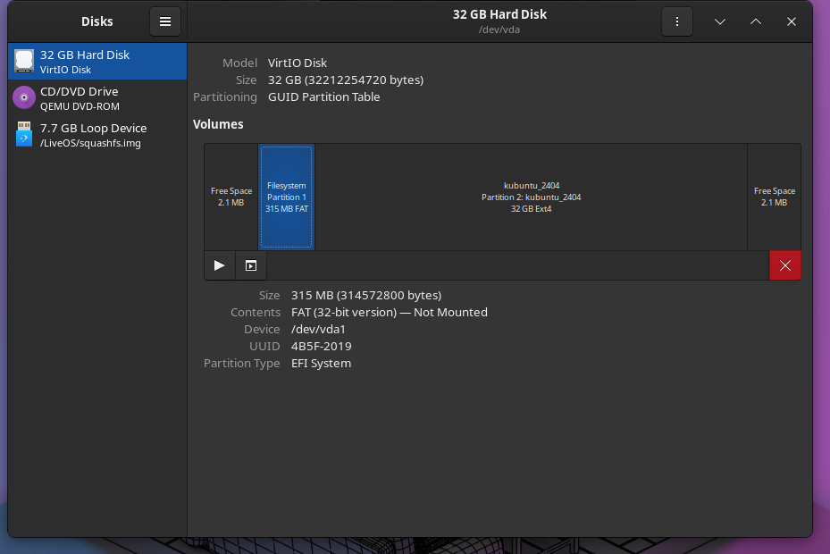
5. Смонтируйте раздел EFI, если он еще не смонтирован, нажав кнопку воспроизведения
   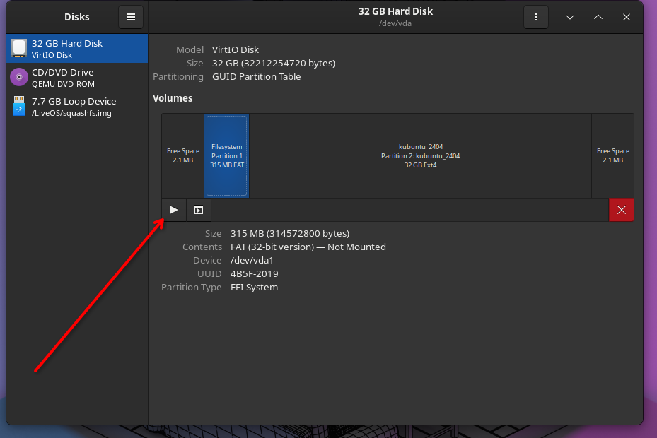
6. Нажмите на синюю надпись рядом с `mounted at`
   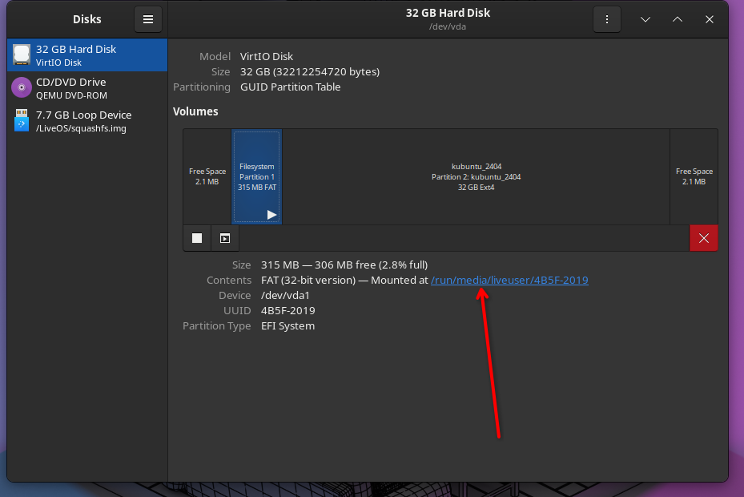
7. Дважды щелкните по папке EFI
   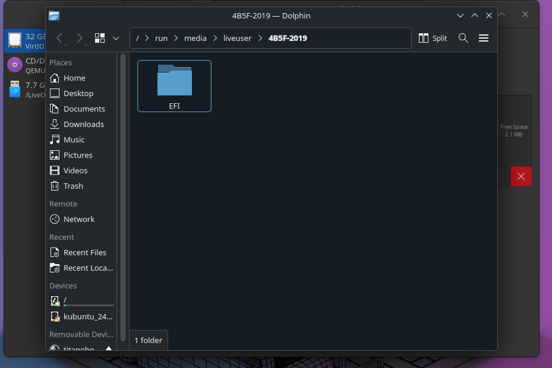
8. Найдите папку `Ubuntu` или `Fedora` и переместите ее в корзину
   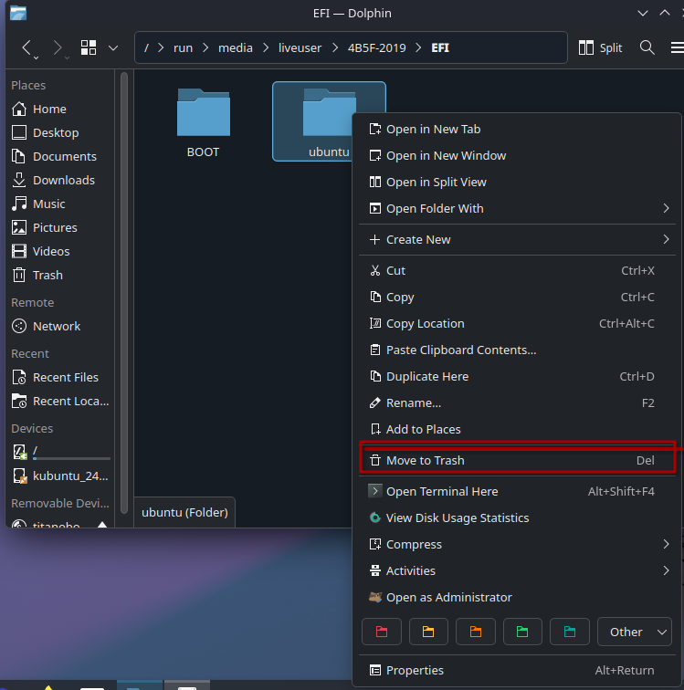
!!! warning
    Не удаляйте никакие другие папки, такие как Boot, Dell, HP или Microsoft, иначе Windows может перестать загружаться!
9. Перезагрузитесь и снова запустите установщик. Возможно, стоит удалить разделы, которые были созданы во время первой попытки установки.
   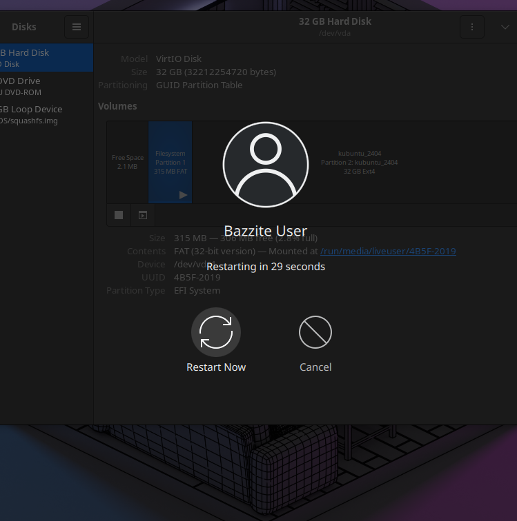
