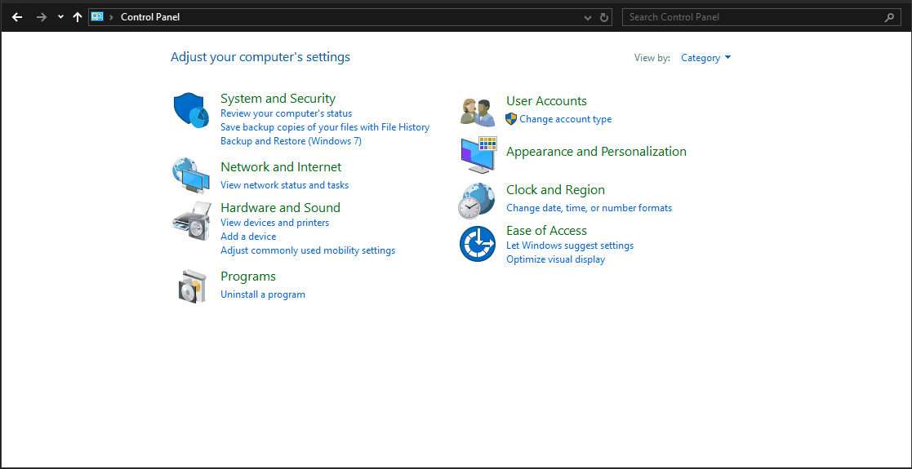

# Běžné problémy a řešení

## Režim Steam Big Picture je pomalý

**Problém:** Když vyberete **Nabídka Steam >> Zobrazit >> Big Picture**, uživatelské rozhraní může fungovat pomalu. Nicméně hry, které běží přes rozhraní, fungují hladce.

**Řešení:** Úplně zavřete Steam a spusťte Steam pomocí zástupce nabídky **Režim velkého obrazu Steam**. Také se ujistěte, že je v nastavení Steamu povoleno **Nastavení Steamu >> Rozhraní >> Povolit GPU akcelerované vykreslování ve webových zobrazeních (vyžaduje restart)**.

>**Poznámka**: Tato oprava se také zabývá problémy s výkonem v herním režimu Steamu a problémy GPU Nvidia, má to však nevýhodu, že Steam a postranní nabídka se někdy nevykreslují správně.

## Zvuk je na hardwaru ASUS ROG Ally měkký

**Problém:** Zvuk je tichý i při maximální hlasitosti.

**Řešení:** Na Rog Ally se objevují dvě zvuková zařízení:
- **Rodinný 17h/19h/1ah HD audio ovladač**
- **ROG Ally**

Oba vzájemně ovlivňují hlasitost zvuku, takže musí mít stejnou úroveň hlasitosti.

## Gamepady a ruční joysticky nefungují v režimu Desktop

**Problém:** Gamepady a joysticky kapesních zařízení nefungují v režimu plochy, takže musíte použít dotykovou obrazovku nebo připojit externí myš.

Otevřete **Nastavení Steamu >> Ovladač >> Rozvržení jiného než herního ovladače >> Rozvržení plochy**. Klikněte na **Upravit** Poté **Povolit vstup Steam** a nakonfigurujte, jak ovladač potřebuje jako klávesnici a myš v režimu plochy.

!!! tip "Často budete muset snížit **Citlivost pravého joysticku** někde mezi 50-80 %. Jinak bude kurzor myši příliš rychlý a nebude spolehlivý."

## Nastavení automatického přihlášení v desktopové edici Bazzite

**Problém:** Jak nakonfigurujete automatické přihlášení v Bazzite?

<h3>Nastavení rozlišení v KDE Plasma</h3>

Otevřete **Nastavení systému >> Barvy a motivy >> Přihlašovací obrazovka (SDDM)**, poté na pravé straně obrazovky bude tlačítko označené **Chování**, klikněte na něj.

Nyní zaškrtněte **"Automaticky přihlásit"**, vyberte svého uživatele a pro relaci vyberte **"Plasma (Wayland)"** a nezapomeňte kliknout na tlačítko **"Použít"**.

<h3>Automatické přihlášení v GNOME</h3>

Otevřete aplikaci **Nastavení >> Uživatelé**. Klikněte na tlačítko **Odemknout** v pravém horním rohu. Poté zapněte **Automatické přihlášení**.

## Nastavení staršího hardwaru HTPC

**Problém:** Jak nastavíte podobnou verzi jako Bazzite-Deck pomocí hardwaru GPU, který je považován za „starší“ a není podporován pro herní režim Steam?

**Řešení:** Povolte automatické přihlašování a nastavte Steam tak, aby se automaticky spouštěl v režimu Big Picture na Steamu pro slušný herní zážitek z gauče, pokud máte starší hardware.

Existuje video průvodce, který můžete sledovat pro obraz GNOME Desktop Bazzite pomocí GPU Nvidia (předtím, než hardware Nvidia mohl spustit režim hry Steam, ale stejný nápad):

https://www.youtube.com/watch?v=F9l-RQvCPMo

Pokud používáte obraz KDE Plasma od Bazzite, můžete přeskočit část „Přizpůsobení GNOME, aby prostředí uživatelům z Windows více připomínalo domov“ a pomocí výše uvedených kroků zprovoznit automatické přihlašování v Bazzite KDE. Poté nakonec nastavte režim Steam Big Picture na automatické spuštění v **Nastavení >> Autostart**.

## Žádné Wi-Fi nebo kabelové připojení v Bazzite při duálním spouštění systému Windows

**Problém:** Spouštíte duální spouštění systému Windows pomocí Bazzite a vaše Wi-Fi/kabelové připojení funguje ve Windows, ale někdy selže v Bazzite.

**Řešení:** Rychlé spuštění je funkce systému Windows, která uvádí váš počítač do hybridního stavu mezi vypnutím a režimem spánku, aby se zkrátila doba potřebná ke spuštění systému Windows. Toto nastavení však může uzamknout hardwarová zařízení, jako je vaše Wi-Fi, ethernet a možná i další hardware.  Jedním z řešení je vybrat možnost Restartovat místo možnosti Vypnout, což provede úplný cyklus napájení. Lepším řešením je však rychlé spuštění jednoduše zakázat.

Můžete to udělat takto:

- Otevřete **Ovládací panely**
- Klikněte na **Hardware a zvuk**
- Klikněte na **Změnit činnost tlačítek napájení**, která se nachází v části Možnosti napájení
- Klikněte na **Změnit nastavení, která jsou momentálně nedostupná**
- Zrušte zaškrtnutí **Zapnout rychlé spuštění (doporučeno)**
- (Volitelné) Zrušte také zaškrtnutí **Hibernace**, pokud ji nepoužíváte, protože může způsobit stejné problémy jako rychlé spuštění
- Klikněte na **Uložit změny**



Pokud nyní vyberete možnost Vypnout, systém Windows se úplně vypne a nebude zasahovat do Bazzite.

## Wi-Fi je pomalé / Wi-Fi prodlévá špičky

**Problém:** Výkon vašeho Wi-Fi je mnohem pomalejší, než se očekávalo, nebo má špičky zpoždění, což narušuje hlasový chat a online hry. Problém se nevyskytuje ve Windows.

**Řešení:** Zdá se, že funkce úspory energie Wi-Fi v Linuxu na některých zařízeních nefunguje správně.  Otevřete terminál a spusťte `ip link show`, zobrazí se seznam všech vašich síťových zařízení a výstup by měl vypadat nějak takto:

```
1: lo: <LOOPBACK,UP,LOWER_UP> mtu 65536 qdisc noqueue state UNKNOWN mode DEFAULT group default qlen 1000
    link/loopback 00:00:00:00:00:00 brd 00:00:00:00:00:00
2: wlp6s0: <BROADCAST,MULTICAST,UP,LOWER_UP> mtu 1500 qdisc noqueue state UP mode DORMANT group default qlen 1000
    link/ether 00:00:00:00:00:00 brd ff:ff:ff:ff:ff:ff permaddr 00:00:00:00:00:00
```

Zařízení, které nás zajímá, je zařízení Wi-Fi. V tomto příkladu (můj ROG Ally) se síť Wi-Fi nazývá `wlp6s0`.
Dalším běžným názvem pro síť Wi-Fi je `wlan0`.

Dále spusťte `iw wlp6s0 get power_save` (pokud se název vašeho zařízení liší, změňte `wlp6s0`), abyste potvrdili, zda je zapnutá úspora energie:
```
Power save: on
```

Existují různé kroky k vyřešení tohoto problému v závislosti na tom, zda jste zakázali **iwd**. Pokud jste aktualizovali nebo nainstalovali Bazzite po [1. lednu 2026](https://universal-blue.discourse.group/t/bazzite-spring-cleaning-in-december-update/), bude **iwd** nastaveno jako výchozí WiFi backend.
!!! info "Z důvodů výkonu a kvůli opravě určitých problémů souvisejících se streamováním [`iwd`](https://wiki.archlinux.org/title/Iwd) nahradil [`wpa_supplicant`](https://wiki.archlinux.org/title/Wpa_supplicant) jako výchozí WiFi backend pro Bazzite od roku 2026. Pro přepnutí zpět spusťte `ujust toggle-iwd`. Přepnutí **odstraní** všechny konfigurace sítě."

=== "iwd (iwd je zapnuto)"

    Chystáme se nakonfigurovat iwd tak, aby nepoužíval funkci úspory energie pro všechna zařízení Wi-Fi. Otevřete terminál a spusťte

    ```bash
    printf "[DriverQuirks]\nPowerSaveDisable = *" | sudo tee /etc/iwd/main.conf
    systemctl restart iwd
    ```

    Dále spusťte `iw wlp6s0 get power_save` a potvrďte, že je úsporný režim vypnutý:
    ```
    Power save: off
    ```

    Pamatujte, že tato oprava může negativně ovlivnit životnost baterie vašeho notebooku nebo kapesního počítače. Pokud si přejete tuto změnu vrátit, stačí smazat konfigurační soubor:
    ```bash
    sudo rm /etc/iwd/main.conf
    systemctl restart iwd
    ```

=== "wpa_supplicant (iwd je VYPNUTO)"

    Chystáme se nakonfigurovat NetworkManager tak, aby nepoužíval funkci úspory energie pro všechna zařízení Wi-Fi. Otevřete terminál a spusťte

    ```bash
    printf "[connection]\nwifi.powersave = 2" | sudo tee /etc/NetworkManager/conf.d/wifi-powersave-off.conf
    systemctl restart NetworkManager
    ```

    Dále spusťte `iw wlp6s0 get power_save` a potvrďte, že je úsporný režim vypnutý:
    ```
    Power save: off
    ```

    Pamatujte, že tato oprava může negativně ovlivnit životnost baterie vašeho notebooku nebo kapesního počítače. Pokud si přejete tuto změnu vrátit, stačí smazat konfigurační soubor:
    ```bash
    sudo rm /etc/NetworkManager/conf.d/wifi-powersave-off.conf
    systemctl restart NetworkManager
    ```

<hr>

## Chyba při připojování k Wi-Fi: "Nepodařilo se přidat nové připojení: připojení 802.1x musí mít zřizovací soubory IWD"

!!! info "Z důvodů výkonu a kvůli opravě určitých problémů souvisejících se streamováním [`iwd`](https://wiki.archlinux.org/title/Iwd) nahradil [`wpa_supplicant`](https://wiki.archlinux.org/title/Wpa_supplicant) jako výchozí WiFi backend pro Bazzite od roku 2026. Pro přepnutí zpět spusťte `ujust toggle-iwd`. Přepnutí **odstraní** všechny konfigurace sítě."

NetworkManager nemůže automaticky generovat připojení 802.1x při použití backendu `iwd`.

Pokud chcete dál používat backend `iwd` a chcete se pouze připojit k `eduroam`, postupujte takto:

```bash
sudo nano /var/lib/iwd/eduroam.8021x
```

Poté přidejte následující:

```bash
[Security]
EAP-Method=PEAP
EAP-Identity=anonymous@<university.domain>
EAP-PEAP-Phase2-Method=MSCHAPV2
EAP-PEAP-Phase2-Identity=<username@university.domain>
EAP-PEAP-Phase2-Password=<password>

[Settings]
AutoConnect=true
```

Ujistěte se, že jste nahradili `<university.domain>`, `<username@university.domain>` a `<password>` správnými přihlašovacími údaji. Poté stiskněte `Ctrl+X` a `Y` pro uložení a ukončení.

Nyní se zkuste znovu připojit. Pokud se stále nemůžete připojit, proveďte:

```bash
nmcli connection modify eduroam 802-1x.phase1-auth-flags 32
```

A zkuste se znovu připojit.

Pokud stále dochází k problémům s Wi-Fi, zkuste se vrátit k backendu `wpa_supplicant` nebo se obraťte na podporu na https://discord.bazzite.gg.

<hr>

## Chyba při připojování k Wi-Fi: „Konfigurace IP nebyla k dispozici“ při připojování k bezdrátovým sítím 802.1x

!!! info "Z důvodů výkonu a kvůli opravě určitých problémů souvisejících se streamováním [`iwd`](https://wiki.archlinux.org/title/Iwd) nahradil [`wpa_supplicant`](https://wiki.archlinux.org/title/Wpa_supplicant) jako výchozí WiFi backend pro Bazzite od roku 2026. Pro přepnutí zpět spusťte `ujust toggle-iwd`. Přepnutí **odstraní** všechny konfigurace sítě."

Zkontrolujte systémové protokoly pomocí `ujust logs-this-boot | grep NetworkManager`, měli byste to vidět 

```
NetworkManager[1563]: <info>  [1770094603.8488] device (wlan0): state change: failed -> disconnected (reason 'none', managed-type: 'full')
NetworkManager[1563]: <info>  [1770094603.8568] dhcp4 (wlan0): canceled DHCP transaction
NetworkManager[1563]: <info>  [1770094603.8569] dhcp4 (wlan0): activation: beginning transaction (timeout in 45 seconds)
NetworkManager[1563]: <info>  [1770094603.8569] dhcp4 (wlan0): state changed no lease
```

Při použití backendu `iwd` nemusí být NetworkManager schopen získat pronájem DHCP v podnikové síti, pokud jste se k ní dříve připojili na jiném backendu nebo jiném OS. 

Pokud chcete dál používat backend `iwd`, postupujte takto:

```bash
sudo mkdir -p /etc/iwd/
sudo nano /etc/iwd/main.conf
```

Poté přidejte následující:

```ini
[General]
AddressRandomization=network
```

Poté stiskněte `Ctrl+X` a `Y` pro uložení a ukončení a poté znovu načtěte `iwd` spuštěním:

```bash
systemctl daemon-reload
systemctl restart iwd
```

Měli byste být schopni se připojit k podnikové síti.
Pokud stále dochází k problémům s Wi-Fi, zkuste se vrátit k backendu `wpa_supplicant` nebo se obraťte na podporu na https://discord.bazzite.gg.

<hr>

## GPU Nvidia Optimus nebyl detekován na přenosných počítačích

**Problém:** Pokud používáte Bazzite na notebooku s GPU Nvidia Optimus, můžete si všimnout, že hry běží špatně a zdá se, že běží na integrovaném GPU.

**Řešení:** Musíte povolit supergfxctl, který se při spouštění her automaticky přepne na diskrétní GPU Nvidia. Otevřete terminál a spusťte:

```bash
ujust enable-supergfxctl
```

<hr>

## Probuzení ze spánku nefunguje se základní deskou Gigabyte b550

**Problém:** Jakmile se základní deska Gigabyte b550 pozastaví, správně se neobnoví a displej zůstane černý až do restartu.

**Řešení:** To lze vyřešit deaktivací probuzení GPP0 a GPP8. Pro přepnutí této opravy je k dispozici skrytý příkaz ujust:
```bash
ujust _toggle-gigabyte-wake-fix
```
<hr>

## Okna Steam jsou vždy nahoře, chybí na hlavním panelu nebo je nelze přetáhnout

**Problém:** Okna Steam zůstávají nad všemi ostatními okny, nezobrazují se na hlavním panelu (pouze v systémové liště) a nelze je přetáhnout kliknutím na tělo okna.

**Příčina:** Pravidlo okna KWin nazvané „Nastavení okna pro klávesnici Steam“ automaticky vytvoří Bazzite při každém spuštění služby Steam. Odpovídá `steamwebhelper steam` a síly:

- Ponechat nad ostatními okny → Ano
- Přeskočit hlavní panel → Ano
- Přijmout zaměření → Ne

**Řešení:** Otevřete **Nastavení systému >> Správa oken >> Pravidla oken** a deaktivujte pravidlo s názvem „Nastavení okna pro klávesnici Steam“.

!!! warning "Smazání pravidla nebude fungovat trvale, protože Bazzite je znovu vytvoří při každém spuštění Steamu. Místo toho jej musíte **zakázat**."

<hr>

## Ovladač Xbox přes Bluetooth je zaseknutý na spojovací smyčce a tlačítko Xbox stále bliká

**Problém:** Váš ovladač nemá nejnovější firmware.

**Řešení:** Nejjednodušším řešením je připojení ovladače k ​​počítači se systémem Windows. Stáhněte si aplikaci Xbox Accessories a aktualizujte ovladač na nejnovější firmware. Poté by se měl ovladač bez problémů připojit. Pokročilejší uživatel by mohl otočit virtuální počítač s Windows a projít řadičem, aby tam provedl aktualizaci firmwaru.