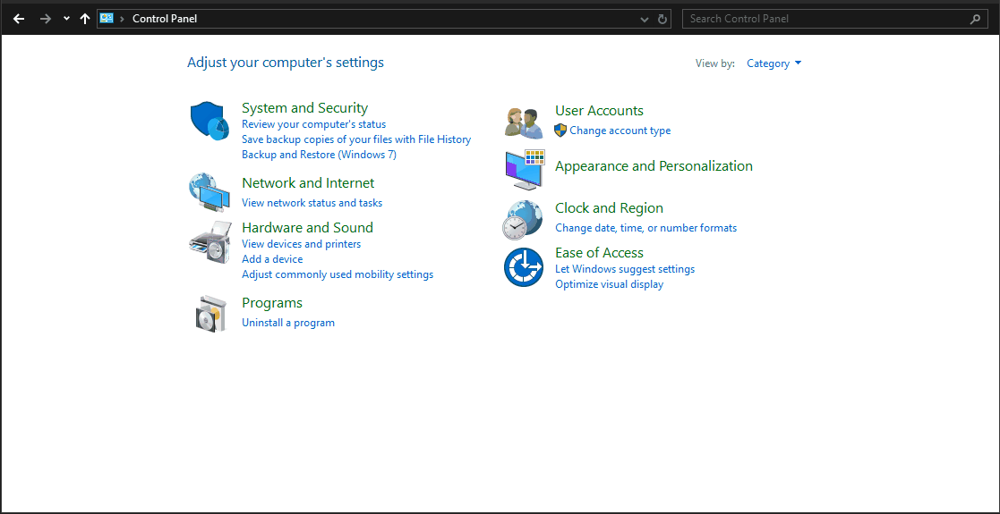

# Частые проблемы и решения

## Steam Big Picture Mode работает медленно { #steam-big-picture-mode-is-slow }

Когда вы выбираете **Steam Menu → View → Big Picture**, интерфейс работает медленно, хотя игры, запущенные через него, работают плавно.

Если вы столкнулись с этой проблемой, полностью закройте Steam и запустите Steam через ярлык меню **Steam Big Picture Mode**. Также убедитесь, что в настройках Steam включен параметр **Steam Settings → Interface → Enable GPU accelerated rendering in web views (requires restart)**.

>**Примечание**: это исправление также решает проблемы с производительностью в Steam Gaming Mode на GPU Nvidia, но у него есть недостаток: меню Steam и боковое меню иногда отображаются некорректно.

<hr>

## Тихий звук на ASUS ROG Ally { #audio-is-soft-on-asus-rog-ally-hardware }

На Rog Ally отображаются два аудиоустройства:

-   **Family 17h/19h/1ah HD Audio Controller**
-   **ROG Ally**

Оба влияют на громкость друг друга, поэтому их нужно выставить на один и тот же уровень.

<hr>

## Геймпады и джойстики портативных устройств не работают в Desktop Mode { #gamepads-and-handheld-joysticks-dont-work-in-desktop-mode }

Откройте **Steam Settings → Controller → Non-Game Controller Layouts → Desktop Layout**. Нажмите **Edit** → **Enable Steam Input** и настройте, как контроллер должен работать в роли клавиатуры и мыши в Desktop Mode.

!!! Tip "Обычно **Right Joystick Sensitivity** нужно уменьшить примерно до 50-80%. Иначе курсор мыши будет слишком быстрым и неудобным."

!!! Notice "В KDE Plasma 6.7 появилась функция управления рабочим столом с помощью контроллера. Она конфликтует с описанной выше эмуляцией Steam, поэтому отключите ее. Или, наоборот, отключите эмуляцию Steam, если хотите пользоваться встроенной поддержкой контроллера в Plasma."

<hr>

## Автоматический вход в Desktop Editions Bazzite { #setting-bazzites-desktop-editions-to-automatically-login }

=== "KDE Plasma"

    Откройте **System Settings → Colors and Themes → Login Screen**. На этом экране отметьте **"Automatically log in"**, выберите своего пользователя, в качестве сеанса выберите **"Plasma"** и не забудьте нажать кнопку **"Apply"**.
    
=== "GNOME"

    Откройте **Settings application → Users**. Нажмите кнопку **Unlock** в правом верхнем углу. Затем включите **Automatic Login**.

<hr>

## Настройка устаревшего железа для HTPC { #htpc-legacy-hardware-setup }

Steam Gaming Mode поддерживается не на всех GPU, поэтому ниже описан способ получить похожий опыт с помощью Desktop-образа Bazzite.

Включите автоматический вход и настройте автозапуск Steam в Steam Big Picture Mode, чтобы удобно играть с дивана.

Есть видеоинструкция для GNOME Desktop-образа Bazzite с GPU Nvidia. Она была записана до того, как железо Nvidia смогло запускать Steam Gaming Mode, но идея та же:

https://www.youtube.com/watch?v=F9l-RQvCPMo

Если вы используете образ Bazzite KDE Plasma, можно пропустить раздел "Making Gnome look more familiar to Windows users" и воспользоваться шагами выше, чтобы настроить автоматический вход в Bazzite KDE. После этого настройте автозапуск Steam Big Picture Mode в **Settings → Autostart**.

## Нет Wi-Fi или проводного подключения в Bazzite при двойной загрузке с Windows { #no-wi-fi-or-wired-connection-in-bazzite-when-dual-booting-with-windows }

Если у вас настроена двойная загрузка Windows и Bazzite, а Wi-Fi или проводное подключение работает в Windows, но иногда не работает в Bazzite, скорее всего, причина в Windows Fast Startup.

Fast Startup - функция Windows, которая переводит компьютер в гибридное состояние между выключением и гибернацией, чтобы Windows запускалась быстрее. Но из-за этой настройки могут блокироваться устройства, например Wi-Fi, Ethernet и, возможно, другое железо. Один вариант решения - выбирать Restart вместо Shutdown, чтобы выполнить полный цикл питания. Но лучше просто отключить Fast Startup.

Это можно сделать так:

-   Откройте **Control Panel**
-   Нажмите **Hardware and Sound**
-   Нажмите **Change what the power buttons do** в разделе Power Options
-   Нажмите **Change settings that are currently unavailable**
-   Снимите отметку **Turn on fast startup (recommended)**
-   (Необязательно) Снимите отметку **Hibernate**, если не пользуетесь гибернацией: она может вызывать те же проблемы, что и Fast Startup
-   Нажмите **Save changes**



Теперь, если выбрать Shutdown, Windows полностью выключится и не будет мешать Bazzite.

## Wi-Fi работает медленно или появляются скачки задержки { #wi-fi-is-slow-wi-fi-lag-spikes }

Функция энергосбережения Wi-Fi в Linux может плохо работать на некоторых устройствах. Если в Windows проблемы нет, попробуйте решение ниже. 

Откройте терминал и выполните `ip link show`. Команда выведет список всех сетевых устройств, а вывод должен выглядеть примерно так:

```
1: lo: <LOOPBACK,UP,LOWER_UP> mtu 65536 qdisc noqueue state UNKNOWN mode DEFAULT group default qlen 1000
    link/loopback 00:00:00:00:00:00 brd 00:00:00:00:00:00
2: wlp6s0: <BROADCAST,MULTICAST,UP,LOWER_UP> mtu 1500 qdisc noqueue state UP mode DORMANT group default qlen 1000
    link/ether 00:00:00:00:00:00 brd ff:ff:ff:ff:ff:ff permaddr 00:00:00:00:00:00
```

Нас интересует Wi-Fi-устройство. В этом примере (ROG Ally) оно называется `wlp6s0`.

!!! tip "Еще одно распространенное имя Wi-Fi-устройства - `wlan0`."

Затем выполните `iw wlp6s0 get power_save` (замените `wlp6s0`, если ваше устройство называется иначе), чтобы проверить, включено ли энергосбережение:
```
Power save: on
```

Дальнейшие шаги зависят от текущего Wi-Fi-бэкенда.
!!! info "Разработка [`iwd`](https://wiki.archlinux.org/title/Iwd) заброшена, потому что Intel сместила приоритеты в сторону от открытого исходного кода. Вы все еще можете попробовать его, чтобы исправить скачки задержки, вызванные [`wpa_supplicant`](https://wiki.archlinux.org/title/Wpa_supplicant), но он может перестать работать в любой момент. Поэтому настоятельно рекомендуется [сменить Wi-Fi-бэкенд](./#switching-wi-fi-backends) на [`wpa_supplicant`](https://wiki.archlinux.org/title/Wpa_supplicant)."

=== "wpa_supplicant (iwd is OFF)"

    Настроим NetworkManager так, чтобы он не использовал энергосбережение для всех Wi-Fi-устройств. Откройте терминал и выполните:

    ```bash
    echo -e "[connection]\nwifi.powersave = 2" | sudo tee /etc/NetworkManager/conf.d/wifi-powersave-off.conf
    systemctl restart NetworkManager
    ```

    Затем выполните `iw wlp6s0 get power_save`, чтобы убедиться, что энергосбережение отключено:
    ```
    Power save: off
    ```

    !!! warning "Это исправление может сократить время работы ноутбука или портативного устройства от батареи."
    
    Если хотите отменить изменение, удалите файл конфигурации:
    ```bash
    sudo rm /etc/NetworkManager/conf.d/wifi-powersave-off.conf
    systemctl restart NetworkManager
    ```
    
=== "iwd (iwd is ON)"

    Настроим iwd так, чтобы он не использовал энергосбережение для всех Wi-Fi-устройств. Откройте терминал и выполните:

    ```bash
    echo -e "[DriverQuirks]\nPowerSaveDisable = *" | sudo tee /etc/iwd/main.conf
    systemctl restart iwd
    ```

    Затем выполните `iw wlp6s0 get power_save`, чтобы убедиться, что энергосбережение отключено:
    ```
    Power save: off
    ```

    !!! warning "Это исправление может сократить время работы ноутбука или портативного устройства от батареи."
    
    Если хотите отменить изменение, удалите файл конфигурации:
    ```bash
    sudo rm /etc/iwd/main.conf
    systemctl restart iwd
    ```

<hr>

## Ошибка при подключении к Wi-Fi: "Failed to add new connection: 802.1x connections must have IWD provisioning files" { #error-on-connecting-to-wi-fi-failed-to-add-new-connection-8021x-connections-must-have-iwd-provisioning-files }

!!! warning "Это проблема, специфичная для [`iwd`](https://wiki.archlinux.org/title/Iwd). Настоятельно рекомендуется [сменить Wi-Fi-бэкенд](./#switching-wi-fi-backends) на [`wpa_supplicant`](https://wiki.archlinux.org/title/Wpa_supplicant), так как Intel больше не поддерживает проект [`iwd`](https://wiki.archlinux.org/title/Iwd)."

NetworkManager не может автоматически создавать подключения 802.1x при использовании бэкенда `iwd`.

Если вам нужно продолжить использовать бэкенд `iwd` и вы просто хотите подключиться к `eduroam`, выполните следующие шаги:

```bash
sudo nano /var/lib/iwd/eduroam.8021x
```

Затем добавьте следующее:

```bash
[Security]
EAP-Method=PEAP
EAP-Identity=anonymous@<university.domain>
EAP-PEAP-Phase2-Method=MSCHAPV2
EAP-PEAP-Phase2-Identity=<username@university.domain>
EAP-PEAP-Phase2-Password=<password>

[Settings]
AutoConnect=true
```

Замените `<university.domain>`, `<username@university.domain>` и `<password>` на правильные данные для входа. После этого нажмите `Ctrl+X`, затем `Y`, чтобы сохранить файл и выйти.

Теперь попробуйте подключиться снова. Если подключиться все равно не получается, выполните:

```bash
nmcli connection modify eduroam 802-1x.phase1-auth-flags 32
```

И снова попробуйте подключиться.

<hr>

## Ошибка при подключении к Wi-Fi: "IP configuration was unavailable" при подключении к беспроводным сетям 802.1x { #error-on-connecting-to-wi-fi-ip-configuration-was-unavailable-when-connecting-to-8021x-wireless-networks }

!!! warning "Это проблема, специфичная для [`iwd`](https://wiki.archlinux.org/title/Iwd). Настоятельно рекомендуется [сменить Wi-Fi-бэкенд](./#switching-wi-fi-backends) на [`wpa_supplicant`](https://wiki.archlinux.org/title/Wpa_supplicant), так как Intel больше не поддерживает проект [`iwd`](https://wiki.archlinux.org/title/Iwd)."

Проверьте системные журналы командой `ujust logs-this-boot | grep NetworkManager`. Вы должны увидеть примерно следующее:

```
NetworkManager[1563]: <info>  [1770094603.8488] device (wlan0): state change: failed -> disconnected (reason 'none', managed-type: 'full')
NetworkManager[1563]: <info>  [1770094603.8568] dhcp4 (wlan0): canceled DHCP transaction
NetworkManager[1563]: <info>  [1770094603.8569] dhcp4 (wlan0): activation: beginning transaction (timeout in 45 seconds)
NetworkManager[1563]: <info>  [1770094603.8569] dhcp4 (wlan0): state changed no lease
```

При использовании бэкенда `iwd` NetworkManager может не получить DHCP-аренду в Enterprise-сети, если раньше вы уже подключались к ней через другой бэкенд или другую ОС. 

Если вы предпочитаете продолжить использовать бэкенд `iwd`, выполните следующие шаги:

```bash
sudo mkdir -p /etc/iwd/
sudo nano /etc/iwd/main.conf
```

Затем добавьте следующее:

```ini
[General]
AddressRandomization=network
```

После этого нажмите `Ctrl+X`, затем `Y`, чтобы сохранить файл и выйти, затем перезагрузите `iwd` командой:

```bash
systemctl daemon-reload
systemctl restart iwd
```

После этого подключение к Enterprise-сети должно заработать.

<hr>

## Переключение Wi-Fi-бэкендов { #switching-wi-fi-backends }

!!! info "Разработка [`iwd`](https://wiki.archlinux.org/title/Iwd) заброшена, потому что Intel сместила приоритеты в сторону от открытого исходного кода. Вы все еще можете попробовать его, чтобы исправить скачки задержки, вызванные [`wpa_supplicant`](https://wiki.archlinux.org/title/Wpa_supplicant), но он может перестать работать в любой момент. Поэтому настоятельно рекомендуется [сменить Wi-Fi-бэкенд](./#switching-wi-fi-backends) на [`wpa_supplicant`](https://wiki.archlinux.org/title/Wpa_supplicant)."

Чтобы сменить Wi-Fi-бэкенд, откройте [Bazzite Portal](/Installing_and_Managing_Software/Bazzite_Portal/) и на странице **Troubleshooting** выберите **Change Wi-Fi system back-end**.

<hr>

## GPU Nvidia Optimus не обнаруживается на ноутбуках { #nvidia-optimus-gpu-not-detected-on-laptops }

Если вы запускаете Bazzite на ноутбуке с GPU Nvidia Optimus, можно заметить, что игры работают плохо и, похоже, запускаются на встроенном GPU.

В таком случае нужно включить supergfxctl: он автоматически переключается на дискретный GPU Nvidia при запуске игр. Откройте терминал и выполните:

```bash
ujust enable-supergfxctl
```

!!! info "Если вам нужны функции **Advanced Optimus**, к сожалению, сейчас **нет** рабочего способа динамически переключать MUX для дисплеев, за исключением очень ранних наработок по AMD SmartMUX. Сейчас изменение настроек MUX **требует** перезагрузки."

<hr>

## У Flatpak-приложений нет аппаратного ускорения на Nvidia { #flatpak-apps-have-no-hardware-acceleration-on-nvidia }

Если вы недавно обновили Bazzite на устройстве с GPU Nvidia, можно заметить, что Flatpak-приложения работают плохо, у них нет аппаратного ускорения или выводится предупреждение о **Nvidia Flatpak Runtime mismatch**.

В таком случае обновите все Flatpak-приложения в **Bazaar** или выберите **Update Nvidia Flatpak Runtime** в **Bazzite Portal** → **Manage Bazzite**, если не хотите обновлять остальные Flatpak-приложения.

!!! info "Bazzite предоставляет systemd-сервис, который автоматизирует это, но в некоторых ситуациях обновление все равно может понадобиться выполнить вручную (например, если при запуске нет подключения к интернету). Лучшее решение - чтобы проекты Flatpak и Nvidia улучшили обработку этих Runtime либо создали пакет, который предоставляет драйвер Flatpak Nvidia через системные библиотеки, но для этого нужно намного больше работы."

<hr>

## Выход из сна не работает с некоторыми материнскими платами Gigabyte { #waking-from-sleep-doesnt-work-with-some-gigabyte-motherboard }

<small>_Почему жизнь спит? ...Потому что материнские платы Gigabyte не просыпаются._</small>

После перехода материнской платы Gigabyte в сон система может не проснуться корректно, а дисплей останется черным до перезагрузки.

Это можно исправить, отключив пробуждение GPP0 и GPP8. Для включения и отключения исправления предусмотрена скрытая команда ujust:

```bash
ujust _toggle-gigabyte-wake-fix
```

<hr>

## Контроллер Xbox по Bluetooth застрял в цикле подключения, а кнопка Xbox продолжает мигать { #xbox-controller-over-bluetooth-is-stuck-on-a-connecting-loop-and-the-xbox-button-keeps-flashing }

Причина в том, что на контроллере установлена не последняя прошивка.

Самое простое решение - подключить контроллер к компьютеру с Windows. Скачайте приложение Xbox Accessories и обновите контроллер до последней прошивки. После этого контроллер должен подключаться без проблем. 

Более сложный способ - запустить виртуальную машину Windows и пробросить в нее контроллер, чтобы обновить прошивку там.

<hr>

## Курсор мигает или исчез { #my-cursor-is-flickering-has-disappeared }

Обычно это происходит из-за ошибок в драйверах GPU. В качестве временного обходного решения можно отключить аппаратные курсоры.

=== "KDE Plasma"

    Добавьте переменную окружения этой командой:

    ```bash
    echo "KWIN_FORCE_SW_CURSOR=1" > ~/.config/environment.d/99-kwin-force-sw-cursor.conf
    ```

=== "GNOME"

    Добавьте переменную окружения этой командой:

    ```bash
    echo "MUTTER_DEBUG_DISABLE_HW_CURSORS=1" > ~/.config/environment.d/99-mutter-disable-hw-cursor.conf
    ```
    
!!! warning "Это исправление может сократить время работы ноутбука или портативного устройства от батареи."

<hr>

## SMB-общий ресурс в Dolphin не работает { #dolphin-smb-share-does-not-work }

Причина в том, что в Atomic-установках группы пользователей находятся не там, где их ожидает Dolphin, поэтому кнопка добавления пользователя в группу на самом деле не работает.

Замените `<username>` на свое имя пользователя и выполните следующие команды.
```bash
grep -E '^usershares:' /usr/lib/group | sudo tee -a /etc/group
sudo usermod -aG usershares <username>
```
