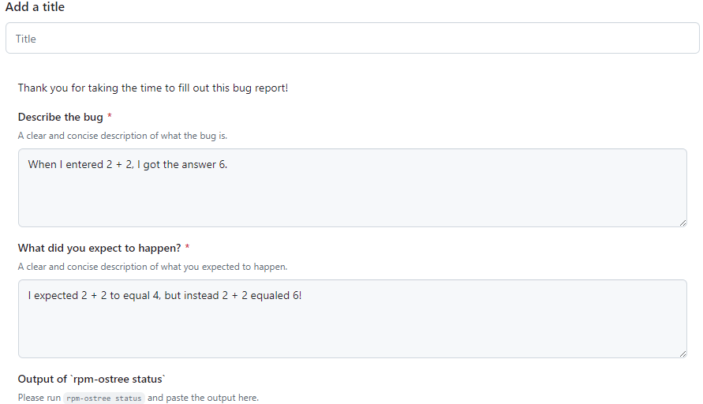

# Сообщение об ошибках

## Отправляйте отчеты об ошибках в подходящее место

Сообщайте об ошибках, с которыми вы столкнулись в Bazzite, в нашем [**трекере задач**](https://github.com/ublue-os/bazzite/issues)! Мы не рекомендуем сообщать об ошибках на форумах Discourse, потому что отчеты там могут потеряться или просматриваться участниками Bazzite реже, чем в трекере задач.

Если вы не уверены, что столкнулись именно с ошибкой, попробуйте спросить в каналах #bazzite-help на [сервере Bazzite в Discord](/community/#discord-no-discord-account).

>Пожалуйста, используйте английский язык в отчете об ошибке! Если вы используете LLM для перевода, также приложите исходный отчет, написанный вами на предпочитаемом языке, чтобы можно было заметить возможные ошибки или смысл, потерянный при переводе.
    
>Если вам трудно писать отчеты об ошибках на английском, вы можете добавить [Needs Translation] в заголовок отчета. Участники сообщества могут помочь вам с переводом.

## Пошаговый разбор шаблона задачи Bazzite




## Обновите Bazzite перед отправкой отчета

Иногда ошибки исправляют в обновлениях, поэтому перед отправкой отчета попробуйте обновить и перезагрузить устройство, чтобы проверить, сохраняется ли проблема после обновления.

>**Прочитайте, как обновить Bazzite на вашем устройстве**:
>[**Руководство по обновлению**](../Installing_and_Managing_Software/Updates_Rollbacks_and_Rebasing/updating_guide.md)

## Обязательно приложите системные журналы

Откройте терминал хоста и **введите**:

```
ujust device-info
```

Приложите ссылку на системные журналы, которую выведет команда.

## Сталкиваетесь с системными сбоями?

```command
ujust logs-last-boot
```
Скопируйте вывод в отчет об ошибке.
