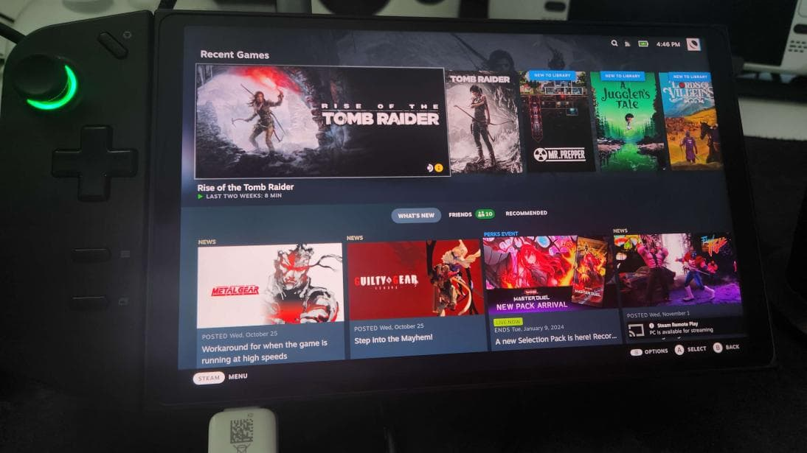
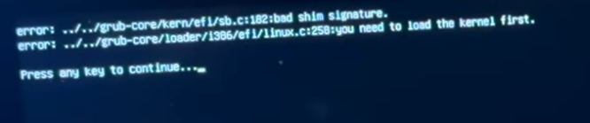
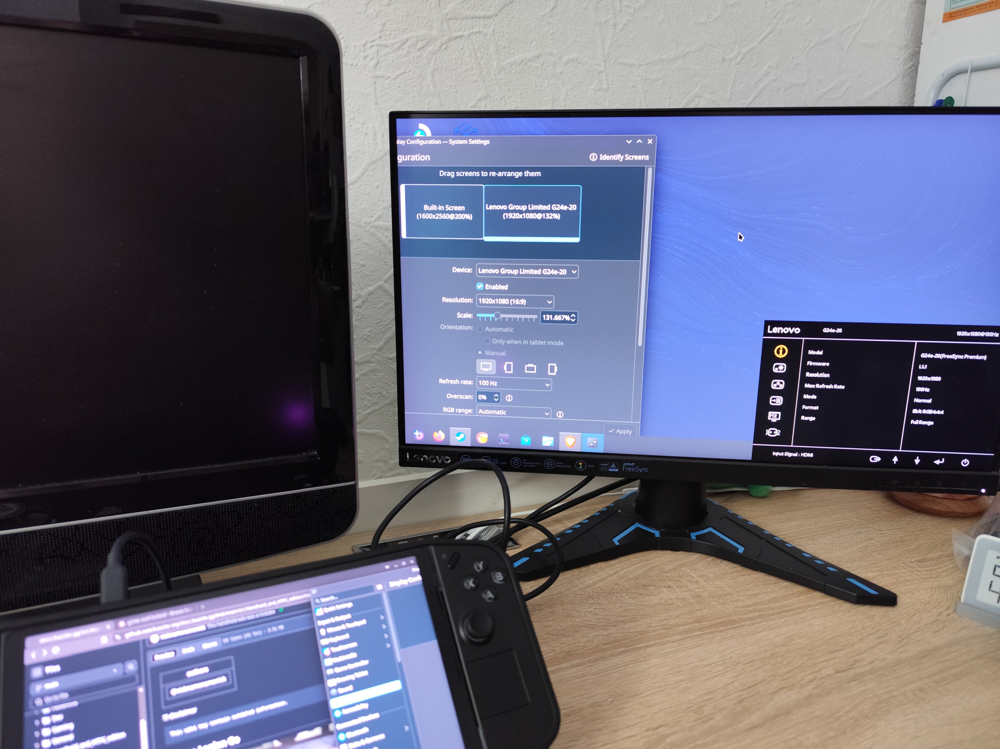
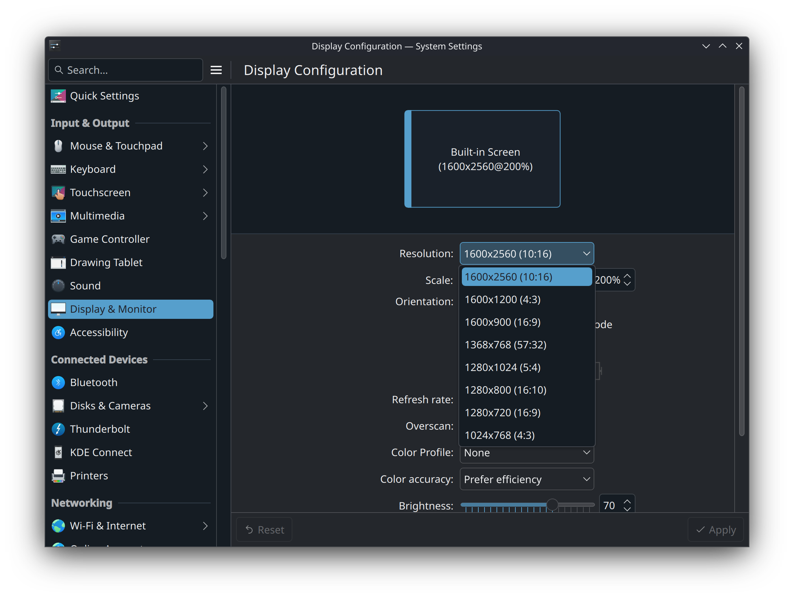
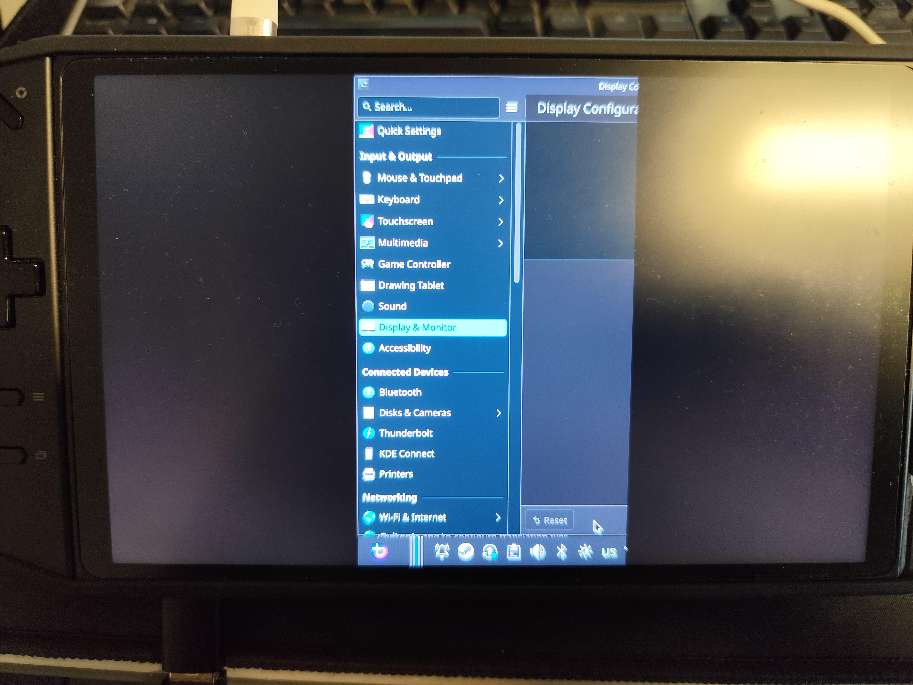

# Handheldy Lenovo

!!! disclaimer

    Tato wiki může obsahovat zastaralé informace.

## Lenovo Legion Go



### Volitelné vylepšení
- Nakonfigurujte překrytí HHD jeho otevřením pomocí <kbd>Legion R</kbd>
- Upravte měřítko uživatelského rozhraní v Nastavení zobrazení

### Známé problémy

- Překrytí výkonu může hlásit nepřesnou spotřebu energie.
- Adaptivní/automatický jas displeje je momentálně nefunkční.
  - Ruční posuvník jasu v uživatelském rozhraní Steam funguje bez problémů.
- Firmware systému BIOS a řadiče **doporučujeme** aktualizovat v systému Windows.

### Aktualizace systému BIOS přeruší klíč Secure Boot



Přečtěte si naši [Průvodce bezpečným spouštěním](/General/Installation_Guide/secure_boot.md#method-b-after-installation-method) a znovu zaregistrujte klíč po aktualizaci systému BIOS, pokud ponecháte funkci Secure Boot povolenou, což je výchozí nastavení pro toto zařízení.

!!! info

    Od července 2025 fungují externí monitory dobře. Externí displej lze nastavit na příslušné nativní rozlišení a obnovovací frekvenci.

    

    Bez dalších oprav nabízí interní displej pouze své nativní rozlišení se správným poměrem stran. Lze zvolit jiná rozlišení, ale většina obrazovky zůstane prázdná.

    
    


Pokud vaše obrazovka nezobrazuje správný výstup nebo vypadá zrnitě, hlučně nebo zvláštně barevně, budete muset **vstoupit do [TTY session](/Handheld_and_HTPC_edition/quirks.md#tty-if-you-cannot-access-desktop-mode) a zadat tento příkaz**:

```
rm ~/.config/kwin*
```

Případně do něj **ssh a zadejte tento příkaz**:

```
mv ~/.config/kwinoutputconfig.json ~/.config/kwinoutputconfig.json.old
```

## Externí zdroj

Další informace najdete v [Průvodci tipy a triky Legion Go](https://github.com/aarron-lee/legion-go-tricks), který obsahuje užitečné skripty pro tento kapesní počítač.