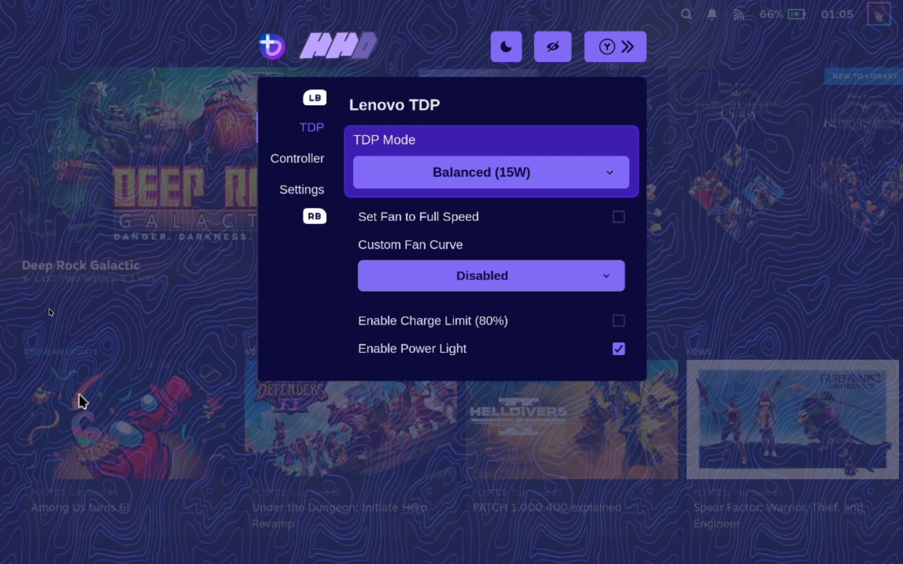
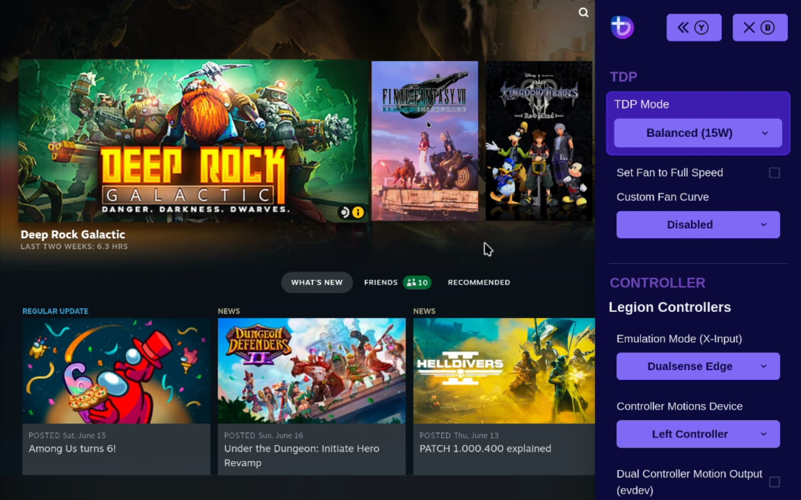
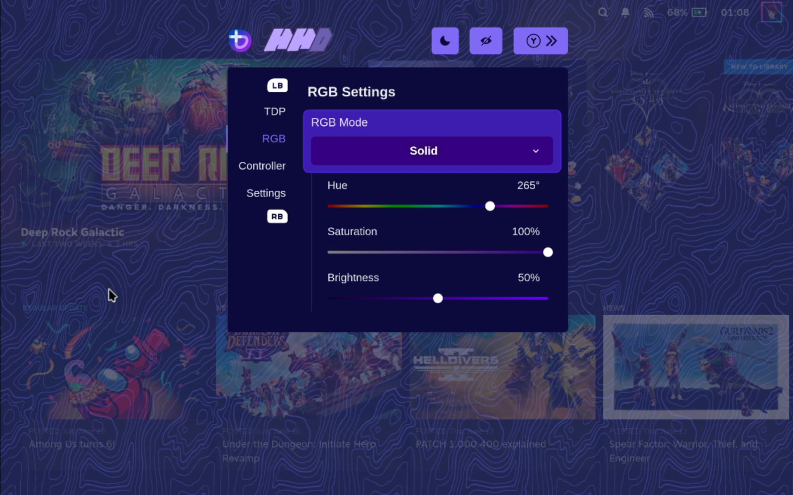
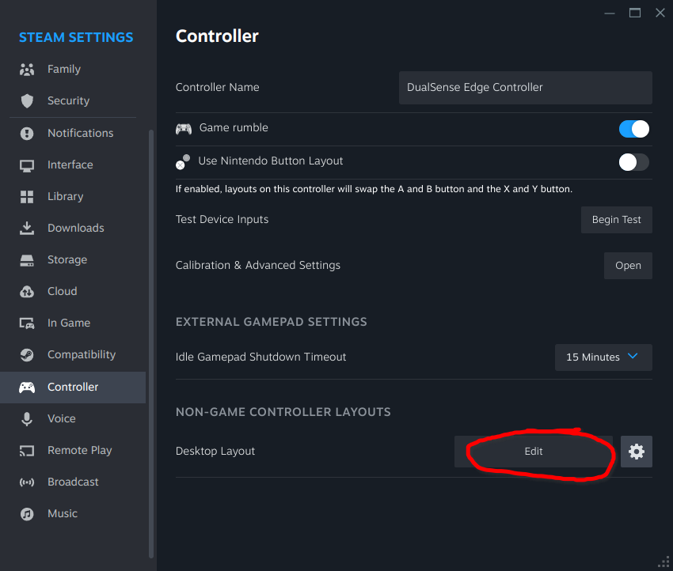

# Kompatibilita s handheld

## Funkce podobné SteamOS

>**Upozornění**: Bazzite v současnosti používá [Handheld Daemon](https://github.com/hhd-dev/hhd/blob/master/readme.md) pro správnou podporu handheldu. 

Obrazy Bazzite-Deck se dodávají s [Steam Gaming Mode](../Steam_Gaming_Mode.md), který má napodobovat zážitek ze SteamOS.  Cílem je mít dřívější podporu pro většinu kapesních počítačů x86_64 před SteamOS a se stejnými výhodami jako desktopová verze Bazzite.

## Podporované kapesní počítače

!!! attention

    Tento seznam je neúplný a neznamená, že neuvedené handheldy v současné době nefungují s Bazzite, ale protože postrádáme konkrétní informace týkající se jejich poinstalačního nastavení, řešení a správné hardwarové podpory pro Linux, nejsou zde uvedeny.

**Všechny handheldy kromě Steam Deck využívají [Handheld Daemon](https://github.com/hhd-dev/hhd/blob/master/readme.md) pro ovládání, TDP atd.**

_Kliknutím na název každého hardwaru zobrazíte nastavení po instalaci a známé problémy/náhradní řešení._

- [**ASUS Handheld**](./ASUS_ROG_Ally.md)
- [**Lenovo Handhelds**](./Lenovo_Legion_Go.md)
- [**GPD Handhelds**](./GPD_Handhelds.md)
- [**OneXPlayer Handhelds**](./OneXPlayer_Handhelds.md)
- [**Ayn Handhelds**](./Ayn_Handhelds.md)
- [**Ayaneo Handhelds**](./Ayaneo_Handhelds.md)
- [**Steam Deck**](./Steam_Deck.md)
- [**Ostatní kapesní počítače**](./Other_Handhelds.md)

Pokud váš kapesní počítač není uveden v záznamech, **nemusí** nutně znamenat, že zařízení není podporováno. 

## Nastavení HHD

!!! attention

    HHD je určeno a funkční pro kapesní počítače, které **není** Steam Deck.

>Další informace naleznete v [**HHD README**](https://github.com/hhd-dev/hhd/blob/master/readme.md).

1. Dvakrát stiskněte „tlačítko boční nabídky“ pro přístup k překrytí Handheld Daemon v herním režimu Steam

2. Vyberte požadovanou emulaci ovladače a barvu RGB

!!! note

    Funkce gyroskopu **vyžaduje** emulaci DualSense

## Ovládací prvky TDP



Existuje několik možností pro ovládací prvky TDP, které fungují s Bazzite:

- [HHD-overlay](https://github.com/hhd-dev/hhd/blob/master/readme.md) podporuje ovládací prvky TDP. (**Primární podporovaná metoda**)
  - Má také předinstalovanou aplikaci pro stolní počítače, vyhledejte aplikaci Handheld Daemon v režimu plochy.
- [SimpleDeckyTDP](https://github.com/aarron-lee/SimpleDeckyTDP) podporuje TDP, GPU, Power Governor a další nastavení.
  - Má také [grafickou aplikaci](https://github.com/aarron-lee/SimpleDeckyTDP-Desktop), ale je třeba ji nainstalovat ručně.
  - [PowerControl](https://github.com/mengmeet/PowerControl) podporuje TDP, GPU a ovládání ventilátoru na vybraných zařízeních.

### Jak otevřu překrytí HHD?




Stiskněte, podržte nebo dvakrát klepněte na tlačítko Nabídka Rychlý přístup.

## Informace o ovladači

U většiny kapesních počítačů se kromě Steam Decku pro plnou funkčnost používá emulace ovladače DualSense. Dvojitým klepnutím nebo podržením tlačítka postranní nabídky získáte přístup k nastavení emulace ovladače, včetně přepnutí na ovladač Xbox s omezenou funkčností.

Pokud má vaše zařízení pádla, budete chtít použít ovladač DualSense Edge (**kromě Ayn Loki**). Ve výchozím nastavení je zakázáno, protože některé hry jej nemapují správně.

Některé hry a emulátory mohou vyžadovat **vypnuto** Steam Input, aby správně fungovaly s vašimi ovládacími prvky.

### Ovládací prvky na ploše



Rozvržení stolního ovladače nemusí ve výchozím nastavení existovat, pokud Steam nenastaví váš ruční ovladač správně. To lze opravit v nastavení ovladače Steam.

Virtuální klávesnice je klávesnice na obrazovce Steamu, ale je třeba ji nastavit v nastavení Steamu v režimu plochy. Neexistuje **žádná výchozí klávesová zkratka pro klávesnici na obrazovce Steamu** (Přemapujte ji na <kbd>**X**</kbd> nebo co chcete).  Rozvržení stolního ovladače nemusí ve výchozím nastavení existovat, pokud Steam nenastaví váš ruční ovladač správně. To lze opravit v nastavení ovladače Steam

## Nastavení Decky

Chcete-li nainstalovat [Decky Loader](https://decky.xyz), otevřete hostitelský terminál a zadejte:

```bash
ujust setup-decky
```

K Decky Loader se dostanete stisknutím tlačítka „boční nabídky“, známého také jako nabídka rychlého přístupu (QAM), jednou z režimu Steam Gamemode nebo režimu Steam Big Picture.

Nabídka Rychlý přístup je přístupná z klávesnice pomocí Control + 2 nebo pomocí externího ovladače pomocí tlačítka Xbox/PS + A/X.

### Decky pluginy

!!! attention

    Decky se může po aktualizacích rozbít nebo odinstalovat, zejména pokud existuje aktualizace.

Nainstalujte volitelné [Decky pluginy](https://plugins.deckbrew.xyz/) pro váš kapesní počítač. Pokud se setkáte s nějakými zásadními problémy, pak se doporučuje odinstalovat Decky před nahlášením chyb Bazzite.

## Nepodporované kapesní počítače

!!! note

    U některých handheldů bylo potvrzeno, že spouštějí Bazzite, ale trpí chybějící podporou ovladačů pro Linux včetně chybějících zvukových ovladačů.

Nepodporované handheldy _mohou fungovat_ s Bazzite, ale mohou se vyskytnout závažné problémy, které nejsou zdokumentovány. Pokud váš kapesní hardware není uveden, můžete Bazzite vyzkoušet s naším obrazem Bazzite-Deck.

Váš počet najetých kilometrů se může lišit v závislosti na netestovaném hardwaru. Bazzite **nemá** požadované nastavení pro nepodporovaný handheld, takže nastavení bude ručně provedeno koncovým uživatelem pro různé funkce, pokud dokonce funguje správně na nepodporovaném zařízení.

## Upozornění na e-GPU:

- Stejné [hardwarové požadavky GPU](/Gaming/Hardware_compatibility_for_gaming.md#steam-gaming-mode-requirements), které platí pro herní režim Steam, platí také pro e-GPU.
  - GPU Nvidia jsou **nepodporovány**, ale mohou fungovat, pokud se přeloží na obraz Nvidia `-deck` s potenciálem vynikajících chyb.

>[**Obecná příručka Linux e-GPU + skript**](https://github.com/ewagner12/all-ways-egpu)