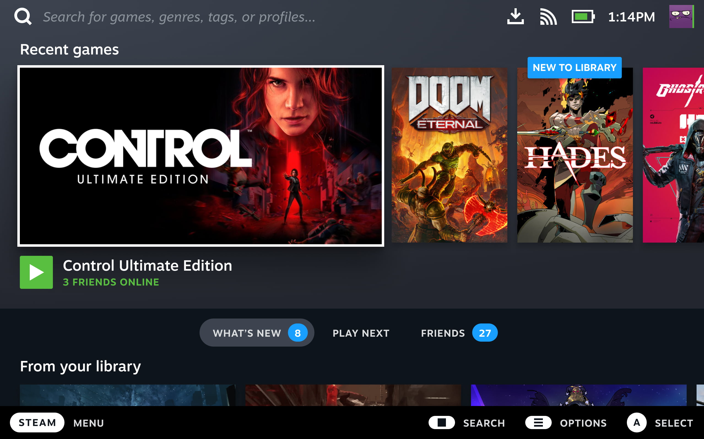

# Bazzite-Deck Obecný přehled

## Co je to Bazzite-Deck?

**Bazzite pro sestavy domácího kina a kapesní počítače**.  Má být prostředím přívětivým pro ovladače a poskytovat uživatelům „konzolový“ zážitek podobný SteamOS pro Steam Deck. Je určen jak pro kapesní počítače, tak pro sestavy PC domácího kina. Bazzite je podobný SteamOS tím, že sdílí mnoho balíčků, které SteamOS obsahuje, takže je připraven ke hře, jakmile je dokončen proces instalace.

Tato dokumentace nemusí pokrývat konkrétní oblasti za předpokladu, že uživatel již zná SteamOS a jak funguje. Pokud nejste obeznámeni s něčím, co nelze najít v naší dokumentaci, prozkoumejte svou konkrétní otázku pomocí klíčových slov při hledání „SteamOS“ nebo „Steam Deck“. Jinak se zeptejte na našich [**fórech**](https://universal-blue.discourse.group/c/bazzite/5) nebo [**Discord**](https://discord.gg/f8MUghG5PB).

## Co je herní režim Steam?

>Prohlédněte si [**Dokumentaci pro handheld**](../Handheld_and_HTPC_edition/Handheld_Wiki/index.md) pro nastavení po instalaci a běžné problémy s **handheld zařízeními**.

**Upozorňujeme, že herní režim Steam má ve srovnání s tradičními desktopovými prostředími náročné hardwarové požadavky GPU.**

!!! important

    Beta klient Steam **není** podporován, před nahlášením problémů se vraťte ke stabilnímu klientovi.

https://www.youtube.com/watch?v=zXK1CXUyzXQ
**Prohlídka uživatelského rozhraní Steam Deck od [Linux for Everyone](https://www.youtube.com/@LinuxForEveryone)**

Bazzite využívá herní režim Steam k vyplnění výklenku herních zařízení na ruce a na gauči. Steam Gaming Mode je to, na čem je SteamOS na Steam Decku postaven. Jednoduché rozhraní, které je vhodné pro ovládání, postavené na UI/UX Steam „Big Picture Mode“. Minimální relace běží na pozadí pouze na naprosté minimum, takže většina hardwarových prostředků jde na hranou hru. 

[**Gamescope**](https://github.com/ValveSoftware/gamescope) je hlavní složkou herního režimu Steam, který poskytuje možnosti nastavení limitu snímkové frekvence, možnosti škálování rozlišení atd. Režim Steam Gaming se také označuje jako „gamepadUI“ a „gamescope-session“, ale dokumentace Bazzite jej obvykle označuje jako „herní režim Steam”.

### Vstup Steam

!!! note
        
        Některé hry a emulátory mohou vyžadovat **vypnuto** Steam Input, aby správně fungovaly s vašimi ovládacími prvky.

[Průvodce Steamem](https://steamcommunity.com/sharedfiles/filedetails/?id=2804823261), který obsahuje **tipy a triky pro ovládání na Steam Decku, ale obsahuje informace, které se stále mohou vztahovat na všechna zařízení se systémem Bazzite-Deck**.

#### Jak otevřu boční nabídky pomocí fyzické klávesnice?

**Nabídka Home Steam**: <kbd>Ctrl</kbd>/<kbd>Win</kbd>+<kbd>1</kbd>
**Nabídka rychlého přístupu (QAM)**: <kbd>Ctrl</kbd>/<kbd>Win</kbd>+<kbd>2</kbd>

## Oficiální průvodce SteamOS společnosti Valve

!!! important

    Ne všechny informace budou přesné, pokud jde o Bazzite-Deck.

Valve napsalo [**průvodce**](https://help.steampowered.com/en/faqs/view/7DD4-C618-182E-0E49) pro Steam Deck, který může obsahovat některé relevantní informace týkající se Bazzite.