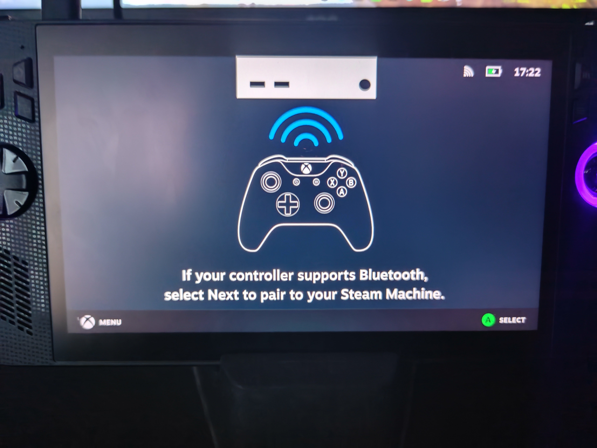
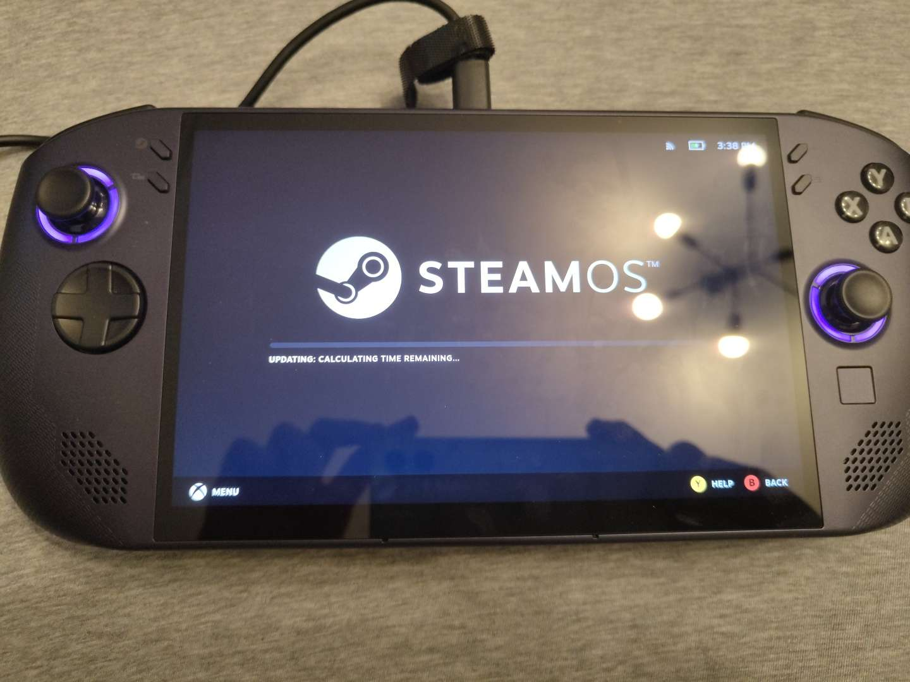
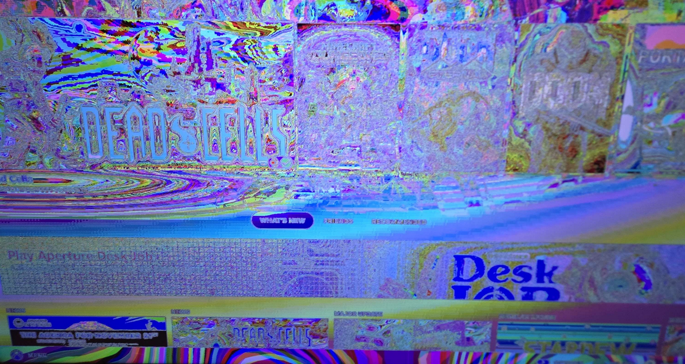

# Zvláštnosti a řešení v herním režimu Steam

## Jak mohu použít svou microSD kartu, kterou jsem použil na mém Steam Decku se SteamOS?

Otevřete hostitelský terminál a zadejte tento **příkaz**:

```command
ujust switch-to-ext4
```

## Jak určím správný monitor pro herní režim? (pouze HTPC)

V režimu plochy otevřete hostitelský terminál a spusťte tento **příkaz**:

```command
mkdir ~/.config/environment.d
nano ~/.config/environment.d/10-gamescope-session.conf
```

Pak do souboru přidejte toto:

`OUTPUT_CONNECTOR=DP-1`
Změňte `DP-1` na správný výstup.
Výstupy zobrazení můžete najít pomocí příkazu

KDE:
```
kscreen-doctor -o
```

GNOME:
```
gnome-randr
```

!!! note

    Bylo hlášeno, že některé systémy správně nehlásí název Display Output při použití gnome-randr, můžete spustit příkaz níže a vypsat všechny názvy připojených výstupů bez jakýchkoli podrobností, abyste je mohli porovnat s tím, co hlásí výše uvedené příkazy.

```
grep -r '^connected' /sys/class/drm/*/status | grep -Po 'card.?-\K([^/]*)'
```

Uložte pomocí <kbd>CTRL</kbd> + <kbd>X</kbd> a poté stiskněte <kbd>Y</kbd> a poté <kbd>ENTER</kbd>

## Zvukový výstup nefunguje (výchozí zařízení)

Tento problém se obvykle vyskytuje u zvuku televizoru HDMI.  Chcete-li upravit nastavení zvuku, přejděte do režimu plochy a do nastavení systému. Vypněte zařízení, která neodpovídají zvukovému výstupu, který používáte. Příkladem toho je deaktivace všech věcí, které nejsou HDMI pro zvuk vašeho televizoru.

## Změna fyzického rozložení klávesnice pro herní režim Steam

Režim Steam Gaming Mode nemá žádný oficiální způsob, jak změnit fyzické rozložení klávesnice a vždy bude výchozí nastavení pro americké rozložení.  Pokud chcete změnit rozvržení, můžete nastavit proměnnou prostředí `XKB_DEFAULT_LAYOUT=no` nahrazující `no` správným rozvržením pro vás.

Přidejte tuto proměnnou prostředí do `~/.config/environment.d/10-gamescope-session.conf` V podstatě se ujistěte, že jsou skryté soubory zapnuté a přesuňte se do adresáře **Home**, poté přejděte do adresáře .config a zadejte adresář environment.d.  Uvnitř tohoto adresáře by měl být soubor, který by měl být upravován pomocí textového editoru, uložen jako „10-gamescope-session.conf“, aby správně fungoval.

<sub>(Upozorňujeme, že pokud soubor "10-gamescope-session.conf" a/nebo složka "environment.d" již neexistuje, vytvořte jej.)</sub>

Funguje to v režimu Desktop včetně spuštění Nested Gamescope a funguje to také pro Nested Desktop, ale má to své zvláštnosti: <kbd>altgr</kbd> + <kbd>2</kbd> pro psaní „<kbd>@</kbd>“ v norském rozložení stále nebude fungovat, ale základní rozložení klávesnice bude vždy fungovat.  Klávesa `altgr` naštěstí není potřeba pro normální psaní na norském rozložení, nicméně bylo hlášeno, že <kbd>altgr</kbd> funguje na francouzském rozložení, ale výsledky se mohou lišit.

## Jak deaktivuji určité funkce „Steam Deck“, které jsou v konfliktu s mým nastavením?

**Scénáře, kde je to žádoucí**:

*>* **Příklad 1**: Klávesnice a myš pro tento titul nefungují.

*>* **Příklad 2**: Spouštěč hry pro úpravu nastavení videa nebo přidání modů se nespustí.

**>* **Příklad 3**: Některé funkce/možnosti nejsou dostupné, což by mělo být.

Otevřete vlastnosti hry na Steamu a **zadejte tuto možnost spuštění**:

```command
SteamDeck=0 %command%
```

## Proč konkrétní pluginy Decky Loader na Bazzite nefungují?

Některé pluginy jsou vytvořeny speciálně pro SteamOS nebo Steam Deck a nemusí nutně fungovat na hardwaru Bazzite nebo jiném než Steam-Deck.

Například [DeckMTP plugin](https://github.com/dafta/DeckMTP) funguje pouze na modelech Steam Deck a nebude fungovat na jiném hardwaru.

## Jak mohu použít SteamDeckGyroDSU na hardwaru, který není Steam Deck?

SteamDeckGyroDSU nemůžete používat mimo Steam Deck, ale můžete zkusit vypnout Steam Input a _může_ fungovat v závislosti na vašem hardwaru a případu použití.

## Jak určím, který GPU by měl herní režim Steam používat?

Otevřete relaci TTY pomocí **externí fyzické klávesnice** pomocí této **kombinace kláves**:
   <kbd>Ctrl</kbd>+<kbd>Alt</kbd>+<kbd>F4</kbd>

```command
export-gpu
```

**Případně** v režimu Desktop zadejte tento příkaz do terminálu:

```
/usr/bin/export-gpu
```

Vyberte GPU, který chcete použít pro herní režim Steam.


## Ztratil jsem zkratku „Návrat do herního režimu“.

Tuto zkratku můžete obnovit otevřením terminálu a spuštěním:

 ```
 ujust restore-gamemode-shortcut
 ```

## Za tuto obrazovku nelze postoupit

1. Otevřete relaci TTY pomocí **externí fyzické klávesnice** pomocí této **kombinace kláves**:
    <kbd>Ctrl</kbd>+<kbd>Alt</kbd>+<kbd>F4</kbd>
2. Přihlaste se ke svému uživateli.
3. Zadejte tento příkaz:
```
steamos-session-select plasma
```
4. Přihlaste se do služby Steam v režimu plochy a restartujte zařízení.

## Zaseknutý na 'Aktualizace výpočtu: Zbývající čas'

Restartujte zařízení.

## Steam se zlomil a herní režim je také nefunkční

Ve scénářích, kdy se herní režim Steam odmítne spustit kvůli problému s klientem Steam.

### Metoda režimu Desktop

Otevřete hostitelský terminál a **zadejte tento příkaz**:

```
ujust fix-reset-steam
```

### Metoda TTY (_pokud nemáte přístup do režimu Desktop_)
Vstupte do relace TTY pomocí <kbd>Ctrl</kbd>+<kbd>Alt</kbd>+<kbd>F4</kbd> a přihlaste se pomocí svého uživatelského jména a hesla Bazzite.

**Zadejte tento příkaz**:

```
ujust fix-reset-steam
```

## Chyba „Při zobrazování tohoto obsahu se něco pokazilo“.

Nejpravděpodobněji je to způsobeno nefunkčním zásuvným modulem Decky Loader, který jste nainstalovali. Odinstalujte poškozený plugin. Tento problém mohou způsobit také konkrétní motivy CSS Loader.

## Proč VRR nefunguje na mém displeji kompatibilním s VRR?

Většinou je to proto, že zařízení připojujete přes HDMI, které nepodporuje VRR na Linuxu. Zde je [zdroj](https://www.phoronix.com/news/HDMI-2.1-OSS-Rejected) těchto informací.

## Duhový displej



Zapněte a vypněte HDR v nabídce Rychlý přístup.

Možná však budete muset povolit „Force Composite“, který najdete v možnostech vývojáře, který je také nutné předem povolit v nastavení Steam.

## Zaseknutý u loga Bazzite
1. Otevření relace TTY pomocí **externí fyzické klávesnice** pomocí této **kombinace klávesnic a zadání tohoto příkazu**:
    <kbd>Ctrl</kbd>+<kbd>Alt</kbd>+<kbd>F4</kbd>
2. Přihlaste se ke svému uživateli.
3. Zadejte tento příkaz:
```
ujust fix-reset-steam
```

Restartujte systém.

### Alternativní metoda
!!! attention

    Zkuste nejprve restartovat zařízení, než budete pokračovat dalšími kroky! Pokud to uděláte nesprávně, můžete přijít o své hry, uložené soubory a další obsah.

1. Otevřete relaci TTY pomocí **externí fyzické klávesnice** pomocí této **kombinace klávesnic a zadáním tohoto příkazu**:
    <kbd>Ctrl</kbd>+<kbd>Alt</kbd>+<kbd>F4</kbd> a `mv ~/.local/share/Steam ~/.local/share/Steam1`
2. Tento příkaz přejmenuje adresář `Steam` na `Steam1` a přinutí Steam, aby se znovu inicializoval a vytvořil nový adresář.
3. Své hry můžete přesunout z přejmenovaného adresáře `Steam1` do nového adresáře `Steam`, pokud jste nějaké měli dříve nainstalované ve svém interním úložišti.
4. Ukončete relaci TTY zadáním této **kombinace klávesnice**: <kbd>Ctrl</kbd> + <kbd>Alt</kbd> + <kbd>F2</kbd>.

### Video tutoriál
https://www.youtube.com/watch?v=gE1ff72g2Gk

## Exkluzivní problémy GPU Nvidia s herním režimem Steam

- "Povolit GPU akcelerované vykreslování ve webových zobrazeních (vyžaduje restart)" musí být povoleno v nastavení Steam pro lepší výkon v uživatelském rozhraní.
  - Rozlišení nad 2560x1440 způsobí při použití tohoto nastavení grafické artefakty, které zlomí hru.
- HDR může způsobit herní grafické artefakty.