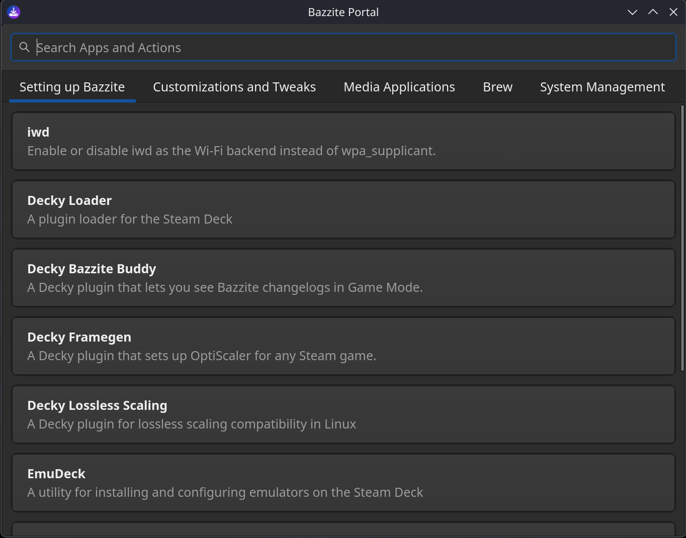
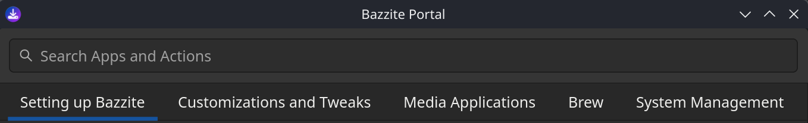
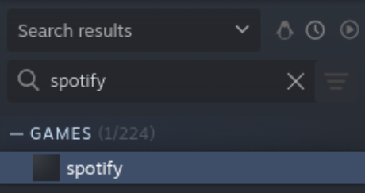
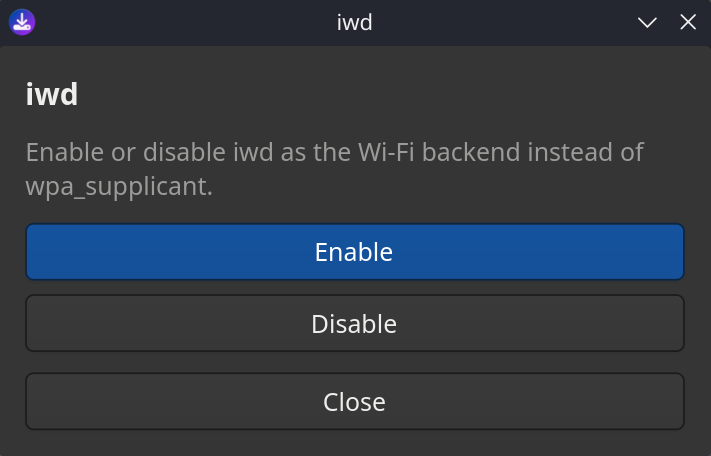

---  
title: Bazzite Portal  
---



## Overview

The Bazzite Portal is a configuration tool that uses [`ujust`](./ujust.md) commands to enable features, install system updates, install specific packages, and troubleshoot system issues:

- Installs useful tools like [Decky](https://github.com/SteamDeckHomebrew/decky-loader), [OpenRGB](https://github.com/calcprogrammer1/openrgb), and [Waydroid](https://github.com/waydroid/waydroid).
- Uses [`topgrade`](https://github.com/topgrade-rs/topgrade) to install updates for multiple package managers, including Bazzite, Flatpak (Bazaar), firmware (`fwupdmgr`), and Brew.
- Installs Homebrew apps from the [Universal Blue tap,](https://github.com/ublue-os/homebrew-tap) and adds web apps for various streaming services.
- Gather system logs, rollback system updates, reset Bazzite to its default configuration, or rebase your system to a different version.

!!! tip "Want to know more?"

    To learn about the Bazzite Portal's internal workings, see [”How the Bazzite Portal works”](#how-the-bazzite-portal-works).
  
## Launching Bazzite Portal

The Bazzite Portal is installed by default. To launch the app:

=== "KDE Plasma"

    1\. Click **Application Launcher** in the bottom-left corner.
    2\. Click **System**.
    3\. Click **Bazzite Portal**.

=== "GNOME"

    1\. Click the **Activities** button in the top-left corner.
    2\. Click **App Grid**.
    3\. Type in "Bazzite".
    4\. In the search results, click **Bazzite Portal**.

## Configuration settings

The Bazzite Portal's features are organised into categories:



### Setting up Bazzite

This category installs various apps (such as [Decky Loader](https://github.com/SteamDeckHomebrew/decky-loader)) and integrates them with Steam, where supported.

| Feature                    | Description                                                                                                                             | `ujust` command              |
| :------------------------- | :-------------------------------------------------------------------------------------------------------------------------------------- | :--------------------------- |
| **iwd**                    | Switches the Wi-Fi backend between `iwd` and `wpa_supplicant`. The `iwd` backend can improve network performance in some circumstances. | `toggle-iwd`                 |
| **Decky Loader**           | Installs the Decky plugin loader.                                                                                                       | `setup-decky`                |
| **Decky Bazzite Buddy**    | Shows the latest Bazzite changelogs in Decky.                                                                                           | `get-decky-bazzite-buddy`    |
| **Decky Framegen**         | Adds OptiScaler to a Steam game.                                                                                                        | `get-framegen`               |
| **Decky Lossless Scaling** | Adds compatibility for lossless scaling.                                                                                                | `get-decky-lossless-scaling` |
| **EmuDeck**                | Installs emulators and adds them to Steam.                                                                                              | `get-emudeck`                |
| **Sunshine**               | Installs a self-hosted game streaming service, letting you play games remotely using a Moonlight client.                                | `setup-sunshine`             |
| **Waydroid**               | Installs a compatibility layer for Android apps.                                                                                        | `configure-waydroid`         |
| **OpenRGB**                | Control your device's RGB lighting.                                                                                                     | `install-openrgb`            |
| **Resilio Sync**           | Installs a file synchronization tool that uses peer-to-peer networking.                                                                 | `install-resilio-sync`       |

### Customizations and tweaks

This category contains settings to suit personal preferences or specific hardware.

| Feature                             | Description                                                                                                                                                                                                 | `ujust` command            |
| :---------------------------------- | :---------------------------------------------------------------------------------------------------------------------------------------------------------------------------------------------------------- | :------------------------- |
| **Add input group to current user** | Runs a script that adds your user account to the `input` group. This is needed for compatibility with certain controller drivers.                                                                              | `add-user-to-input-group`  |
| **Visible Password Asterisks**      | Toggles password asterisks for `sudo` prompts.                                                                                                                                                              | `toggle-password-feedback` |
| **GRUB Menu Visibility**            | Hide or show the GRUB menu during the boot process.                                                                                                                                                         | `configure-grub`           |
| **Boot to Windows from Steam**      | If you're dual-booting with Windows, this adds a Steam menu item that lets you reboot into Windows.                                                                                                         | `setup-boot-windows-steam` |
| **Automounting**                    | Configure automounting of `BTRFS` and `EXT4` partitions under `/run/media/system`                                                                                                                           | `toggle-automounting`      |
| **SteamOS Automounting**            | Enables or disables file system automounting for SteamOS.                                                                                                                                                   | `enable-steamos-automount` |
| **Wake-on-LAN**                     | Enables Wake-on-LAN support for remotely power on your device.                                                                                                                                              | `toggle-wol`               |
| **CEC Sleep Standby**               | Automatically puts your TV on standby when system sleeps. Uses HDMI-CEC and requires compatible hardware.                                                                                                   | `toggle-cec-sleep`         |
| **Clean Steam Shortcuts**           | Automatically deletes any Steam shortcuts from your desktop whenever you reboot.                                                                                                                            | `steam-icons`              |
| **OpenTabletDriver**                | An open source tablet driver.                                                                                                                                                                               | `install-opentabletdriver` |
| **SSH Service**                     | Enables remote SSH access to your system.                                                                                                                                                                   | `toggle-ssh`               |
| **SteamCMD**                        | A command-line client for Steam that lets you install dedicated servers.                                                                                                                                    | `get-steamcmd`             |
| **Global FSR4 Upgrade (RDNA4)**     | Enables Proton FSR4 for RDNA4 GPUs. Also upgrades FSR 3.1+ to FSR 4 on Proton 10 (and Proton GE 10-25 or newer).                                                                                            | `toggle-global-fsr4`       |
| **Global FSR4 Upgrade (RDNA3)**     | Enables Proton FSR4 for RDNA3 GPUs, such as the RX 7900 XTX. Also upgrades FSR 3.1+ to FSR 4. Only compatible with Proton GE, Proton EM, or similar.                                      | `toggle-global-fsr4-rdna3` |
| **Global DLSS Upgrade**             | Enables the Proton DLSS upgrade, which updates DLSS DLLs. Only compatible with Proton GE, Proton EM, or similar.                                                                                     | `toggle-global-dlss`       |
| **REISUB**                          | Enables all the [`magic SysRq key`](https://fedoraproject.org/wiki/QA/Sysrq) functions, using `kernel.sysrq = 1`. **Note:** This setting is considered insecure. | `toggle-reisub`            |

### Media Applications

This category installs web apps for various gaming and video streaming services, such as Spotify and Youtube. 

This integration lets you run the web app directly from your Steam library. For example:



### Brew

This category lets you install Homebrew apps from the [Universal Blue tap](https://github.com/ublue-os/homebrew-tap).

| Feature                                          | Description                                                | Brew component             |
| ------------------------------------------------ | ---------------------------------------------------------- | -------------------------- |
| **Add the Ublue tap**                            | Adds the Universal Blue Brew tap.                          | `ublue-os/tap`             |
| **Install Visual Studio Code (Needs Ublue Tap)** | Installs the Visual Studio Code editor.                    | `visual-studio-code-linux` |
| **Install Antigravity (Needs Ublue Tap)**        | Installs Google Gravity, an IDE for an AI Coding Agent.    | `antigravity-linux`        |
| **Install LM Studio (Needs Ublue Tap)**          | Installs LM Studio, letting you run LLMs on your computer. | `lm-studio-linux`          |
| **Install JetBrains Toolbox (Needs Ublue Tap)**  | Installs JetBrains Toolbox.                                | `jetbrains-toolbox-linux`  |
| **Install VSCodium (Needs Ublue Tap)**           | Installs the VSCodium editor.                              | `vscodium-linux`           |

### Systems Management

This category lets you update your system and do advanced troubleshooting. You can gather system logs, rollback system updates, reset Bazzite to its default configuration, or rebase your system to a different version.

- **Update Bazzite and Apps**: See the [Update Guide](Updates_Rollbacks_and_Rebasing/updating_guide.md).
- **Rebase Bazzite** (_stable_ and _testing_): See the [Rebase Guide](Updates_Rollbacks_and_Rebasing/rebase_guide.md).
- **Rollback Bazzite**: See [Rollbacks](Updates_Rollbacks_and_Rebasing/rolling_back_system_updates.md) and [Bazzite Rollback Helper](Updates_Rollbacks_and_Rebasing/bazzite_rollback_helper.md).

## How the Bazzite Portal works

This section explains how the Bazzite Portal uses a configuration file to organise and run its [`ujust`](./ujust.md) commands.

The Bazzite Portal's configuration is stored in `/usr/share/yafti/yafti.yml`, where you can see the menu items and the commands they'll run.

For example, this entry shows the `ujust` commands used by the `iwd` setting:

```yaml
     - id: "toggle-iwd"
        title: "iwd"
        description: "Enable or disable iwd as the Wi-Fi backend instead of wpa_supplicant."
        default: false
        status_script: "ujust toggle-iwd status"
        options:
          - id: "enable"
            label: "Enable"
            script: "ujust toggle-iwd enable"
          - id: "disable"
            label: "Disable"
            script: "ujust toggle-iwd disable"

```

This configuration generates menu options in Bazzite Portal that let you enable or disable `iwd`:



!!! tip "Want to know more?"

    For more information about how a specific `ujust` command works , see [”View each ujust script's source code”](./ujust.md/#view-each-ujust-scripts-source-code).

## Project website

https://github.com/xXJSONDeruloXx/yafti-gtk
