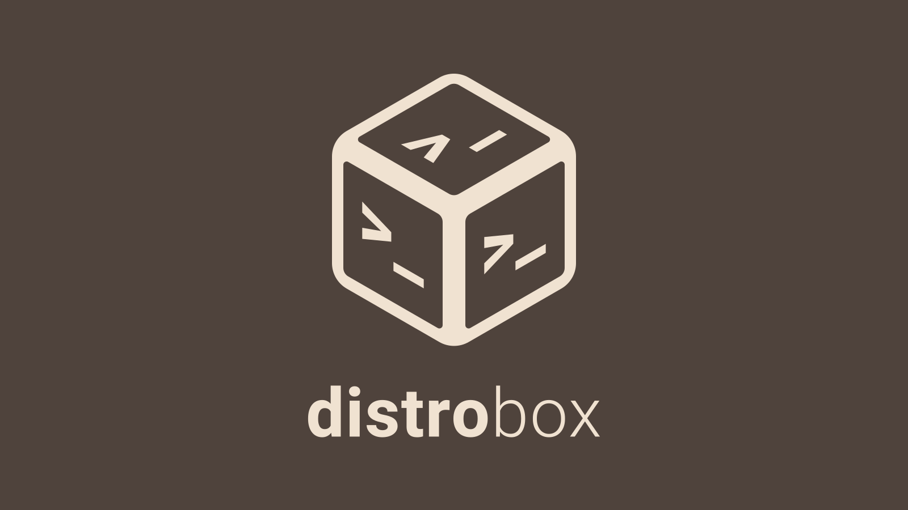
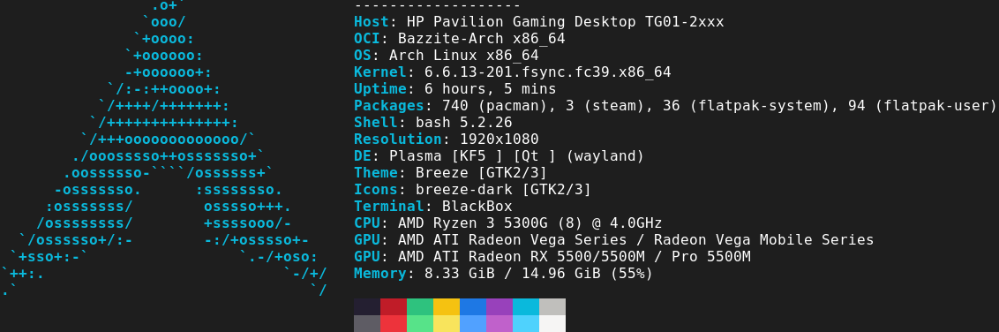
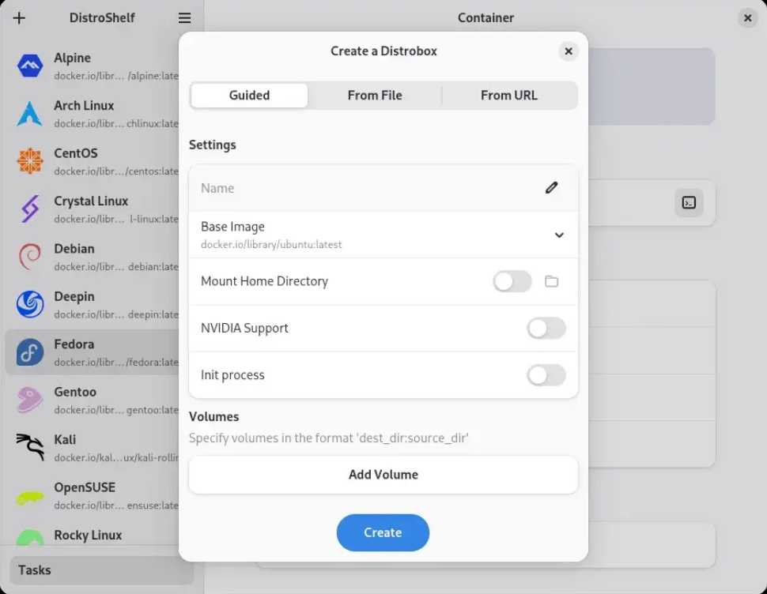

# Kontejnery Distrobox



## Základní použití

Spouštějte další minimální varianty populárních linuxových distribucí v Bazzite uvnitř kontejneru a přistupujte k balíčkům každé distribuce, aniž by jakékoli jejich závislosti a knihovny ovlivňovaly hostitelský počítač.

- Kontejnery **nejsou** virtuální stroje.
- Kontejnery jsou určeny jako **jednorázové** a mohou narazit na problémy, kde je třeba je znovu vytvořit.
- Použití této metody k získání softwaru **vyžaduje znalost toho, jak tradiční operační systémy Linux instalují balíčky**.
  - Vytvořte testovací kontejner, abyste se seznámili se základními příkazy Linuxu, než se do toho pustíte dále.

Kontejnery Distrobox provozují podsystémy jiných oblíbených [distribucí Linuxu](https://distrobox.it/compatibility/#containers-distros) s přístupem k jejich správcům balíčků (`apt`, `dnf`, `pacman` atd.) a jejich formátům balíčků a repozitářům jako [AUR](https://aur.archlinux.org/). Kontejnery Distrobox lze použít jak pro **vývojová prostředí**, tak pro **instalaci aplikací, které nejsou dostupné v žádné z jiných instalačních metod**, které mohou být exkluzivní pro konkrétní správce balíčků.

### **Příklady distribuce Linuxu**:

| OS | Správce balíčků | Hledat balíčky |
| ------------------------------------ | ------------------- | ------------------------------------------------------------------------- |
| [Fedora][fedora] | [`dnf`][dnf] | [balíčky Fedory][fedora_balíčky] / [balíčky COPR][copr] |
| [Arch Linux][arch] | [`pacman`][pacman] | [Balíčky Arch Linux][arch_pkgs] / [Balíčky AUR][aur_pkgs] |
| [Debian][debian] / [Ubuntu][ubuntu] | [`apt`][apt] | [Balíčky Debian][deb_pkgs] / [Balíčky Ubuntu][ubuntu_pkgs]( [PPA][ppa]) |
| [openSUSE][opensuse] | [`zypper`][zypper] | [balíčky openSUSE][osuse_pkgs] |
| [Void Linux][void] | [`xbps`][xbps] | [Void Linux Packages][void_pkgs] |
| [Alpine][alpine] | [`apk`][apk] | [Alpine Linux Packages][alpine_pkgs] |

#### Příklad kontejneru Arch Linux Distrobox:



<small>_Používám Arch (v kontejneru) btw._</small>

## Případy použití

Kontejnery Distrobox lze použít jak pro **vývojová prostředí**, tak pro **instalaci aplikací, které nejsou dostupné v žádné z jiných instalačních metod**, které mohou být exkluzivní pro konkrétní správce balíčků.

## Grafické rozhraní Distroboxu



Kontejnery Distrobox lze vytvářet a spravovat graficky pomocí [**DistroShelf**](https://github.com/ranfdev/DistroShelf), který je předinstalovaný.

## Integrace stolního počítače

Aplikace s grafickým uživatelským rozhraním se mohou integrovat do vašeho systému pomocí zástupce aplikace exportováním aplikace pomocí níže uvedeného příkazu v okně kontejnerového terminálu:

```bash
distrobox-export --app <package>
```
Chcete-li „zrušit export“ aplikace, zadejte v okně kontejnerového terminálu příkaz níže:

```bash
distrobox-export --delete --app <package>
```

## Ručně vytvořte předem nakonfigurované kontejnery Distrobox

```command
ujust distrobox-assemble
```

Vyberte kontejner, který chcete použít.

> **Pokročilí uživatelé**: Deklarujte své vlastní kontejnery Distrobox podle [dokumentace `distrobox-assemble`](https://distrobox.it/usage/distrobox-assemble/).

### Vstup do kontejneru

Přepínejte mezi různými kontejnery ve vašem hostiteli pomocí terminálu nebo alternativně **zadejte**:

```
distrobox enter <container>
```

## Odstranění kontejnerů Distrobox

Odstraňte kontejnery graficky pomocí DistroShelf.

Případně použijte příkazový řádek:

```command
distrobox stop <container_name>
```

```commmand
distrobox rm -f <container_name>
```

## Video průvodce Distroboxem

https://youtu.be/5m0YfIiypwA

## Web projektu

https://distrobox.it/

[fedora]: https://fedoraproject.org/
[dnf]: https://docs.fedoraproject.org/en-US/quick-docs/dnf/
[fedora_pkgs]: https://packages.fedoraproject.org/index-static.html
[copr]: https://copr.fedorainfracloud.org/
[arch]: https://archlinux.org/
[pacman]: https://wiki.archlinux.org/title/Pacman
[arch_pkgs]: https://archlinux.org/packages/
[aur_pkgs]: https://aur.archlinux.org/packages?SB=l&SO=d
[debian]: https://www.debian.org/
[ubuntu]: https://ubuntu.com/
[apt]: https://ubuntu.com/server/docs/package-management
[deb_pkgs]: https://packages.debian.org/stable/
[ubuntu_pkgs]: https://packages.ubuntu.com/
[ppa]: https://launchpad.net/ubuntu/+ppas
[opensuse]: https://get.opensuse.org/
[zypper]: https://documentation.suse.com/smart/systems-management/html/concept-zypper/index.html
[osuse_pkgs]: https://search.opensuse.org/packages/
[void]: https://voidlinux.org/
[xbps]: https://docs.voidlinux.org/xbps/index.html
[void_pkgs]: https://voidlinux.org/packages/
[alpine]: https://www.alpinelinux.org/
[apk]: https://wiki.alpinelinux.org/wiki/Alpine_Package_Keeper
[alpine_pkgs]: https://pkgs.alpinelinux.org/packages