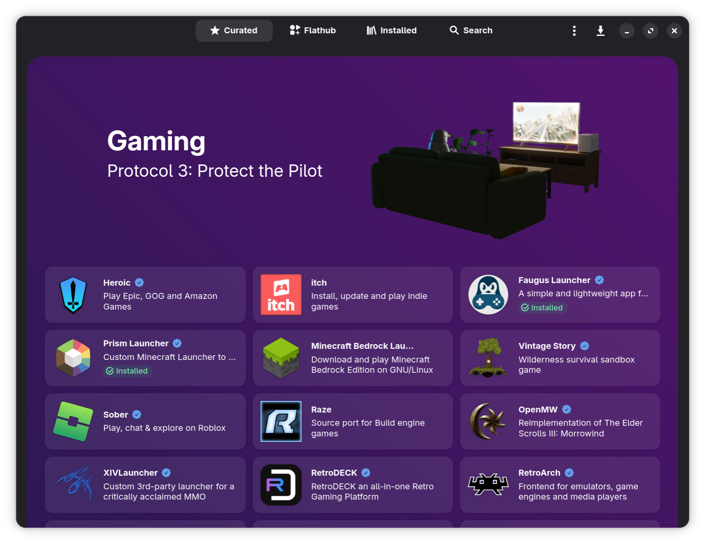

# Bazaar App Store



## Účel

Bazaar je **primární metoda instalace aplikací na Bazzite** _(mimo malý výběr softwaru dostupného na [Portálu Bazzite nebo jako příkaz `ujust`](./ujust.md))_ a pokud je to možné, doporučuje se nainstalovat většinu aplikací přes Bazaar místo jiných formátů.  Bazaar je rozhraní pro [Flatpaks](https://flatpak.org/), které pocházejí z [Flathub](https://flathub.org/).

## Co je Flatpak?

Flatpak je univerzální formát kontejnerového balíčku, který se snaží aplikace sandboxovat prostřednictvím flexibilních oprávnění, ke kterým má aplikace přístup ve vašem systému.  Je to **primární metoda instalace aplikací na Bazzite** a nejvíce doporučený způsob instalace softwaru přes jiné formáty kromě několika výjimek softwaru dostupného na portálu Bazzite, který má prioritu. Flatpaks lze graficky nainstalovat, upgradovat a odinstalovat prostřednictvím obchodu s aplikacemi Bazaar.

### Instalace terminálu

**Případně otevřete hostitelský terminál a zadejte**:

```
flatpak install <application>
```

## Spravujte Flatpaks

Spravujte Flatpak pomocí [Flatseal](https://github.com/tchx84/Flatseal) a [Warehouse](https://github.com/flattool/warehouse), které jsou obě předinstalované.

### Flatseal

**Flatseal** slouží ke změně [oprávnění aplikace](https://github.com/tchx84/Flatseal/blob/92e675e5ad2129f2aabf324261570eef442494f6/DOCUMENTATION.md), pokud je to nutné.

Někdy webové stránky projektu nebo [úložiště Github](<https://github.com/flathub/com.discordapp.Discord/wiki/Rich-Precense-(discord-rpc)#flatpak-applications>) obsahují informace o tom, jaká oprávnění je třeba změnit, aby bylo možné provádět určité funkce.

### Warehouse

**Warehouse** je nástroj, který uživatelům poskytuje grafické rozhraní pro **downgrade aplikací**, instalaci vzdálených zdrojů Flatpak mimo Flathub na vlastní riziko a zálohování uživatelských dat aplikací.

## Web projektu

https://github.com/kolunmi/bazaar