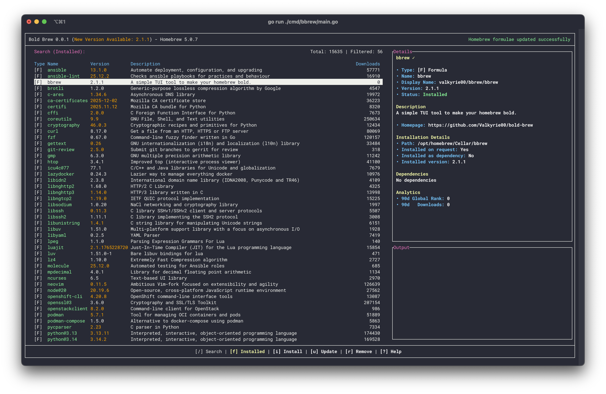

# Homebrew

## Co je to homebrew?


!!! note

    Jakýkoli balíček, který vyžaduje oprávnění root, bude buď potřebovat kořenový kontejner Distroboxu, nebo musí být vrstvený s `rpm-ostree`.

Homebrew je správce balíčků, který instaluje balíčky do jejich vlastní předpony. Primárně se používá pro aplikace rozhraní příkazového řádku (CLI) a terminálového uživatelského rozhraní (TUI). Homebrew může také instalovat grafické aplikace pomocí příznaku `--cask`, ale většina z nich je pro macOS, protože podpora sudů na Linuxu se stále vyvíjí. K instalaci balíčků použijte aplikaci Bold Brew nebo terminál pomocí příkazu níže.

Nainstalujte balíčky do hostitelského terminálu pomocí tohoto **příkazu terminálu**:

```
brew install <package>
```

!!! note

    Pouze pro více uživatelů nebo atypická nastavení: K instalaci balíčků Homebrew budou vyžadována oprávnění root (`sudo`), protože k jejich instalaci používá uživatele `linuxbrew`.

## Bold Brew



[Aplikace Bold Brew](https://bold-brew.com/) nabízí terminálové uživatelské rozhraní (TUI) pro instalaci běžných balíčků Homebrew.

## Web projektu

https://brew.sh/