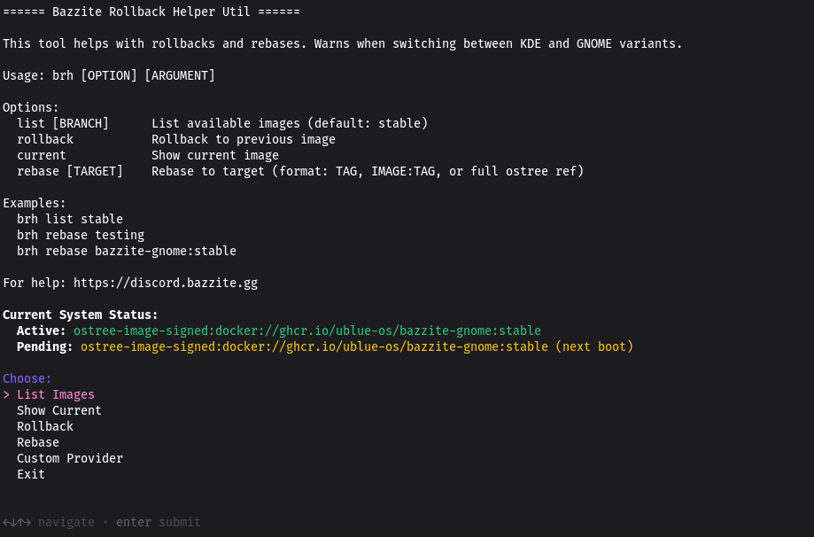

# Bazzite Rollback Helper (`brh`)



!!! note

    Portál Bazzite integruje příkazy Bazzite Rollback Helper do grafického zobrazení.

## Účel

`bazzite-rollback-helper` je nástroj příkazového řádku pro vrácení upgradů systému nebo změnu toku aktualizací.  Vraťte se zpět k sestavení Bazzite za posledních 90 dní pomocí nástroje příkazového řádku, který pomáhá s **návraty**, **rebasováním** a **vydává informace na vašem aktuálním obrazu Bazzite**.

## Pomocí `bazzite-rollback-helper`

Otevřete hostitelský terminál a **zadejte**:

```command
bazzite-rollback-helper
```

K dispozici je také **alias**, který umožňuje méně psaní pro uživatele handheldů nebo HTPC nastavení bez klávesnice:

```command
brh
```

## Dostupné možnosti:

- `list` = Seznam obrazů za posledních 90 dní, které lze změnit.
- `rollback` = Návrat k předchozímu nasazení při příštím restartu.
- `current` = Zobrazit informace o aktuálním nasazení a obrazu.
- `rebase` = Přepnutí na jiné sestavení, aktualizační větev nebo jiný obraz Fedory **na vlastní nebezpečí**.

### Příklady

`bazzite-rollback-helper list` zobrazí seznam dostupných obrazů Bazzite.

`bazzite-rollback-helper rebase <image-name:stable>` k přeložení na starší obraz, větev aktualizace nebo jiný obraz Bazzite (Desktop vs. Bazzite-Deck).  Najděte verzi z příkazu `list`.

### Přepracování na starší obraz Bazzite

**Příklad**: `bazzite-rollback-helper rebase stable-40.20240930.0`
<sub>(Tento obraz je příklad a již nelze vrátit zpět, protože je příliš starý.)</sub>

Převedení na bitovou kopii vás uzamkne na bitovou kopii operačního systému, což znamená, že nové funkce a aktualizace zabezpečení již nebudou aplikovány, dokud znovu nepřejdete zpět na stabilní aktualizační kanál.

Vraťte se k normálním aktualizacím operačního systému později po odstranění chyby, která vám brání spustit kanál Stable update:
`bazzite-rollback-helper rebase stable`

## Video tutoriál pomocníka pro vrácení zpět Bazzite

https://www.youtube.com/watch?v=XvljabnzgVo