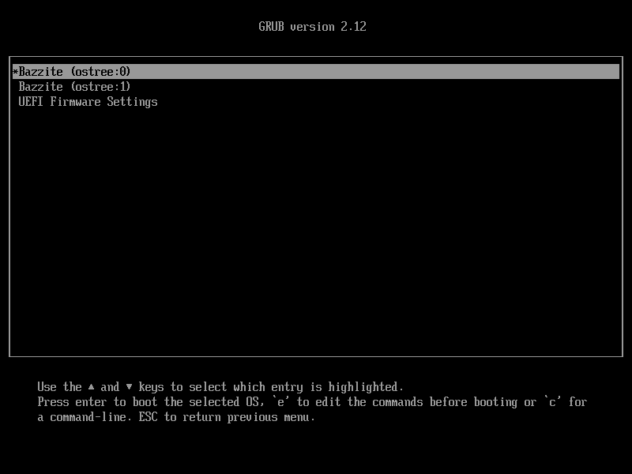

# Updates, Rollbacks, and Rebasing

## System & Application Updates


!!! attention

    It is required to have **3% free storage of your total drive that Bazzite is installed on** to update properly.

### How do updates work?

Bazzite updates all of the changes made specifically in Bazzite itself, updates from Fedora's base packages upstream, graphic drivers, and user software installed from Bazaar.

#### Desktop Images

- System updates happen **automatically daily** on a schedule and when the hardware is not under heavy use, like playing video games.
    - There is a check in-place to only update the image when your CPU, battery, and RAM usage meets certain requirements.
- Updates will be downloaded in the background and will **apply on the next reboot** and should contain the newest build of Bazzite.
    - An upgrade can be forced with the System Update tool at your own convenience.
- Updates upgrade system packages, Steam, and installed applications when available. 

#### Bazzite-Deck Images

- Updates can be managed in Steam Gaming Mode **manually** by the user.
  - Open: **Steam Menu** > **Settings** > **System** > **Check for Updates** > **Apply**
    - **Reboot** to apply system upgrades.
- Updates upgrade system packages, Steam, and installed applications when available.

### Do I have to reboot immediately after every system update?

**No**, but the **system upgrade will not apply until the next reboot**.  User-installed applications from Bazaar **will be upgraded without rebooting**.

- **Desktop images**: While your device is running, newer updates will still download in the background once a day, and will be waiting to be applied until the device is rebooted.
- **Bazzite-Deck images**: Updates will be checked daily and can be downloaded at your leisure.
  
### How do I view the changelog for each update?

Changelogs for each Bazzite can be found on [Github](https://github.com/ublue-os/bazzite/releases).

### How does upgrading to a new major version release work?

Bazzite should automatically update when our new builds based on that new major release is ready.

### How do I change the Bazzite's update branch? (Stable, Testing, and Unstable)

There are two update branches:

- Stable (`:stable`)
  - Default branch that's used in normal Bazzite installations.
- [Testing (`:testing`)](https://github.com/ublue-os/bazzite/compare/main...testing)
  - Get a sneak peak of future Bazzite builds before release.
  - Bugs may frequently appear.
  - Encouraged to rebase back to `:stable` after testing a major release.
    - It can be behind on certain updates for a long time.

<hr>

## Rolling Back System Updates



Swap back to a previous system update if there are major issues after updating via the GRUB menu or the `rpm-ostree rollback` command or using the Bazzite Rollback Helper.

### Using the Bazzite Rollback Helper (`brh) Utility

<link to it here>

<hr>

## Other Update Topics

### How do I save my **current** deployment?

You can pin your **current** deployment with this **command**:

```command
sudo ostree admin pin 0
```

Unpin saved **current** deployment:

```command
sudo ostree admin pin --unpin 0
```

### How do I disable automatic updates?

...
