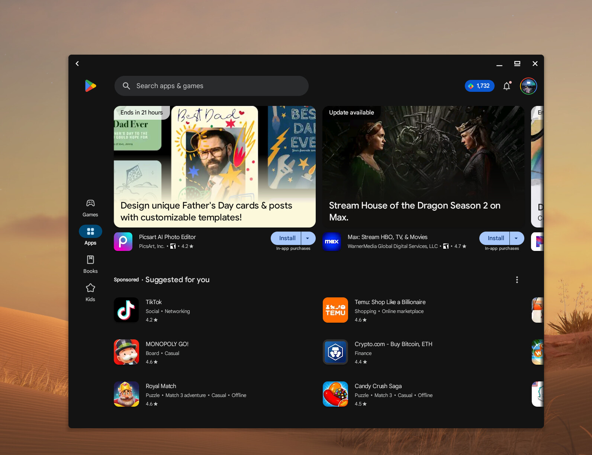
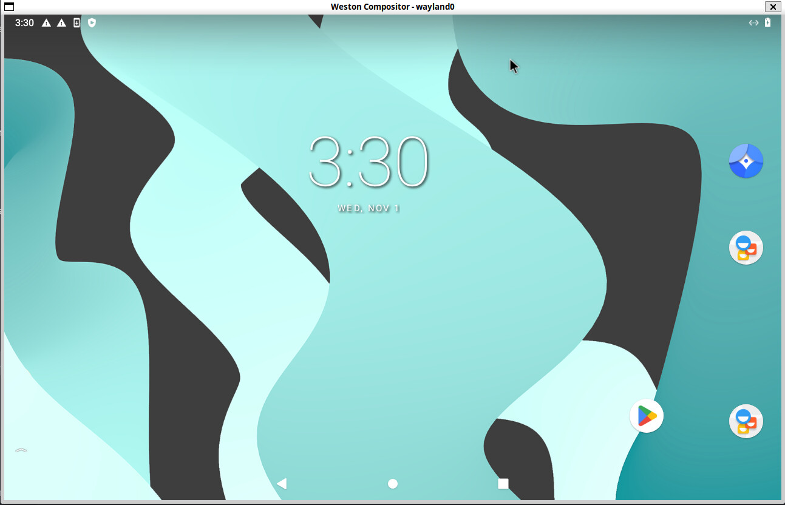
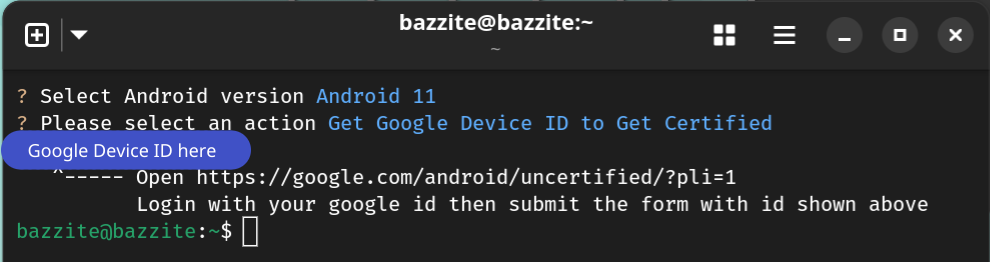
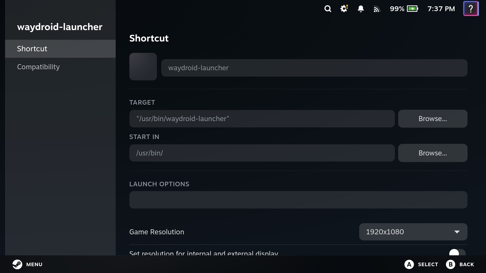
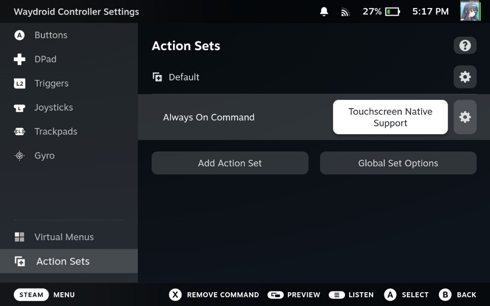
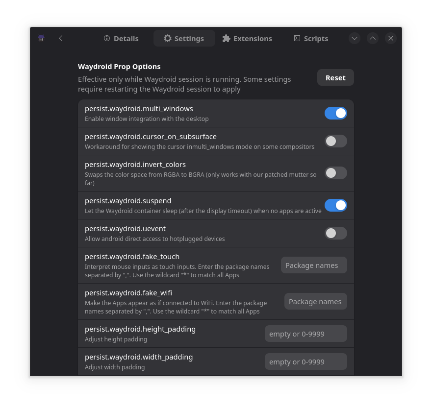

# Průvodce nastavením Waydroid

## Co je Waydroid?



!!! attention

    Waydroid **nepracuje** na hardwaru Nvidia.



[Waydroid](https://waydro.id/) je kontejner pro Android, který běží na Linuxu. Uživatelé Bazzite mohou pomocí této metody spouštět aplikace pro Android.

## První nastavení

Otevřete hostitelský terminál a **zadejte tento příkaz pro nastavení Waydroidu**:

```bash
ujust configure-waydroid
```

### Inicializujte Waydroid

Waydroid vyžaduje, aby jej uživatelé poprvé inicializovali, což lze provést výběrem:
`Initialize Waydroid`

Ujistěte se, že to funguje zadáním tohoto **příkazu**:

```bash
/usr/bin/waydroid-launcher
```

Tím se poprvé spustí Waydroid.

### Nakonfigurujte Waydroid

> Přizpůsobte si svůj kontejner Waydroid

#### Část 1: Zastavte relaci Waydroid

Waydroid musí přestat běžet, aby se správně nakonfiguroval.

Otevřete hostitelský terminál a zadejte tento **příkaz**:

```command
waydroid session stop
```

#### Část 2: Konfigurace

Otevřete hostitelský terminál a zadejte tento **příkaz**:

```
ujust configure-waydroid
```

Výběr `Configure Waydroid` umožní uživatelům instalovat další vylepšení Androidu pomocí [Waydroid Extras Scripts.](https://github.com/casualsnek/waydroid_script#waydroid-extras-script)

1. Vyberte verzi systému Android, kterou jste nainstalovali. Chcete-li zjistit nainstalovanou verzi Androidu, spusťte Waydroid, otevřete aplikaci Nastavení a přejděte na „O tomto telefonu“. Vaše verze Androidu bude 11 nebo 13.
2. Vyberte položky k instalaci

##### Dostupné doplňky Waydroid:

- [**GApps**](https://github.com/opengapps/opengapps/wiki/FAQ) (výchozí aplikace pro Android včetně **Obchodu Google Play)** nebo [microG](https://microg.org/) (bezplatné alternativy k aplikacím Google)

- **ARM Translation** (**_libndk_** nebo **_libhoudini_**)
- _libhoudini_ nabízí lepší celkovou kompatibilitu ve srovnání s _libndk_.
    - Některé hry mohou běžet pouze na jednom z _libhoudini_ nebo _libndk_.  Na Androidu 11 poběží _libhoudini_ výrazně pomaleji než _libndk_, pokud máte procesor AMD.
    - **Neinstalujte oba současně. Pokud potřebujete přejít, před instalací nové odinstalujte aktuální vrstvu překladu.**

- [**Magisk**](https://github.com/topjohnwu/Magisk) (sada pro pokročilé uživatele systému Android)

- [**Podpora Logitech Smartdock**](https://support.logi.com/hc/en-us/articles/360023201574-What-is-SmartDock) (hardwarová podpora SmartDock)

- [**F-Droid Privileged Extension**](https://f-droid.org/packages/org.fdroid.fdroid.privileged/) (Správná podpora [F-Droid](https://f-droid.org/en/packages/))

- [**`widevine`**](https://widevine.com/) (Podpora DRM pro streamování videa)

### Získejte ID zařízení Google pro získání certifikace (**GApps**)



1. Spusťte Waydroid
   (**Waydroid musí být spuštěn**)

2. Po výběru aktuální verze Androidu vyberte `Get Google Device ID to Get Certified`, zejména pokud plánujete používat Obchod Google Play (**GApps**).

3. Postupujte podle pokynů na výstupu terminálu.

Po ověření obvykle chvíli potrvá, než vaše zařízení získá certifikaci Google Play.

## Přidat jako zástupce mimo službu Steam

> To je užitečné pro [obrazy Bazzite, které používají režim hry Steam.](../Handheld_and_HTPC_edition/Steam_Gaming_Mode.md)

Ujistěte se, že jste do služby Steam přidali `/usr/bin/waydroid-launcher` jako hru bez Steamu, aby Waydroid správně fungoval v herním režimu Steam.



### Povolit podporu více dotyků

Chcete-li používat vícedotyková gesta ve Waydroid při spuštění v herním režimu Steam, musíte povolit "Touchscreen Native Support" v nastavení ovladače Steam:

1. V rámci zástupce Waydroid přejděte na **Nastavení ovladače**.
2. Přejděte na **Upravit rozvržení** > **Sady akcí** > **Výchozí**.
3. Vyberte **Přidat příkaz Always-On**.
4. V části **Systém** vyberte příkaz **Nativní podpora dotykové obrazovky**.



<hr>

## Waydroid Tipy a triky

Tato část je věnována specifičtějším operacím a problémům v rámci Waydroid běžícího na Bazzite.

## Aplikace Waydroid Helper



[waydroid-helper](https://github.com/waydroid-helper/waydroid-helper) je GUI aplikace, která umožňuje pokročilejší konfiguraci a kontrolu nad vašimi instalacemi Waydroid.

Chcete-li jej nainstalovat, spusťte následující příkaz `ujust`:

```bash
ujust configure-waydroid helper
```

Alternativně můžete přejít přímo na jejich [vydání](https://github.com/waydroid-helper/waydroid-helper/releases) a nainstalovat nejnovější AppImage přes GearLever.

### Zakázat vstupy do Waydroid, když není zaostřeno

Waydroid má [problém](https://github.com/waydroid/waydroid/issues/135), kde bude registrovat vstupy z ovladačů, klávesnic a dalších vstupních zařízení, i když okno není zaostřené.

Zakázat tuto funkci:

!!! note

    Waydroid musí běžet!

V hostitelském terminálu **spusťte tento příkaz**:

```command
waydroid prop set persist.waydroid.uevent false
```

Pokud někdy budete chtít tuto změnu vrátit zpět, proveďte stejné kroky, ale stejným příkazem nastavte `true` místo `false`.

### Zadávání klepnutím myší

Některé aplikace neočekávají kliknutí myší a reagují pouze na klepnutí na dotykovou obrazovku.

!!! note

    Waydroid musí běžet!

Tento příkaz můžete použít v hostitelském terminálu k povolení této aplikace:

```command
waydroid prop set persist.waydroid.fake_touch "PACKAGE_NAME_HERE"
```

!!! note

    Názvy balíčků jsou obvykle ve formátu „com.example.appname“.
    Název balíčku pro aplikaci najdete v dolní části stránky „Informace o aplikaci“ v aplikaci Nastavení.

    Podporovány jsou také zástupné znaky, takže „com.rovio.*“ by se vztahovalo na všechny hry od Rovio.

    Příklad pro aplikaci „Fate/Grand Order“ by byl:
    `waydroid prop set persist.waydroid.fake_touch "com.aniplex.fategrandorder.en"`

Aby se změny projevily, je třeba aplikaci uvnitř Waydroidu restartovat.

!!! warning

    Tímto příkazem nastavujte pouze konkrétní aplikace!
    Globální nastavení systému pomocí zástupného znaku může způsobit nepravidelné chování kurzoru myši.

Chcete-li tyto změny vrátit zpět, použijte v hostitelském terminálu následující příkaz:

```command
waydroid prop set persist.waydroid.fake_touch ""
```

### Možnosti rozlišení a hustoty

Toto je určeno pro uživatele, kteří mají problémy s rozlišením Waydroid, škálováním nebo spuštěním Waydroid vnořeného. Toto je **volitelné**.

Otevřete hostitelský terminál a zadejte následující **příkazy**:

```bash
sudoedit /etc/default/waydroid-launcher
```

```bash
sudoedit /etc/default/steamos-nested-desktop
```

Po dokončení uložte textové soubory.

### Oprava hybridní grafiky Waydroid

Toto je určeno pouze pro uživatele, kteří mají ve svém hardwaru více GPU, kteří mají ve Waydroidu grafické poškození.

**Zadejte hostitelský terminál**:

```
ujust configure-waydroid
```

Pak `Select GPU for Waydroid`, který dá možnost, jaký GPU použít pro Waydroid k opravě grafických poškození.

### Resetovat Waydroid

!!! warning

    Ztratíte všechna svá Waydroid data.

Pokud máte problémy nebo chcete nový kontejner Waydroid, vyberte po **zadání**: `Reset Waydroid`:

```
ujust configure-waydroid
```