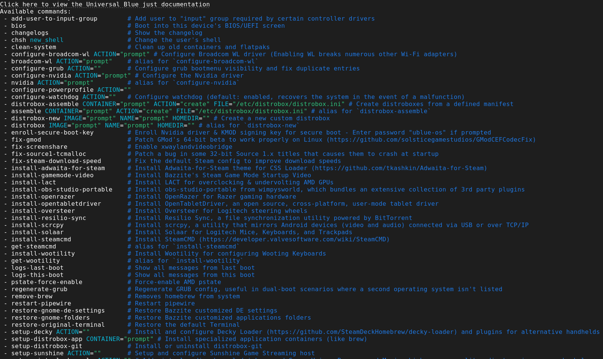
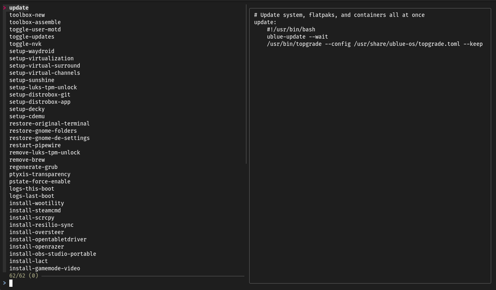

# Příkazy `ujust`

## Použití


!!! note

    Použijte aplikaci Bazzite Portal jako grafické rozhraní pro oblíbené příkazy `ujust`.

`ujust` příkazy, které automatizují úlohy pomocí skriptů, které lze použít pro konfiguraci a údržbu systému. Může také nainstalovat specializovaný software, který je dodáván s Bazzite jako instalační skript správci a přispěvateli projektu.  Vezměte prosím na vědomí, že _některý_ software, který lze nainstalovat z příkazů `ujust`, může do vaší instalace přidat [**vrstvené balíčky**](../rpm-ostree.md), což se obecně nedoporučuje.


<sub>Tímto se zobrazí seznam dostupných příkazů.</sub>

Otevřete hostitelský terminál a **zadejte tento příkaz**:

```
ujust
```




```
ujust --choose
```

Zobrazí se uživatelské rozhraní terminálu příkazů `ujust`, které můžete spouštět pomocí kláves se šipkami nebo pomocí myši.

!!! attention

    Příkazy, které vyžadují hodnoty nebo příznaky, s touto metodou nefungují.

### Ruční zadávání příkazů

**Najděte příkaz, který chcete použít, a zadejte**:

```
ujust <command>
```

Konkrétní příkazy můžete vyhledat **zadáním**:

```
ujust | grep "<search keyword(s)>"
```

- `install-`: Instalujte program, v tuto chvíli nejsou k dispozici žádné konfigurační ani odinstalační příkazy.
    - **Upozornění**: Některé z aplikací, které lze nainstalovat jako příkaz `ujust`, mohou skončit s [vrstvením balíčků](./rpm-ostree.md) do vašeho systému.
- `get-`: Nainstalujte si "rozšíření", jako jsou Decky pluginy, a pokud se jedná o rozšíření, může také používat `get-`.
- `setup-`: Instalační program, poskytuje možnosti odinstalace a konfigurace po instalaci.
- `configure-`: Nakonfigurujte něco, co je v obrazu ve výchozím nastavení.
  - Pokud je nutné jej nejprve nainstalovat, bude v `setup-`.
- `toggle-`: Povolí nebo zakáže funkci nebo nastavení.
  - Výběr může být automatický nebo manuální v závislosti na implementaci.
- `fix-`: Opravuje, opravuje nebo řeší problém.
- `distrobox-`: Exkluzivní sloveso Distrobox určené k usnadnění používání kontejneru.
- `foo`: Nahraďte to jakýmkoli příkazem, který se nazývá.
  - Toto jsou zkratky, které jsme považovali za nezbytné, abychom neměli sloveso.
    - **Příklady**: `ujust update` & `ujust enroll-secureboot-key`

## Zobrazit zdrojový kód každého skriptu `ujust`

Pokud byste chtěli vidět, co každý skript dělá pro každý příkaz, otevřete hostitelský terminál a **zadejte**:

```
ujust --show <command>
```

Případně můžete příkazy `ujust` najít lokálně v:
`/usr/share/ublue-os/just`

!!! note

    Tento adresář také zobrazuje **skryté** příkazy `ujust`.

## Přehled skriptů `ujust`

Toto jsou jen některé z běžných příkladů skriptů Bazzite `ujust`, je jich mnohem více, které lze zobrazit pomocí `ujust --choose`, jak je uvedeno výše.

### Skripty údržby

- **ujust update** - aktualizuje systém, flatpaky a kontejnery najednou
- **ujust configure-grub** - Konfiguruje viditelnost spouštěcí nabídky GRUB
- **ujust fix-reset-steam** - Resetujte složku Steam zpět do nového stavu, aniž byste odebírali hry, hudbu, ukládání atd. Velmi užitečné, pokud Steam dělá potíže nebo pokud se vám v herním režimu zobrazuje prázdná obrazovka
- **ujust fix-proton-hang** - Force ukončí všechny procesy související s vínem a protonem. Užitečné, pokud nemůžete spustit hry poté, co se hra nepodaří správně zavřít
- **ujust bios** - Restartuje se přímo na obrazovku BIOS/UEFI tohoto zařízení
- **ujust restart-pipewire** - Praskající zvuk? Restartování Pipewire to někdy opraví
- **ujust enroll-secure-boot-key** - Zaregistruje ovladač Nvidia a podpisový klíč KMOD pro bezpečné spouštění. Budete to potřebovat, pokud chcete používat Bazzite s povoleným Secure Boot
- **ujust clean-system** - Vyčistí staré nepoužité obrazy Podman, svazky, balíčky flatpak a obsah rpm-ostree

### Konfigurace/povolení skriptů

- **ujust configure-waydroid** - konfigurační pomocník pro Waydroid. Další informace v [Průvodce nastavením Waydroid](../Installing_and_Managing_Software/Waydroid_Setup_Guide.md)
- **ujust setup-virtualization** - nastavení a konfigurace virtualizace a vfio
- **ujust setup-sunshine** - zapněte nebo vypněte hostitele Sunshine Game Streaming
- **ujust setup-luks-tpm-unlock** - povolte automatické odemykání LUKS pomocí TPM
- **ujust setup-decky** - Nainstalujte a nakonfigurujte Decky Loader
- **ujust setup-boot-windows-steam** - Přidá skript ve službě Steam pro spouštění systému Windows, což je užitečné pro nastavení duálního spouštění
- **ujust enable-tailscale** - Umožňuje podporu pro Tailscale
- **ujust enable-supergfxctl** - Povolte Supergfxctl, přepínač GPU pro hybridní notebooky
- **ujust bazzite-cli** - Mod Bazzite CLI pro vylepšení cli ve stylu Bluefin. Více informací v [Nástroje příkazového řádku Bazzite](../Advanced/bazzite-cli.md)

### Skripty pro odstraňování problémů

- **ujust logs-last-boot** - Zobrazí všechny zprávy z posledního spuštění
- **ujust logs-this-boot** - Zobrazí všechny zprávy z tohoto spouštění
- **ujust device-info** - Shromažďuje užitečné informace o zařízení do přihrádky. To je velmi užitečné pro poskytování informací při vytváření lístků podpory.

## Web projektu

https://just.systems/man/en/